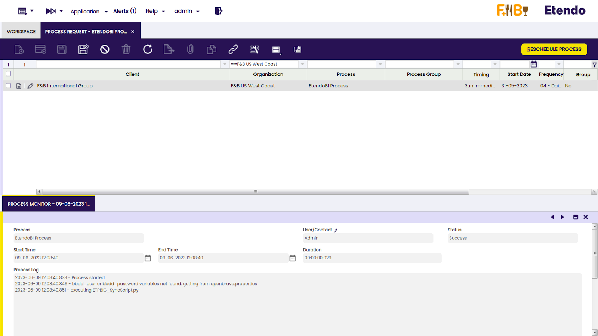

:octicons-package-16: Javapackage: `com.etendoerp.etendobi.extensions`

## Overview

In this section, the user can find technical information about the Etendo BI Extensions Bundle.

## Etendo BI Connector

:octicons-package-16: Javapackage: `com.etendoerp.integration.powerbi`

In Etendo, it is possible to create base queries and to customize them when needed. This will provide information which can be used by Power BI.

For this process, a background setting is required in order to create CSV files that will be uploaded to a server. The files will use information from the pre-established base queries and their customazation in case there are any. 

The following documentation is about the steps to consider when configuring this funtionality to create the CSV files.

### Requirements

To ensure proper functioning of the script, follow the steps below:

!!! note
    The following steps can only be used for Linux OS.

1. rsync must be installed in our system, since this is the tool we use to connect to the server.

    ``` bash title="Terminal"
    sudo apt install rsync
    ```

2. Make sure you have at least python3.7 or above installed on your system. You can verify the installation by running

    ``` bash title="Terminal"
    python3 --version
    ```

    If it is not installed, run 
    
    ``` bash title="Terminal"
    sudo apt update && sudo apt install python3
    ```
    And then verify that the version is correct.

3. It is highly likely that pip3 comes bundled with the installation of python3. Verify if it is installed by running 

    ``` bash title="Terminal"
    pip3 --version
    ```

    Then ensure to have an updated version of it

    ``` bash title="Terminal"
    sudo pip3 install --upgrade pip
    ```

    If it is not installed, run

    ``` bash title="Terminal"
    sudo apt install python3-pip
    ```

4. The user needs to install libpq-dev to ensure seamless communication and compatibility between our python script and the postgresql database.

    To install it, run 
        ``` bash title="Terminal"
        sudo apt install libpq-dev
        ```

5. The following libraries need to be installed using pip3 for them to work: psycopg2, pandas and requests. You can install them by running:

    ``` bash title="Terminal"
    sudo apt install python3-psycopg2
    ```

    ``` bash title="Terminal"
    pip3 install pandas
    ```

    ``` bash title="Terminal"
    pip3 install requests
    ```

### Etendo BI Connector Module Configuration

First, make the proper configurations from the **Webhooks window**. This will later allow BI Logs to be sent to the **BI Logs Monitor window**.

#### Webhooks window

:material-menu: `Application` > `General Setup` > `WebHook Events` > `Webhooks`

From the Webhooks window, it is necessary to create a new record and complete the required fields as follows:

- **Module**: Base Queries for EtendoBI 

- **Name**: EtendoBI Logger

- **Description**: Fill EtendoBI Log window

- **Event Class**: Java

- **Java\_Class**: `com.etendoerp.integration.powerbi.processes.FillLogWindow`

!!! info
    It is highly recommended to have just one Webhook for this module to work properly, as its functionality will not vary. That’s why, it is better to use the organization \* in order to cover all child organizations.


In the **Params tab**, four records must be created under the names:

- **client**
   
- **description**

- **logtype**

- **organization**

- **rule**


!!! info
    For more information about Webhooks, visit [Webhooks Events](../bundles/platform/etendo-webhooks.md).

#### User API Token window 

:material-menu: `Application` > `General Setup` > `WebHook Events` > `User API Token`

Then, make the proper configurations from the **User API Token window**. Here, it is necessary to grant access to a **user role**, so a token in this window needs to be created.


Then, go back to the **Webhooks window**, and create a record in the **Access tab** in order to add the previously generated token. 


!!! success 
    This way the Webhook is configured. Now, it is necessary to configure the EtendoBI Connector module.


#### BI Connection Window

:material-menu: `Application` > `Master Data Management` > `Analysis` > `BI Connection`

In the **BI Connection window**, It is necessary to create a record to specify the path to the CSVs creation script and the Webhook to use. If the **EtendoBI bundle** is installed and the script path was not changed, the user should use the default value of ‘repository path’ field. Otherwise, the corresponding path should be specified. 

!!! info
    It is important to note that the **Repository path** will search for the corresponding path INSIDE the WebContent folder of the project. 


In the **Data Destination** tab, the file name of the script needs to be specified. 


Finally, in the **Execution variables** tab, some records must be created being the ‘Variable’ field:

- **ip**: ip of the server where the files will be uploaded **(mandatory)**

- **client**: the name of our client **(mandatory)**

- **user**: the user used to connect to the server. **(mandatory)**

- **application_url**: url of our application. e.g. "https://my-domain.cloud/etendo" **(mandatory)**

- **port**: port of the server where the user is  connecting to **(default: 22)** 

- **path**: path of the server where the files will be sent **(default: /)**

- **private-key-path**: path of the private key used for the connection to the server

- **bbdd\_user**: username of a read only user to access the database

- **bbdd\_password**: password of the read only user

- **csv_separator**: delimiter to use in the final csv files **(default: |)**

**private-key-path** is the path of the private key used for the connection to the server. If this variable is not specified, the script will try to connect without specifying a private key.
In the **bbdd\_user** and **bbdd\_password** variables, enter the **username** and **password** of a user with read-only permissions to the database. If either of these two variables is not found, the process will use the credentials of the database superuser.

!!! info
    However, it is **highly recommended** to use a user with read only permissions as it is a great security measure.


As an example, let’s use the following values:


!!! info
    It is important to respect the specified names for the “Variable” field.


Also, it is important to note that the script is going to create a folder named as the value of the **“Client” variable**, and it will contain folders for each organization that executes the background process. Therefore, if there are **two BI Connections** with the same **“Client” value**, the last execution of the process will overwrite the folder.  
  
 

For example, let's say there is  Organization A, which has Organizations B and C as its child organizations. If the user needs to have the same configuration for both, we can create a BI Connection using Organization A and set up two background processes that run the "EtendoBI Process," one for Organization B and the other for Organization C.

When the script is executed, a folder will be created with the value of the "Client" variable in the BI Connection window as its name. Within that folder, subfolders will be created for each organization (in this case, A\_logs and A\_output for Organization A, and B\_logs and B\_output for Organization B).

#### Enterprise Module Management window

:material-menu: `Application` > `General Setup` > `Enterprise Model` > `Enterprise Module Management`

To load the Etendo base queries, go to the **Enterprise Module Management window**, and select Base Queries for EtendoBI and then click the **OK button**.


#### BI Query window 

:material-menu: `Application` > `Master Data Management` > `Analysis` > `BI Query`

After that, Etendo base queries should be successfully loaded in the **BI Query window**.


There are several points to consider when handling queries in this module.

- **Primary Key Requirement**: Every base query must have its primary key as the first column. This is crucial  since in the script it is assumed that the first column is the identifier. 

!!! warning
    A failure to adhere to this can result in incorrect output, duplicated records, and an immense number of rows.

- **Client column on base query**: Every base query must include `ad_client_id` column, with the alias “ClientID”

- **Organization column on base query**: Every base query must include `ad_org_id` column, with the alias “OrgID”

- **Custom Query Customization**: The customization of the query must also include the primary key (which is the same as the base query since customization is performed on the same table) with the SAME ALIAS as the base query. 

!!! warning
    Failing to respect this can lead to improper mapping between the results of the base query and its customization, resulting in incorrect output.

Let’s see an example of a correct base query and customization.


In this case, as a base query there are three columns. In its customization, there is a new column “name”. 

!!! info
    Note that there are three mandatory columns in the base query, with the correct alias for column `ad_client_id` and `ad_org_id`. It is important to make sure that **“ClientID”** and **“OrgID”** aliases are being set WITHOUT double quotes. Also, **there should not be** more than one space between the “as” keyword. 

    ``` sql
        … ad_client_id as “ClientID”, …    -- INCORRECT
        … ad_client_id as ClientID, …      -- CORRECT
    ```

In the customization query, despite the requirement to have the primary key with the same alias as the base query, it is not necessary for it to be the first column. In this case, if instead of having:

``` sql
SELECT m_warehouse_id as WarehouseID, name as "Warehouse Name" FROM m_warehouse
```

We have:

``` sql
SELECT name as "Warehouse Name", m_warehouse_id as WarehouseID FROM m_warehouse
```

The result will be exactly the same.

The script executes the base query, and then merges the customization, using both primary keys for mapping the rows.

If a base query has a **customization**, the script creates **three different CSVs**.

- A CSV file that contains the **result of the base query**. This CSV file has the prefix `EBI_` if it is an Etendo base query. If it is a client base query, it has the **first three letters** of the value of the “Client” variable that was set earlier as a prefix.

- A CSV file with the prefix `BASE_`, which contains the **columns from the base query**, but if the customization overrides any of these values, they will be overwritten with the values from the customization. In this case, the `BASE_` CSV file will be the same as the base query since the **customization does not override** any values from the base query columns.

- A CSV file with the prefix `FULL_`, which includes b**oth the columns from the base query and any additional columns added in the customization**. In the given example, the `FULL_` CSV file will contain the additional column “Warehouse Name”. 

Later, at the end of the configuration,  this example query will be executed to analyze the **generated CSV files**.

!!! info
    It is important to note that there should be only one customization per base query. It should also be made clear that it is not possible to add constraints to the customization to remove rows from the base query. Instead, the customization allows adding or overwriting columns in the original query, using the primary key to map the records.


Base queries must all contain the `ad_client_id` and `ad_org_id` columns, with alias **“ClientID”** and **“OrgID”** (case insensitive). 
!!! warning
    If a query does not have these columns with their alias, it will produce an error and be ignored.

#### Process Request window

:material-menu: `Application` > `General Setup` > `Process Scheduling` > `Process Request`

Once the query configuration is done, go to the **Process Request window**, create a new record, select the **EtendoBI Process** from the process field and schedule it.


The scope of the data collection performed by the queries is based on the **organization** that configured the **background process**. In other words, all the obtained data is  filtered by the **client** and the **organization** that configured the **background process**, and **NOT** by the organization used in the **BI Connection window**. If the organization does not have a configuration in the **BI Connection**, Etendo will search for the **configuration** in one of its **parent organizations**, but the data scope will remain the same (itself and its child organizations).

!!! info
    If the organization that configured the background process does not have a BI Connection and there is no BI Connection found for its parent organizations either, the **process will not be executed**. 


The process will never search for a BI Connection in the child organizations of the one which was set on the background process.




In the **Process Monitor** tab, the status of **Success** is shown in the new record that appears when the process is executed. It is good to know that this process executes our python script, so if there were no issues up until the execution of the python script, it will return to success status regardless of whether the python script fails.

#### BI Logs Monitor window 

:material-menu: `Application` > `Master Data Management` > `Analysis` > `BI Logs Monitor`

The execution process can be checked in the **BI Logs Monitor** window.


In this example image, the information about the script execution can be seen.

If no records in the **Logs window** were created after the execution of the script, it is possible that the error occurred on the **synchronization** of the files with the server. The user is able to check this by looking at the **rsync log files** created in the **filesystem**. 


After the execution of the process, two new directories should be created in the filesystem. One will contain the logs files, one for the rsync execution that will contain information about the file upload to the server; another file called syncScript.log.{datetime}, that will contain information about the script execution (most of this information can be seen in the Logs Monitor window, but if for any reason the window cannot receive this information, it should be able to be seen using this .log file).

In this example, in the path where the script is allocated, a new directory named “Etendo” should be created. Inside it, there should be two folders for the organization that set the background process (F&B US West Coast).

`drwxrwxr-x 1 <user> <group> 9,1K jun 8 16:52 ETPBIC_SyncScript.py`

`drwxrwxr-x 4 <user> <group> 4,0K jun 8 17:39 Etendo/`

Inside the Etendo/ folder, we have:

`drwxrwxr-x 2 <user> <group> 4,0K jun 8 16:54 F+B_US_West_Coast_logs/`

`drwxrwxr-x 2 <user> <group> 4,0K jun 8 16:54 F+B_US_West_Coast_output/`


The output directory, will contain all the CSVs that should have been uploaded to the server.

!!! info
    Remember that the main folder is created using the prefix of the “Client” variable that is set on BI Connection window. If two connections have the same value for “Client” variable, these directories will be overwritten.


This is the content of `Ete_Example.csv` and `BASE_Example.csv` files: 

!!! info
    Remember that since any column is not being overridden, these files are the same. 


On the other hand, this is the content of `FULL_Example.csv`:


!!! warning
    Make sure to have the corresponding permissions to connect to Files, since an incorrect configuration can lead to an error.

---

This work is a derivative of [Developer Guide](https://wiki.openbravo.com/wiki/Category:Developers_Guide){target="\_blank"} by [Openbravo Wiki](http://wiki.openbravo.com/wiki/Welcome_to_Openbravo){target="\_blank"}, used under [CC BY-SA 2.5 ES](https://creativecommons.org/licenses/by-sa/2.5/es/){target="\_blank"}. This work is licensed under [CC BY-SA 2.5](https://creativecommons.org/licenses/by-sa/2.5/){target="\_blank"} by [Etendo](https://etendo.software){target="\_blank"}.

---
This work is licensed under :material-creative-commons: :fontawesome-brands-creative-commons-by: :fontawesome-brands-creative-commons-sa: [ CC BY-SA 2.5 ES](https://creativecommons.org/licenses/by-sa/2.5/es/){target="_blank"} by [Futit Services S.L.](https://etendo.software){target="_blank"}.