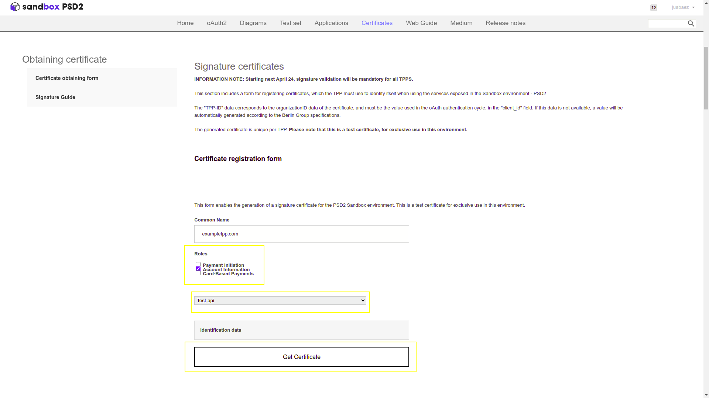

---
tags:
  - PSD2 Service
  - Financial Bundle
  - Redsys
  - .p12 File
  - banking integration
---

# PSD2 Integration

## Overview

Etendo is able to integrate with several banking entities using the PSD2 protocol (Payment Services Directive 2) through the [Redsys](https://redsys.es/){target="_blank"} API, which acts as a service provider. 
The integration is carried out only with **banks that support Redsys**, thus guaranteeing secure and efficient communication for obtaining financial transactions, balance inquiries and movements compatible with the PSD2 protocol.

!!!info
        For more information about banks supported by Redsys visit [Banks supported by Redsys](https://redsys.es/psd2.html){target="_blank"}.


## Service Configuration in Etendo

### Configuration in the RX config window 

Add to the RX config window a new record as shown below. This configuration indicates the **URL** where the PSD2 service is running.


### Configuration in the RX service window 

!!!info
    For the configuration in the RX service window, follow the tutorial defined in the [Adding the token value](../../../../developer-guide/etendo-rx/tutorials/creating-a-new-microservice.md#adding-the-token-value) in the Creating a New Microservice section of the documentation. 

### Configuration of the PSD2 HUB service in Redsys

**Redsys** is a technology platform that provides payment services in Spain. It works with banks and other payment service providers to facilitate secure electronic transactions, including card payments and mobile payment solutions.

Redsys acts as an **intermediary in payment processing**, offering payment gateway services and transaction security. So, it is necessary to create an account in Redsys in order to integrate the Etendo with the bank provider. 

- To create an account in Redsys, login to the [Sandbox Registration Page](https://market.apis-i.redsys.es/psd2/xs2a/user/register){target="_blank"}.


- Create an application entering in the [Application Registration Section](https://market.apis-i.redsys.es/psd2/xs2a/application){target="_blank"}.


- Choose a tittle to create the application: 


Enter the **Subscription** section and subscribe to the HUB of your choice.


## Certificate and Generation of the P12 file

At the moment of integrating **business partners and banks** using the PSD2 security protocol and the payment service provider Redsys, it is crucial to understand certain key concepts and the role of specific components, such as the **.p12 file**. This document provides an overview of PSD2, Redsys, and the role of a .p12 file in this integration.

### PSD2 Definition

The **Revised Payment Services Directive (PSD2)** is an European Union legislation designed to regulate payment services and payment service providers in the EU and the European Economic Area (EEA). 

Its main objectives are:

  - Improving the security of electronic payments: it implements stricter authentication requirements to reduce fraud.
	- Encouraging innovation and competition: allows third parties to access users' bank account information (with their consent), promoting the emergence of new financial services.
	- Consumer protection: increases transparency and establishes new liability rules for unauthorized payments.

### .p12 file utility for in a PSD2 integration with Redsys

A .p12 file (also known as PKCS#12) is a **file container** that can store one or more X.509 certificates, as well as the associated private key. These files are used to secure communications and authenticate the identity of participants in a transaction.

The following are the functions of the .p12 file:

-  **Authentication**: Verifies the identity of the business partner accessing account information or initiating payments, ensuring that they are who they claim to be.

- **Encryption**: Protects the confidentiality of communications between the business partner, the bank and Redsys.

- **Integrity**: Ensures that messages have not been altered during transmission by means of digital signatures.

### Certificates needed

For this integration, it is necessary to guarantee 3 crucial aspects to ensure **security and compliance** with PSD2 regulations:

- **Mutual Authentication**: Both the business partner and the bank need to authenticate each other.

- **Encryption of Communications**: Communications between the business partner and the bank must be encrypted to ensure that sensitive data (such as customer credentials and financial transactions) cannot be intercepted or manipulated. 

- **Digital Signature**: Some operations may require the digital signature of messages to ensure their integrity and authenticity.

To guarantee this, two types of certificates are required:

**QSealC (Qualified Electronic Seal Certificate)**: Used to digitally sign messages and guarantee their integrity and authenticity.

**QWAC (Qualified Website Authentication Certificate)**: Used to authenticate the server and enable secure communication.

!!!info
        These certificates are issued by authorized trust service providers, through the [URL eIDAS Dashboard](https://esignature.ec.europa.eu/efda/tl-browser/#/screen/home){target="_blank"}, you can locate the authorized certifying entities for the issuance of the EIDAS certificate.

!!!note
        For both certificates, it is an **indispensable condition to be registered with the Bank of Spain**, which is the banking supervisor of these certificates. Contact the service provider for more information.

### .p12 file creation

!!!note
        The .p12 file will be used later as part of the integration setup. 

### Test Sandbox Certificates

The following is an example of how to generate the .p12 file using the server certificate(*1) and the private key(*2) provided by Redsys in its portal.

!!!note
        The server certificate and private key are referred to as (*1) and (*2) respectively in order to refer to them later.




As it can be seen in the Certificates section, the Role of the application must be configured, for that, select such application and press the **Get Certificate button**. This will provide the test certificates, both the server certificate(*1) and the private key(*2) .

### Generating the .p12 file


1. Save the server certificate(*1) and private key(*2): Copy the contents of the server certificate and private key into separate files, e.g. `cert.cer` and `key.pem`.

2. Create the P12 file: Using the [KeyStore Explorer application](https://keystore-explorer.org/){target="_blank"}. This application provides an intuitive interface and facilitates the creation of the .p12 file.

It is also possible to perform this procedure using the **OpenSSL tool**.

These are the specific commands:

```
openssl pkcs12 -export -out api-testkeypar.p12 -inkey key.pem -in cert.cer -name "api-test" -passout pass:keystore_password -passin pass:cert_password

```

!!!info
        To protect the P12 file a password will be prompted. This password will be required each time the P12 file is used for authentication or digital signature.

### OpenSSL command explained

- **export**: Indicates that a PKCS#12 file is being created.
- **out `testkeypar.p12`**: Specifies the name of the output PKCS#12 file.
- **inkey `key.pem`**: Specifies the file containing the private key.
- **in `cert.cer`**: Specifies the file containing the public certificate.
- **name `api-test`**: Assigns the alias `api-test` to the certificate inside the PKCS#12 file.
- **passout pass**:keystore_password: Specifies the keystore password. This sets the password to protect the PKCS#12 file.
- **`passin pass:cert_password`**: Specifies the password for the private key, if the key is encrypted.

#### Productive certificates

Once the **QSealC** and **QWAC** certificates have been obtained, the .p12 file must be generated as previously explained, taking into account that the server certificate(*1) corresponds to the QWAC certificate and the private key(*2) corresponds to the QSealC certificate.

#### .p12 Configuration

Once the .p12 has been generated it is necessary to indicate the values of the parameters with which it has been generated as well as the path where it is located within the OAuth provider configuration window for each of the providers, as shown below.

The fields to be completed are:

- Keystore Path: Path to .p12 file
- Keystore Password: Password of the .p12 file
- Certificate Alias: Alias of the certificate
- Certificate Password: Password of the private key.

These parameters allow the integration to make use of the .p12 to secure communications and authenticate the identity of the transaction participants.

