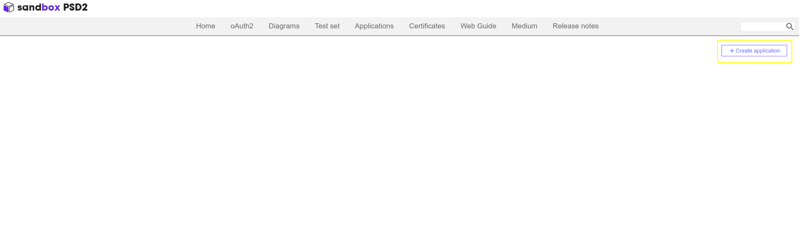

---
tags:
  - PSD2 Service
  - Financial Account
  - Redsys
  - .p12 File
  - Bank Integration
  - Etendo RX
---

# Bank Integration PSD2 

:octicons-package-16: Javapackage: `com.etendoerp.psd2.bank.integration`

## Overview

Etendo is able to integrate with several banking entities using the PSD2 (Payment Services Directive 2) protocol through the [Redsys](https://redsys.es/){target="_blank"} API, which acts as a service provider.
The integration is carried out only with **banks that support Redsys**, thus guaranteeing secure and efficient communication for obtaining financial transactions, balance inquiries and movements compatible with the PSD2 protocol.

!!!info
    For more information about banks supported by Redsys visit [Banks supported by Redsys](https://redsys.es/psd2.html){target="_blank"}.

!!!info
    To be able to include this functionality, the **Financial Extensions Bundle** must be installed. To do that, follow the instructions from the marketplace: [Financial Extensions Bundle](https://marketplace.etendo.cloud/#/product-details?module=9876ABEF90CC4ABABFC399544AC14558){target="_blank"}. For more information about the available versions, core compatibility and new features, visit [Financial Extensions - Release notes](https://docs.etendo.software/whats-new/release-notes/etendo-classic/bundles/financial-extensions/release-notes/).

!!!warning
    It is important to note that before starting this configuration, the **QWAC** and **QSealC** certificates are required. Detailed instructions on how to obtain them can be found in the [Certificates](#certificates) section.


## Dokerized Services

To begin the integration, it is essential to launch all the services related to this module. This includes **Etendo RX**, a service that provides a reactive development platform and implements a security layer using the standard **OAuth** authentication protocol required for synchronization. Additionally, the **PSD2 service**, which interacts with Redsys, needs to be started.

Within the PSD2 module and its dependencies, the required infrastructure is distributed using **Etendo Docker Manager**. In this case, it is necessary to define the following configuration variables in the `gradle.properties` file to launch the services:

```groovy title="gradle.properties"
docker_com.etendoerp.etendorx=true
docker_com.etendorx.psd2.bank.integration=true
```

!!!info
    For more information about how to handle Etendo Dockerizations visit [Docker Management](../platform/dependency-manager.md). 

??? Note "Tomcat and PostgresSQL Dockerized (Optional)"
    It is also possible to run the dockerized [PostgreSQL service](../platform/docker-management.md#postgres-database-service) and [Tomcat service](../platform/tomcat-dockerized-service.md), **optionally** adding the [Platform Extensions Bundle](https://marketplace.etendo.cloud/#/product-details?module=5AE4A287F2584210876230321FBEE614){target=_isblank} and the following configuration variables:

    ```groovy title="gradle.properties"
    docker_com.etendoerp.tomcat=true
    docker_com.etendoerp.docker_db=true
    ```

Then, to effectively run the services is necessary to **execute the command** in the terminal: 

```bash title="Terminal"
./gradlew resourses.up
```

Here, all the services and their respective logs can be seen running using [LazyDocker tool](https://github.com/jesseduffield/lazydocker){target=_isblank}


## Services Configuration

### RX Config window
:material-menu: `Application` > `Etendo RX` > `RX Config`

As `System Administrator` role, in this window, it is necessary to add two entries, one for each service to be used. The following fields should be included:

- **Service Name**: The name of each service.
- **Service URL**: The internal URL of the Docker service.
- **Updatable Configs**: Check this checkbox.
- **Public URL**: Configure the publicly accessible URL for the service.

!!! info 
    Below are configuration examples. Replicate them, only personalizing the **Public URL** fields.


### Get User Token 
:material-menu: `Application` > `General Setup` > `Security` > `User`

It is necessary to obtain and configure a user token that will later be used by the **PSD2 service** to modify authentication records within Etendo when interacting with Redsys.

1. As `Administrator` role, in the **User** window, select the user who has access to Banks and Banking Information, and this token will interact with the system under that user.
    
    !!! info
        It is recommended to associate the service with the administrator user.

    A new entry must be created in the **RX Service Access** tab, and the corresponding fields should be completed. 

    - In the **RX Services** field, select **psd2** option.
    - Define the **Default Role** and **Default Organization** fields based on the user's access level.

    
    !!!note
        In this example, the **admin** user is used:
        - **Default Role**: F&B Group Admin
        - **Default Organization**: F&B International Group

        This configuration provides the highest level of access but can be customized according to specific requirements.

2. Next, to obtain the token, it is necessary to make a request from Postman or any REST client, using the following format:

    **Request:**

    - URL: `https://<PublicServerURL>/auth/api/authenticate`
    - Method: `GET`  
    - Body:

    ```json title="Body"
    {
        "username":"admin",
        "password":"admin",
        "service":"Psd2",
        "secret":"1234"
    }
    ```
    !!! info 
        Replace the credentials with those of the user configured in the previous step 

    **Response:**

    ```json
    {
        "token": "*********"
    }
    ```

    

3. Once the token is obtained, it is necessary to add it to the `gradle.properties` file in the `psd2.token` variable so that it can be used by the PSD2 service.

    ```groovy title="gradle.properties"
    psd2.token= ******
    ```

### Configuration of the PSD2 HUB service in Redsys

**Redsys** is a technology platform that provides payment services in Spain. It works with banks and other payment service providers to facilitate secure electronic transactions, including card payments and mobile payment solutions.

Redsys acts as an **intermediary in payment processing**, offering payment gateway services and transaction security. So, it is necessary to create an account in Redsys in order to integrate the Etendo with the bank provider. 

- To create an account in Redsys, login to the [Sandbox Registration Page](https://market.apis-i.redsys.es/psd2/xs2a/user/register){target="_blank"}.


- Create a new service under the title `<Client Name>-API` by entering in the [Application Registration Section](https://market.apis-i.redsys.es/psd2/xs2a/application){target="_blank"}.



- Choose a tittle to create the application: 


- After adding the required information, the application will be created:


- At the bottom of the same page the **Subscription** section is shown, click on **See Details** to subscribe to the HUB of your choice.


## Certificates

When integrating **Etendo financial accounts with the bank** using the PSD2 security protocol and the Redsys payment service provider, understanding key components like the **.p12 file** is crucial. This document provides an overview of PSD2, Redsys, and the role of the .p12 file in this integration.

### Utility of the .p12 File in PSD2 Integration with Redsys

A .p12 file (PKCS#12) is a **container file** that stores one or more X.509 certificates along with the associated private key. These files are essential for securing communications and authenticating the identity of the parties involved in a transaction.

Functions of the .p12 file:

- **Authentication**: Verifies the identity of the bank account user accessing account information or initiating payments.
  
- **Encryption**: Ensures the confidentiality of communications between Etendo, the bank, and Redsys, preventing unauthorized access to sensitive data.

- **Integrity**: Uses digital signatures to ensure that messages have not been altered during transmission.

To ensure security and compliance with PSD2 regulations, two types of certificates are required:

- **QSealC (Qualified Electronic Seal Certificate)**: Digitally signs messages to guarantee their integrity and authenticity.

- **QWAC (Qualified Website Authentication Certificate)**: Authenticates the server and secures communications.


!!!info
    These certificates are issued by authorized trust service providers, through the [URL eIDAS Dashboard](https://esignature.ec.europa.eu/efda/tl-browser/#/screen/home){target="_blank"}, you can locate the authorized certifying entities for the issuance of the EIDAS certificate.

!!!note
    In the case of obtaining these certificates in Spain, it is an **indispensable condition to be registered with the Bank of Spain**, the banking supervisor for these certificates. Contact a service provider for more information.


## Generating the .p12 file
Once the **QSealC** and **QWAC** certificates have been obtained, the .p12 file must be generated, taking into account that the server certificate corresponds to the QWAC certificate and the private key corresponds to the QSealC certificate, copy into separate files, e.g. `cert.cer` and `key.pem` respectively.

There are two ways of generating the .p12 file: 

1.   Create the P12 file: Using the [KeyStore Explorer application](https://keystore-explorer.org/){target="_blank"}. This application provides an intuitive interface and facilitates the creation of the .p12 file.

2. It is also possible to perform this procedure using the [OpenSSL tool](https://openssl.org/){target="_blank"}.

    This is the specific example command:

    ``` bash title="Terminal"
    openssl pkcs12 -export -out keystore_tls.p12 -inkey key.pem -in cert.cer -name "keystore_tls" -passout pass:<keystore_password> -passin pass:<cert_password>
    ```

    !!!warning
        To protect the P12 file a password will be prompted. This password will be required each time the P12 file is used for authentication or digital signature.

    **OpenSSL command explained**

    - **export**: Indicates that a PKCS#12 file is being created.
    - **out `keystore_tls.p12`**: Specifies the name of the output PKCS#12 file.
    - **inkey `key.pem`**: Specifies the file containing the private key.
    - **in `cert.cer`**: Specifies the file containing the public certificate.
    - **name `keystore_tls`**: Assigns the alias `keystore_tls` to the certificate inside the PKCS#12 file.
    - **passout pass**: `keystore_password`: Specifies the keystore password. This sets the password to protect the PKCS#12 file.
    - **passin pass:`cert_password`**: Specifies the password for the private key, if the key is encrypted.


Once the `.p12` file is generated, it must be copied to the `/cert` folder in the root of the project to be used. For example, at `/opt/EtendoERP/cert/keystore_tls.p12`.


## Provider Configurations

:material-menu: `Application` > `General Setup` > `Enterprise Model` > `Enterprise Module Management`

As `Administrator` role, apply the dataset **Bank Integration PSD2**, that includes the configuration needed for each supported provider offered by [Redsys](https://redsys.es/){target="_blank"}, 


!!! info
    For more information about how to apply a dataset visit the functional documentation about [Enterprise Module Management](../../../basic-features/general-setup/enterprise-model.md#enterprise-module-management). 

Once the dataset is applied, all provider configurations will be added to the **Auth Provider** window.


### Key Store Configuration

:material-menu: `Application` > `RX Service` > `oAuth Provider`

In the **oAuth Provider** window, access each provider to be used and add the certificate configuration.

The fields to be completed are:

- **Keystore Path**: Path to the `.p12` file, e.g. `/cert/keystore_tls.p12`.
- **Keystore Password**: Password of the `.p12` file.
- **Certificate Alias**: Alias of the certificate. e.g. `keystore_tls`
- **Certificate Password**: Password of the private key.


These parameters allow the integration to make use of the .p12 to secure communications and authenticate the identity of the transaction participants.

## Restart Docker Services
Once all the configuration is complete, it is necessary to relaunched the Docker services so that the certificate changes, token, and other configurations are applied.

```bash title="Terminal"
./gradlew resources.up
```
Afterward, you can continue with the setup in the [Bank Integration PSD2 User Guide](../../../../user-guide/etendo-classic/optional-features/bundles/financial-extensions/psd2-bank-integration.md#setup).
