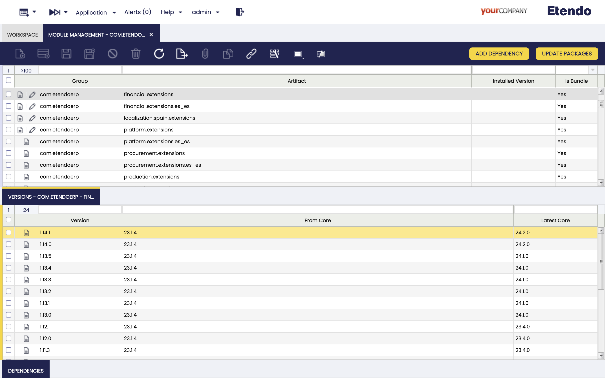

---
tags:
  - Beta
  - Etendo Classic
  - platform extensions
  - bundles
  - dependency
  - dependency manager
  - dependencies management
---

# Dependency Manager

:octicons-package-16: Javapackage: `com.etendoerp.dependencymanager`

## Overview

With this development, the user can have access to all the available dependencies to add, configure them and check information about versions, validations, etc. This is done through two windows: Module Management and Dependency Management.

## Module Management

In the `Application` > `Etendo Dependencies Management` > `Module Management` window, the user can see all the modules to be added and select the corresponding version in the **versions** tab. Once one of the versions is selected, the dependencies of such version can be found in the **dependencies** subtab.

!!!info
    The fields in this window are read-only.

Fields to note:

- **Active**: Checkbox to select if this module is active or not.
- **Group**: the identifier of the artifact.
- **Artifact**: the unit of deployment fetched and used.
- **Installed Version**: the version of the used module.
- **Is bundle**: Checkbox to select if this module is a bundle or not.

This window presents two buttons that can be used: **Add dependency** and **Update Packages**.

### Add Dependency 

This button is used to install all the dependecies part of a specific version of the selected module. The popup window shows all the dependencies to be installed.

!!!note
    A warning notification is shown to inform the user about versions compatibility before installing the dependencies shown.

Once the process is done, the **Dependency Management** window is opened and all the installed dependencies are shown.

### Update Packages

This button is used to execute the Update Packages process which updates the list of available packages with the latest information.

## Dependency Management

In the `Application` > `Etendo Dependencies Management` > `Dependency Management` window, the user can find all the dependencies installed in the previous step.

Fields to note:

- **Active**: Checkbox to select if this dependency is active or not
- **Group**: The identifier of the artifact.
- **Artifact**: The unit of deployment fetched and used.
- **Version**: Version of the module
- **Format**: Describes the dependency format. They can be `Source`, `JAR` or `local`.
    - `Source`: In this case, the source code is available and compilation is required.
    - `JAR`: In this case, a standard format for java packages distribution, these include the compiled java classes.
    - `Local`: The local format implies that the module is installed but it is not declared as a repository dependency. 
- **Installation Status**: It describes the dependency current status.
    - Pending download: This is the status by default when a new dependency is added or updated.  To be installed, it is necessary to compile the environment and, in such case, the dependency is in `source` format. 
    - Installed: Used once the dependency is already installed.
- **Version Status**: It describes the dependency version status.
    - Untracked: Only for external dependencies.
    - Update Available: In case there are new available versions.
    - Updated: The latest available version is installed.
- **External Dependency** (Only available for `JAR` dependencies): Checkbox that identify an external library or module required by the project, managed by Gradle. These dependencies are retrieved from remote repositories during the build process.

This window presents to buttons that can be used: **Change Version** and **Change Format**.

### Change Version 

This button is used to update or downgrade versions. 

When the version of a module is modified, its related dependencies could be modified as well. In this case, it is possible to add new, update or delete versions. 

!!!note
    A warning notification is shown to inform the user about versions compatibility before executing the process.

### Change Format 

This button is used to change the format of the module.  This process needs to be executed when it is necessary to migrate from a local format to a gradle dependency, while keeping the modules updated.  The options are `source`, `JAR` or `local`.

- In case the module is originally in `local` format, the options in the **Change format** popup window are `JAR` or `source`.

- In case the module is originally in `source` format, the only option in the **Change format** popup window is `JAR`.

- In case the module is originally in `JAR` format, the only option in the **Change format** popup window is source. In this case, the window shows a warning notification to remind the user that the original directory is deleted once the process is finished.

## Add Local Dependencies 

This process, in `Application` > `Etendo Dependencies Management` > `Add Local dependencies`, also part of the Etendo Dependencies Management, is in charge of identifying all the locally installed modules without related dependencies, add them to the Dependency Management window with the `local` format.

## Update Packages Information

Since the information about packages is updated frequently, the user can execute this process, in `Application` > `Etendo Dependencies Management` > `Update Packages Information` to update the list of packages with the latest information.

!!!info
    The same process can be executed from the **Module Management** window, selecting one record and clicking the **Update packages** button.

!!!note
    Each time the server is restarted, the update process is executed automatically.