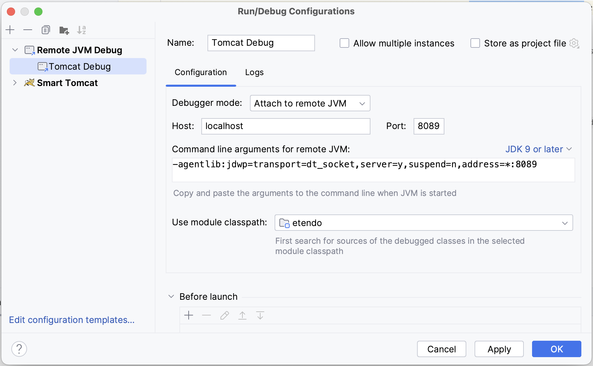

---
tags:
  - Docker
  - Tomcat
  - Service
  - Infrastructure
---

# Dockerized Tomcat Service

:octicons-package-16: Javapackage: `com.etendoerp.tomcat`

## Overview

The `com.etendoerp.tomcat` module enables the Dockerization of Tomcat within Etendo Classic. This module modifies Gradle tasks to automatically deploy the `WAR` file into the container when executing the `smartbuild` task.

!!! info
    To be able to include this functionality, the Platform Extensions Bundle must be installed. To do that, follow the instructions from the marketplace: [Platform Extensions Bundle](https://marketplace.etendo.cloud/#/product-details?module=5AE4A287F2584210876230321FBEE614){target=_isblank}. For more information about the available versions, core compatibility and new features, visit [Platform Extensions - Release notes](../../../../whats-new/release-notes/etendo-classic/bundles/platform-extensions/release-notes.md).

## Configuration Variables

To enable and configure the Tomcat service, the following configuration variables are available:

- **Enable the Service**

    ```groovy title="gradle.properties"
    docker_com.etendoerp.tomcat=true
    ```
    This variable enables the Tomcat service.

- **Configure Tomcat Port** (Optional)
    ```groovy title="gradle.properties"
    tomcat.port=<port>
    ```
    This variable sets the port for the Tomcat service. The default port is `8080`

- **Configure Debug Port** (Optional)

    ```groovy title="gradle.properties"
    docker_com.etendoerp.tomcat_debug=<debug_port>
    ```
    This variable sets the debug port for the Tomcat service. The default debug port is `8009`

    !!! info
        For debugging in IntelliJ, create a new configuration of type **Remote JVM Debug** and set the port to listen on.

        

Execute the following command to apply the configuration changes:

```groovy title="Terminal"
./gradlew setup
```

## Compile the Environment

- The first time Tomcat is used within a Docker environment, the setup must be compiled by executing:
    
    ``` bash title="Terminal"
    ./gradlew resources.up
    ```

    ``` bash title="Terminal"
    ./gradlew update.database compile.complete smartbuild
    ```

    This command will update the database and recompile the java classes and deploy the `WAR` to the *dockerized Tomcat service*. 

    !!! info
        This module modifies **Gradle tasks**. Executing the `update.database` command will automatically stop the Tomcat service. The `smartbuild` task will then ensure that the `WAR` file is correctly deployed in the container. After the smartbuild execution, the service will automatically restart, enabling an automated compilation from the command line.
         


- Refer to [Docker Management](./docker-management.md) page for more information on container management.


## Extra Configuration to Use Tomcat (Dockerized) with a Host Database in Linux Environments

1. Listen on the Docker Network

    Create the `etendo.conf` file in the location `/etc/postgresql/<your_pg_version>/main/conf.d/etendo.conf` with the following content:

    ``` title="etendo.conf"
    listen_addresses = 'localhost,172.17.0.1'
    ```

    !!! note
        The IP address `172.17.0.1` is the interface that connects the host with the Docker service. This is the default address used for this connection.

2. Allow Access from the Docker Subnetwork

    Add the following line to the `/etc/postgresql/<your_pg_version>/main/pg_hba.conf` file:
    
    ``` title="pg_hba.conf"
    host all all 172.0.0.0/8 scram-sha-256
    ```
    !!! note
        The subnet `172.0.0.0/8` is used to enable access from Docker Tomcat to the host. By default, Docker assigns a subnet within the range of `172.1.0.0/8` to `172.254.0.0/8`.
3. Restart the PostgreSQL Service

    Finally, restart the PostgreSQL service by running the following command in the terminal:

    ``` bash title="Terminal"
    sudo systemctl restart postgresql
    ```


---
This work is licensed under :material-creative-commons: :fontawesome-brands-creative-commons-by: :fontawesome-brands-creative-commons-sa: [ CC BY-SA 2.5 ES](https://creativecommons.org/licenses/by-sa/2.5/es/){target="_blank"} by [Futit Services S.L.](https://etendo.software){target="_blank"}.