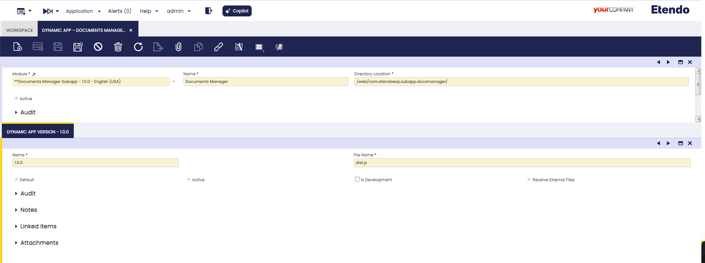

---
tags:
  - Dynamic App
  - SubApp
  - Etendo Mobile
---
# Dynamic App 
:octicons-package-16: Javapackage: `com.etendoerp.dynamic.app`

## Overview
This page explains how to configure and export dynamic applications in Etendo Classic, which are dynamically displayed in Etendo Mobile.

### Dynamic App window
:material-menu: `Application` > `General Setup` > `Application` > `Dynamic App`

As `System Administrator` role, in the **Dynamic App** window, specify the paths and versions for each subapplication. These settings determine how subapplications are displayed when users log into Etendo Mobile.

Fields to note:

- **Module**: The module that can export the window configuration.
- **Name**: Name with the application will be shown.
- **Directory Location**: The path where the compiled application bundle is located. In development, the path must be empty `/`, but in production, the path is `/<javapackage>/web/`.
- **Active**: To select if this application is active or not.

### Dynamic App Version Tab 
Allows the application to be versioned, enabling both development and production versions.

Fields to note:

- **Name**: Name of the application version E.g. `dev` or `1.0.0`.
- **File Name**: The bundle name of the compiled application, by default `dist.js`.
- **Default**: This check defines that this version is productive.
- **Is Development**: This check defines that this version is in development and can be deployed locally.
- **Active**: To select if this application version is active or not.
- **Receive External Files** Identifies sub-applications that allow receiving shared files from external applications and are capable of handling them.
