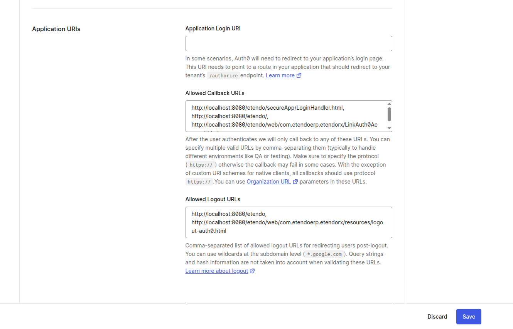

---
tags:
  - Etendo RX
  - oAuth
  - SSO Login
  - Middleware
---

# Etendo RX 
:octicons-package-16: Javapackage: `com.etendoerp.etendorx`

## oAuth Provider

This section describes the oAuth Authentication module included in the Platform Extensions bundle.

oAuth Authentication process facilitates the **provider type configuration** which allows users to **securely authenticate and authorize access** to their information using their preferred provider.

oAuth facilitates an authentication method through a security protocol for obtaining a token needed to make **API calls** to access specific resources on behalf of their owner. This authentication will allow Etendo to get the necessary information to access to third party applications. 

### oAuth Provider Window

In the oAuth Provider window in :material-menu: `Application`> `Etendo RX`> `oAuth Provider`, set the preferred type provider by adding the user authentication URL in the **API oAuth URL field**. This URL can be found in the provider documentation API.  

The other fields will be completed with data referring to the corresponding provider.


## Etendo SSO Login

Etendo allows you to authenticate using these external provider accounts: **Google**, **Microsoft**, **LinkedIn**, **GitHub** and **Facebook**. Using the Single Sign-On (SSO) protocol is possible due to the integration through:

- [EtendoAuth Middleware Service](#set-up-etendo-to-login-with-etendoauth-middleware-service-recommended)
- [Auth0 Custom Implementation](#how-to-integrate-your-own-auth0-login-provider-with-etendo)

### Set up Etendo to Login with EtendoAuth Middleware Service (Recommended)

To enable login to **Etendo** using external providers (Google, Microsoft, LinkedIn, GitHub or Facebook), you need to perform two main steps:

- [x] Enable the SSO (Single Sign-On) feature through a system preference
- [x] Configure the connection settings in `gradle.properties`

---

1. #### Enable the SSO Login Preference

    1. Log in as **System Administrator**
    2. Go to the **Preferences** window
    3. Create a new preference with the following settings:

        - **Property**: `Allow SSO Login`  
        - **Selected**: Yes  
        - **Value**: `Y`

        

2. #### Configure EtendoAuth Middleware Integration

    To authenticate via the **EtendoAuth Middleware**, follow these steps:

    1. Open the `gradle.properties` file
    2. Add the following properties:

        ```title="gradle.properties"
        sso.auth.type=Middleware
        sso.middleware.url=https://sso.etendo.cloud
        sso.middleware.redirectUri=http://localhost:8080/etendo/secureApp/LoginHandler.html
        authentication.class=com.etendoerp.etendorx.auth.SWSAuthenticationManager
        ```

        !!! warning
            This module cannot be configured together with [Etendo Advanced Security](overview.md#etendo-advanced-security) because both use the `authentication.class` property. 

        !!!note
            During development, you can use `localhost`. However, for production, set your actual domain.

        With these settings, Etendo will be able to authenticate users through external login providers using the middleware.

        !!! warning "Potential SSO Configuration Mismatch"

            {width=400 align=right }
        
            If any of the steps above are omitted, attempting to log in using an external provider will display the following error message:           

            To resolve this issue, ensure that both the SSO preference and the corresponding entry in `gradle.properties` are correctly configured and consistent with each other.

!!! info
    For more information about the use of the SSO Login functionality, visit [the SSO Login User Guide](../../../../user-guide/etendo-classic/optional-features/bundles/platform-extensions/etendo-rx.md#etendo-sso-login).


### How to Integrate your own Auth0 Login Provider with Etendo

This option is recommended only if you need to implement your own authentication service and cannot use the EtendoAuth Middleware service. Follow this guide to configure an Auth0 application and enable social login in Etendo.


1. #### Create a New Auth0 Application

    1. Go to the Auth0 Dashboard:
    [https://manage.auth0.com/dashboard](https://manage.auth0.com/dashboard)
    2. Sign up or log in to your Auth0 account. 
    3. Create a new application for the Etendo integration:

        - In the left-hand menu, go to **Applications** → **Applications**.
        - Click **Create Application** in the top-right corner.
            
        - Choose a name and select **Regular Web Application**.


2. #### Choose the Technology Stack

    1. After creating the application, choose the technology used in the project. For Etendo, select **Java**.

        

    2. You will be redirected to the **Quick Start** tab of the newly created application.

        


3. #### Configure Social Login Providers

    1. In the left-hand menu, go to **Authentication** → **Social**.

        

    2. Click **Create Social Connection**.

    3. Choose the selected social login providers (Google, Facebook, etc.).

        

    4. Follow the configuration steps provided by `Auth0` for each provider.

        

    5. After setup, go to the **Applications** tab within the connection and link it to your application.

        

    6. Repeat this process for every provider you want to enable.


4. #### Retrieve and Set Credentials

    1. Return to the application and go to the **Settings** tab.

        

    2. Locate the following credentials:
        - **Domain**
        - **Client ID**
        - **Client Secret**

    3. Add them to the `gradle.properties` file in the following format:

        ``` title="gradle.properties"
        sso.domain.url=your-domain.auth0.com
        sso.client.id=your-client-id
        sso.client.secret=your-client-secret
        sso.auth.type=Auth0
        authentication.class=com.etendoerp.etendorx.auth.SWSAuthenticationManager
        ```

        !!! warning
            This module cannot be configured together with [Etendo Advanced Security](overview.md#etendo-advanced-security) because both use the `authentication.class` property.


5. #### Configure Callback and Logout URLs

    In the **Settings** tab, configure the following allowed URLs:

    - **Allowed Callback URLs:**

        The URLs Auth0 redirects to after a successful login.

        ```
        http://localhost:8080/etendo/secureApp/LoginHandler.html,
        http://localhost:8080/etendo,
        http://localhost:8080/etendo/web/com.etendoerp.etendorx/LinkAuth0Account.html
        ```

    - **Allowed Logout URLs:**

        The URLs Auth0 redirects to after the user logs out.
        ```
        http://localhost:8080/etendo,
        http://localhost:8080/etendo/web/com.etendoerp.etendorx/resources/logout-auth0.html
        ```

        

    !!!note
        During development, you can use `localhost`. However, for production, set your actual domain in **Application Login URI**. If you're still in development, you may leave it blank.


6. #### Set the Callback URL

    Add the callback URL to the `gradle.properties`:

    ```title="gradle.properties" 
    sso.callback.url=http://localhost:8080/etendo/secureApp/LoginHandler.html
    ```

7. #### Compile the Project

    Once all properties are configured, compile the project:

    ```bash title="Terminal"
    ./gradlew setup smartbuild
    ```

8. #### Log In via External Providers
    
   
    1. Start the Tomcat server.
    2. Open the Etendo login page and click **Use a Social Account to Sign In** 
    3. Here you will see the `Auth0` login page with the configured providers.

    

    !!!tip
        Customize the login screen in **Branding** > **Universal Login** in the Auth0 dashboard.

        

!!! info
    For more information about the use of the SSO Login functionality, visit [the SSO Login User Guide](../../../../user-guide/etendo-classic/optional-features/bundles/platform-extensions/etendo-rx.md#etendo-sso-login).