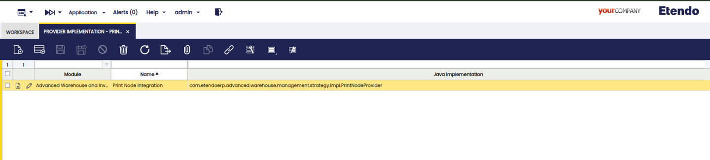

# Print Provider

## Register a new Print Provider

This guide explains how to extend the Print Provider module to integrate an external print provider (e.g., PrintNode, Bartender, Hardware Manager, etc.). The goal is for any module to be able to register its own connector without duplicating common logic and only create buttons pointing to the Send Print Job Action for sending print jobs, which will also automatically resolve the list of available printers and the corresponding print template.

## Architecture

The **main components of the Print Provider module** are:

- **PrintProviderStrategy** (Service Provider Interface): Contract to be implemented by each provider. It exposes three operations

    - `fetchPrinters` (Provider): list of printers (PrinterDTO).

    - `generateLabel` (Provider, Table, recordId, TemplateLine, params): File (PDF).

    - `sendToPrinter` (Provider, Printer, copies, labelFile): String (jobId).


### Provider Implementation
:material-menu: `General Setup` > `Print Provider Configuration` > `Provider Implementation`

!!! info
    Access to this window is restricted to users with the System Administrator (Sys) role. Operational users will not be able to modify these settings.

This window allows to register third-party print providers such as PrintNode. Here you can configure credentials, endpoint URLs, and the specific Java implementation that complies with the PrintProviderStrategy contract. Each organization can maintain its own print providers.



Fields to note:

- **Module**: Indicates the module where the Print Provider configuration will be exported.
- **Name**: Descriptive name of the provider.
- **Java Implementation**: Path to the Java file where the provider implementation is located. This must comply with the established contract, defining how printers are displayed, how the printout is generated, and how it is sent to the printer.

- **Resolve ProviderStrategyResolver**:  Given a Provider (registered in the [Print Providers](../../../../user-guide/etendo-classic/optional-features/bundles/platform-extensions/print-provider.md#print-providers) window), find its ProvidersImplementation ([Provider Implementation](../../../../user-guide/etendo-classic/optional-features/bundles/platform-extensions/print-provider.md#provider-implementation) window), load the class (java Implementation), and return an instance of the strategy.

    **PrinterUtils utilities**: Cross-functional helpers

    - Entity loading/validation (requireProvider, requirePrinter, requireTableByName, resolveTemplateLineFor).
    - Process/JSON parameters (requireParam, requireJSONArray, requirePositiveInt).
    - Provider parameters (getRequiredParam, providerParamContentCheck).
    - Jasper templates (resolveTemplateFile, loadOrCompileJasperReport).
    - Process result helpers (fail, warning).

- **Actions**, ready to use

    - UpdatePrinters: synchronizes the supplier's printer catalog (add/update/disable).
    - SendGeneratedLabelToPrinter: generates the label (Jasper) and sends it to the selected printer.

- **Key data model**

    - Provider: Print provider configuration (links implementation, parameters, and printers).
    - ProvidersImplementation: Defines the Java class (FQN) of the strategy/SPI to be used by the provider.
    - ProviderParam: Provider key/value parameters (e.g., apikey, printersurl, printjoburl).
    - Printer: Locally registered printer for a provider (external ID, name, “default,” active).
    - Template: Template header associated with a table; groups its lines.
    - TemplateLine: Template variant (.jrxml/.jasper path, “default”, order/lineNo).

## How to Create a New Supplier

1. **Create the strategy class**: Create a class in the module that extends `PrintProviderStrategy`. 


    ``` title=" MyProviderStrategy.java - Skeleton Example"
    public class MyProviderStrategy extends PrintProviderStrategy {
     // (optional) constants for timeouts, MIME, etc.

     @Override

     public List<PrinterDTO> fetchPrinters(Provider provider) throws PrintProviderException {
       // 1) Validate provider and required params

       final ProviderParam printersUrl = PrinterUtils.getRequiredParam(provider, "printersurl");

       PrinterUtils.providerParamContentCheck(printersUrl, "printersurl");
       // 2) Build HTTP client/request
       // 3) Send and handle InterruptedException (re-set interrupt + rethrow with context)
       // 4) Validate statusCode and parse JSON → List<PrinterDTO>
       // 5) Return list
     }
     @Override

     public File generateLabel(Provider provider, Table table, String recordId,

     TemplateLine templateRef, JSONObject params) throws PrintProviderException {
       // Use PrinterUtils.resolveTemplateFile + loadOrCompileJasperReport
       // Fill report (DOCUMENT_ID, SUBREPORT_DIR)
       // Export PDF to a temp file and return it
     }

     @Override

     public String sendToPrinter(Provider provider, Printer printer, int numberOfCopies, File labelFile)

         throws PrintProviderException {
       // 1) Validate inputs (provider/printer/file)
       // 2) Read required ProviderParams (e.g., printjoburl, apikey)
       // 3) Prepare request body (e.g., base64, title, source)
       // 4) POST; validate response; extract jobId (if available)
     }

     @Override

     public File generateLabel(Provider provider, Table table, String recordId,

                               TemplateLine templateRef, JSONObject params) throws PrintProviderException {
       // Use PrinterUtils.resolveTemplateFile + loadOrCompileJasperReport
       // Fill report (DOCUMENT_ID, SUBREPORT_DIR)
       // Export PDF to a temp file and return it
     }

     @Override

     public String sendToPrinter(Provider provider, Printer printer, int numberOfCopies, File labelFile)

         throws PrintProviderException {
       // 1) Validate inputs (provider/printer/file)
       // 2) Read required ProviderParams (e.g., printjoburl, apikey)
       // 3) Prepare request body (e.g., base64, title, source)
       // 4) POST; validate response; extract jobId (if available)

     }
    }
    ```

    **Contractual conventions**

    - Printer.value stores the external ID of the printer (key for “upsert”).
    - Throw PrintProviderException (extends OBException) for functional/integration failures.
    - Do not log secrets (API keys); log context (statusCode, truncated bodies).

2. **Register the implementation**

    - **AD: Provider Implementation**

        - Java Implementation: com.mi.modulo.print.MyProviderStrategy

    - **AD: Print Provider**

        - Reference to the previous implementation.

    - **AD: Provider Param**

        - Define the keys (reuse if applicable): printersurl, printjoburl, apikey, etc.
        - Save values (e.g., your API URLs).

## How to Register Labels (Jasper)

1. Create a new record in the **Print Templates** window, indicating the table to which it applies.

2. Indicate the location of your template in the lines tab. `TemplateLine.templateLocation` accepts:

    - @basedesign@/...
    - @<módulo>@/...
    - Paths related to basedesign

**Technical Details**

- The priority applies to the “Default” check; otherwise, you will get the one with the lowest sequence number.
- `PrinterUtils.resolveTemplateFile` resolves locations in `src-loc/design` and web.
- `PrinterUtils.loadOrCompileJasperReport` supports `.jrxml` (compile) and `.jasper` (load).

!!! note "Recommended parameters"
    - DOCUMENT_ID = recordId
    - SUBREPORT_DIR = template directory (for subreports)

## Custom Parameter Injection with Hooks

The Print Provider module supports a hook mechanism that allows external modules to inject custom JasperReports parameters during label generation. This capability enables advanced customization scenarios where business logic needs to add or modify report parameters before the report is rendered.

### Hook Interface

Modules can implement the `GenerateLabelHook` interface to customize JasperReports parameters. The hook execution occurs during the `generateLabel` phase, before the report is filled with data.

**Key features:**

- **Table-specific execution**: Each hook declares which tables it applies to via `tablesToWhichItApplies()`.
- **Priority-based ordering**: Hooks execute in priority order (lower values first), allowing control over execution sequence.
- **Full context access**: Hooks receive a `GenerateLabelContext` object providing access to provider configuration, table metadata, record ID, template information, and the parameter map.
- **CDI integration**: Hooks are automatically discovered and managed through CDI.

### Implementing a Hook

To create a custom hook:

1. **Create a class** that implements `GenerateLabelHook`
2. **Annotate** with `@Dependent` for CDI discovery
3. **Implement required methods**:
   - `execute(GenerateLabelContext context)`: Main logic to add/modify parameters
   - `tablesToWhichItApplies()`: Return list of table IDs where this hook applies
   - `getPriority()` (optional): Return execution priority (default: 100)

### Example: Custom Barcode Generation

The following example demonstrates a hook that generates custom barcode labels for business documents. This hook replaces the default database query with a custom data source containing calculated barcode information.

```java title="CustomDocumentLabelHook.java"
package com.etendoerp.examples.hooks;

import java.util.ArrayList;
import java.util.List;
import javax.enterprise.context.Dependent;

import com.etendoerp.print.provider.api.GenerateLabelHook;
import com.etendoerp.print.provider.api.PrintProviderException;
import com.etendoerp.print.provider.dto.BarcodeLabelDTO;
import net.sf.jasperreports.engine.data.JRBeanCollectionDataSource;

/**
 * Hook that adds custom parameters for document label generation.
 * Generates barcode data and provides it as a custom data source.
 */
@Dependent
public class CustomDocumentLabelHook implements GenerateLabelHook {

  private static final List<String> TABLES_TO_WHICH_IT_APPLIES = List.of(
      "YOUR_DOCUMENT_TABLE_ID",      // Document header table ID
      "YOUR_DOCUMENT_LINE_TABLE_ID"  // Document line table ID
  );

  @Override
  public void execute(GenerateLabelContext context) throws PrintProviderException {
    try {
      final String recordId = context.getRecordId();

      // Retrieve the document record
      BaseOBObject currentRecord = getDocumentRecord(recordId);

      if (currentRecord == null) {
        throw new PrintProviderException("Document not found: " + recordId);
      }

      // Resolve the lines to process
      List<DocumentLine> lines = resolveDocumentLines(currentRecord);

      // Generate barcode data for each line
      List<BarcodeLabelDTO> barcodeData = generateBarcodeData(lines);

      // Create a JRBeanCollectionDataSource with the barcode data
      JRBeanCollectionDataSource dataSource = new JRBeanCollectionDataSource(barcodeData);

      // Add the datasource as a parameter
      // IMPORTANT: This replaces the SQL query in the jasper template
      context.addParameter("REPORT_DATA_SOURCE", dataSource);

    } catch (PrintProviderException e) {
      throw e;
    } catch (Exception e) {
      throw new PrintProviderException("Failed to add barcode parameters: " + e.getMessage(), e);
    }
  }

  protected List<BarcodeLabelDTO> generateBarcodeData(List<DocumentLine> lines) {
    List<BarcodeLabelDTO> result = new ArrayList<>();

    for (DocumentLine line : lines) {
      // Build barcode based on business rules (product info, quantities, etc.)
      String barcode = buildBarcodeForLine(line);
      String barcodeWithSeparator = buildBarcodeWithSeparator(line);

      result.add(new BarcodeLabelDTO(barcode, barcodeWithSeparator));
    }

    return result;
  }

  @Override
  public int getPriority() {
    return 50;  // Medium priority
  }

  @Override
  public List<String> tablesToWhichItApplies() {
    return TABLES_TO_WHICH_IT_APPLIES;
  }
}
```

### Hook Context API

The `GenerateLabelContext` provides the following methods:

| Method                                   | Description                                |
| ---------------------------------------- | ------------------------------------------ |
| `addParameter(String key, Object value)` | Adds or updates a JasperReports parameter  |
| `getParameter(String key)`               | Retrieves the current value of a parameter |
| `getParameters()`                        | Returns a read-only view of all parameters |
| `getProvider()`                          | Gets the provider configuration            |
| `getTable()`                             | Gets the target table metadata             |
| `getRecordId()`                          | Gets the record ID being printed           |
| `getTemplateLine()`                      | Gets the template line reference           |
| `getJsonParameters()`                    | Gets the JSON parameters from the request  |

### Custom Data Sources

Hooks can provide custom data sources by setting the `REPORT_DATA_SOURCE` parameter. When this parameter is present, the Print Provider will use it instead of the default database connection:

```java
// Create a custom data source from a collection
List<MyDataDTO> data = prepareCustomData();
JRBeanCollectionDataSource dataSource = new JRBeanCollectionDataSource(data);

// Set it as the data source
context.addParameter("REPORT_DATA_SOURCE", dataSource);
```

This is particularly useful when:

- The data needs complex transformations before rendering
- Data comes from multiple sources (database + external APIs)
- Business logic requires calculated fields not present in the database
- Performance optimization requires pre-aggregated data

### Best Practices

1. **Error handling**: Always wrap business logic in try-catch blocks and throw `PrintProviderException` with meaningful messages.

2. **Null safety**: Validate that required objects are present before accessing them:

   ```java
   if (context.getTable() == null) {
       throw new PrintProviderException("Table information is required");
   }
   ```

3. **Recommended priority coordination**: Use priority values to control execution order when multiple hooks apply to the same table:

   - System/core hooks: 1-30
   - Standard business hooks: 31-70
   - Custom/extension hooks: 71-100

4. **Logging**: Use SLF4J logging to aid troubleshooting:

   ```java
   private static final Logger log = LoggerFactory.getLogger(MyHook.class);

   log.debug("Executing hook for record: {}", recordId);
   ```

5. **Performance**: Keep hook execution lightweight. Avoid heavy database queries or external API calls that could slow down label generation.

### Printer Update

- The process calls strategy.fetchPrinters(provider) and performs an upsert on Printer:

    - **Create** if it does not exist (provider, value=externalId).
    - **Update** name/default if it already exists.
    - **Deactivate** printers from the provider that were not included in this synchronization.

- Printer.value = external ID; Printer.name is user-friendly; Printer.default marks “default.”

    !!!note "Recommendation"
        If the provider's API does not return a single field that can serve as a stable key, one can be composed (e.g.,  < accountId >:< remotePrinterId >).

### Errors

- Use `PrintProviderException` for exception handling.
- Log the messages you need in AD_MESSAGE. You can access these messages using the `String.format` and `OBMessageUtils.getI18NMessage` formatting utilities.

## Workflow and Configuration

!!! Note 
    Remember that the initial configuration must be performed only once, as the system administrator. Provider parameters such as printersurl and apikey must be defined correctly to avoid connection or printer synchronization failures.

1. **Configuration** (one-time)

    - As System administrator, create a record in Providers Implementation indicating the path of your strategy class.
    - As administrator, create a Provider that references the implementation defined in the previous step.
    - In the Provider Params tab, define the required parameters (URLs, API key, etc.).

2. **Discover Printers**

    - UpdatePrinters (Action executed from the Printers window): use fetchPrinters from the strategy and synchronize Printer.

3. **Generate Label**

    - `SendGeneratedLabelToPrinter` (Action executed from the button in the desired window) resolves TemplateLine from the table associated with the button window (e.g., button in Product window will resolve table M_Product). This action compiles/loads Jasper and produces the temporary PDF.

4. **Send to printer**

    - `sendToPrinter` makes the necessary HTTP/SDK call and returns jobId (when available).

### Basic Example

- In the module, create `com.my.module.print.MyProviderStrategy` (extends `PrintProviderStrategy`).

- Configuration per window
    - Provider Implementation:

        - specify javaImplementation = com.my.module.print.MyProviderStrategy

    - Print Provider:

        - specify the previously registered provider in providers implementation.

    - ProviderParam:

        - printersurl: URL for obtaining printers.
        - printjoburl: URL for sending print jobs.
        - apikey: Key for authenticating with the middleware.

- Run **Update Printers** from the **Printers** window. The Action delegates responsibility for updating printers to the fetchPrinters implementation.

- Execute **Generate Printable** from the button that has been registered in the desired window. The Action `SendGeneratedLabelToPrinter` delegates the responsibility of:

    - Generating the printout to your generateLabel implementation.
    - Sending the previous print job to your sendToPrinter implementation.

---
This work is licensed under :material-creative-commons: :fontawesome-brands-creative-commons-by: :fontawesome-brands-creative-commons-sa: [ CC BY-SA 2.5 ES](https://creativecommons.org/licenses/by-sa/2.5/es/){target="_blank"} by [Futit Services S.L.](https://etendo.software){target="_blank"}.