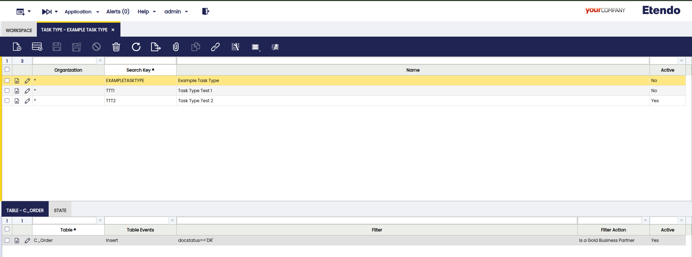
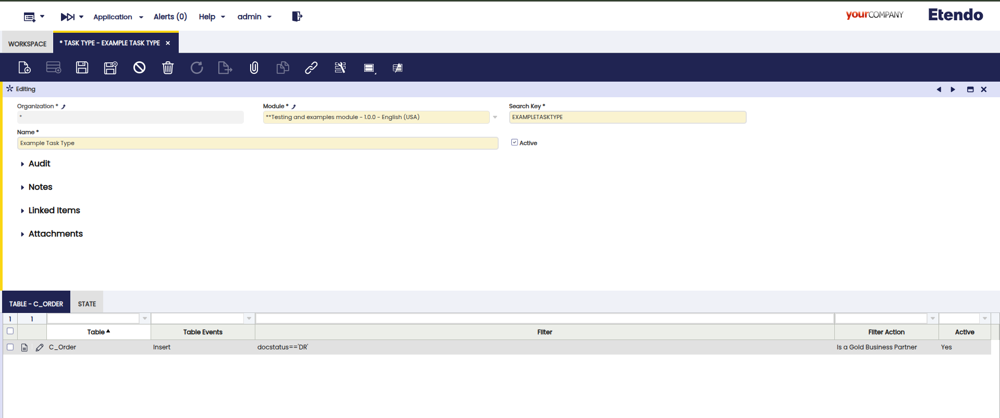
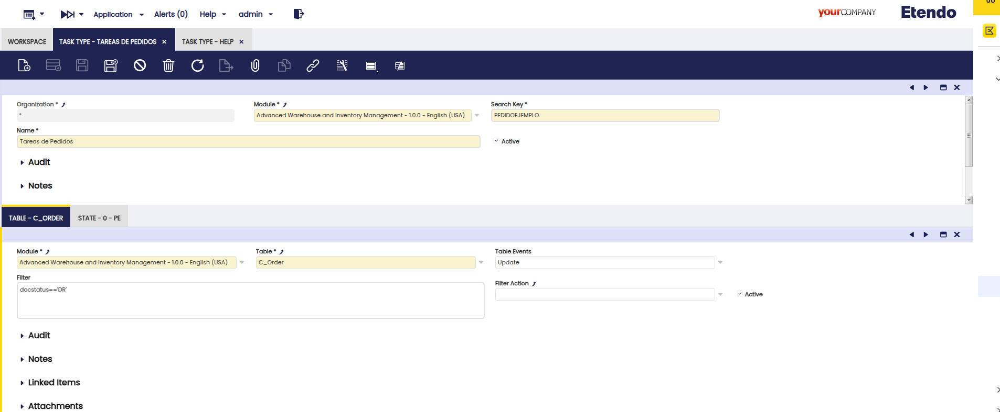
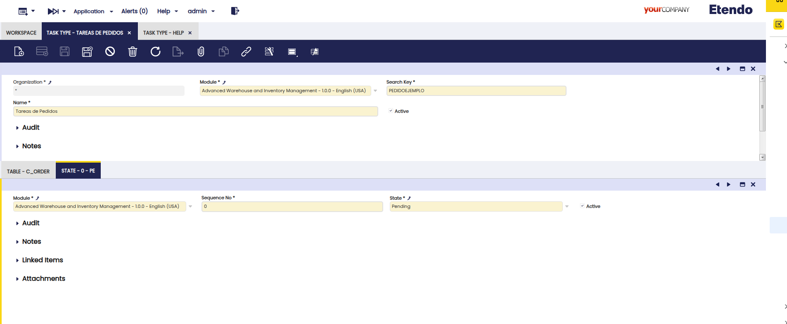
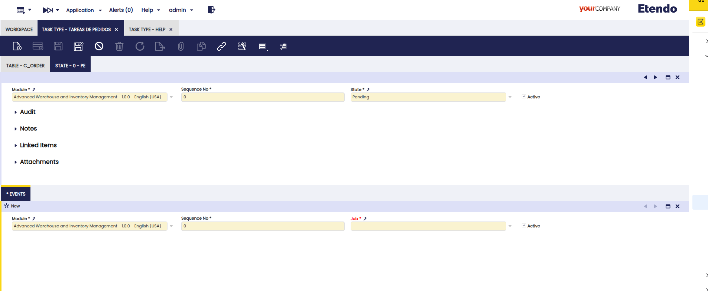
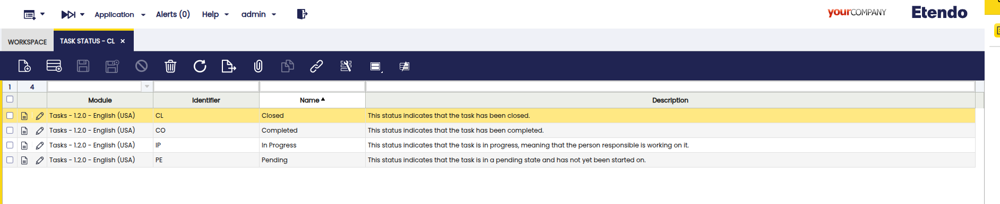
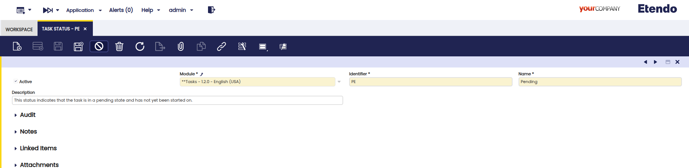
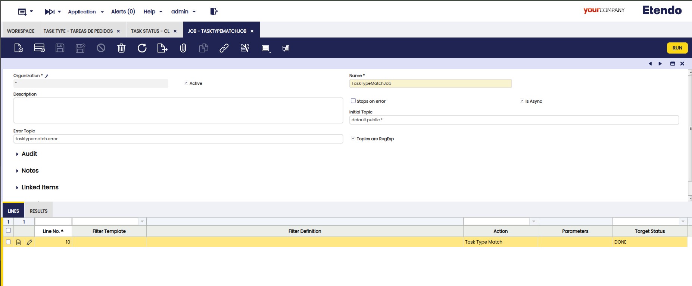
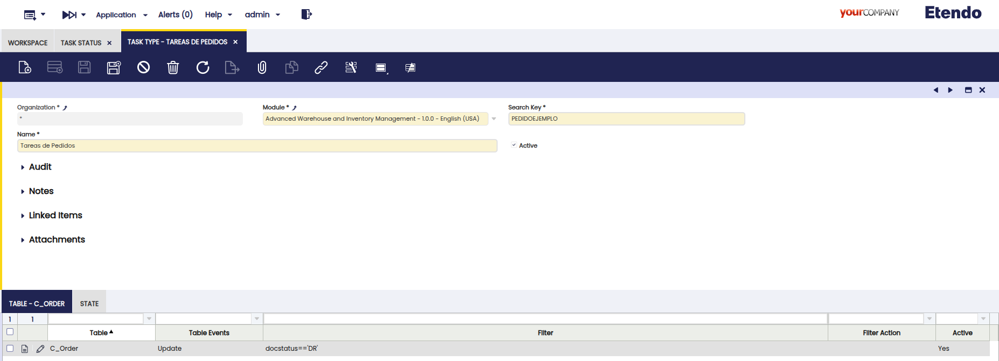
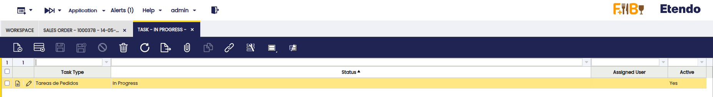

---
tags:

  - Task
  - Custom Tasks
  - Task Type
  - Task Status
  - Debezium
  - Kafka
---

# Task
:octicons-package-16: Javapackage: `com.etendoerp.task`

## Overview
This page explains how to configure and manage asynchronous and configurable tasks in Etendo Platform. Tasks can automatically triggered based on database events (such as `INSERT`, `UPDATE`, or `DELETE` database event), and can execute a sequence of defined actions such as validations, notifications, or assignments. These tasks are dynamically managed through a set of configuration windows.

The system processes tasks in response to events that occur within Etendo, such as the creation of an order or an incident. Based on these events, tasks are generated, assigned, and processed through a predefined sequence of states and actions.

## Initial Configuration

This module adds **rule-based task creation**, **state transitions**, and **Kafka messaging** capabilities to Etendo Platform.


**What `TaskTypeMatchJob` Does**


Debezium Event ──► TaskTypeMatchJob ──► ETASK_Task + Kafka Topics
            (rules • filters • states)


#### Stages & Behavior

| Stage                 | Behavior                                                                                                                                                      |
| --------------------- | ------------------------------------------------------------------------------------------------------------------------------------------------------------- |
| 1. Normalise          | Extracts table, verb (create / update / delete), and before/after JSON.                                                                                       |
| 2. Table `ETASK_Task` | • `Create` (created_automatically = N) → triggers events of the initial state. <br> • `Update` (status changes) → triggers events of the new state.           |
| 3. Other Tables       | For each matching Task Type:<br>• Pass JEXL filter + advanced logic.<br>• Create task (stores full JSON in `event_jsoninfo`).<br>• Fire initial state events. |
| 4. Output             | Returns JSON: <br>`json { "next": ["topicA", …], "message": {…}, "tasks": [{"task": "…", "state": "…"}, …] }`                                                 |

### Database Prerequisites

```sql
ALTER SYSTEM SET wal_level = logical;        -- restart PostgreSQL
ALTER TABLE etask_task REPLICA IDENTITY FULL;  -- enables BEFORE image
```

### Register the Debezium Connector

```bash
curl -X POST http://localhost:8083/connectors \
  -H 'Content-Type: application/json' \
  -d '{
        "name": "default",
        "config": {
          "connector.class": "io.debezium.connector.postgresql.PostgresConnector",
          "topic.prefix":   "default",

          "database.hostname": "db",
          "database.dbname":   "<database_name>",
          "database.user":     "postgres",
          "database.password": "syspass",

          "plugin.name": "pgoutput",

          "table.include.list": "public.etask_task", "public.<table>"

          "key.converter":   "org.apache.kafka.connect.json.JsonConverter",
          "value.converter": "org.apache.kafka.connect.json.JsonConverter",
          "key.converter.schemas.enable":   "false",
          "value.converter.schemas.enable": "false"
        }
      }'
```

!!! tip
    Add any extra business table to `table.include.list` as needed.  `etask_task` is **mandatory**.

###  Build & Deploy

1. Set the following configuration variables to enable and start the required services:

    ```groovy title="Gradle.properties"
    docker_com.etendoerp.etendorx=true
    docker_com.etendoerp.etendorx_async=true
    ```

2. Start the Dockerized services

    ```bash title=Terminal
    ./gradlew resources.up
    ```

3. Compile the environment

    ```bash title=Terminal
    ./gradlew update.database compile.complete smartbuild
    ```

4. Then start Tomcat


## Task Type Window
:material-menu: `Application` > `General Setup` > `Tasks` > `Task Type`

The **Task Type** window is used to create different types of tasks and is only accessible to users with the `System Administrator` role. A task type defines the event that triggers it, the sequence of states it must follow, and the actions that should execute in each state.




**Fields to note:**

- **Organization**: Defines the organization scope.
- **Module**: The owning module of the task type.
- **Search Key**: A unique identifier.
- **Name**: A human-readable name for the task type.
- **Active**: Toggle to enable or disable this task type.


#### Table Tab
Specifies the table and the database event (`INSERT`, `UPDATE`, `DELETE`) that will trigger the task. Optional filters (JEXL) and advanced validations can be defined. Task creation is triggered by Debezium events, which are processed by the `TaskTypeMatchJob` job. The system uses Kafka topics to communicate changes and actions.



- **Table**: The monitored database table (must be included in Debezium's `table.include.list`).
- **Action**: The database action that triggers the task.
- **Filter**: A dynamic JEXL expression to narrow down the triggering conditions.
- **Filter Action**: Optional advanced validation logic or a custom Groovy process (Action).

#### State Tab
Defines the lifecycle of the task by listing possible states (e.g., Pending, In Progress, Closed) in a specific sequence. Each state can trigger one or more jobs (async processes) via Kafka, as configured in the Events tab.



- **Name**: The name of the task state.
- **Sequence No.**: Determines the order of execution.
- **Status**: Links the state to a reusable status (see Task Status Window).

#### Events Tab (under State)
Allows defining jobs or actions that should be executed automatically when the task enters a specific state. Each event references a job (such as `TaskTypeMatchJob` or other async jobs), which can publish messages to Kafka topics as part of the workflow.



- **Job**: Reference to the job to be executed (should be set up as asynchronous and with RegExp topics in the Async Process window for Kafka integration).
- **Parameters**: Additional configuration for the job.
- **Action**: Must return a JSON with a Kafka topic, e.g. `{ "topic": "my.kafka.topic" }`.


## Task Status Window
:material-menu: `Application` > `General Setup` > `Tasks` > `Task Status`

This window allows creating reusable statuses for task types. Default values include `Pending`, `In Progress`, `Completed`, and `Closed`. Developers with `System Administrator` role can add custom statuses and export them in a development module. States in the Task Type window are linked to these statuses, enabling the workflow engine to track and trigger state transitions and associated events (including Kafka notifications).




**Fields to note:**

- **Search Key**
- **Name**
- **Description**

### Job Window
:material-menu: `Application` > `General Setup` > `Jobs`

Used to view and manage jobs. The default `TaskTypeMatchJob` is created when the Task module is installed and is responsible for processing Debezium events, matching them to task types, and orchestrating task creation, state transitions, and Kafka messaging. Users with the `System Administrator` role may create custom jobs, which can participate in the workflow by being referenced in state events and configured for asynchronous execution and Kafka topic subscription.



**Key configuration:**

- **Organization**
- **Name**
- **Description**
- **Initial and Error Topics**: Kafka topics for job communication.
- **Asynchronous**, **RegExp**: For Kafka-based async job processing (`Is Async` = `Y`, `Topics are RegExp` = `Y`).
- **Active**
- **Lines Tab**: Defines actions and result topics. Actions should return a JSON with the next Kafka topic to notify.

Jobs referenced in events should be set up as asynchronous and configured to listen to the appropriate Kafka topics.

!!! warning
    When jobs are added or changed, Tomcat must be restarted to regenerate Kafka listeners and ensure all async processes are active.


### Example Workflow

1. A `System Administrator` user creates a task type: **Example Task Type**.

- **Table**: `C_Order`
- **Event**: `UPDATE`
- **Filter**: `docstatus == 'DR'`
- **Advanced Filter**: process definition `Is a Gold Business Partner` to ensure the Business Partner category is Gold.

**Task Type**
    - Select Table and Event (`INSERT` / `UPDATE` / `DELETE`)
    - Optional: JEXL Filter + Advanced Logic (Action)

**States**

    - Define states in order (via Sequence No)
    - Link each to a `Status`

**Events**

    - Set Sequence No
    - Reference a `Jobs Job` (async process)
    - The `Action` must return:
    
    ```json
        { "topic": "my.kafka.topic" }
    ```

    This topic is collected by `TaskTypeMatchJob` and added to the `next` array in the output.

2. When triggered, the task is created with the status `Pending`. A job named `Set Business Partner As International` runs, marking the BP as international.

    

3. Next, log in as a Sales role (not System). Create and edit a Sales Order in `Draft` status.

4. Check the **Task** window to verify that the task has been created:

    

