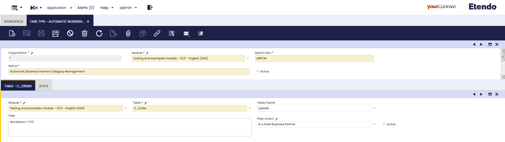
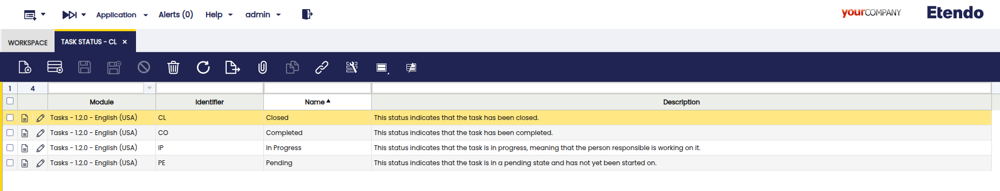

---
tags:

  - Task
  - Custom Tasks
  - Task Type
  - Task Status
  - Debezium
  - Kafka
---

# Task
:octicons-package-16: Javapackage: `com.etendoerp.task`

## Overview
This page explains how to configure and manage asynchronous and configurable tasks in Etendo Platform. Tasks can automatically triggered based on database events (such as `INSERT` or `UPDATE` database event), and can execute a sequence of defined actions such as validations, notifications, or assignments. These tasks are dynamically managed through a set of configuration windows.

The system processes tasks in response to events that occur within Etendo, such as the creation of an order or an incident. Based on these events, tasks are generated, assigned, and processed through a predefined sequence of statuss and actions.

## Initial Configuration

This module adds **rule-based task creation**, **status transitions**, and **Kafka messaging** capabilities to Etendo Platform.


**What `TaskTypeMatchJob` Does**


Debezium Event ──► TaskTypeMatchJob ──► ETASK_Task + Kafka Topics
            (rules • filters • status)


#### Stages & Behavior

| Stage                 | Behavior                                                                                                                                                      |
| --------------------- | ------------------------------------------------------------------------------------------------------------------------------------------------------------- |
| 1. Normalise          | Extracts table, verb (create / update ), and before/after JSON.                                                                                       |
| 2. Table `ETASK_Task` | • `Create` (created_automatically = N) → triggers events of the initial status. <br> • `Update` (status changes) → triggers events of the new status.           |
| 3. Other Tables       | For each matching Task Type:<br>• Pass JEXL filter + advanced logic.<br>• Create task (stores full JSON in `event_jsoninfo`).<br>• Fire initial status events. |
| 4. Output             | Returns JSON: <br>`json { "next": ["topicA", …], "message": {…}, "tasks": [{"task": "…", "status": "…"}, …] }`                                                 |

### PostgreSQL Configuration for Debezium

```sql
ALTER SYSTEM SET wal_level = logical;        -- restart PostgreSQL
ALTER TABLE etask_task REPLICA IDENTITY FULL;  -- enables BEFORE image
```

These commands prepare the PostgreSQL database to work with **Debezium**, a tool for capturing changes in tables.

- `ALTER SYSTEM SET wal_level = logical;`  
  Sets the Write-Ahead Logging (WAL) level to `logical`.  
  This is required for Debezium to stream logical changes from the database.  
  
  !!! warning  "**PostgreSQL must be restarted** after applying this change"

- `ALTER TABLE etask_task REPLICA IDENTITY FULL;`  
  Enables full replica identity on the `etask_task` table, allowing Debezium to access the previous values of rows when `UPDATE` operations occur.

These commands are **mandatory prerequisites** for Debezium to detect and propagate events to Kafka, which in turn triggers task processing in Etendo.

###  Start RX services

1. Set the following configuration variables to enable and start the required services:

    ```groovy title="Gradle.properties"
    docker_com.etendoerp.etendorx=true
    docker_com.etendoerp.etendorx_async=true
    ```

2. Start the Dockerized services

    ```bash title="Terminal"
    ./gradlew resources.up
    ```

### Register the Debezium Connector

This command registers a new Debezium connector in Kafka Connect. The connector listens to changes in the `etask_task` table (and any additional listed tables) and publishes them to Kafka topics. This enables the Etendo task processing engine to react to database changes in real time.


```bash title="Terminal"
curl -X POST http://localhost:8083/connectors \
  -H 'Content-Type: application/json' \
  -d '{
        "name": "default",
        "config": {
          "connector.class": "io.debezium.connector.postgresql.PostgresConnector",
          "topic.prefix":   "default",

          "database.hostname": "<postgres_host>",
          "database.dbname":   "<database_name>",
          "database.user":     "postgres",
          "database.password": "syspass",

          "plugin.name": "pgoutput",

          "table.include.list": "public.etask_task", "public.<table>"

          "key.converter":   "org.apache.kafka.connect.json.JsonConverter",
          "value.converter": "org.apache.kafka.connect.json.JsonConverter",
          "key.converter.schemas.enable":   "false",
          "value.converter.schemas.enable": "false"
        }
      }'
```

!!! info "Important Notes"

    - `postgres_host`: This variable refers to the hostname or IP address that allows the connector to access the PostgreSQL database outside the container. Its value depends on the Docker setup:

        - If using **Docker Desktop** (macOS, Windows, or Linux), you can use `host.docker.internal` to access the host machine from inside a container.

        - If using **native Docker**, the alias `host.docker.internal` is not available. Instead, run:

            ```bash title="Terminal"
            ip route | grep default
            ```

            Use the IP address shown after `default via` (e.g., `172.17.0.1`) as the host address.

        - If PostgreSQL is running dockerized in the same network, you can use the container name `db` as the hostname, thanks to Docker's internal DNS resolution.

    - `database.name`: The name of the PostgreSQL database to connect to.

    - `table.include.list`: Comma-separated list of tables to monitor. `public.etask_task` is **mandatory**. 


### Compilation

1. Compile the environment

    ```bash title="Terminal"
    ./gradlew update.database compile.complete smartbuild
    ```

2. Then start Tomcat


## Task Type Window
:material-menu: `Application` > `General Setup` > `Tasks` > `Task Type`

In this window, Task Types are defined, in this component the database events that automatically create a new task, the sequence of states it must follow and the actions to be executed in each state are defined. A developer, with the role of System Administrator, must define the task types, states and events, and they must be exported in a module under development.



**Fields to note:**

- **Organization**: Defines the organization scope.
- **Module**: The module where this component will be exported.
- **Search Key**: A unique identifier.
- **Name**: A human-readable name for the task type.
- **Active**: Checkbox to enable or disable this task type.

#### Table Tab
In this tab you specify the observed table and the event (insert or update) that will trigger the creation of the task. 
In addition, optional filters (JEXL) associated to the table fields or even advanced filters defined as actions can be defined. In case multiple tables or filters are defined, the task will be created on the first match, generating a single task per event occurred.

- **Module**: The module where this component will be exported.
- **Table**: The monitored database table (must be included in Debezium's `table.include.list`).
- **Action**: The database action that triggers the task (`INSERT` or `UPDATE`).
- **Filter**: A dynamic [JEXL Expression](https://commons.apache.org/proper/commons-jexl/reference/syntax.html){target="\_blank"} to narrow down the triggering conditions.
- **Filter Action**: Optional advanced validation implemented as filter [Action](../../how-to-guides/how-to-create-jobs-and-actions.md).
- **Active**: Checkbox to enable or disable this table.

#### Status Tab
Defines the lifecycle of the task by listing the possible status (e.g., Pending, In Progress, Closed) in a specific sequence. When a task is defined it is assigned the first status of the sequence.
Assigning or changing the status of a task, triggers the Events defined in the corresponding tab.

- **Module**: The module where this component will be exported.
- **Line No.**: It is used to determine the status order  and to determine which is the initial state when tasks are created.
- **Status**: Dropdown of reusable status defined in [Task Status](#task-status-window) window.
- **Active**: Checkbox to enable or disable this status.

##### Events
This tab defines asynchronous jobs that are automatically executed when the task enters a specific status. Jobs can post messages to Kafka topics as part of the workflow.

- **Module**: The module where this component will be exported.
- **Line No.**: It determines the queuing order, although as they are asynchronous processes they can be executed in parallel.
- **Job**: Reference to the job to be executed (should be set up as asynchronous), for more information visit [Jobs]() documentation.
- **Active**: Checkbox to enable or disable this event.


## Task Status Window
:material-menu: `Application` > `General Setup` > `Tasks` > `Task Status`

This window allows you to create reusable statuses for task types. Default values include `Pending`, `In Progress`, `Completed`, and `Closed`. Developers with `System Administrator` role can add custom statuses and export them in a development module. statuss in the Task Type window are linked to these statuses, enabling the workflow engine to track and trigger status transitions and associated events (including Kafka notifications).



**Fields to note:**

- **Module**: The module where this component will be exported.
- **Search Key**: A unique identifier for the status.
- **Name**: The display name that will be shown when using this status.
- **Description**: Optional description of the status.


## Example Workflow

En este ejemplo definiremos un nuevo tipo de tarea, la idea es que al completarse la primer orden de venta  de un  busines partners de la categoria "Internacional", se cree una tarea en estado pending lo que dispara una accion que asocia al cliente al programa de fidelizacion y luego si esa tarea se mueve a estado in progress  automaticamente se mueve a ese cliente a la categoria inicial "Gold".

1. As `System Administrator` user creates a task type *Automatic Loyalty Program Management** 

- **Table**: `C_Order`
- **Event**: `UPDATE`
- **Filter**: `docstatus == 'CO' and doctype =='SO'`
- **Filter Action**: `Is An International Business Partner`


**status**

    - Define status in order (via Sequence No)
    - Link each to a `Status`

**Events**

    - Set Sequence No
    - Reference a `Jobs Job` (async process)
    - The `Action` must return:
    
    ```json
        { "topic": "my.kafka.topic" }
    ```

    This topic is collected by `TaskTypeMatchJob` and added to the `next` array in the output.

2. When triggered, the task is created with the status `Pending`. A job named `Set Business Partner As International` runs, marking the BP as international.

    

3. Next, log in as a Sales role (not System). Create and edit a Sales Order in `Draft` status.

4. Check the **Task** window to verify that the task has been created:

    


## Job Window
:material-menu: `Application` > `General Setup` > `Jobs`

Used to view and manage jobs. The default `TaskTypeMatchJob` is created when the Task module is installed and is responsible for processing Debezium events, matching them to task types, and orchestrating task creation, status transitions, and Kafka messaging. Users with the `System Administrator` role may create custom jobs, which can participate in the workflow by being referenced in status events and configured for asynchronous execution and Kafka topic subscription.


**Key configuration:**

- **Organization**
- **Name**
- **Description**
- **Initial and Error Topics**: Kafka topics for job communication.
- **Asynchronous**, **RegExp**: For Kafka-based async job processing (`Is Async` = `Y`, `Topics are RegExp` = `Y`).
- **Active**
- **Lines Tab**: Defines actions and result topics. Actions should return a JSON with the next Kafka topic to notify.

Jobs referenced in events should be set up as asynchronous and configured to listen to the appropriate Kafka topics.

!!! warning
    When jobs are added or changed, Tomcat must be restarted to regenerate Kafka listeners and ensure all async processes are active.


- **Parameters**: Additional configuration for the job.
- **Action**: Must return a JSON with a Kafka topic, e.g. `{ "topic": "my.kafka.topic" }`.
