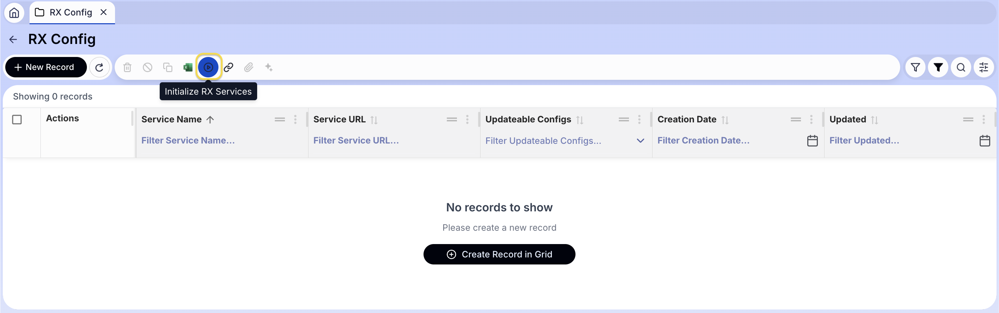
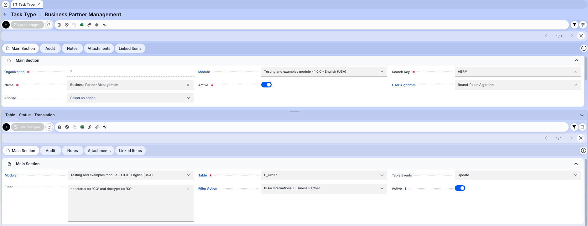
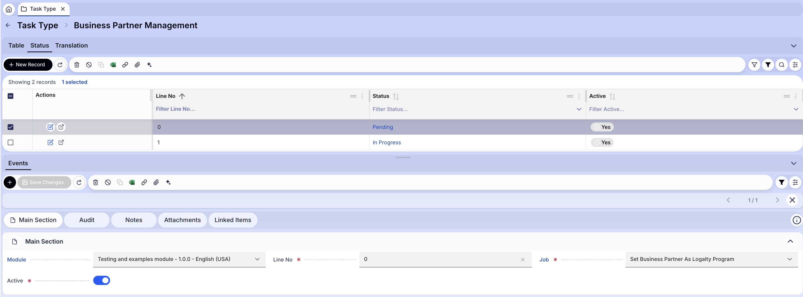
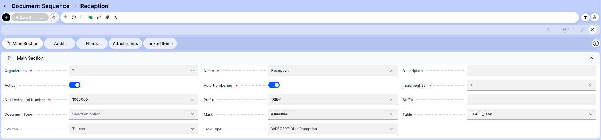
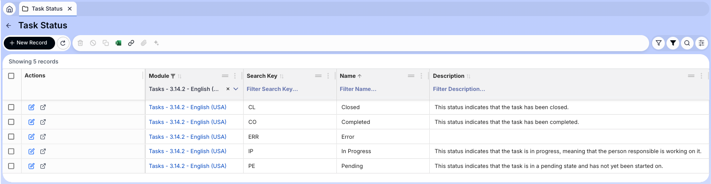
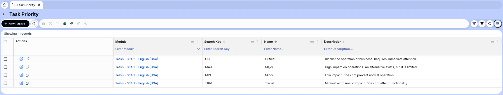
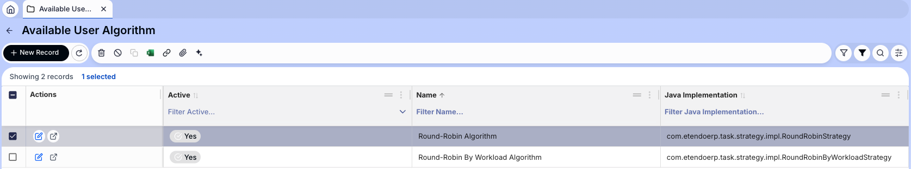

# Task
:octicons-package-16: Javapackage: `com.etendoerp.task`

## Overview
This page explains how to configure and manage asynchronous and configurable tasks in Etendo Platform. Tasks can be automatically triggered based on database events (such as `INSERT` or `UPDATE`), and can execute a sequence of defined actions such as validations, notifications, or assignments. These tasks are dynamically managed through a set of configuration windows.

The system processes tasks in response to events that occur within Etendo, such as the creation of an order or an incident. Based on these events, tasks are generated automatically, assigned, and processed through a predefined sequence of statuses and actions.

## Initial Configuration

### Configure PostgreSQL for Debezium Change Capture

Debezium is a change-data-capture tool that monitors your database for row-level changes and forwards them to Kafka. The two SQL commands below enable that monitoring on the Etendo database.

The database name is the value of `bbdd.sid` in `gradle.properties` (typically `etendo`), and the connection must use the PostgreSQL system user defined by `bbdd.systemUser` (typically `postgres`).

Choose the connection command that matches how your PostgreSQL instance is configured:

- If PostgreSQL requires a password, run:
    ```bash title="Terminal"
    psql -U postgres etendo
    ```
- If you are on Linux and PostgreSQL uses peer (OS-level) authentication, run:
    ```bash title="Terminal"
    sudo -u postgres psql -d etendo
    ```

Once connected, run the following SQL commands:

!!! warning "**PostgreSQL service must be restarted** after applying this change"

```sql title="PostgreSQL"
ALTER SYSTEM SET wal_level = logical;
ALTER TABLE etask_task REPLICA IDENTITY FULL;
```

These commands prepare the PostgreSQL database to work with **Debezium**, a tool for capturing changes in tables. 

| Command                 | Description                                                                                                                                      |
|-------------------------|--------------------------------------------------------------------------------------------------------------------------------------------------|
| `wal_level = logical`   | Sets the Write-Ahead Logging (WAL) level to `logical`. This is required for Debezium to stream logical changes from the database.                |
| `REPLICA IDENTITY FULL` | Enables full replica identity on the `etask_task` table, allowing Debezium to access the previous values of rows when `UPDATE` operations occur. |

These commands are **mandatory prerequisites** for Debezium to detect and propagate events to Kafka, which in turn triggers task processing in Etendo.

!!! info
    If you skip this manual configuration, the `./gradlew kafkaConnectSetup --info` task can detect missing settings and apply them automatically. However, doing so forces a PostgreSQL restart during the setup run. Apply the SQL commands manually first if a mid-setup database restart is not acceptable in your environment.

### Start RX Services

!!! warning
    Add these variables only after you have completed the base Etendo installation (the initial `./gradlew install` and first Tomcat startup). Do not include them during that initial install. Adding them before the base installation is complete will cause the base install itself to fail.

1. Configure the following variables in `Gradle.properties` to enable and start the required services:

    ```groovy title="Gradle.properties"
    docker_com.etendoerp.etendorx=true
    docker_com.etendoerp.etendorx_async=true
    kafka.enable=true
    kafka.connect.bbdd.host=host.docker.internal
    kafka.connect.host=kafka
    kafka.connect.tables=public.etask_task,public.<table>
    authentication.class=com.etendoerp.etendorx.auth.SWSAuthenticationManager
    ```

    !!! info "Important Notes"

        - `docker_com.etendoerp.etendorx`: Enables RX services.  
        - `docker_com.etendoerp.etendorx_async`: Enables Kafka and Connect services.  
        - `kafka.enable`: Activates the Kafka service.  
        - `kafka.connect.bbdd.host`: PostgreSQL host. By default `host.docker.internal`. If PostgreSQL runs in a Docker container on the same network, you can use the container name (e.g., `db`) thanks to Docker's internal DNS.  
        - `kafka.connect.host`: Kafka host. By default `kafka` when running in Docker. In other environments, specify the correct host.  
        - `kafka.connect.tables`: Comma-separated list of tables to monitor. `public.etask_task` is **mandatory**. Add any additional tables you need to track.  
        - `authentication.class`: Class used to obtain the SWS token required for authentication.  

2. Apply the configuration by running the Gradle setup task:

    ```bash title="Terminal"
    ./gradlew setup --info 
    ```

3. Start the Docker services:

    ```bash title="Terminal"
    ./gradlew resources.up
    ```

4. Create the connection between Connect and Kafka by running:

    !!! info
        This command calls the Kafka Connect REST API, which runs on port 8083 inside the Docker network by default. If Kafka Connect has not fully started after `resources.up`, the command will fail. Wait until all Docker services are healthy before running it (you can check with `docker ps` or your Docker dashboard).

        Only Kafka Connect needs to be healthy for this step. The other dockerized RX services (config, auth, DAS, edge) start automatically and do not require any manual ERP configuration at this point — you will configure them in the **Initialize RX Services** section below.

    ```bash title="Terminal"
    ./gradlew kafkaConnectSetup --info
    ```

### Compile the Environment and Start Tomcat

!!! warning
    **Tomcat must not be running** when this command executes, because `update.database` modifies the database schema and will fail or produce inconsistent data if Tomcat is active.

    - **Docker-managed Tomcat** (`docker_com.etendoerp.tomcat=true` in `gradle.properties`): Stop the Tomcat container before running the command (e.g., `docker stop etendo-tomcat-1`). `smartbuild` will restart Tomcat automatically when the build completes.
    - **Locally installed Tomcat** (Tomcat started manually on your machine, not through Docker): Stop the Tomcat process before running the command, then start it again manually once the build completes.

```bash title="Terminal"
./gradlew update.database compile.complete smartbuild --info
```

### Initialize RX Services
:material-menu: `Application` > `Etendo RX` > `RX Config`

!!! warning
    This step is mandatory. Without it, the Task module cannot function. The **Initialize RX Services** process populates the default configuration variables — including service endpoints and parameters — that the RX services need to communicate with Etendo Classic. Skipping this step causes task processing to fail silently — no error is shown and no tasks are created or processed.

Once the environment is compiled and Tomcat is running, as `System Administrator` role, navigate to **RX Config** window, run the **Initialize RX Services** process from the toolbar. This step registers the access data required for the interaction between Etendo RX services. For more details, see [Etendo RX Configurations](../../../etendo-rx/getting-started.md#etendo-rx-configurations).



## Task Type Window
:material-menu: `Application` > `General Setup` > `Task Management` > `Task Type`

In this window, Task Types are defined, in this component the database events that automatically create a new task, the sequence of states it must follow and the actions to be executed in each state are defined. 

A developer, with the `System Administrator` role, must define the task types, states and events, and they must be exported in a module under development.



**Fields to note:**

- **Organization**: Defines the organization scope.
- **Module**: The module where this component will be exported.
- **Search Key**: A unique identifier of the task type.
- **Name**: Readable name for the task type.
- **Active**: Checkbox to enable or disable this task type.
- **User Algorithm**: Drop-down to select the automatic task assignment algorithm. These algorithms are configured in the [Available User Algorithm](#available-user-algorithm-windows) window. The default options are:

    - **Round-Robin Algorithm**: Distributes tasks equally in sequence, without considering workload. Use when the tasks and resources are similar.
    - **Round-Robin By Workload Algorithm**: Assigns tasks to the resource with the lightest current load. Use when the task sizes or resource capacities vary.

- **Priority**: Optional default priority assigned to tasks created from this task type (e.g., `Critical`, `Major`, `Minor`, `Trivial`). If set, all new tasks of this type will inherit this priority unless overridden manually.

### Table Tab
In this tab you specify the observed table and the event (insert or update) that will trigger the creation of the task.
In addition, optional filters (JEXL) associated to the table fields or even advanced filters defined as actions can be defined. 

!!! warning
    In case multiple tables or filters are defined, it must be ensured that they are mutually exclusive because more than one task could be created per event occurred.

**Fields to note:**

- **Module**: The module where this component will be exported.
- **Table**: The monitored database table (must be included in Debezium's `table.include.list`).
- **Action**: The database action that triggers the task (`INSERT` or `UPDATE`).
- **Filter**: A dynamic [JEXL Expression](https://commons.apache.org/proper/commons-jexl/reference/syntax.html){target="\_blank"} to narrow down the triggering conditions.
- **Filter Action**: Optional advanced validation implemented as filter [Action](../../how-to-guides/how-to-create-jobs-and-actions.md).
- **Active**: Checkbox to enable or disable this table trigger.

### Status Tab
Defines the lifecycle of the task by listing the possible statuses (e.g., Pending, In Progress, Closed) in a specific sequence. 
When a task is created it is assigned the **first status** of the sequence. Assigning or changing the status of a task triggers the **events** defined in the following subtab.



**Fields to note:**

- **Module**: The module where this component will be exported.
- **Line No.**: It is used to determine the status order and to determine which is the initial state when tasks are created.
- **Status**: Dropdown of reusable status defined in [Task Status](#task-status-window) window.
- **Active**: Checkbox to enable or disable this status.

#### Events Subtab

This tab defines asynchronous jobs that are automatically executed when the task enters a specific status. Jobs can post messages to Kafka topics as part of the workflow.

- **Module**: The module where this component will be exported.
- **Line No.**: It determines the queuing order, although as they are asynchronous processes they can be executed in parallel.
- **Job**: Reference to the job to be executed (should be set up as asynchronous), for more information visit [How to Create Jobs and Actions](../../how-to-guides/how-to-create-jobs-and-actions.md) documentation.
- **Active**: Checkbox to enable or disable this event.

### Task No. Sequence Configuration
:material-menu: `Application` > `Financial Management` > `Accounting` > `Setup` > `Document Sequence`

Each Task Type can be linked to a [Document Sequence](../../../../user-guide/etendo-classic/basic-features/financial-management/accounting/setup/document-sequence.md) to auto-generate the **Task No.** field with a formatted, sequential identifier.



Create a new sequence with the following values:

- **Name**: A descriptive name for the sequence.
- **Auto Numbering**: Enable to auto-generate sequential numbers.
- **Increment By**: Numeric step between generated values.
- **Next Assigned Number**: The starting number for the sequence.
- **Prefix**: Optional string prepended to each number.
- **Suffix**: Optional string appended to each number.
- **Mask**: Format mask for the numeric part.
- **Table**: Must be set to `ETASK_Task`.
- **Column**: Must be set to `Taskno`.
- **Task Type**: Select the Task Type this sequence applies to.

!!! info
    Each Task Type can have its own sequence, allowing different prefixes, masks, and numbering ranges per type.

## Task Status Window
:material-menu: `Application` > `General Setup` > `Task Management` > `Task Status`

This window allows you to create reusable statuses for task types. Default values include `Pending`, `In Progress`, `Completed`, and `Closed`. Developers with `System Administrator` role can add custom statuses and export them in a development module. In the Task Type window these statuses are used, enabling the workflow engine to track and trigger status transitions and associated events (including Kafka notifications).



**Fields to note:**

- **Module**: The module where this component will be exported.
- **Search Key**: A unique identifier for the status.
- **Name**: The display name that will be shown when using this status.
- **Description**: Optional description of the status.
- **Active**: Checkbox to enable or disable this status.

## Task Priority Window
:material-menu: `Application` > `General Setup` > `Task Management` > `Task Priority`

This window allows you to create reusable priorities for tasks. Priorities help organize and categorize tasks by importance level. Developers with `System Administrator` role can add custom priorities and export them in a development module. These priorities can be assigned to tasks to indicate their relative importance.



**Fields to note:**

- **Module**: The module where this component will be exported.
- **Search Key**: A unique identifier for the priority.
- **Name**: The display name that will be shown when using this priority.
- **Description**: Optional description of the priority.
- **Sequence Number**: Numeric value that determines the order or weight of the priority (e.g., 20).
- **Color (Hex)**: Hexadecimal color code for visual identification of the priority in the interface (e.g., `#F57C00`).
- **Active**: Checkbox to enable or disable this priority.

## Available User Algorithm Windows
:material-menu: `Application` > `General Setup` > `Task Management` > `Available User Algorithm`

In this window, you can configure the different algorithms that allow determining the availability of users to the task's assignment.

It only needed to define a name and the Java path where the implementation of the algorithm is located. This implementation must extend the `UserAvailabilityStrategy` interface.



**Fields to note:**

- **Active**: Checkbox to enable or disable this algorithm.
- **Module**: The module where this component will be exported.
- **Name**: The display name that will be shown when using this algorithm.
- **Java Implementation**: Path of the Java file where the algorithm implementation is located, this implementation must extend `UserAvailabilityStrategy` interface.


## Example Workflow

If you review the documentation of the different windows, you can see that an example of how to use tasks is being followed.
The idea is that once this task type is configured, when the first sales order of a business partner with the International checkbox marked is completed, a new task is created in pending status. It is automatically associated to a user using the defined algorithm.
When the task is created, the Event associated to the initial status of the task **pending** is triggered, this event launches a job in charge of marking the customer as associated to the loyalty program.  
Then, assuming that the user assigned to follow up this customer (sales agent) determines that the customer has already invoiced enough, he can move the task to **in progress** status and the automation automatically mark it as a **Gold** customer.

Now we will go through the settings:

1. In the example configuration shown in this documentation, we defined a new task type called `Business Partner Management` and assigned the `Round-Robin Algorithm` for user assignment.
2. As we can see in the **Table** tab, it is configured to detect the `UPDATE` action on the `c_order` table filtering only when a **sales order** is **completed**.
3. Two statuses are configured, **Pending** and **In progress** in that order, which means that when a new task is created it will be automatically assigned the `Pending` status.
4. Two jobs are selected in the **Events** subtab, **Set Business Partner As Loyalty Program** when the task is `pending`, and **Set Business Partner As Gold** when the task is `In Progress` respectively.

!!! info
    In the [Task - User Guide](../../../../user-guide/etendo-classic/optional-features/bundles/platform-extensions/task.md) section you can see how tasks are automatically created, assigned users and how to change their status from the window with the same name.


---
This work is licensed under :material-creative-commons: :fontawesome-brands-creative-commons-by: :fontawesome-brands-creative-commons-sa: [ CC BY-SA 2.5 ES](https://creativecommons.org/licenses/by-sa/2.5/es/){target="_blank"} by [Futit Services S.L.](https://etendo.software){target="_blank"}.


