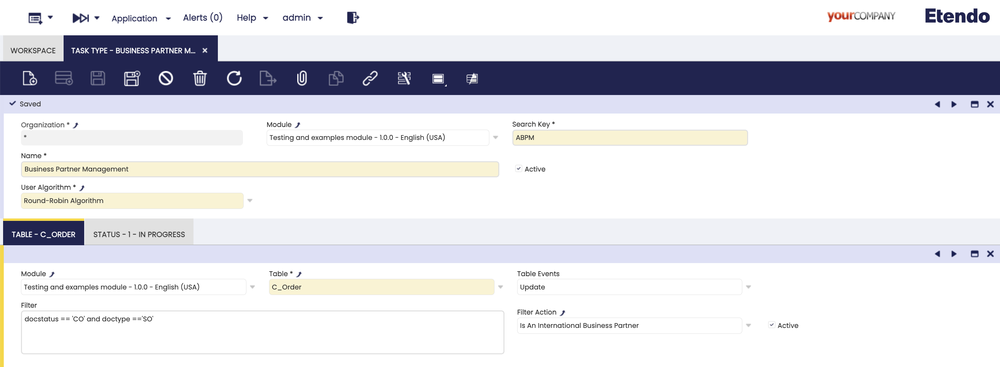
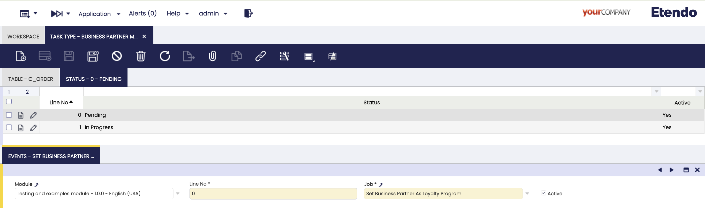

# Task
:octicons-package-16: Javapackage: `com.etendoerp.task`

## Overview
This page explains how to configure and manage asynchronous and configurable tasks in Etendo Platform. Tasks can be automatically triggered based on database events (such as `INSERT` or `UPDATE`), and can execute a sequence of defined actions such as validations, notifications, or assignments. These tasks are dynamically managed through a set of configuration windows.

The system processes tasks in response to events that occur within Etendo, such as the creation of an order or an incident. Based on these events, tasks are generated automatically, assigned, and processed through a predefined sequence of statuses and actions.

## Initial Configuration

### PostgreSQL Configuration for Debezium Use

```sql title="PostgreSQL"
ALTER SYSTEM SET wal_level = logical;
ALTER TABLE etask_task REPLICA IDENTITY FULL;
```

These commands prepare the PostgreSQL database to work with **Debezium**, a tool for capturing changes in tables.

!!! warning "**PostgreSQL service must be restarted** after applying this change" 

| Command                 | Description                                                                                                                                      |
|-------------------------|--------------------------------------------------------------------------------------------------------------------------------------------------|
| `wal_level = logical`   | Sets the Write-Ahead Logging (WAL) level to `logical`. This is required for Debezium to stream logical changes from the database.                |
| `REPLICA IDENTITY FULL` | Enables full replica identity on the `etask_task` table, allowing Debezium to access the previous values of rows when `UPDATE` operations occur. |

These commands are **mandatory prerequisites** for Debezium to detect and propagate events to Kafka, which in turn triggers task processing in Etendo.

###  Start RX services

1. Set the following configuration variables to enable and start the required services:

    ```groovy title="Gradle.properties"
    docker_com.etendoerp.etendorx=true
    docker_com.etendoerp.etendorx_async=true
    kafka.enable=true

    authentication.class=com.etendoerp.etendorx.auth.SWSAuthenticationManager
    ```

2. Start the Dockerized services

    ```bash title="Terminal"
    ./gradlew resources.up
    ```

### Register the Debezium Connector

This command registers a new Debezium connector in Kafka Connect. The connector listens to changes in the `etask_task` table (and any additional listed tables) and publishes them to Kafka topics. This enables the Etendo task processing engine to react to database changes in real time.


```bash title="Terminal"
curl -X POST http://localhost:8083/connectors \
  -H 'Content-Type: application/json' \
  -d '{
        "name": "default",
        "config": {
          "connector.class": "io.debezium.connector.postgresql.PostgresConnector",
          "topic.prefix":   "default",

          "database.hostname": "<postgres_host>",
          "database.dbname":   "<database_name>",
          "database.user":     "postgres",
          "database.password": "syspass",

          "plugin.name": "pgoutput",

          "table.include.list": "public.etask_task", "public.<table>"

          "key.converter":   "org.apache.kafka.connect.json.JsonConverter",
          "value.converter": "org.apache.kafka.connect.json.JsonConverter",
          "key.converter.schemas.enable":   "false",
          "value.converter.schemas.enable": "false"
        }
      }'
```

!!! info "Important Notes"

    - `postgres_host`: This variable refers to the hostname or IP address that allows the connector to access the PostgreSQL database outside the container. Its value depends on the Docker setup:

        - If using **Docker Desktop** (macOS, Windows, or Linux), you can use `host.docker.internal` to access the host machine from inside a container.

        - If using **native Docker**, the alias `host.docker.internal` is not available. Instead, run:

            ```bash title="Terminal"
            ip route | grep default
            ```

            Use the IP address shown after `default via` (e.g., `172.17.0.1`) as the host address.

        - If PostgreSQL is running dockerized in the same network, you can use the container name `db` as the hostname, thanks to Docker's internal DNS resolution.

    - `database.name`: The name of the PostgreSQL database to connect to.

    - `table.include.list`: Comma-separated list of tables to monitor. `public.etask_task` is **mandatory**. 


### Compilation

1. Compile the environment

    ```bash title="Terminal"
    ./gradlew update.database compile.complete smartbuild
    ```

2. Then start Tomcat


## Task Type Window
:material-menu: `Application` > `General Setup` > `Task Management` > `Task Type`

In this window, Task Types are defined, in this component the database events that automatically create a new task, the sequence of states it must follow and the actions to be executed in each state are defined. 

A developer, with the `System Administrator` role, must define the task types, states and events, and they must be exported in a module under development.



**Fields to note:**

- **Organization**: Defines the organization scope.
- **Module**: The module where this component will be exported.
- **Search Key**: A unique identifier of the task type.
- **Name**: Readable name for the task type.
- **Active**: Checkbox to enable or disable this task type.
- **User Algorithm**: Drop-down to select the automatic task assignment algorithm. These algorithms are configured in the [Available User Algorithm](#available-user-algorithm-windows) window. The default options are:

    - **Round-Robin Algorithm**: Distributes tasks equally in sequence, without considering workload. Use when the tasks and resources are similar.
    - **Round-Robin By Workload Algorithm**: Assigns tasks to the resource with the lightest current load. Use when the task sizes or resource capacities vary.

### Table Tab
In this tab you specify the observed table and the event (insert or update) that will trigger the creation of the task. 
In addition, optional filters (JEXL) associated to the table fields or even advanced filters defined as actions can be defined. 

!!!warning
    In case multiple tables or filters are defined, it must be ensured that they are mutually exclusive because more than one task could be created per event occurred.

**Fields to note:**

- **Module**: The module where this component will be exported.
- **Table**: The monitored database table (must be included in Debezium's `table.include.list`).
- **Action**: The database action that triggers the task (`INSERT` or `UPDATE`).
- **Filter**: A dynamic [JEXL Expression](https://commons.apache.org/proper/commons-jexl/reference/syntax.html){target="\_blank"} to narrow down the triggering conditions.
- **Filter Action**: Optional advanced validation implemented as filter [Action](../../how-to-guides/how-to-create-jobs-and-actions.md).
- **Active**: Checkbox to enable or disable this table trigger.

### Status Tab
Defines the lifecycle of the task by listing the possible statuses (e.g., Pending, In Progress, Closed) in a specific sequence. 
When a task is created it is assigned the **first status** of the sequence. Assigning or changing the status of a task triggers the **events** defined in the following subtab.



**Fields to note:**

- **Module**: The module where this component will be exported.
- **Line No.**: It is used to determine the status order and to determine which is the initial state when tasks are created.
- **Status**: Dropdown of reusable status defined in [Task Status](#task-status-window) window.
- **Active**: Checkbox to enable or disable this status.

#### Events Subtab

This tab defines asynchronous jobs that are automatically executed when the task enters a specific status. Jobs can post messages to Kafka topics as part of the workflow.

- **Module**: The module where this component will be exported.
- **Line No.**: It determines the queuing order, although as they are asynchronous processes they can be executed in parallel.
- **Job**: Reference to the job to be executed (should be set up as asynchronous), for more information visit [Async Jobs]() documentation.
- **Active**: Checkbox to enable or disable this event.


## Task Status Window
:material-menu: `Application` > `General Setup` > `Task Management` > `Task Status`

This window allows you to create reusable statuses for task types. Default values include `Pending`, `In Progress`, `Completed`, and `Closed`. Developers with `System Administrator` role can add custom statuses and export them in a development module. In the Task Type window these statuses are used, enabling the workflow engine to track and trigger status transitions and associated events (including Kafka notifications).


**Fields to note:**

- **Module**: The module where this component will be exported.
- **Search Key**: A unique identifier for the status.
- **Name**: The display name that will be shown when using this status.
- **Description**: Optional description of the status.
- **Active**: Checkbox to enable or disable this status.


## Available User Algorithm Windows
:material-menu: `Application` > `General Setup` > `Task Management` > `Available User Algorithm`

In this window, you can configure the different algorithms that allow determining the availability of users to the task's assignment.

It only needed to define a name and the Java path where the implementation of the algorithm is located. This implementation must extend the `UserAvailabilityStrategy` interface.


**Fields to note:**

- **Module**: The module where this component will be exported.
- **Name**: The display name that will be shown when using this algorithm.
- **Java Implementation**: Path of the Java file where the algorithm implementation is located, this implementation must extend `UserAvailabilityStrategy` interface.
- **Active**: Checkbox to enable or disable this algorithm.


## Example Workflow

If you review the documentation of the different windows, you can see that an example of how to use tasks is being followed.
The idea is that once this task type is configured, when the first sales order of a business partner with the International checkbox marked is completed, a new task is created in pending status. It is automatically associated to a user using the defined algorithm.
When the task is created, the Event associated to the initial status of the task **pending** is triggered, this event launches a job in charge of marking the customer as associated to the loyalty program.  
Then, assuming that the user assigned to follow up this customer (sales agent) determines that the customer has already invoiced enough, he can move the task to **in progress** status and the automation automatically mark it as a **Gold** customer.

Now we will go through the settings:

1. In the example configuration shown in this documentation, we defined a new task type called `Business Partner Management` and assigned the `Round-Robin Algorithm` for user assignment.
2. As we can see in the **Table** tab, it is configured to detect the `UPDATE` action on the `c_order` table filtering only when a **sales order** is **completed**.
3. Two statuses are configured, **Pending** and **In progress** in that order, which means that when a new task is created it will be automatically assigned the `Pending` status.
4. Two jobs are selected in the **Events** subtab, **Set Business Partner As Loyalty Program** when the task is `pending`, and **Set Business Partner As Gold** when the task is `In Progress` respectively.

!!! info
    In the [Task - User Guide](../../../../user-guide/etendo-classic/optional-features/bundles/platform-extensions/task.md) section you can see how tasks are automatically created, assigned users and how to change their status from the window with the same name.

---
This work is licensed under :material-creative-commons: :fontawesome-brands-creative-commons-by: :fontawesome-brands-creative-commons-sa: [ CC BY-SA 2.5 ES](https://creativecommons.org/licenses/by-sa/2.5/es/){target="_blank"} by [Futit Services S.L.](https://etendo.software){target="_blank"}.


