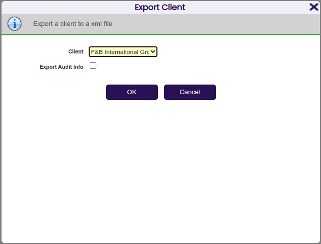
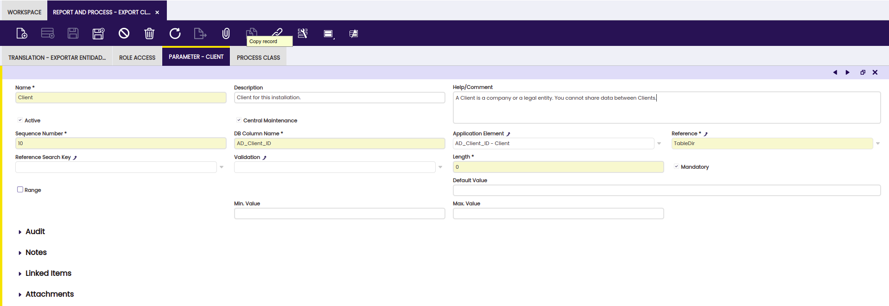

#  Processes

  
##  Overview

A process is a systematic series of actions directed to some end. Typically a
process receives some parameters and taking them into account performs some
actions to obtain a result. Etendo defines two main kinds of processes
_PL/SQL Processes_ and _Java Processes_ .

All processes (as well as [Reports](../../../developer-guide/etendo-classic/concepts/.How_to_create_a_Report.md)) are managed from the same window: `Application Dictionary > Report and Process`. 

Once a process is defined it can be added to the menu to be called directly from there, it can be invoked through a button or it can be scheduled to be executed in the background.

Background processes can be set as _Prevent Concurrent Executions_ . Before a process with this attribute is about to be executed, it is checked there are no other instances of the same process in execution at the same time, in this case another execution is aborted.

###  Parameters

When a process (PL/SQL or Java) or a Jasper Report is set as _Standard_, a pop-up message is automatically generated and displayed when invoking it, this message looks like this:

{: .legacy-image-style}

This pop-up has a section with information about the process, this information is obtained from the _Help_ field in the _Report and Process_ tab.

It also prompts for a number of parameters, and finally there are two buttons, _OK_ to start the process and _Cancel_ to close the pop-up and not to do anything else. In case the process did not require any parameter that section would be empty.

When this kind of process requires parameters they must be defined in the `Application Dictionary > Report and Process > Parameter`tab.

{: .legacy-image-style}

Parameters are defined in a very similar way than columns are. Depending on the _Reference_ field, the generated UI assigned for the parameter will be different.

Let's overview some of the most important fields in this tab:

  * *DB Column name* : This is the name the parameter will be passed with to the process. When the process is going to use this parameter it will have to use this name. Please notice that Postgresql is case-sensitive. In case the parameter references an existing column in database (for example, it is a parameter of type search), then the _DB Column name_ field must be cased the same way as the column in the Application Dictionary. 
  * *Sequence* : It is a numeric value to order the parameter in the pop-up. 
  * *Application Element* : It is the [Element](../../../developer-guide/etendo-classic/concepts/Element_and_Synchronize_Terminology.md)  that will be used to get the label from, in this way parameters are translatable. 
  
!!!note 
    It is also possible to set or not this element as *Centrally Maintained*. 

  * *Reference* , *Reference Search Key* and *Validation*: These three fields works exactly like the same ones when defining references for columns. 
  * *Range* : If it is checked, the pop-up will display two parameters in order to define a range, the first parameter will be named as specified in _DB Column name_ field and the second one will have the same name with a _TO_ suffix. 

###  Defining Processes

Processes can be of two different types: _PL/SQL Processes_ and _Java
Processes_ . PL/SQL processes are implemented in the PL/SQL language and are executed by the database engine. Java proceses are implemented in the Java language and are executed by the application server.

####  PL/SQL Processes

_PL/SQL Processes_ are implemented by database stored procedures. 

!!!info
    For more information, read [How to create a Stored Procedure](../../../developer-guide/etendo-classic/how-to-guides/.How_to_create_a_Stored_Procedure.md).

PL/SQL processes are defined in `Application Dictionary > Report and Process`. The only field to take into account for this kind of processes is *Procedure*: It is the procedure name in the database. 

!!!note
    As PL/SQL procedures are assigned to modules, they must be named according to following the naming rules: the name of the procedure must start with the module's
    DBPrefix.

As the pop-up for PL/SQL processes is always automatically generated, the *UI
Pattern* field must be set as _Standard_ .

In case the process requires any parameter, it is possible to define them. 

!!!info
    To learn more about how to do it read [Parameters](#parameters).

####  Java Processes

Java processes are implemented by java classes. 

!!!info
    For more information, read [How to create a Java Process](../../../developer-guide/etendo-classic/how-to-guides/.How_to_create_a_Java_Based_Process.md)   .

Java processes are also defined in the `Application Dictionary > Report and Process` window. Depending on the _UI pattern_ they use, they can be split
into _Standard_ and _Manual_ . Additionally, if the _UI Pattern_ is set to
_Manual_, it is necessary to include an entry in the *Process Mapping* to make
it accessible in the `web.xml`.

!!!note
    The pop-up used to invoke Java processes defined with _Standard_ _UI pattern_
    is automatically generated in the same way the interface for PL/SQL processes
    is done.

To set a Java process to be have Standard UI just set the _UI Pattern_ field
to _Standard_ in the `Application Dictionary > Report and Process` header.

It is also necessary to indicate the Java class that is going to implement the
process, this is done adding a new record in the *Process Class* tab. At
least, one record in this tab must be checked as default.

If the process requires parameters they can be defined in the *Parameter*
tab as explained in the [Parameters](#parameters) section of this document.

###  Executing processes

!!!note
    It is required to define the process compilation in order to be able to
    execute it. This step can be performed executing ` ./gradlew smartbuild ` and
    restarting Tomcat afterwards.  

  
Processes can be executed from the user interface from a menu or in with
button. It can also be scheduled to be executed in the background without any
user interaction.

####  Executing a process from a menu option

To execute a process from a menu option, you need to define a new menu option
that executes the process. Menus are defined in `General Setup > Application > Menu`. In the *Action* field the *Process* entry must be selected, then in the *Process* field select the process. it will be executed immediately and then saved.

Finally, press the *Tree* button to organize the new menu option in the menu
tree, and now the process defined can be executed selecting this new menu
created.

####  Executing a process from a button

To execute a process with a button you need to define a column that references
a button. In `Application Dictionary > Tables and Columns`, go to the
column you want to use to execute the process and in the field *Reference*
select the *Button* entry, then in the *Process* field select the process
you want to execute and save.

When executing a process with a button, the record ID of the current record
selected of the table will be passed to the process. This allows to execute
functions for specific records.

####  Executing a process in the background

Backgroung processes are defined in `General Setup > Process Scheduling > Process Request`. 

!!!info
    For more information, read [How to create a Background Process](../../../developer-guide/etendo-classic/how-to-guides/How_to_create_a_Background_Process.md).

In this window you can define a background process. The process to be executed
can be selected in the *Process* field. Then you define the scheduling for
the background process and it is then ready for use.

!!!note
    There is no user interaction necessary to execute the process, thus no pop-up
    will appear prompting for additional parameters.

#####  Kill a background Process
 
  
A button *Kill Process* is shown in the Process Monitor window on that
processes that implements the KillableProcess interface while a process is
being executed (Status = Processing). The interface KillableProcess will let
you kill your process using a kill mechanism.

**Mechanism to Kill**

The mechanism that your background process uses to kill itself might vary
between implementations. However the main idea in any implementation
should be to have the body of the job's execution periodically check some
flag to see if a kill has been requested, and if the flag is set, somehow
abort the performance of the rest of the job's work.

Let's see an example

Here we have a dummy process which simply prints in the log
the identifier for all the business partners:

    
    
    public class DummyProcess extends DalBaseProcess {
     
      private static final Logger log4j = Logger.getLogger(DummyProcess.class);
     
      @Override
      protected void doExecute(ProcessBundle bundle) throws Exception {
        try {
     
          // Get all business partners
          final OBCriteria<BusinessPartner> bpCri = OBDal.getInstance().createCriteria(
              BusinessPartner.class);
          bpCri.setFetchSize(1000);
          final ScrollableResults partnerScroller = bpCri.scroll(ScrollMode.FORWARD_ONLY);
          int i = 1;
          // Loop all business partners using a ScrollabeResults to avoid performance issues
          while (partnerScroller.next()) {
            final BusinessPartner bp = (BusinessPartner) partnerScroller.get()[0];
            // Print the Identifier for every business partner
            log4j.info(bp.getIdentifier());
     
            if ((i % 100) == 0) {
              OBDal.getInstance().getSession().clear();
            }
            i++;
     
          }
          partnerScroller.close();
        } catch (Exception ex) {
          Throwable e = DbUtility.getUnderlyingSQLException(ex);
          log4j.error("Error in DummyProcess", e);
          throw new JobExecutionException(e.getMessage(), e);
        }
     
      }
     
    }

**Killable Process**

Now, we will see the same process but with Interface KillableProcess implemented with the kill method.

    
    
    public class DummyProcessKillable extends DalBaseProcess implements KillableProcess {
     
      private static final Logger log4j = Logger.getLogger(DummyProcessKillable.class);
     
      // Add a variable 'stop' to control the kill implementation and set false by default
      private boolean stop = false;
     
      @Override
      protected void doExecute(ProcessBundle bundle) throws Exception {
        try {
     
          // Get all business partners
          final OBCriteria<BusinessPartner> bpCri = OBDal.getInstance().createCriteria(
              BusinessPartner.class);
          bpCri.setFetchSize(1000);
          final ScrollableResults partnerScroller = bpCri.scroll(ScrollMode.FORWARD_ONLY);
          int i = 1;
          // Loop all business partners using a ScrollabeResults to avoid performance issues
     
          // Only continue with the process if the variable 'stop' is false
          while (partnerScroller.next() && !stop) {
            final BusinessPartner bp = (BusinessPartner) partnerScroller.get()[0];
            // Print the Identifier for every business partner
            log4j.info(bp.getIdentifier());
            // Add a timeout of 30 seconds
            Thread.sleep(30000);
     
            if ((i % 100) == 0) {
              OBDal.getInstance().getSession().clear();
            }
            i++;
     
          }
          partnerScroller.close();
        } catch (Exception ex) {
          Throwable e = DbUtility.getUnderlyingSQLException(ex);
          log4j.error("Error in DummyProcess", e);
          throw new JobExecutionException(e.getMessage(), e);
        }
     
      }
     
      @Override
      public void kill(ProcessBundle bundle) throws Exception {
        bundle.getLog().log("process killed")
        // When kill is called set variable 'stop' to true so the process will be interrupted in the
        // next iteration: while (partnerScroller.next() && !stop)
        stop = true;
      }
     
    }

Let us comment the code. First, we need to implement the KillableProcess interface.

    
    
    public class DummyProcessKillable extends DalBaseProcess implements KillableProcess {

We create a variable *stop* that we will use to check the continuity of the execution.

    
    
    // Add a variable 'stop' to control the kill implementation and set false by default
      private boolean stop = false;

In the main loop of the process, we add the check to stop the execution when
the variable is set to true.

    
    
          // Only continue with the process if the variable 'stop' is false
          while (partnerScroller.next() && !stop) {

We have also added a sleep (30 seconds) to make the execution time longer.

    
    
            Thread.sleep(30000);

Finally, we implement the kill method that sets *stop* to true.

    
    
      @Override
      public void kill(ProcessBundle bundle) throws Exception {
        bundle.getLog().log("process killed")
        // When kill is called set variable 'stop' to true so the process will be interrupted in the
        // next iteration: while (partnerScroller.next() && !stop)
        stop = true;
      }

Now, we are able to kill the process from the Process Monitor. When a process
is killed, the status in the process monitor will be *Killed by User*.

This work is a derivative of [Processes](http://wiki.openbravo.com/wiki/Processes){target="\_blank"} by [Openbravo Wiki](http://wiki.openbravo.com/wiki/Welcome_to_Openbravo){target="\_blank"}, used under [CC BY-SA 2.5 ES](https://creativecommons.org/licenses/by-sa/2.5/es/){target="\_blank"}. This work is licensed under [CC BY-SA 2.5](https://creativecommons.org/licenses/by-sa/2.5/){target="\_blank"} by [Etendo](https://etendo.software){target="\_blank"}. 

