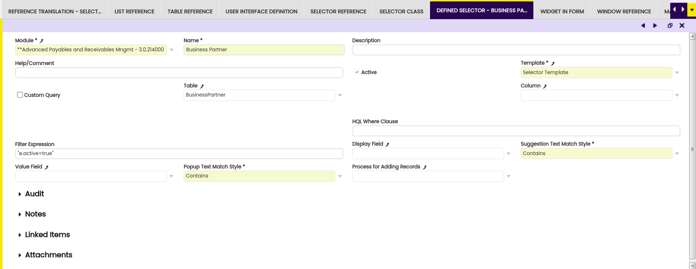
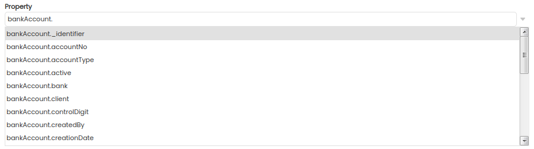
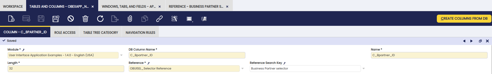
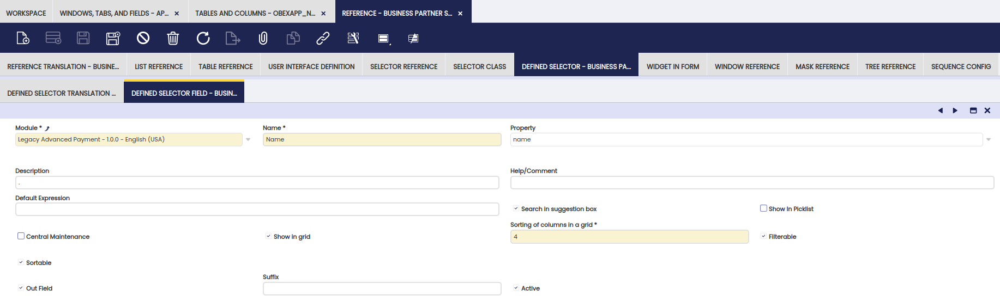
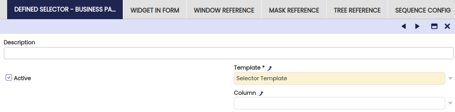

# Selectors

##  Overview

In this section, the process to define selectors in the Etendo system is described.

Selectors combine a suggestion box with a popup window with filter and sorting capabilities. They have a number of important features:

  * they can be completely defined without manual coding. 
  * the selector definition (columns, search criteria, where clause) can be changed at runtime without re-compiling or re-starting the system. 
  * the selector makes it very easy to show linked information of a selected entity or search, sort and filter on linked information. 
  * the selector suggestion box, as well as the popup grid, support paging with lookahead. This makes them also suitable for large datasets. 

##  Selector Example Module

The manual refers to and uses screenshots from the  Selector Example module.
To follow this manual it is necessary to install this module from the central repository.

After installing this module and rebuilding, you can try out the selector functionality. Change Role to Admin (or another user role having access to the example window). You can find the selector example in `General Setup` > `Examples` > `SelectorExample`. Click on this menu option. A grid view opens, click new to open the edit form.

The form shows three selector fields: 2 business partner fields and one product field. The product field gets enabled after you have entered a value in the second business partner field.

{: .legacy-image-style}

{: .legacy-image-style}

A suggestion box is dropped-down when you start typing in the fields. You can also click on the magnifier icon to show a popup window with several filter and sorting possibilities.

##  Selector Concept

A selector is defined within the Application Dictionary of Etendo. A selector is used for representing foreign key references in the Etendo user interface. A selector is defined as part of a Reference (a domain type) definition within Etendo.

A selector consists of three parts:

  * the reference definition 
  * the selector header defining which table to select from and the where clause to use 
  * the selector fields which define which columns are searched and what columns are shown in the popup window. 

##  Defining a Selector

To define a new selector go to `Application Dictionary` > `Reference` window.
Defining the selector is a three-step procedure:

  1. create a new reference 
  2. create a selector header 
  3. create zero or more selector fields 

This section guides you through all three steps.

###  Step 1: Define a Reference

The reference is used in the column definition. The definition is shown below in the screenshot.


  
A description of the fields:

  * Name, Description and Help should be set to a specific value for the reference you are creating 
  * Base Reference **must** be set to false 
  * Parent Reference **must** be set to OBUISEL_Selector_Reference 
  * Model, WAD and Runtime UI Implementation can be left empty most of the time.

###  Step 2: Define the Selector

After defining the reference, the selector information can be entered. This is also done in the reference window. Make sure that the reference window shows the reference you have created in step 1 then click **Defined Selector**
in the top right of the window and press the **new** button.




  
A description of the fields:

  * **Name and Help/Comment**: set these to values describing the selector 
  * **Description**: this is used as the title of the popup window 
  * **Template**: there should normally be only one option: Selector Template. Multiple options are possible if additional templates have been installed for selectors. 
  * **Table**: normally a selector selects from a table, select the relevant table from the list 
  * **Column**: the column in the referenced table to which the foreign key column points. If nothing is set here (the default) then the primary key column is used. 
  * **Datasource**: can be set when no table is selected. A data source can be used to provide data which is not read from the database but is, for example, computed at runtime. For more information on Datasources, see the [Datasource](../concepts/datasources.md) Developers Manual.
  * **HQL Where Clause**: this where clause is used to filter the data read from the database. 

!!! Note
    Currently it is not possible to use session variables in the where clause.
  
!!! Note
    When using properties of the entity in the whereclause always the prefix 'e.' has to be used, for example 'e.seqno'  
  
  
  * **Display Field**: this selector field is displayed in the drop-down of the suggestion box. Some specific aspects: 
    * an empty value (the default one) means that the identifier columns of the referenced table are used to display information in the suggestion box. This default value is often a good choice. 
    * initially, when creating a selector, it is not possible to select a field here as no selector fields have been defined yet (see next section). After defining one or more selector fields, it is possible to choose one of these fields here. 
  * **Value Field**: this selector field is set as the value and stored in the database as the foreign key field. Some specific aspects: 
    * an empty value (the default one) means that the primary key column of the referenced table is used. This is by far the most common case and therefore a good choice for most if not practically all cases. 
    * initially, when creating a selector, it is not possible to select a field here as no selector fields have been defined yet (see next section). After defining one or more selector fields, it is possible to choose one of these fields here. 
  * **Sort By Field**: this selector field is used to sort the records in the drop-down of the suggestion box. Some specific aspects: 
    * an empty value (the default one) means that the records are ordered by the values of the display field. And in case the display field is neither defined, the identifier columns of the referenced table are used to sort information in the suggestion box. This default is often a good choice. 
    * initially, when creating a selector, it is not possible to select a field here as no selector fields have been defined yet (see next section). After defining one or more selector fields, it is possible to choose one of these fields here. 

###  Step 3: Defining Selector Fields

After defining the selector header, the next step is to define the selector field. A selector field is used for the following things:

  * to define a column in the popup search grid 
  * to define a column of the target table which is searched for the suggestion box 
  * to define the display field of the suggestion box (what gets displayed when a user types in values in the field) 
  * to define the value field, the column which is used to set the value in the foreign key column 
  * to define the sort by field of the suggestion box 

A selector can have zero or more selector fields. It is possible to define a selector without selector fields. The system will use the default which is to show the identifier in the suggestion box and use the primary key of the referenced table as the value. The suggestion box is shown in the field but no popup window is shown. So this is a light-weight selector definition.

To define a selector field click on the **Defined Selector Field** link shown in the top-right of the Defined Selector tab.

{: .legacy-image-style}
  
The description of the fields of the Defined Selector Field:

  * **Name**: use a descriptive name here 
  * **Property**: is a column/property from the table set in the selector header. This field is implemented using the selector itself. This makes it easy for a user to select the correct model property. It is possible to enter a property path. For the business partner table, it is possible, for example, to specify `bankAccount.bank.name` which will show the name of the bank of the bank account of the business partner. See the [next section](#property-paths-showing-linked-information) on Property Paths for more information. 

{: .legacy-image-style}

  * **Description and Help/Comment**: set these to meaningful values for your specific case (see also the **Central Maintenance** field below). The description field is for future usage. 
  * **Show in grid**: if checked, then the field is visible in the popup grid. If not checked then the field is not shown in the popup grid. It can still be used as the value field, display field, sort by field or as a search field for the suggestion box. 
  * **Sorting of columns in a grid**: the order in which the columns are shown in the popup grid. Only relevant if **Show in grid** is checked. 
  * **Sortable**: determines if the user can sort on this column in the popup grid. Only relevant if **Show in grid** is checked. 
  * **Filterable**: determines if the user filter on this column in the popup grid. Only relevant if **Show in grid** is checked. 
  * **Central Maintenance**: if checked then the name, description and help/comment are copied/used from the column. This is handled by the [Synchronize Terminology](../concepts/Element_and_Synchronize_Terminology.md)  process. 
  * **Search in suggestion box**: as a default, the suggestion box will use the string entered by the user to search in the display field (set in the selector header) or identifier. You can select additional fields to search in by setting this field (Search in suggestion box) to yes/checking it. To make search field invisible just uncheck the field **show in grid**, then the field is only used to search and not displayed in the popup grid. 

!!! note
    * If none of the selector fields have **show in grid** checked/set to yes, then no popup grid is available and the magnifier icon is not shown, the user can only select data through the suggestion box. 
    * when setting a column to filterable or sortable, it is possible that a decreasing performance is encountered with a table with many thousands of records. If this happens, contact the database administrator to optimize the table by adding indexes. Note that these new indexes have to be exported to the Etendo metadata using standard `export.database` procedures. 

###  Property Paths, Showing Linked Information

The selector has a very powerful feature that makes it easy to show linked information in the suggestion box and popup windows.

To give an example of linked information. For a business partner selector, it is quite easy to show the identifier of the business partner category. This linked information can take multiple steps, so it is possible to show the name of the bank of the bankaccount of the business partner. These two examples are entered like this in the property field of the Defined Selector Field:

  * `businessPartnerCategory._identifier` 
  * `bankAccount.bank.name` 

By using the dot (.), the path takes the next step in the model. The suggestion box in the Defined Selector Field window gives support in entering the correct path.

{: .legacy-image-style}

This is then displayed like this in the popup window (see the bank and the business partner category columns):

{: .legacy-image-style}

The fields which use such a property path can be used as the display field, sort by field or value field and can be used to filter and sort on in the popup grid. So they are treated as standard normal properties.

###  Table and Datasource

A selector can retrieve its content from a table or from a Datasource. When in the selector definition a table is defined then on the server Etendo will create a datasource for this table. So internally for Etendo there is no real difference between a table or datasource for the selector.

There are a number of use-cases for which using a datasource makes sense:

  * when the data for a selector requires preprocessing after retrieval from the database. 
  * when the data in a selector is not even read from the database but computed in memory by the system. 

A datasource is implemented by a developer and then defined in the Application Dictionary. After this, it can be used to define selectors.

!!!note
    For more information on how to implement a datasource, see its [Datasources](../concepts/datasources.md) page.

###  Translated information

The Selector and Selector Fields also allow you to specify translated versions of names and titles shown in the user interface. To use translated names and titles, go to the **Defined Selector translation** and **Defined Selector Field Translation** tabs. These tabs are available at the top of the window when editing a Selector or Selector Field.

###  Selector Examples

The Selector Example module installs a number of different selectors. These selectors can be studied to see how they are defined and what the result in the user interface is. When you filter the reference grid on the word 'Selector' they will show up:

{: .legacy-image-style}

##  Using a Selector

The next step is making use of the selector in the data model. The selector is the same as any other Reference in Etendo. The Reference is used in the definition of a Column. To use the defined selector and set it in a column, go to `Application Dictionary` > `Tables and Columns`. Then select the table and the column you want to set the reference for.

Then, in the reference field, choose OBUISEL_Selector Reference. Then in the next combo box **Reference Search Key**, select the specific selector. In the screenshot below a Business Partner Selector is chosen.  

{: .legacy-image-style}
  
The column can be used to define a field in the Etendo window in a standard way. So in the Etendo Window/Tab/Field definition there is no special setting or handling required for the selector.

After setting the reference in the column and using it in a specific window, you need to restart Etendo to see it in action.

##  Changing a Selector at Runtime

The selector definition itself can be changed at runtime without re-compiling the system. There are no real limits to what part of the selector definition which can be changed at runtime, a non-excluding list:

  * add/remove columns from the popup grid 
  * change the where clause 
  * change the fields which are searched as part of the suggestion box display 

!!! note
    In order to change a selector, the module it belongs to needs to be in development.
    If not, then it is possible that the client-side javascript (representing the selector) is not refreshed automatically.

##  Defining Out Fields

The usual return values from a Selector is the record **id** and **indentifier**. In some cases the developer wants to return more fields and not only these two. You can mark a Selector Field as **Out Field** and will be part of the
JavaScript returned object.

!!! note 
    By default the **id** and **identifier** fields are part of the returned object .
  
{: .legacy-image-style}

###  Using Out Fields in Manual Code (Advanced)

You can use the New Selectors in manual code (not generated by WAD). You must include all the necessary JS imports. There is an empty hook function **onValueChanged** that you can override in your manual window, to perform any custom action. When the user picks a row, this function gets executed. By default it does not do anything.

####  Example of Function

!!! note
    To test this code, you must have a browser with console enabled, e.g. Firefox with Firebug.  

``` 
     
    isc.OBSelectorLinkWidget.addProperties({
       onValueChanged: function(selected) {
           // selected is an object with members id and _identifier
           // plus all Out Fields
           window.console.log("%o", selected); 
         }
       }
    });
```

In this case, all instances of the OBSelectorLinkWidget will execute the same function, this example function just prints the object passed as parameter.

You can also only override the function on a particular instance.
    
     
    // sc_C_Bpartner_One_ID is an instance of OBSelectorWidget or OBSelectorLinkWidget
    sc_C_Bpartner_One_ID.onValueChanged = function(selected) {
     window.console.log("%o", selected);
    };

##  Providing a New Selector Template (Advanced)

The selector definition is converted to javascript code using a template. The template is selected in the selector (see step 2 above). It is possible for a module to add a new template which can be used for creating selectors.
Creating a new template needs to be done by a developer with a good understanding of Etendo.

Also to implement a new template it is necessary to understand the template processing and template handling functionality used by Etendo. The [Etendo Architecture](../concepts/etendo-architecture.md) page provides detailed information. It discusses both template processing, caching, i18n and also gives pointers on how to implement a custom template.

The template used for the selector can be found in the source tree of the `org.openbravo.userinterface.selector` module inside the `org.openbravo.userinterface.selector.templates` package in the `selector.ftl` file.

A custom template should be created inside a separate module. To make use of it, define it inside `Application Dictionary` > `Templates`.

{: .legacy-image-style}

  
The main fields to set:

  * The TemplateClasspathLocation should point to the location in the source tree of the custom template. 
  * The ComponentType **must** be set to selector. The ComponentType determines if the template can be selected in the selector definition. 

{: .legacy-image-style}

When defining selectors, the user can select the custom template.

##  Customizing the Look and Feel of the Selector

The styling of the selector is mostly automatically derived from the styling of other components. Only the icon on the right of the field needs to be styled, see [this page](../concepts/skins.md#selector) for more information.

##  Troubleshooting

###  The Suggestion Box does not Filter

**Symptom** : When typing in values in the selection box it does not filter, all records are shown.

**Cause** : This can happen when you have accidentally added boolean/yes/no fields to be **search in suggestionbox**.

**Solution** : uncheck the **search in suggestionbox** fields for the boolean/yes/no fields, searching these fields is not supported by the selector in the suggestion box.

###  The Suggestion Box is Always Empty

**Symptom** : When typing values in the selection field the suggestion box is empty or shows much less results than expected, also selecting the direct drop down results in an empty/smaller than expected list.

**Cause** : this happens because there are **search in suggestionbox** fields which require a join to a table while the foreign key is not always set. Only the records which have a value in the foreign key are shown.

**Solution** : if the foreign key selection field is the only one on which is filtered this is fine, however if there are multiple search fields then searching on non-mandatory foreign key fields is not supported by the selector.

##  Advanced Topics

###  HQL Transformers

It is possible to modify an HQL query entirely via java and dependency injection using transformers. To implement the new functionality, visit [HQL Transformers](../how-to-guides/How_to_create_a_HQL_Based_Table.md#HQL_Transformers).

###  Using foreign keys in HQL Custom queries

In order to do that, the HQL select clause for that property needs to point to an entity (i.e. e.organization, instead of e.organization.name). Then in the definition of the selector field we have to select a Table reference that points to the target entity.

---

This work is a derivative of [Selectors](http://wiki.openbravo.com/wiki/Selectors){target="\_blank"} by [Openbravo Wiki](http://wiki.openbravo.com/wiki/Welcome_to_Openbravo){target="\_blank"}, used under [CC BY-SA 2.5 ES](https://creativecommons.org/licenses/by-sa/2.5/es/){target="\_blank"}. This work is licensed under [CC BY-SA 2.5](https://creativecommons.org/licenses/by-sa/2.5/){target="\_blank"} by [Etendo](https://etendo.software){target="\_blank"}. 