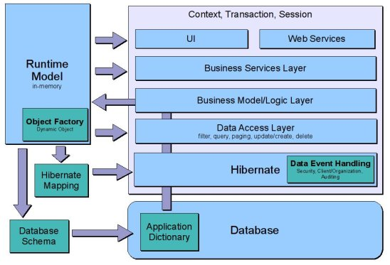

#  Data Access Layer
  
##  Overview

The goal of the Etendo Data Access Layer (DAL) development is to strengthen the middle-tier in the application, i.e. to implement business logic in Java. The DAL provides the
application developer with the following functionality:

  * Type safe querying and retrieval of business objects from the database. 
  * A convenient API to update or create new data in the database. 
  * A type safe interface to update information of a business object, increased productivity by making the properties of a business object directly visible through getters and setters (in the IDE). 
  * Transaction and context handling. 
  * Security and validation checking. 
  * Automatically maps new entries in the Application Dictionary to database tables and columns. 
  * Generates Java class business objects (and their associations) on the basis of the Application Dictionary model. 

The DAL consists of a development-time and runtime part. The development-time
part takes care of generating Java business object classes. The runtime part
takes care of mapping Java classes to the database and supporting
functionality such as security and validation.

##  A 'Hello World' Example

As a first simple example, let's create a new business partner group and store
it in the database:
``` java
     // create the object through the factory
      final Category bpg = OBProvider.getInstance().get(Category.class); 
     
     // set some values
     bpg.setDefault(true);
     bpg.setDescription("hello world");
     bpg.setName("hello world");
     bpg.setValue("hello world");
     bpg.setActive(true);
     
     // store it in the database
     OBDal.getInstance().save(bpg);
```

There are a number of things which are important to note:

  * The above code does not set an explicit user context. The user context is set automatically when running the above code in Etendo Classic. However, in other environments, it has to be set explicitly, see [here](#user-context) for more information. 
  * There is a BPGroup class which models the data of the _c_bp_group_ table. This class has type safe getters and setters for all the data in this table. 
  * A factory (the OBProvider) is used to create an instance of the BPGroup class. 
  * The OBDal service is the main entry point into the Data Access Layer, it offers save, remove and query functionality. The OBDal API is discussed in more detail below. 

The code snippet above also shows that you do not need to work with SQL or JDBC
to work with the data from the database. As a developer, you work
directly with objects and the available data is directly visible through the
getters and setters.

As a next step, let's query for the business partner group, and change its
description:
```java
     // create an OBCriteria object and add a filter
     final OBCriteria<Category> obCriteria = OBDal.getInstance().createCriteria(Category.class);
     obCriteria.add(Restrictions.eq("name", "hello world"));
     
     // perform the actual query returning a typed list
     final List<Category> categories = obCriteria.list();
     final Category cat = categories.get(0);
     
     // and set a new name
     cat.setName("another hello world");
     OBDal.getInstance().save(cat);
```
This code snippet introduced a number of new concepts:

  * The OBDal service is used to create an OBCriteria object. 
  * The OBCriteria object represents the query, implements the Hibernate Criteria interface and can be used as a standard Hibernate Criteria object. The OBCriteria object also supports sorting and paging parameters. The OBCriteria API is discussed in more detail below. 
  * The OBCriteria list method performs the actual query, it returns a type safe list of the requested objects. 
  * After changing the name of the business partner group, you don't need to do an explicit save. At commit time Hibernate will automatically detect _dirty_ objects and save those. 

This was a short introduction which shows how the DAL can be used to create,
store and retrieve one (simple) business object. The rest of this section
will describe the Data Access Layer functionality in more detail.

##  DAL Architecture

The image below shows the envisioned architecture for the data access layer in
Etendo Classic.

  


  
This architecture is implemented:

  * Runtime model: the runtime model is the main driver for generating the business objects and the Hibernate mapping. It's also used extensively in security, export/import and in webservices implementations. 
  * Hibernate Mapping: from the runtime model the DAL (during initialization) generates a Hibernate mapping. This Hibernate mapping is used to initialize Hibernate. 
  * Database Schema: the runtime model (actually the application dictionary) can be used to update the database schema. This is not available as part of the DAL but as part of the DBSourceManager product. 
  * Data Access Layer: the Data Access Layer (DAL) provides an API to store, query and remove business objects from the database. 
  * Business Model/Logic Layer : the business model/logic layer contains the implementation of the business processes. 
  * Business Services: the service layer exposes the business logic to the outside world. I

The complete architecture runs inside of a context which provides security and
transaction handling.

##  Business Object

This document uses the term business object to denote an entity and its
dependent information. A business object can be a simple entity such as a
currency which just has basic primitive fields. On the other hand it can also
be a structure of entities, for example an order header with its order line.

A business object structure always has one business object which is the owner
of all the business objects in that structure, for example, for a sales order
the sales order header business object is the owner of the complete structure
(i.e. of the sales order lines). Another way of describing this is that the
sales order lines depend on the sales order header, a sales order line can not
exist without its sales order header and when a sales order header is removed
also its sales order lines should be removed.

The DAL uses the foreign keys from the child to parent to create the parent-
child association in Java and Hibernate. More specifically: the foreign key
columns which have the field isParent set to yes (checked/true) define the
business object parent-child relations, other foreign key columns define
standard many-to-one associations. For example the foreign key field
_c_order_id_ in _c_order_line_ is used to create the one-to-many association
(in the in-memory runtime model) from _c_order_ to _c_order_line_ . This one-
to-many association is then used to generate a List<OrderLine> member in the
Java Order class and a one-to-many mapping in Hibernate.
  
It is possible not to generate those one-to-many associations in the parent
entity. This can be avoided by setting *Child Property in Parent Entity* field to
false in Column tab. 

!!!note
    Generated one-to-many properties in the parent
    entity, load all children in memory when invoked, so they should be only
    generated when the expected amount of child records is low, otherwise it
    might cause an `OutOfMemoryError`.

In order to keep a backward compatible API, `hb.generate.all.parent.child.properties=true` preference can be set in etendo.propeties, in this way all foreign key columns will generate a one-
to-many property in the parent entity.

##  DAL Main Interfaces

The DAL offers three main services to instantiate, create and query Etendo Classic business objects: OBDal, OBCriteria and OBProvider. The service classes
can all be found in the _org.openbravo.dal.service_ package.

###  OBDal

The  [OBDal](https://github.com/etendosoftware/etendo_core/blob/main/src/org/openbravo/dal/service/OBDal.java){target="\_blank"}  instance (available through _OBDal.getInstance()_ ) is the main
entrance point for retrieving and storing business objects in the database in
a validated and secure way. It provides the following functions:

  * save: stores a new business object in the database or an existing business object is updated. For existing business objects, it is not required to call this method as Hibernate does automatic _dirty_ checking. 
  * get: retrieves a single business object using its ID. There are two versions: one using the class name (of the generated business object) and one using the entity name. 
  * remove: delete a business object from the database, the actual database delete is done at commit time. 
  * create OBCriteria: [OBCriteria](https://github.com/etendosoftware/etendo_core/blob/main/src/org/openbravo/dal/service/OBCriteria.java){target="\_blank"} objects are used for querying. 
  * commitAndClose and rollbackAndClose: these methods can be used to implement custom transaction handling. Normally, this is done by the environment (Etendo web container or Etendo test). 

The OBDal API makes extensive use of the  [OBCriteria](https://github.com/etendosoftware/etendo_core/blob/main/src/org/openbravo/dal/service/OBCriteria.java){target="\_blank"}  and  [OBQuery](https://github.com/etendosoftware/etendo_core/blob/main/src/org/openbravo/dal/service/OBQuery.java){target="\_blank"}  classes to support querying.
  
The OBDal class allows accessing to the  read-only database (pool). In
this case, the instance must be retrieved with the
_OBDal.getReadOnlyInstance()_ method. It is important to note that if the
read-only pool is not configured, this method will use the standard pool to
get the database connections.
  
Once the read-only pool is configured, there are two ways to override
_OBDal.getReadOnlyInstance()_ behavior:

  * Creating a record in _Data Pool Selection_ , which associates a database pool with a particular report. 
  * Using the _Default DB Pool used by reports_ Preference, which defines the default pool returned by _OBDal.getReadOnlyInstance()_ if no entry in Data Pool Selection is made for the current Process. 

###  OBCriteria

The  OBCriteria  class implements the [Hibernate Criteria](https://docs.jboss.org/hibernate/core/3.5/reference/en/html/querycriteria.html){target="\_blank"} interface. It
extends the standard Hibernate Criteria functionality for filtering on active,
client and organization. In addition, it offers convenience methods to set
orderby and to perform count actions.

Summarizing, the OBCriteria object supports all Hibernate Criteria features:

  * Setting the where-clause of a filter using the Hibernate Criterion concept. 
  * Setting paging parameters such as first row and maximum number of results. 
  * Setting order by on the query. 
  * Specifying joins for performance reasons. 
  * Performing counts, average etc. 

For more information, see the [Hibernate Criteria](https://docs.jboss.org/hibernate/core/3.5/reference/en/html/querycriteria.html){target="\_blank"} on Criteria queries.

The functionality of OBCriteria is illustrated with a number of code snippets:

An OBCriteria instance is created as follows:
``` java
final OBCriteria obc = OBDal.getInstance().createCriteria(Currency.class);
```
Query on the name property:
```java
obc.add(Restrictions.eq("name", "testname"));
```
Restrictions.eq is an instance of the Hibernate Criterion class. The Hibernate
Criterion concept is an expression language coded in Java supporting most
commonly used expressions (and, or, equal, not-equal, in, between, etc.).

Setting a descending order by on the name property:
``` java
obc.addOrderBy("name", false);
```
Or another one: order by the name property of a referenced business object
product:
``` java
obc.addOrderBy("product.name", false);
```
Set some paging parameters, return 10 objects, beginning with the 100th:
``` java
     obc.setFirstResult(100);
     obc.setMaxResults(10);
```
Also return inactive objects (as a default only active objects are returned):
``` java
obc.setFilterOnActive(false);
```
Count the number of Currency objects in the database:
``` java
final int bpGroupCount = obc.count();
```
Retrieve the list of Business Objects:
``` java
     final List<BPGroup> bpgs = obc.list();
```
Get a specific currency:
``` java
     final OBCriteria<Currency> obc = OBDal.getInstance().createCriteria(Currency.class);
     obc.add(Restrictions.eq("isoCode", "USD"));
     final List<Currency> cs = obc.list();
     final Currency c = cs.get(0);
```
###  OBQuery

The [OBQuery](https://github.com/etendosoftware/etendo_core/blob/main/src/org/openbravo/dal/service/OBQuery.java){target="\_blank"}  class is an extension of the  [Hibernate Query](https://docs.jboss.org/hibernate/orm/3.5/reference/en/html/queryhql.html){target="\_blank"} object. It
extends the standard Hibernate Query functionality for filtering on active,
client and organization.

The OBQuery object is created through the _OBDal.createQuery_ method. The
first argument of the createQuery is a class or an entity name, the second
argument is the where-clause. The where-clause can be a simple one:
``` sql
    name='test'
```

or one which also declares an alias:
``` sql 
    as ol where ol.order.id='abc'
```

In code:
``` java
final OBQuery<Category> obQuery = OBDal.getInstance().createQuery(Category.class,"name='testname' or searchKey='testvalue'");
final List<Category> bpgs = obQuery.list();
```
###  OBProvider

Etendo business objects should not be instantiated directly using the
new operator. Instead the  [OBProvider](https://github.com/etendosoftware/etendo_core/blob/main/src/org/openbravo/base/provider/OBProvider.java){target="\_blank"}  class should be used to create an
instance of the required business object. The OBProvider is located in the
_org.openbravo.base.provider_ package and can be retrieved using the method
OBProvider.getInstance(). The OBProvider offers methods to instantiate using a
class name or using an entity name. Some code examples:
``` java
      final Category bpg = OBProvider.getInstance().get(Category.class); 
     
     // The ENTITYNAME constant is created by the business object generation logic
     final BPGroup bpg = (BPGroup)OBProvider.getInstance().get(BPGroup.ENTITYNAME);
```
##  Etendo Business Objects

The DAL generates, instantiates and uses Etendo business objects. This
part of the development manual describes their structure and main interfaces.

###  BaseOBObject

All Etendo Classic business objects inherit from the [BaseOBObject](https://github.com/etendosoftware/etendo_core/blob/main/src/org/openbravo/base/structure/BaseOBObject.java){target="\_blank"}  class. This
class is located in the _org.openbravo.base.structure_ package.

The BaseOBObject class offers the following functionality:

  * Direct access (called the dynamic API) to all the properties and values of the data within the business object through the get(String propertyName) and set((String propertyName, Object value) methods. These methods are particularly useful when working with generic functions such as security and logging. 
  * Access to the Entity describing the type and properties of the business object. 
  * Security and validation checks when getting and setting values. 
  * Access to the ID of the object through the getId method. 
  * Access to the identifier of the object: the getIdentifier method of the BaseOBObject uses the identifier properties of the object to create a displayable title for that object. 

The section on runtime model and dynamic API below, gives an example on how
the dynamic API and the runtime model can be used.

As all Etendo Classic business objects should extend this class, it is safe to
cast an object to this class when required.

###  Generated Business Object Classes

At development time, the DAL will generate business object classes for each
table defined in the application dictionary. This is done as part of the
compile.complete ant tasks or can be done separately through the
generate.entities ant task. These generated classes are the classes which are
normally used by a developer because they offer compile-time-checked typed
access to properties. The generated classes are created in the _src-gen_
folder in the Etendo Classic development project and are part of the
_org.openbravo.base.model_ package and its subpackages.

The generated classes extend the BaseOBObject and offer typed wrapper getters
and setters around the generic set and get method of the parent BaseOBObject
class:
``` java
     public String getRecord() {
      return (String) get("record");
     }
     
     public void setRecord(String record) {
      set("record", record);
     }
```
In addition, the generated Java classes set default values (in the constructor)
and have a static ENTITYNAME variable which must be used when it is required
to refer directly to an entity name of an entity.

###  Entity, Property and Column Naming

The Data Access Layer uses names defined in the Application Dictionary for
different purposes:

  * xml tag names in REST web services and import export 
  * class names of generated Entity classes 
  * member names of members of generated Entity classes 
  * to detect that a certain Entity implements/supports a certain interface (see [here](#important-interfaces)) 

The application dictionary historically allows many different types of names
(also ones that are illegal for xml/java). Therefore, the data access layer
applies specific conversion logic to always ensure that names are allowed and
unique for xml/Java.

For a full listing of all entity and property names, see the [Data Model
Reference](/developer-guide/etendo-classic/concepts/Data_Model) section.

####  Entity Naming

An entity (corresponds to a table in Etendo Classic) has different names,
relevant for different situations:

  * A table name (stored in _AD_Table.tablename_ ) which is the database table name in the physical database. 
  * An entity name (present in _AD_Table.name_ ) which is a globally unique name. It corresponds to the XML tag name used for that entity. It is, for example, used in [REST webservices](../../../developer-guide/etendo-classic/concepts/XML_REST_Web_Services.md) and client export/import. 
  * A Java class name (stored in _AD_Table.classname_ ), the classname is used when generating the Java business object. It is unique within the data package of the table. 

Each table (i.e. entity) in Etendo Classic belongs to a data package. A data
package has a Java package field which defines the Java package in which the
entity Java class is generated.

!!!warning
    AD_Table.name shouldn't contain blank spaces. If the name of the table
    contains spaces, the process of building the entity name will remove those
    spaces, e.g. 'My Table' will be converted to 'MyTable'.  
  
####  Property Naming

For property naming, the logic is slightly different. The property naming logic
has two distinct steps: 

  1) first determine an initial property name, and

  2) correct/convert this property name.

The initial property name is determined as follows:

  * Properties for standard primitive type (varchar, numeric, etc.) and foreign key columns: for these properties the value in _AD_Column.name_ is used as the start of the property name calculation. 
  * Properties which model a list of child entities: the so-called one-to-many or list properties. For example, the Order class has a property _OrderLineList_ . The initial name of this property is set as follows: 
    * (common case) if the column name on the other side (from the child to the parent) is the same as the primary key column name of the parent, then use the entity name of the child plus the suffix 'List'. For example, the c_orderline table has a foreign key c_order_id to the c_order table. This results in a property orderLineList in the Order entity. 
    * (non-common case) if the column name, which points from the child to the parent, is different than the primary key column name of the parent, then the following naming rule is used: target entity name + "_" + referenced property name + "List". For example, if the c_orderLine table has a column: c_orderheader_id with property name orderHeader then the resulting list property in the Order would be: OrderLine_orderHeaderList. 

Next, the property name generation performs the following steps:

  * Spaces are removed and used to camelcase, for example the name 'Enable in Cash' is converted to: EnableInCash (note the uppercased I). 
  * Underscores are removed and used to camelcase: for example the name 'C_Poc_email_ID' is translated to CPocEmailID. 
  * 'illegal' characters are removed: only characters from a to z and A to Z and numbers (not as prefix) are maintained, so 'G/L Item' will be translated to 'GLItem'. 
  * The first character is lowercased: AccountingFact is converted to accountingFact. 

####  Property Naming and Supported Interfaces

The data access layer automatically detects that an entity supports a certain
interface by analyzing the name of the properties of that entity. It is
therefore very important to be precise in naming of properties. The naming
of properties and the interfaces supported by specific properties are
discussed in the following section.

###  Important Interfaces

The generated classes implement a set of interfaces which can be used to check
if a certain instance of a class has specific functionality available:

* [ClientEnabled](https://github.com/etendosoftware/etendo_core/blob/main/src/org/openbravo/base/structure/ClientEnabled.java){target="\_blank"}  : flags an object as having a getClient/setClient method and as an object which is stored by Client.

!!! note 
    Etendo automatically detects that a table (==Entity) implements this interface if it has a column with the name: client (defined in the ad_column.name field). When this interface is implemented/detected then the client property is used to automatically filter objects (on the readable clients) when querying and to do security checks when persisting an object.


* [OrganizationEnabled](https://github.com/etendosoftware/etendo_core/blob/main/src/org/openbravo/base/structure/OrganizationEnabled.java){target="\_blank"}: an object implementing this interface has getOrganization/setOrganization methods. 

!!!note
    Etendo automatically detects that a table (==Entity) implements this interface if it has a column with the name: organization (defined in the ad_column.name field). When this interface is implemented/detected, then the organization property is used to automatically filter objects (on the readable organizations) when querying and to do security checks when persisting an object. 

* [ActiveEnabled](https://github.com/etendosoftware/etendo_core/blob/main/src/org/openbravo/base/structure/ActiveEnabled.java){target="\_blank"}: an object implementing this interface has an active flag (boolean) which can be reached through the isActive/setActive methods. 

!!!note
    Etendo automatically detects that a table (==Entity) implements this interface if it has a column with the name: active (defined in the ad_column.name field). When this interface is detected/implemented then the active field is used in automatic filtering of objects when querying through the data access layer. 

* [Traceable](https://github.com/etendosoftware/etendo_core/blob/main/src/org/openbravo/base/structure/Traceable.java){target="\_blank"}: a Traceable object has audit information: created and updated (date fields), and createdby and updatedby (contain a User). This audit information is reachable through corresponding accessors. 

!!!note
    Etendo automatically detects that a table (==Entity) implements this interface if it has the following columns (all are required): creationDate, created, updated, updatedBy (set in the ad_column.name field). See specifically the name of the date of creation property, it should be: creationDate. When this interface is implemented/detected then the data access layer will automatically set audit fields when an object is persisted. 

###  Client and organization and Audit information

The above interfaces are used by the DAL when an object is saved for the first
time or updated in the database:

  * a ClientEnabled object for which the Client is not set will get the current Client of the user (present in the user context). 
  * an OrganizationEnabled object for which the Organization is not set will get the current Organization of the user (present in the user context). 
  * a Traceable object: when saved for the first time, the created, createdby, updated and updatedby are set. When an object is updated, then the updated and updatedby are set. 

So, a developer does not need to explicitly set this information in a new or
existing object. 

!!!note 
    For the data access layer to detect that a table supports the above interfaces, the column names (AD_Column.name) need to adhere to specific standards, see [here](../../../developer-guide/etendo-classic/concepts/Data_Access_Layer.md#property-naming-and-supported-interfaces) for more information.

###  Creating a new instance of a Business Object

A business object may never be created using the Java new operator. All business objects should be created using the  [OBProvider](https://github.com/etendosoftware/etendo_core/blob/main/src/org/openbravo/base/provider/OBProvider.java){target="\_blank"}  factory class:
``` java
     // create the object through the factory
      final Category bpg = OBProvider.getInstance().get(Category.class);
```
Hibernate will detect that a business object is new when:

  * the ID of the business object is not set 
  * when the flag newOBObject is set to true explicitly 

So, if you want to create a new business object with a specific ID (by calling
setId(...)) then you explicitly need to call
businessObject.setNewOBObject(true). Otherwise, Hibernate will throw an
exception ('count of batch update operation....').

##  User Context

The DAL operates within a user context. The user context is implemented in the
[OBContext](https://github.com/etendosoftware/etendo_core/blob/main/src/org/openbravo/dal/core/OBContext.java){target="\_blank"}  class in the _org.openbravo.dal.core_ . The OBContext is
initialized using a userId. On the basis of this userId, the OBContext computes
the role, clients, organizations and accessible entities. This information is
used by the DAL for security checking and automatic filtering on client and
organization.

The OBContext is stored as a ThreadLocal variable and the DAL always assumes
that there is one available. The OBContext can be retrieved using the call
_OBContext.getOBContext()_.

Normally a developer can assume that there is always a user context available.
The following sections discuss this in detail.

###  User Context in a running Etendo Classic Instance

When the code runs inside of an Etendo Classic application then the user
context is always set. This is done through a request filter (the
_DalRequestFilter_ in the _org.openbravo.dal.core_ package). This request
filter ensures that the OBContext ThreadLocal is set to the current user (of
Etendo), puts the OBContext in the http session and cleans up the OBContext
when the thread ends (as the thread may be reused by another user).

###  User Context in a Test environment

The DAL uses a base class for its test cases (see topic Testing further
below). This base class takes care of setting the user context when running
tests.

###  User Context in a Standalone situation

The user context can also be set by calling _OBContext.setOBContext(userId)_
with a userId which exists in the ad_user table. This will setup a user
context and place it in the OBContext ThreadLocal member to be used by the
DAL.

###  Administrator Mode

As was just mentioned, DAL operates within a user context, and provides
automatic security checking mechanisms to prevent the user from accessing data
which according to the Etendo Security Model should not be accessed.

However, in most cases, the piece of code developed is contained within an
object which in itself automatically provides part of the security checking,
in particular the entity access. For example, if the piece of code is part of
a process which is called from a button, the user will only be able to click
that button if he is already in the window (and therefore, has access to that
entity). The same happens when the code is part of a callout (the callout will
only be fired if the user is already in the window).

The OBContext provides an Administrator Mode which can be used to perform
administrative actions even if the user does not have enough privileges. This
mode bypasses the Entity Access checking, and it does not filter by Client
or Organization.

An additional Administrator Mode is provided, which bypasses the Entity Access
checking, but it does filter by Client Organization. It is encouraged to use
this restricted Administrator Mode, as it conveniently filters by Client and
Organization, something that is usually needed on Business Logic code.

The syntax to activate the restricted Admin Mode:
``` java
    try {
      OBContext.setAdminMode(true);
     
      // do administrative things here
     
    } finally {
      OBContext.restorePreviousMode();
    }
```

In some cases, it is necessary, though, to prevent also client/organization
check, this can be done using ` OBContext.setAdminMode(false) ` .

!!!note 
    The calls to setAdminMode/restorePreviousMode are balanced, meaning
    that for each call to setAdminMode there is also exactly one call to
    restorePreviousMode. If in one request the number of calls to setAdminMode is
    unequal to the number of calls to restorePreviousMode then a warning is
    displayed: _Unbalanced calls to enableAsAdminContext and resetAsAdminContext_.

####  Cross Organization Reference Administrator Mode
  
Validation for referenced object's organization in columns [supporting it](../../../developer-guide/etendo-classic/concepts/Data_Access_Layer.md#cross-organization-references) can
be bypassed by using a special Administrator mode: `
setCrossOrgReferenceAdminMode ` . Restoring previous mode is done by `
restorePreviousCrossOrgReferenceMode ` . Similarly to standard admin mode,
calls must be balanced for this mode, independently from standard admin mode.
``` java
      OBContext.setCrossOrgReferenceAdminMode();
      try {
     
        // cross organization references are allowed here
     
      } finally {
        OBContext.restorePreviousCrossOrgReferenceMode();
      }
```

##  Transaction and Session

The DAL implements the so-called open-session-view [https://developer.jboss.org/docs/DOC-13954] pattern. With a
slight variation that the DAL will automatically create a Hibernate Session
and start a transaction when the first data access takes place (if none
existed). So not when the HTTP requests begins. The Session and Transaction
are placed in a ThreadLocal and re-used for subsequent data access actions in
the same thread.

An important thing to be aware of is that normally all database actions are
flushed to the database when the session is committed. In a web environment,
this is at the end of the http request. To perform flush on demand, call the
_OBDal.getInstance().flush()_ method.

Normally a developer does not need to explicitly commit or rollback a Session
or Transaction:

  * Within Etendo Classic: the open-session-view [https://developer.jboss.org/docs/DOC-13954] pattern is used, when running the code in the Etendo Classic application, the transaction commit and session close takes place at the end of the http request (see the [DalRequestFilter](https://github.com/etendosoftware/etendo_core/blob/main/src/org/openbravo/dal/core/DalRequestFilter.java){target="\_blank"}). If an exception occurs, then a rollback is performed. 
  * In the Etendo Classic test environment: The DAL base test class ([OBBaseTest](https://github.com/etendosoftware/etendo_core/blob/main/src-test/src/org/openbravo/test/base/OBBaseTest.java){target="\_blank"}) takes care of committing or rollingback transactions. 
  * Standalone: if the code is running standalone, then an explicit commit or rollback needs to be performed. This can be done through the OBDal methods: _OBDal.getInstance().commitAndClose()_ or _OBDal.getInstance().rollbackAndClose())_ . 

!!!warning
    SQLC and DAL: The standard Etendo Classic database access
    (through Windows) works outside of the DAL. This means that,
    database access uses a different connection than the DAL. If both connections
    update the database, then it is possible that a deadlock situation happens.
    So, when working/updating through both the DAL and SQLC one should always
    first commit/close the connection of the DAL explicitly before continuing with
    SQLC or the other way around.

##  Security and Validation

The DAL performs many different security and validation checks, in both read
and write mode. A security violation results in a  [_SecurityException_](https://github.com/etendosoftware/etendo_core/blob/main/src/org/openbravo/base/exception/OBSecurityException.java){target="\_blank"} , a
validation error in a  [_ValidationException_](https://github.com/etendosoftware/etendo_core/blob/main/src/org/openbravo/base/validation/ValidationException.java){target="\_blank"}. Different exceptions are thrown at different points: some Security Exceptions are thrown when reading a business object (e.g. read security violations), others are thrown when the session commits or flushes (write security violations) or when a setter is called (ValidationException).

If you need to work without this security checks, you should use the
Administrator Mode, or the restricted Administrator Mode.
You can find more information about them in [Administrator Mode](#administrator-mode).

###  Write Access

Write access checks are done when the OBDal save or remove methods are called
or when a business object is saved by hibernate (at flush/commit). For write
access, the following checks are performed:

  * The user must have access to a window/tab which displays the entity. See the  AD_Window_Access  table. 
  * The organization of the business object must be in the list of writable organizations of that user. Writable organizations are organizations directly linked to the role of the user. 
  * The client of the business object must be in the list of writable clients of that user. 

If any of the above checks fails, then a _SecurityException_ is thrown.

###  Read Access

A user can only view information from their own clients and accessible
organizations. This is ensured by the DAL by automatically adding filter
criteria in the OBCriteria object.

Read access is checked for both direct read access and derived read access.
Direct read access allows a user to see all the information of a certain
entity. With derived read access only the active property, audit info and the
ID and identifier may be read by a user.

Direct read access is based on the window access tables, i.e. a user can read
all the information of a certain entity if the user has access to a window
displaying that entity. The read access for a certain table/entity can be
overridden using the ad_table_access table. The set of directly readable
entities is computed by the  [EntityAccessChecker](https://github.com/etendosoftware/etendo_core/blob/main/src/org/openbravo/dal/security/EntityAccessChecker.java){target="\_blank"}  in the
`org.openbravo.dal.security` package.

Derived read access is computed as follows: For each directly readable entity
it is determined to which other entities it refers. These other entities are
derived read accessible. For example, if a user may directly read an invoice
entity, and an invoice refers to a currency then the user has derived read
access to a currency. The derived readable entities are also computed in the
EntityAccessChecker.

Direct and derived read access are checked at different points:

  * Direct read access is checked when a method on the OBDal instance is called. 
  * Derived read access is checked when a getter is invoked or the generic get method is called. 

###  Delete Check

A user may delete a business object if:

  * They have write access to the entity of the business object. 
  * The entity is not set as not-deletable, this is defined in the _ad_table_ . 

Both security checks are done when the session is committed or flushed. See
the  [OBInterceptor](https://github.com/etendosoftware/etendo_core/blob/main/src/org/openbravo/dal/core/OBInterceptor.java){target="\_blank"} class for more details.

###  Table Access Validation

Different tables in Etendo Classic have different access levels. Some tables
only allow information from client 0 and organization *. Other tables allow
objects from any organization.

When a business object is saved, a check is done if the client and organization
of that business object are valid for the table access level of the table. The
check has been implemented in the  AccessLevelChecker  in
`org.openbravo.base.validation` . This check is performed when the session
commits or is flushed.

###  Validation

Property values are validated when the setter is called or the generic set
method on the BaseOBObject is called. The following checks are performed:

  * a check is done if the instance of the value is valid for that property 
  * for String values, a check is done on length or on the allowed String values (list/enumerate values) 
  * for numeric values, the min and max are checked 
  * for mandatory values, a check is done if the value is unequal to null 

The property validation is performed by the classes in
`org.openbravo.base.validation`  . The validation structure is initialized when
the runtime model is created. For each property a corresponding
PropertyValidator is created. Different types of properties have different
types of PropertyValidators.

###  Entity Organization Validation

A business object may only refer to other business objects which belong to the
natural tree of the organization of the business object. This validation is
done when a business object is saved (i.e. when the session commits/flushes).

####  Cross Organization References
  
Entity Organization validation can be bypassed if the following conditions are
all fulfilled:

  * The foreign key column that references to the other object is marked as _Allow Cross Organization Reference_ . This can be set in Tables and Columns > Column tab. 
  * Context is in [Cross Organization Reference Administrator Mode](#cross-organization-reference-administrator-mode). 

#####  Cross Organization references in UI

Columns allowing cross organization references allow users to select records from organizations not included in the tree of the record they are referenced from.

##  DAL support for Database Views

The DAL supports views in practically the same way as normal
tables defined in the application dictionary. This means that:

  * database views are considered as normal business objects 
  * entities are generated for database views 
  * database views can be queried using HQL and the DAL query apis 
  * database views can be accessed through the  [XML](../../../developer-guide/etendo-classic/concepts/XML_REST_Web_Services.md)  and  [JSON](../../../developer-guide/etendo-classic/concepts/json-rest-web-services.md) REST web service apis 

There is one difference between a database view and a database table: the DAL
does not support updates on views, view business objects can be read and
queried but not inserted or updated.

!!!note
    For the DAL to consider a view as a business object it needs to have
    a primary key column defined in the application dictionary. This column does
    not need to be a real primary key in the database but it must hold unique
    values for each record of the view.

##  SQL Functions in HQL

To use SQL Functions in HQL, you first must make sure that Hibernate knows
about your function. So in your java code you have to register the function.
This is done by creating a class that implements the **SQLFunctionRegister**
interface and annotated as _@ApplicationScoped_ .
``` java
    @ApplicationScoped
    public class ExampleSQLFunctionRegister implements SQLFunctionRegister {
      @Override
      public Map<String, SQLFunction> getSQLFunctions() {
        Map<String, SQLFunction> sqlFunctions = new HashMap<>();
        sqlFunctions.put("ad_column_identifier_std", new StandardSQLFunction("ad_column_identifier_std",
            StandardBasicTypes.STRING));
        sqlFunctions.put("now", new StandardSQLFunction("now", StandardBasicTypes.DATE));
        return sqlFunctions;
      }
    }
```

The _getSQLFunctions()_ method should be implemented providing a map with the
SQL functions to be registered. This map will be retrieved during the DAL
layer initialization in order to perform the registration automatically.

Please note that there are several SQL functions being already registered by default in core. See  [here](https://github.com/etendosoftware/etendo_core/blob/main/modules_core/org.openbravo.client.kernel/src/org/openbravo/client/kernel/KernelSQLFunctionRegister.java){target="\_blank"}  and  [here](https://github.com/etendosoftware/etendo_core/blob/main/modules_core/org.openbravo.advpaymentmngt/src/org/openbravo/advpaymentmngt/utility/APRMSQLFunctionRegister.java){target="\_blank"}.
  
After registering the function you can use it directly in an HQL like this:
``` java
    final Session session = OBDal.getInstance().getSession();
    final String qryStr = "select bc.id, ad_column_identifier_std('C_BP_Group', bc.id) from " + Category.ENTITY_NAME + " bc";
    final Query qry = session.createQuery(qryStr);
```
##  Executing Native SQL Queries

The DAL also allows the execution of native SQL queries:
``` java
      String documentNo = (String) OBDal.getInstance().getSession()
            .createNativeQuery("SELECT documentNo FROM c_order WHERE c_order_id = :id")
            .setParameter("id", orderId)
            .uniqueResult();
    
    
     
      // retrieving several records with multiple columns
      @SuppressWarnings("unchecked")
      List<Object[]> warehouseInfo = OBDal.getInstance().getSession()
            .createNativeQuery("SELECT name, value FROM m_warehouse WHERE ad_org_id = :id")
            .setParameter("id", orgId)
            .list();
```
!!!note
    The _createNativeQuery_ method accepts a second argument where the
    returning result type may be specified. But this is NOT supported due to a
    bug  in Hibernate. 
  
##  Runtime Model and the Dynamic API

The DAL makes the model (defined in the Application Dictionary) available at
runtime. The runtime model is especially useful in generic functionality such
as import and export and security and validation.

The runtime model consists of two main concepts:

  * [Entity](https://github.com/etendosoftware/etendo_core/blob/main/src/org/openbravo/base/model/Entity.java){target="\_blank"}: an entity models a database table and its associations to and from other tables (i.e. entities). An entity has an _Entityname_ which is globally unique. In addition, an entity has a runtime Java class which is used for the runtime Java representation. The entity class has methods to retrieve the full list of properties, the ID properties or the identifier properties. 
  * [Property](https://github.com/etendosoftware/etendo_core/blob/main/src/org/openbravo/base/model/Property.java){target="\_blank"}: a property corresponds to a column in the database. Some property specifics: 
    * A property can be a primitive property (String, Date, numeric) or a reference to another entity (which can be retrieved through the _getTargetEntity_ method). 
    * A property can be part of the primary key ( _isId() == true_ ). 
    * A property can be part of the identifier of an entity ( _isIdentifier() == true_ ). 

The runtime model is available through the  [ModelProvider](https://github.com/etendosoftware/etendo_core/blob/main/src/org/openbravo/base/model/ModelProvider.java){target="\_blank"}  class (in
_org.openbravo.base.model_ ) which can be retrieved by calling
_ModelProvider.getInstance()_ . The ModelProvider offers several methods to
retrieve Entities from the in-memory model (the full list, by entity name or
by Java class).

The runtime model makes it possible to use model-driven development techniques
also at runtime. For example, the runtime model together with the dynamic API
offered by the BaseOBObject makes it possible to iterate through all
properties (and their values) of a business object without knowing the exact
type of the business objects.

The example below illustrates how to do this. This method below will translate
any Etendo Classic business entity into a simple XML document using the runtime
model and the dynamic API:
``` java
      private void printXML(BaseOBObject bob) {
        // used to print a bit nicer xml
        final String indent = "\t ";
        
        // get the entity from the runtime model using the entity name of the object
        final String entityName = bob.getEntityName();
        final Entity e = ModelProvider.getInstance().getEntity(entityName);
        // Note: bob.getEntity() also gives the entity of the object
     
        
        // print the opening tag
        System.err.println("<" + e.getName() + ">");
        
        // iterate through the properties of the entity
        for (Property p : e.getProperties()) {
          
          // and get the value through the dynamic api offered by the BaseOBObject
          final Object value = bob.get(p.getName());
          
          // handle null, just create an empty tag for that
          if (value == null) {
            System.err.println(indent + "<" + p.getName() + "/>");
            continue;
          }
          
          // make a difference between a primitive and a reference type
          if (p.isPrimitive()) {
            // in reality some form of xml conversion/encoding should take place...
            System.err.println(indent + "<" + p.getName() + ">" + value + "</" + p.getName() + ">");
          } else {
            // cast to the parent of all openbravo objects
            final BaseOBObject referencedObject = (BaseOBObject) value;
            // assumes that the id is always a primitive type
            System.err.println(indent + "<" + p.getName() + ">" + referencedObject.getId() + 
    		"</" + p.getName() + ">");
          }
        }
        
        // and the closing tag
        System.err.println("</" + e.getName() + ">");
      }
```
This example executes the following steps:

  * Get the _entityname_ from the object and retrieve the Entity from the runtime model through the ModelProvider instance. 
  * Create an opening tag and iterate through all properties of the entity (i.e. all columns of the table). 
  * For each property, do the following: 
    1. Get the value for the property from the business object through the dynamic API. 
    2. Handle null values and check if the property is a primitive type or not. 
    3. For a primitive type, just print the value. 
    4. For a reference type, cast the value to a BaseOBObject and print the ID of the referenced object. 

The above method will print the following output for a business partner group
like the one stored in the hello world example above:
``` xml
    <CoreBPGroup>
    	 <deflt>true</deflt>
    	 <description>hello world</description>
    	 <name>hello world</name>
    	 <value>hello world</value>
    	 <updatedby>1000001</updatedby>
    	 <updated>Sat Oct 04 12:31:57 CEST 2008</updated>
    	 <createdby>1000001</createdby>
    	 <created>Sat Oct 04 12:31:57 CEST 2008</created>
    	 <active>true</active>
    	 <org>1000000</org>
    	 <client>1000000</client>
    	 <id>ff8081811cc769b4011cc769e49b0002</id>
    </CoreBPGroup>
```
In general, when you are working with very generic code (cross-cutting
concerns) which applies to all business objects, then using the runtime model can be considered.

##  Testing

It is of vital importance to follow a test-driven development approach for
every development project. This applies especially to backend process
development (a little less for UI development which is more difficult to test
automatically). The Data Access Layer is tested using many JUnit test cases.
These can be found in the _src-test_ folder in the Etendo Classic project.

As a developer, you can make use of the same test infrastructure as the Data
Access Layer test cases. The only thing you need to do is to let your test
class inherit from the [OBBaseTest](https://github.com/etendosoftware/etendo_core/blob/main/src-test/src/org/openbravo/test/base/OBBaseTest.java){target="\_blank"}  class. The OBBaseTest class takes care of
managing transactions, the context and initializing the DAL.

You can choose to run the test cases for specific users, see the methods in
the OBBaseTest class for more information.
``` java
      public void testMyStuff() {
       setTestUserContext();
     
        // do your test here
      }
```
For more information, visit [How to develop test cases](../../../developer-guide/etendo-classic/how-to-guides/How_to_create_testcases.md). 

##  Test your HQL: the HQL Query Tool

There is an Etendo HQL Query Tool which allows you to try an HQL query directly in the Etendo Classic interface. The module can be found in the [Github repository](https://github.com/etendosoftware/org.openbravo.utility.hqlquerytool){target="\_blank"}. 

This module creates a System Administrator window in which you can enter an HQL query and see the result. This window includes a list of all entities and their properties. The HQL Query Tool is a very useful tool to test HQL queries and to see the result of the query.

##  Calling Processes/Stored Procedures from the DAL

Sometimes, it makes sense to call a stored procedure from the DAL using the
same db connection as it is being used by the DAL. For this purpose, the DAL
includes two utility classes which make it easier to call processes and stored
procedures through the DAL:

  * [CallProcess](https://github.com/etendosoftware/etendo_core/blob/main/src/org/openbravo/service/db/CallProcess.java){target="\_blank"} 
  * [Call Stored Procedure](https://github.com/etendosoftware/etendo_core/blob/main/src/org/openbravo/service/db/CallStoredProcedure.java){target="\_blank"}

These classes make use of the same database connection as the DAL, in addition
instead of working with String parameters, you can work with the java
(primitive) objects directly.

Both classes contain javadoc with a detailed description on how to use the
class.

Another interesting part when working with direct database updates (outside of
Hibernate) is the following section in the trouble shooting guide: [changes
not visible in the DAL after calling stored procedure](/developer-guide/etendo-classic/concepts/Common_Issues_Tips_and_Tricks/#dal-queries-do-not-return-or-do-not-see-changes-in-the-database).

##  The DalConnectionProvider

To access and make use of classic Etendo code, it is often needed to have a
ConnectionProvider object available. When combining DAL actions with classic
Etendo operations, it makes sense to use one overall database connection and
commit all actions in one step.

To support this, the DAL provides a special ConnectionProvider implementation
which makes use of the DAL database connection: the [DalConnectionProvider](https://github.com/etendosoftware/etendo_core/blob/main/src/org/openbravo/service/db/DalConnectionProvider.java){target="\_blank"}.
This class is simple to use, check out the javadoc for more information. The
class can simply be used by instantiating it:
``` java
    ConnectionProvider cp = DalConnectionProvider();
```
No additional information is needed for it to work properly.
  
For those queries that want to use the read-only pool, the connection provider
must be defined as follows:
``` java 
    ConnectionProvider cp = DalConnectionProvider.getReadOnlyConnectionProvider();
```
##  Using the Data Access Layer in an Ant task

To ease the use of the DAL in Ant, a base Ant task class is offered by the
DAL: the DalInitializingTask in the _org.openbravo.dal.core_ package. This
class is in charge of of initializing the DAL layer and other details (i.e. using
the correct classloader).

To make use of this class, the following changes need to be made to the Ant
task and the custom Java Ant task implementation:

  * The custom Ant task Java class should inherit from the _DalInitializatingTask_ . 
  * The custom Ant task Java class should implement a _doExecute_ method instead of the execute method in the custom Ant Java class (renaming the execute method to _doExecute_ is enough). 
  * Two additional properties are required in the ant task definition (in the build.xml): 
    * propertiesFile= `${base.config}/Openbravo.properties`. 
    * userId="100". 

The first property configures the location where the _Openbravo.properties_
file can be found. The second property sets the user under which the task is
performed.  

##  Important Information

###  Hibernate Proxies

To improve performance of single-ended associations, the DAL makes use of the
Hibernate proxy functionality. The Hibernate proxy functionality wraps an
object inside a Hibernate proxy object. This is done at runtime using cglib.
The Hibernate proxy object takes care of loading the business object when it
is actually accessed. The advantage of this approach is that if an object is
never accessed then it is neither loaded, saving performance.

However, the Hibernate proxy is very visible when a developer debugs through
an application because the instance of an object at runtime will not be the
exact class (for example BPGroup) but an instance of a Hibernate proxy class.

To understand what the consequence of using Hibernate proxies, it is essential
that a developer using the DAL reads [this part](https://docs.jboss.org/hibernate/core/3.6/reference/en-US/html/performance.html#performance-fetching-proxies){target="\_blank"} of the Hibernate manual.

###  Performance: getting the ID of a BaseOBObject

The previous section discussed the Hibernate proxy concept. A Hibernate proxy
will load its wrapped business object when one of the methods on the business
object is called. In many cases, a developer just wants access to the ID or
entityname of an object. To prevent loading of the business object when
retrieving just this information, the DalUtil class in
_org.openbravo.dal.core_ offers a _getId_ method and a _getEntityName_ method.
These methods work directly with the HibernateProxy object and do not load the
underlying business object.

###  Hibernate inner workings

To understand how Hibernate operates internally, it is strongly encouraged to
read chapter 21 of the Hibernate manual: [Improving Performance](https://docs.jboss.org/hibernate/core/3.6/reference/en-US/html/performance.html){target="\_blank"}.

###  Classloading

The DAL loads classes when initializing the DAL. The DAL as a default uses the
context class loader of the thread. In some cases, this does not work correctly
(for example when using the DAL in Ant). The DAL uses the OBClassLoader class
to make the classloader configurable. By calling _OBClassLoader.setInstance_
with your own OBClassLoader, you can control the class loader used by the DAL.

###  Creating a new business object with a specific ID

Hibernate will detect that a business object is new when:

  * the ID of the business object is not set 
  * when the flag newOBObject is set to true explicitly 

So if you want to create a new business object with a specific ID (by calling _setId(...)_) then you explicitly need to call
_businessObject.setNewOBObject(true)_. Otherwise, Hibernate will not detect the business object as being new and throw an exception ('count of batch update operation....').

##  Coding Practices when using/extending the DAL

This section discusses a number of essential coding practices which should be
followed when using or extending the DAL.

###  Exception Structure

All exceptions thrown by the DAL extend the base OBException class. The
OBException is a _RuntimeException_ so no explicit catch and throw statements
are required.

The OBException class takes care of logging the exception in a correct way.

When creating your own exception class, it is best to extend OBException so
that you can make use of the standard logging capabilities in the OBException
(the logging capabilities will be extended over time).

###  Runtime Invariants: The Check class

The Data Access Layer in various locations performs assertions or runtime invariant checks. For example, to check if arguments are not null or that a certain condition is met. Implementing these type of checks helps to make your system much more robust. To make implementing these type of checks more convenient the Data Access Layer uses the Check class which is located in the _org.openbravo.base.util_ package. The Check class offers methods to check for _instanceof_ , _isNull_ , _isNotNull_ , etc.

Using a common class for assertions throughout your code makes your code more readable and easier to understand (compared to implementing your own assertion checking).

###  Code Formatting

The source code, which is part of the Data Access Layer, is formatted using one formatting template. It is essential that when developing code in or using the Data Access Layer that this same code format template is used.

A common code format has the following benefits:

  * All Etendo Classic code gets a uniform look and feel, looks cleaner/tidier and, therefore, is more professional. 
  * The code will be easier to understand, less mistakes will be made. 
  * It is possible to do diff's on different versions of the code in mercurial (through your IDE), it is easier to understand changes over time. 
  * Solving mercurial conflicts is easier. 

The code formatting template and his configuration can be found in the following article: [IntelliJ Code Formatting](../../etendo-classic/getting-started/installation/intellij-code-formatting.md).

##  Tips & Tricks and Troubleshooting

!!!info
    For tips and tricks and common issues (and solutions) you may find, please visit the [troubleshooting](../../../developer-guide/etendo-classic/concepts/Common_Issues_Tips_and_Tricks.md#data-access-layer) section.

---

This work is a derivative of [Data Access Layer](http://wiki.openbravo.com/wiki/Data_Access_Layer){target="\_blank"} by [Openbravo Wiki](http://wiki.openbravo.com/wiki/Welcome_to_Openbravo){target="\_blank"}, used under [CC BY-SA 2.5 ES](https://creativecommons.org/licenses/by-sa/2.5/es/){target="\_blank"}. This work is licensed under [CC BY-SA 2.5](https://creativecommons.org/licenses/by-sa/2.5/){target="\_blank"} by [Etendo](https://etendo.software){target="\_blank"}. 
