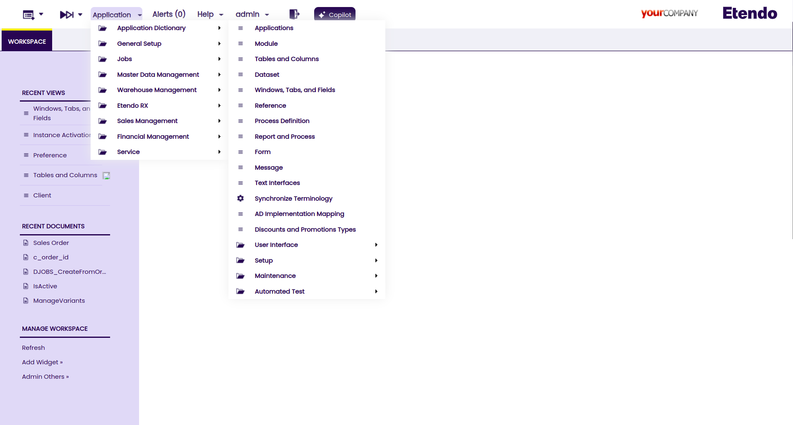

# Application Menu

## Overview

Application Menu is shown in the window's left side. It is used to make all the application elements accessible to the user.

### Managing the menu

Menu is managed from `General Setup` > `Application` > `Menu` window.

To create a new menu entry:

  1. Create a new record in this window.
  2. Select the element type for the entry, this is done setting the **Action** field, the elements callable from menu are **Window**, **Report**, **Process**, **Form**, **Workflow**, **Internal/External link** and **Task**.
  3. Depending on the selected action, a different drop down list will be shown to select one element of the selected type. Note that name and description will be overwritten when synchronize process is executed.
  4. Place the new menu entry in the correct position, this is done by:
    * Selecting a record in the grid.
    * Opening the tree window clicking in tree menu icon 
    * Select the entry to relocate and select the new position.

Folders are created checking the **Summary Level** field.

### Security

Although a menu entry is defined, it will not be displayed in case the role that has log in the application has not granted permission for that element.

### Information folder

In the bottom of the menu, there is an **Information Folder** which contains links to the **Searchs**. The elements displayed in this folder are the ones that are used in at least one accessible window for the current role.

---
This work is a derivative of [Application Menu](http://wiki.openbravo.com/wiki/Application_Menu){target="\_blank"} by [Openbravo Wiki](http://wiki.openbravo.com/wiki/Welcome_to_Openbravo){target="\_blank"}, used under [CC BY-SA 2.5 ES](https://creativecommons.org/licenses/by-sa/2.5/es/){target="\_blank"}. This work is licensed under [CC BY-SA 2.5](https://creativecommons.org/licenses/by-sa/2.5/){target="\_blank"} by [Etendo](https://etendo.software){target="\_blank"}.