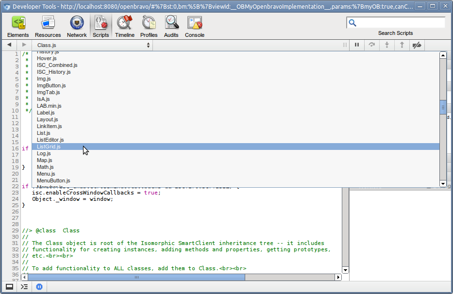
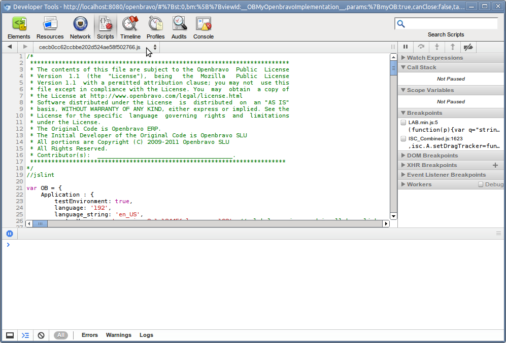
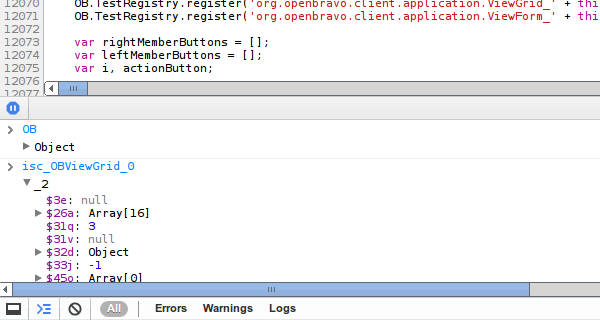
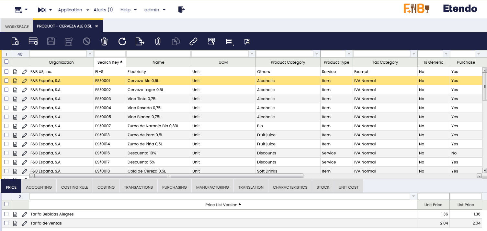
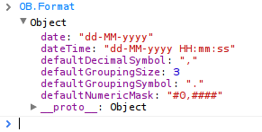

# Client Side Development and API

!!! example  "IMPORTANT: THIS IS A BETA VERSION"
    It is under active development and may contain **unstable or incomplete features**. Use it **at your own risk**.

## Client Side Development Tools

Client side development is a combination of `javascript`, `css` and very limited `html`. Programming is done in `javascript` which is loaded in the browser. The browser is the main client platform. Within the client we use the following development tools:

- Chrome Developers Tools 
- Firebug 

In this page, we will show the **Chrome Developers Tools** as this is the tool we used most of the time.

##  Etendo processing of javascript code

When developing client side code it is important to understand how Etendo pre-processes the javascript code before sending it to the browser. The caching and compression section  of the developers guide is important to read.

Etendo will concatenate all static resources (javascript and css) in one large file before sending it to the client. If no module is marked as in development, it will be minified/compressed (using  jsmin)

The javascript code is generated into a file which has a name based on a guid (for example `088afd247a8fe06c91a654891a1358a2.js`). This guid is again based on the content of the file, so if the javascript changes then also the js file name is changed (and therefore reloaded in the browser). The js file is generated into the web/js/gen folder and served from there to the client.

!!! Note
    The Smartclient source code is always delivered minified and obfuscated. See a next section below for information on how to get non-obfuscated Smartclient version.

##  The smartclient.dev module, smartclient console and sources

When working with Etendo client side code it can make sense to also install the smartclient source code module. You can find it here. To install it, go to the modules directory in your development project and in the console type in this:

    
```
git clone https://bitbucket.org/koodu_software/org.openbravo.userinterface.smartclient.dev
```

and in the top level project directory do this:
    
```
./gradlew smartbuild -Dlocal=no
```

And refresh eclipse so that eclipse sees the modules content. Inside eclipse you can open a smartclient js file with the key combination: shift-ctrl-r, enter for example FormItem.js to see the FormItem source code.

After installing the smartclient source module you can also use the smartclient console in the client, in the address bar of the browser (after loading Etendo) do this:

`javascript:isc.showConsole();`

Within the `smartclient.dev` module you can find the docs directory which contains the reference manual and the quick start guide.

##  Getting non-minimized and non-obfuscated javascript

As explained above, Etendo will automatically try to minimize javascript code for best loading performance. However, this makes debugging in the client side very difficult, therefore there is an easy way to prevent minimizing of javascript.

###  Etendo Javascript

The javascript of modules is minimized if the module is not in development. So to prevent minimization of your javascript put your module in development. The most common modules to have in development for Etendo are:

- `org.openbravo.client.kernel` 
- `org.openbravo.client.application`
- `org.openbravo.userinterface.selector` 

###  Smartclient code

The Smartclient library is normally minimized/obfuscated as this gives the best performance when loading the libraries. However, for debugging and understanding the source code it really helps to have the non-obfuscated code loaded in the client. To use the non-obfuscated code in the browser you have to install the org.openbravo.userinterface.smartclient.dev module (and do ant smartbuild -Dlocal=no after installing).

Then start the application and place the org.openbravo.userinterface.smartclient.dev in development. After that, restart the application.

Then, when debugging (see next section), you can view/use the non-minimized Smartclient source code:



##  Debugging Client Side Code

Debugging client side code is done through the Chrome Developers Tools. After opening Etendo in a browser window, open the Chrome Dev Tools. Click the Scripts button in the top and in the drop down just below it, find the file which has a guid-like name.



  
This js file contains the complete concatenated javascript code, some remarks:

- the file name is a dynamically generated guid, it is different in different installations and Etendo versions 
- if the javascript is minified then put one of the core, client application or client kernel modules in development and restart the application 
- the Smartclient javascript code is not included in this file 

###  Create a Breakpoint

The chrome development tools offers several ways to set breakpoints. For example to pause on exception  or pause on uncaught exceptions.

To do some debugging, enter this string `this.messageBar = isc.OBMessageBar.create({` as a search string in the search field in the top.
Then click on the left, on the line number, to create a breakpoint. Now to test the breakpoint open a window in Etendo. The breakpoint should be hit.


###  Finding Global and Smartclient Components

All Smartclient components are accessible globally:

- The class definitions are all in the isc object. 
- The instances are stored in global variables with this structure: isc_[ClassName]_[SequenceNumber], for example isc_OBViewGrid_0, isc_OBViewForm_0. 

  
You can type in the global variables and objects directly in the console:




###  Finding javascript errors in your own code, stopping on exceptions

When an exception occurs in your javascript code and you have the chrome dev tools open, then often the chrome dev tools will stop the program execution in obfuscated Smartclient code.

To stop the debugger in your own code let chrome stop on exception. This is described in more detail here: pause on  exception or pause on uncaught exceptions.

##  Analyzing Client-Server Requests

While working with Etendo, the system will do several requests to the system. Requests are done for images, data and view definitions. The Chrome Developers Tools provide the network tab to see which requests actually take place. The most interesting one's are the xhr requests.

The image below illustrates the requests done when opening the product window:




  
A summary:

- the view request gets the javascript code for the product window (and all its tabs) from the server. This call is only done if the view has not been cached in the browsers cache. 
- the first `org.openbravo.client.kernel` requests gets the dynamic information related to this window, this call is never cached 
- the Product and PricingProductPrice are so-called datasource requests, they get the records shown in the grids and forms. Only the data for the visible tabs is retrieved 
- the other `org.openbravo.client.kernel` requests are calls to the alert manager, it checks if there are open alerts. 

You can see the returned content by clicking the content tab.

##  Adding javascript to Etendo 

In Etendo, a significant part of the logic is implemented in (generated) javascript. Solution providers implementing new functionality can add new functionality in javascript also. Etendo takes care of checking, minimizing, loading and caching  of javascript. To make use of this framework functionality, javascript has to be added to Etendo in the following way:

- the static javascript should be located in files in this subdirectory of the module: `web/[modulepackage]/js`
- the javascript needs to be registered in Etendo using java, implemented in a so-called ComponentProvider. This is explained in more detail  here. Here is a code snippet which shows how a js file is registered: 
    
```
globalResources.add(createStaticResource(
    "web/org.openbravo.client.application.examples/js/example-view-component.js", true));
```

!!!info
    When implementing your own components, it often makes sense to extend existing components. Make sure that your module then depends on the module that provides the base types. This ensures that the javascript is loaded in the correct order. You **must** add a dependency from your module to the **Openbravo 3.0 Framework** _(org.openbravo.v3.framework)_ module.

  
##  Unit Testing Javascript code

An infrastructure for unit testing javascript code using Jest is available. For more details, see [How to Create Jest Test Cases](../how-to-guides/how-to-create-testcases/how-to-create-jest-testcases.md)

##  Implementing global-singleton javascript objects

When creating global-singleton javascript objects, it is good practice to add these objects to a single global object to prevent global namespace  pollution.

The recommendation is to use both the global existing Etendo javascript object as well as the module's db prefix. For example the Etendo Application Example module has the OBEXAPP dbprefix. The correct way of creating a global singleton is:
 
```
OB.OBEXAPP = {};
OB.OBEXAPP.OnChangeFunctions = {};
```

So first create/add an object to the global Etendo object, the added object should be named using the module's dbprefix. Then the application specific properties can be added to this global object.

##  Etendo Client Side Components - Javascript API

When adding new instances and new classes Etendo follows this convention:

- all global data is added to the global Etendo object 
- all css style names start with Etendo 
- all Smartclient class names start with Etendo 

In this section, we discuss the content of the main Etendo object and of utility functions available there.

###  UI Architecture - Blog post

This  blog  contains a nice image which displays the UI architecture and links the UI components to the javascript types/code.

###  OB.Application - general application information

The `OB.Application` object contains data about the server side application:


###  OB.User - the current user

The `OB.User` object contains information related to the current logged in user:


###  OB.Constants - common constants

The `OB.Constants` object contains constants which are used throughout the application. It contains constant names for parameters which are used in server requests and for delays.

###  OB.Datasource - getting standard and custom data sources

The `OB.Datasource` object provides two methods: create and get.

The get method will first check if a datasource is defined on the client for the requested if. If so it is returned directly, if not then the server is called to generate the definition of the datasource (in javascript) and return it. The returned javascript is evaluated and the created datasource is set in
the target object (by calling its `setDataSource` method or by setting it in its `dsFieldName` property).

The caller of the `OB.Datasource.get` function should take into account that its behavior is asynchronous.

    ```
    // ** {{{ OB.Datasource.get(dataSourceId, target, dsFieldName) }}} **
    //
    // Retrieves a datasource from the server. The return from the server is a
    // javascript string which is evaluated. This string creates a datasource. The
    // datasource
    // object is set in a field of the target (if the target parameter is set). This
    // is done asynchronously.
    //
    // The method returns the datasourceid.
    //
    // Parameters:
    // * {{{dataSourceId}}}: the id or name of the datasource
    // * {{{target}}}: the target object which needs the datasource
    // * {{{dsFieldName}}}: the field name to set in the target object.
    // * {{{doNew}}}: if set to true then a new datasource is created
    // If not set then setDataSource or optionDataSource are used.
    //
    OB.Datasource.get = function(/* String */dataSourceId, /* Object */
    target, /* String */dsFieldName, /*Boolean*/ doNew) {
    ...
    }
    ```

The create method does not call the server but creates the data source directly in the client, using the passed properties. Before creating the new data source, it does a check if the data source has already been created, if so it is returned.
    
    ```
    // ** {{{ OB.Datasource.create}}} **
    // Performs a last check if the datasource was already registered before
    // actually creating it, prevents re-creating datasources when multiple
    // async requests are done for the same datasource.
    // Parameters:
    // * {{{dsProperties}}}: the properties of the datasource which needs to be
    // created.
    OB.Datasource.create = function(/* Object */dsProperties) {
    ```

The `OB.Datasource` object creates datasources using the `isc.OBRestDataSource` javascript class which extends the Smartclient RestDataSource.

###  OB.Format - format patterns

The `OB.Format` object contains the global formatting settings of the current user regarding dates and number formatting. Note that the formatting for specific fields is controlled by the Format.xml definition and not by this object.



###  OB.I18N - getting labels

The `OB.I18N` object provides a getLabel method which can be used to get a translated label from the system. The getLabel method has 4 parameters:

- **Key**: the key in the `AD_Message` table for the label 
- **Params**: null, or an array of parameters, if the label contains parameters (50. %1, etc.) then they are substituted with the values in the array 
- **Object** and **Property**: when set then the label is set in that property of the object, or if the property is a function then it is called on the object with the label as a parameter. See also asynchronous loading below here. 

The system will pre-load all records from `AD_Message` which are not part of the core module. This means that if you try to get a label defined in core that the getLabel function will work asynchronously:

- it will initially return the key and call the server to get the label (asynchronously) 
- when the label is returned then (after parameter substitution) the label is set in the object using the property, if the property is a function then it is called as a function with the label as the parameter, if it is not a function then the label is set in the object using the property. 

###  OB.PropertyStore - handling preferences

Etendo has a feature to define preferences on different levels (system, client, org, role, user, window) and set and get them from the system. When a user loads the application all relevant preferences are pre-loaded in the client.

The application can make use of these preferences on the client and even set them. When a preference is set then the client will call the server to update the value in the database.

The getting and setting of preferences is implemented on the client through the `OB.PropertyStore` object. It has 2 methods:

- **get**: function(propertyName, windowId): returns the value of a property for a certain window 
    
    ``` 
    dataPageSizeaux = OB.PropertyStore.get('dataPageSize',this.view.windowId);
    ```

- **set**: function(propertyName, value, windowId, noSetInServer, setAsSystem): sets a property value, for a certain window. The caller can prevent a server side set by passing noSetInServer as true and if set on the server can control at which level that is done by setting setAsSystem to true 

    ```
    OB.PropertyStore.set('OBUIAPP_GridConfiguration', result, this.windowId);
    ```

The `OB.PropertyStore` has a **listener** concept, which makes it possible to register a listener which gets notified when a property value changes. This is used to update the recent view list in the Etendo Workspace tab. To register a listener, call the addListener method on the `OB.PropertyStore`, it has one parameter the listener which must be a function. For every property change, the listener is called with these parameters:

- **property identifier**: concatenation of the property name and window id separated by an underscore.
- **previous value**: the previous value of the property. 
- **new value**: the new value of the property.

###  OB.RemoteCallManager - Calling the server from the client

The `RemoteCallManager` is used to call ActionHandlers on the server. ActionHandlers are java classes which implement the ActionHandler interface. See the ActionHandler concept.

The `OB.RemoteCallManager` offers one method: **call** which has the following parameters:

- `actionName`: the classname of the ActionHandler class 
- `data`: a javascript object which is passes as the request body, serialized as json 
- `requestParams`: a javascript object, its properties are translated into request parameters: 
- `callback`: a function which is called when the request returns, 3 parameters are passed in when called: response, data and request:

    - response: the smartclient response object 
    - data: contains the javascript object which is created by the server 
    - request: the original request object

- `callerContext`: is returned in request.clientContext (see the third parameter of the callback)

###  OB.ViewManager - Opening Views

The `OB.ViewManager` is the central point for managing which views are open in the main Multi-Document-Interface. It is also used by the history manager to support the back button and refreshing the complete application page, while still maintaining some state.

The `OB.ViewManager` has one main interesting method: openView(viewName, params). This function has 2 parameters:

  - `viewName`: the class name of the view instance to create, it must be a Smartclient class which supports the static create method. 
  - `params`: a javascript object containing parameters which are passed in when creating the view 

The ViewManager will check if the viewName exists as a class on the client. If not, then the server is called to retrieve the class definition, if it is present, then an instance of the view is created.

If the view has a property `showsItSelf` set to `true`, then the `ViewManager` will not open the view instance in a tab in the MDI, but instead will call the show function on the instance. This makes it possible to open popup windows through the ViewManager.

If the instance does not have a `showsItSelf` property, or it is `false`, then the view instance is opened in a tab in the MDI.

###  OB.Utilities.Action - actions execution related utilities

It allows to define some actions that can be called sequentially. There are already some defined actions out of the box in core. 

###  How to Set/Define an Action

New actions can be defined using javascript code (so they can be defined, thanks to modularity, inside a  module just with a new javascript file to set the action and a component provider to load this new file). The way to define an action is like that

```    
OB.Utilities.Action.set('myDefinedAction', function (paramObj) {
    ...
});
```

where `myDefinedAction` is the action name and `paramObj` is the only function argument. This `paramObj` will be used inside the function logic.

**Example:**
        
``` 
OB.Utilities.Action.set('showAlert', function (paramObj) {
    alert(paramObj.text);
});
``` 

###  How to call/execute an action

There are two ways to call/execute an action:

- Using `execute` function: this way executes just one action 
    
    ``` 
    OB.Utilities.Action.execute('myDefinedAction', myParamObj);
    ````

    where `myDefinedAction` is the action name and `myParamObj` is an object with the needed parameters as object members.

    This **execute** function has also a third optional argument "delay", used to make a delayed call of the execution.

    **Examples:**
        

    ```
    OB.Utilities.Action.execute('showAlert', {'text': 'This is just an example'});
    ```

- Using `executeJSON` function: this way can executes several action sequentially 

    ```
    OB.Utilities.Action.executeJSON({'myDefinedAction': { myParamObj }});
    ```
    or 

    ```
    OB.Utilities.Action.executeJSON([{'myDefinedActionA': { myParamObjA }}, {'myDefinedActionB': { myParamObjB }}]);
    ```

    where 'myDefinedAction' is the action name and 'myParamObj' is an object with the needed parameters as object members. As you can see you can call executeJSON just with an object (one action) or with an array of objects (several actions sequentially).

    **Example:**
        
    ```
    OB.Utilities.Action.executeJSON({'showAlert': {'text': 'This is just an example'}});
    ```

    or

    ``` 
    OB.Utilities.Action.executeJSON([{'showAlert': {'text': 'This is the first alert'}}, {'showAlert': {'text': 'This is the second alert'}}]);
    ````

**Threads**

If `executeJSON` function is called with several actions to be executed sequentially (called with an array of objects) a thread is generated for this call. To do this, there is a second argument in the `executeJSON` function: `threadId`. If this `threadId` is not provided, a random one will be generated.

This `threadId` argument also will be automatically added to each parameter object of each action call, so each action has a reference of the thread that has invoked it.

There are three actions that can be done to a thread:

  - cancelThread 
  - pauseThread 
  - resumeThread 

**Full example:**

```
OB.Utilities.Action.set('confirmDialog', function(paramObj) {
    var text = 'Hello ' + paramObj.name + ', do you want to continue with the thread?';
    if (!confirm(text)) {
    OB.Utilities.Action.cancelThread(paramObj.threadId);
    }
});
 
OB.Utilities.Action.set('promptDialog', function(paramObj) {
    var text = '';
    if (paramObj.value) {
    text += 'You have introduced: ' + paramObj.value + '\n';
    }
    text += 'Please, introduce here a 0 in order to continue'
    paramObj.value = prompt(text);
    if (paramObj.value === '0') {
    OB.Utilities.Action.resumeThread(paramObj.threadId);
    } else {
    OB.Utilities.Action.pauseThread(paramObj.threadId);
    OB.Utilities.Action.execute('promptDialog', paramObj, 100);
    }
});
 
OB.Utilities.Action.set('alertDialog', function(paramObj) {
    var text = 'You have finished the thread!\nBye ' + paramObj.name;
    alert(text);
});
 
OB.Utilities.Action.executeJSON([
    {
    'confirmDialog': {
        name: 'John Smith'
    }
    },{
    'promptDialog': {
    }
    },{
    'alertDialog': {
        name: 'John Smith'
    }
    }
]);
```
  
In this example, there is a thread with three actions:

1. **Confirmation dialog:** It asks if you want to continue the thread, so if you accept, the thread continue, if not, the thread is cancelled (`OB.Utilities.Action.cancelThread`)

2. **Prompt dialog:** If you enter 0, the threads continue (`OB.Utilities.Action.resumeThread`), but if you enter any other thing, the thread is paused (`OB.Utilities.Action.pauseThread`) and the previous introduced
value is shown. Note how the function is called recursively until one condition is met using the 'delay' param of 'execute' function (100 in this case). This is to avoid browser crash due to a constant iteration in time.

3. **Alert dialog:** This is the last step of the thread, it just notifies it to you.

###  OB.Utilities.Number - number related utilities

The `OB.Utilities.Number` object contains several methods related to number formatting and rounding which are used within the application:

  - `OB.Utilities.Number.roundJSNumber(num, dec)`: round a number to a number of decimals 
  - `OB.Utilities.Number.OBMaskedToJS(numberStr, decSeparator, groupSeparator)`: convert a numeric string which follows the OB numeric pattern to a javascript number 
  - `OB.Utilities.Number.JSToOBMasked(number, maskNumeric, decSeparator, groupSeparator, groupInterval)`: format a javascript number using the Etendo numeric masc (defined in  format.xml  ), decimal separator, group separator and group interval size (normally 3) 

###  OB.Utilities.Date - date related utilities

The `OB.Utilities.Date` object contains several date parsing and formatting methods:

- `OB.Utilities.Date.OBToJS(OBDate, dateFormat)`: parse an Etendo formatted date string to a javascript date 
- `OB.Utilities.Date.JSToOB(SDate, dateFormat)`: format a javascript into a date string following the Etendo pattern 

###  OBGrid

The `OBGrid` is the main grid class, used by Etendo. If you want to implement your own grid, then it makes sense to extend the `OBGrid` as this will make sure that your grid follows the same styling settings as the other grids.

###  Etendo Window Components

An Etendo window consists of a hierarchy of tabs, each tab has a grid and a form view. In addition, each tab has a toolbar and a messagebar. This user interface is represented by an internal javascript object structure. This section explains the internal structure and the main properties and methods.

####  OBStandardWindow

An Etendo Window is created on the client using an `OBStandardWindow` instance. For each tab in the window, an instance of the  `OBStandardView`  is created. The `OBStandardView` instances are hierarchically structured, each `OBStandardView` has a set of child views. An `OBStandardView` has an instance of `OBViewGrid` to represent the grid and an instance of  OBViewForm  to represent the form.

The OBStandardWindow has the following important properties:

- windowId: the database id of the window 
- view: the root `OBStandardView` 
- views: a complete/flattened list of all views contained in this window 

For more and other properties check the source code of the `OBStandardWindow`.

####  OBStandardView

The  `OBStandardView`  has the following components:

- a form 
- a grid 
- a tab set  with  tabs  , each Smartclient tab represents an Etendo child tab 
- a message bar 
- a toolbar 

Each of these components is discussed in more detail below.

The OBStandardView has the following properties:

- tabId: the id of the tab represented by this view 
- tabTitle: the title of the tab 
- standardWindow: a link back to the standard window instance 
- childTabSet: the Smartclient TabSet which contains the child views, each tab in the TabSet has a pane, the pane is an instance of the OBStandardView. 
- parentView: a link back to the parent, if this view is a child 
- parentTabSet: the link to the parentTabSet (parentView.childTabSet === parentTabSet) 
- toolBar: the OBToolbar instance for this view 
- messageBar: the OBMessageBar which is displayed when a message is displayed 
- viewForm: the OBViewForm of this tab 
- viewGrid: the OBViewGrid of this tab 
- dataSource: the data source which provides records to the grid and the form. The datasource is an instance of the  OBViewDataSource  which is a subclass of the Smartclient  DataSource. 
- isActiveView: (a function), returns true if the view is active (has the focus and an orange bar) 

####  OBViewGrid

The `OBViewGrid` is a subclass of the Smartclient  ListGrid  . In addition to the standard Smartclient properties, the following properties are important:

- view: reference to the OBStandardView which owns this grid

    - setItemValue: function(item, value), sets the value of the item and triggers the  OnChange  functions

- Some Smartclient methods/properties which can be useful:

    - `getSelectedRecord`: get the currently selected record 
    - `getSelectedRecords`: in case multiple records have been selected, return all the selected records 
    - `getEditForm`: when in grid edit mode, contains the current edit form for that row 
    - `getEditRow`: the row which is being edited 
    - `setValue`: function(item, value), sets the value without triggering onchange functions 

####  OBViewForm

The `OBViewForm` is a subclass of the Smartclient `DynamicForm`. In addition to the standard Smartclient properties, the following properties are important:

- view: a reference to the OBStandardView containing this form 
- grid: is set when form is used in inline grid editing 
- hasChanged: is true if a field on the form has been changed by the user 
- isNew: if the form is editing a new record 

####  OBMessageBar

The message bar shows informational, error and warning messages to the user. It can be useful to use the message bar when reacting to user input. For example when implementing a client side onchange function.

The message bar is implemented using the `OBMessageBar` type.

The following methods can be relevant:

- `setType`: function(type), set the type of the message bar, controls the colour and icon. The type can be one of the following constants: 

    - `isc.OBMessageBar.TYPE_SUCCESS` 
    - `isc.OBMessageBar.TYPE_ERROR`
    - `isc.OBMessageBar.TYPE_WARNING` 
    - `isc.OBMessageBar.TYPE_INFO`

- `setText`: function(title, text), sets the content of the messagebar, if the title is not set then a default title is shown. 
- `setLabel`: function(type, title, label, params), can be used to set a parameterized label, see the  OB18N  section. 
- `setMessage`: function(type, title, text), combination of the 2 methods above, in addition shows the message bar. 
- `hide/show`: call hide or show to hide or display the messagebar 

####  OBToolbar

Each `OBStandardView` has its own toolbar (`OBToolbar`) instance, however in the user interface only one is displayed/shown: the toolbar belonging to the active view. The other toolbars are hidden.

Normally a developer does not need to *talk* directly to the toolbar `OBToolbar`. The standard approach is to [add a button to toolbar](../how-to-guides/how-to-add-a-button-to-the-toolbar.md).

---

This work is a derivative of [Client Side Development and API](http://wiki.openbravo.com/wiki/Client_Side_Development_and_API){target="\_blank"} by [Openbravo Wiki](http://wiki.openbravo.com/wiki/Welcome_to_Openbravo){target="\_blank"}, used under [CC BY-SA 2.5 ES](https://creativecommons.org/licenses/by-sa/2.5/es/){target="\_blank"}. This work is licensed under [CC BY-SA 2.5](https://creativecommons.org/licenses/by-sa/2.5/){target="\_blank"} by [Etendo](https://etendo.software){target="\_blank"}. 