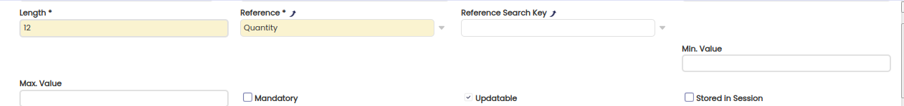
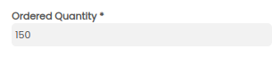
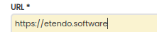
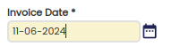
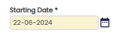
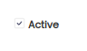
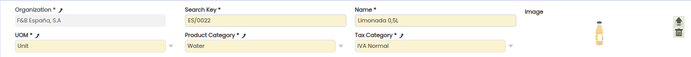

---
tags:
    - Concepts
    - Data Model
    - Application Dictionary
    - Tables
    - Columns
---

# Data Model

## Overview

Etendo Data Model is defined in Application Dictionary. At data model, Application Dictionary maps physical database tables and columns in its own tables (`AD_Table` and `AD_Column`) and on top of this it is built the rest of the system (Windows, tabs, fields, etc.).

This document explains how tables and columns are defined in physical database and how they are mapped in Application Dictionary's Data Model.

## Tables in Application Dictionary

Once [tables](../concepts/Tables.md) are physically defined in database, they must be mapped with Application Dictionary. This mapping is done through `Application Dictionary` > `Tables and Columns` > `Table` tab, which populates `AD_Table` table.

### Table Naming

A table defined in the application dictionary has several names which are used by Etendo in different ways:

- Logical name (`AD_Table`.name): used by the [Data Access Layer](../concepts/Data_Access_Layer.md) in [XML](../concepts/xml-rest-web-services.md) and [JSON](../concepts/JSON_REST_Web_Services.md) REST web services. See [here](../concepts/Data_Access_Layer.md#entity-naming) for more information.
- Physical name (`AD_Table`.tablename): is the name of the table in the database.
- Class name (`AD_Table`.classname): the name of the [generated entity java class](../concepts/Data_Access_Layer.md#generated-business-object-classes).

## Columns in Application Dictionary

After defining the table in Application Dictionary, the next step is to add columns to it. There's a process which reads columns from database and inserts them as columns in the table. This process is invoked from the Create columns from DB button in `Application Dictionary` > `Tables and Columns` > `Table` tab.

After that it is possible to check all the columns in the table in the `Application Dictionary` > `Tables and Columns` > `Table` > `Column` tab, and fine tune them if needed. There is a detailed explanation for all fields in that tab in the documentation about `AD_Column` table.

The following sections explain some details to be taken into account when defining a column.

### Column Naming

A column defined in the application dictionary has several names which are used by Etendo in different ways:

- The logical name (`AD_Column`.name): this name is used by the Data Access Layer for [automatically detecting supported interfaces](../concepts/Data_Access_Layer.md#property-naming-and-supported-interfaces) and [XML and Java property naming](../concepts/Data_Access_Layer.md#property-naming).
- The physical column name (`AD_Column`.columnname): is the name of the column in the database table.

!!!important
    When naming columns related to audit info, client/organization and active it is very important to be precise in the name. If a wrongly spelled name is used then Etendo will not be able to detect that an entity [supports a certain interface](../concepts/Data_Access_Layer.md#important-interfaces) and specific automatic behavior is disabled. See [here](../concepts/Data_Access_Layer.md#important-interfaces) for a list of interfaces and their expected logical column names.

### Defining Business Objects: the isParent

The column definition in the application dictionary is also used to define business object structures in Etendo. If the `isParent` field of a foreign key column is set (checked/true) then this foreign key models an association from a child to a parent. With this information the [Data Access Layer](../concepts/Data_Access_Layer.md) will automatically create an association (in-memory) from the parent to the child.

For example the `C_OrderLine` table has a column `c_order_id`. In the application dictionary this column is flagged as `isParent` (so the `c_order_id` points to the parent of the order line: the order header). The data access layer will translate this foreign key column in two association in the entity model:

- A many-to-one association from the order line entity to the order (its parent)
- A one-to-many association from the order to the order lines, in java this results in a member of type `java.util.List`.

For more information, see [here](../concepts/Data_Access_Layer.md#business-object).

### References

References are used in Etendo Application Dictionary for two purposes:

  - **Define the type of data stored in a column**:
  Depending on the reference a column has, this column will hold different data types, for example numeric values, plain text, links to other columns, etc.

  - **Define how the fields linked to a column will be represented in the UI**:
  A column's reference also indicates how the fields associated to that column will be represented within tabs, for example a drop down list, a text box with a button to show a selector, etc.
  Thus each column in Application Dictionary has one and only one reference.

#### Types of References

There are two basic types of references: **Base** and **Subreferences**. References are set in `Application Dictionary` > `Tables and Columns` > `Table` > `Column` tab using `Reference` field for data type references and `Reference Search Key` for sub types.

##### Base References

These references can be directly associated to a column. Examples of data references are date, price, list, etc.

#### Subreferences

Some base references require another reference to completely define the data the column will contain. This is when sub references are used. The base references defined in core that require a sub reference are: `List` , `Search` and `Table`. Thus when one of these base references is associated to a column it is necessary to also associate to that column another subtype reference. For example, to set a column to a Business Partner search it is necessary to set the main reference for this column to `Search` and the secondary one to `Business Partner Search`.

!!!info
    When columns in Application Dictionary are automatically created based on their database physical description using the `Application Dictionary` > `Tables and Columns` > `Table` > `Create Columns from DB` process, it sets the references that are prone to be the proper ones, but in some cases they need to be changed. It is a good practice to review all the automatically assigned references for new columns after executing this process.

#### Core Base References

The following sections describe the base references defined in core.

##### Numeric references

`Integer` , `Number` , `Amount` , `Quantity` and `General Quantity` are used to maintain numeric values. When defining one of these references, it is possible to include the minimum and/or the maximum value for the column if wanted, notice that the check for this values will be done just in UI but not a database level, so it would be possible to add data out of range using any process. To enforce this restrictions in database, use database check constraints.



When there is a field in a tab associated to a column with one of these references, the way it is represented will look like the picture below.



The physical description of columns using this references must be `number`.

!!!note
    The way decimal numbers are represented is defined in `config/Format.xml` file with these equivalences:  
    - `euroEdition`: Amount
    - `qtyEdition`: Quantity
    - `priceEdition`: Price
    - `IntegerEdition`: Integer
    - `generalQtyEdition`: General Quantity and Number

##### Price

`Price` reference is similar to the previous numeric ones and is intended to store monetary quantities. When defining it, it does not allow maximum and minimum values.

The physical description of columns using this references must be `number`.

##### Text References

`String` , `Text` and `Memo` references are used for text columns. The difference between them is the text length they are supposed to store.

- **String** is for short text and it will always be displayed in UI as a one line text box.
- **Text** and **Memo** are displayed in multiple lines depending on the length defined in the `Length` field.

The physical description of columns using this references must be `char`, `varchar` or `nvarchar`.

This is how a **text** reference looks like in UI:


##### URL link

`Link` reference is used to represent URL links. Columns with this reference are text columns.

The UI for this reference is:



When clicking on the button next to the text box, a new browser is opened with the link in the box.

##### Time References

`Date` , `Time` , `DateTime` `Absolute Time` and `Absolute DateTime` are used for columns storing date or time values. **Date** displays a date without hours; **Time** displays time without date, this is just hour, minutes and seconds; **DateTime** displays date with time.

When defining a column of type **Date** maximum and minimum values are accepted.

In Oracle, physical database columns for these references must be `DATE` or `TIMESTAMP` types. In PostgreSQL the data type is `Timestamp without timezone`.

An example of how a field for a column with reference date is represented is as follows:



Notice that a calendar button is displayed next to the text box, this facilitates the dates selection, when clicking on it a calendar poup-up is opened:


And this is an example of a DateTime field:



The date-picker for this reference is like the Date reference one but also it adds a time-picker. If the input value is empty, this time picker value is the current time.


The format for displaying time and dates is defined in `config/Openbravo.properties` file by the `dateFormat.sql` and `dateTimeFormat.sql` using SQL format. Example:

```java
dateFormat.sql=DD-MM-YYYY
dateTimeFormat.sql=DD-MM-YYYY HH24:MI:SS 
```

**Time** and **DateTime** are relative references, that means that the stored value is loaded from the backend with the backend/server timezone and displayed in the client/browser with the own client timezone:

- The value is stored with server timezone.
- When loading into the client, the server transforms the value to UTC and it sends it to the client. The client transforms this UTC value to client timezone.
- When saving in the server, the client timezone value is transformed to UTC and sent to the server. The server reads this UTC value, it transforms it to server timezone and stores it in the database.

`Absolute Time` and `Absolute DateTime` are, as their name indicates, absolute references, that means that the stored value in the backend/server is exactly the same than is displayed in the client/browser:

- When passing the time/datetime from the client to the server, the value is passed as it is read from the database, so there is no UTC conversion. There are some mechanisms in the client to display the value as it comes, so there are no convesions here.
- When receiving a value from the client, it is stored also as it comes from the client without any UTC conversion.

##### Yes/No Reference

`YesNo` reference is used for columns accepting boolean values (yes or no). In the UI a checkbox is shown, when it is checked the column will take 'Y' as value, when it is not it will take 'N'.

Physical database columns for these references must be `CHAR(1)` .

UI for this reference is:



##### Image

**Image BLOB** reference is used to store images in the database. All images are physically stored in a binary field of the table `AD_IMAGE`, and the table column used must be a reference to this table. Image types supported are the raster types: **PNG**, **JPEG** and **BMP**, and the vector type **SVG**.

!!!info
    **SVG** images are fully supported in the browsers Chrome, Firefox, Safari and Microsoft Edge. Not in Internet Explorer. In this browser, **SVG** images may be clipped and not properly displayed.


The image column can have an associated action that defines a validation and a transformation to be done for images saved in the database based on the original size of the image. Note that vector images _SVG_ never apply for these actions.


The image size values actions defined are:

- **None** . Any image can be saved and no transformation is done to the image
- **Allowed - Exact size** . Only images with the size defined in the fields **Image width** and **Image height** are allowed.
- **Allowed - Minimum size** . Only images with at least the size defined in the fields **Image width** and **Image height** are allowed.
- **Allowed - Maximum size** . Only images with a maximum of the size defined in the fields **Image width** and **Image height** are allowed.
- **Recommended - Exact size** . If the image does not have the size defined in the fields **Image width** and **Image height** a warning is displayed to the user.
- **Recommended - Minimum size** . If the image does not have at least the size defined in the fields **Image width** and **Image height** a warning is displayed to the user.
- **Recommended - Maximum size** . If the image size is larger than size defined in the fields **Image width** and **Image height** a warning is displayed to the user.
- **Resize - Exact resize (without maintaining the aspect ratio)** . The image saved is resized to the size defined in the fields **Image width** and **Image height**. The aspect ratio is not maintained and may change.
- **Resize - Closest to the maximum size (maintaining aspect ratio)** . The image saved is resized to the size defined in the fields **Image width** and **Image height** . But the aspect ratio is maintained adjusting the width or the height of the image to keep in the size defined.
- **Resize - Closest to the maximum size only if larger image** . Similar to the previous action but the resize it is performed only if the image size is larger than the size defined in the fields **Image width** and **Image height**.

When there is a field in a tab associated with one of these references, the way it is represented will look like the following picture:



##### Button

Buttons in Etendo must also be contained in a column though the value for this column is not directly modifiable by the user. Buttons are used to call processes.

When a column is assigned with `Button` reference the following additional fields are displayed: `Process` and `Ref Search Value`.


In **Process** list, we will select the process that is called when the button is clicked, this field is mandatory when the reference is button.

An optional **Ref Search Value** field is also available, here it is possible to select a reference list (see reference list below). If no value in this field is selected the text inside the button will be static (the process name), but if a reference list is selected the text in the box will be the name of the list having the same value as the current value in the list. For example if we define a list with the pairs value, name like: [{'N', 'Process'}, {'Y','Unprocess'}] and we select it, when the columns value is 'N', 'Process' will be displayed but 'Unprocess' when it is 'Y'.

When displaying a tab with a button it looks like:


!!!note
    When clicking on it a popup with the process interface is opened. By default, before opening this popup, the modifications for the current record are autosaved, after the execution of the process, current record is refreshed. This is the reason not to show the buttons while not all mandatory fields are not filled. These defaults are skipped in case the column is unmarked as `Triggers Autosave`.

###### DocAction buttons

Action buttons are a special kind of buttons used to perform process actions on certain documents (such as invoices, orders, etc.). These buttons have as column name **DocAction**.

When they are clicked a popup as follows is opened:


The available actions shown in this popup depend on the document status, and are calculated by `org.openbravo.erpCommon.ad_actionButton.ActionButtonUtility.docAction` method.

###### Post buttons

Another special button is the one issued in documents that support accounting to post/unpost. The column name must be `Posted`, and the process is left empty. These buttons call directly the accounting process.

##### List

`List` reference is used to limit the values a column can take to those ones defined in a list. When a column is defined as list reference, it is necessary to select a sub reference among the existing lists in Application Dictionary, this is done selecting the correct value in the `Reference Search Key` field.


Physical columns for this reference must be `VARCHAR(60)`.

The actual values the column will get are the ones defined as **Search Key** in the list, for more information see [defining lists](#defining-lists) section.

The UI for lists is a drop down list.

###### When to use lists

List are useful to maintain list of fixed values that rarely need to include new ones and which maintenance can be done by a System Administrator role, not by a standard user.

Let us explain through an example. There are 3 types of Modules: **Modules**, **Templates** and **Packages**. This definition is not going to change very often, it is possible that in future releases a new module type to be added but is nothing that is going to change daily, apart of that if it changes for sure no standard user would have to do the modification but **System Administrator** would have to. There are two possible solutions for this:

1. Create a table for module types and add in module table a foreign key column to this table.
2. Create a list of module types and add in module table a column of list reference using this new reference.

The second approach is easier to implement and maintain, additionally it does not create a database table with just 3 fixed records. In fact, behind the scenes, all data for all lists in Etendo is stored in a single database table (`AD_Ref_List`).

Furthermore lists are translatable, this means that the drop down lists can be displayed in the user's language, so following the 1st approach would have required to create a new additional table to hold translations.

###### Defining lists

List references, as the rest of references, are managed from `Application Dictionary` > `Reference` > `Reference` tab.

To create a new one click on **New**, insert a name for it and select **List** as **Parent reference**. This step creates the header for the list.

In this header, it is possible to select `Display value` field. In case this is selected, the list items will be represented by concatenating their value and their name, if not, only name will be displayed.

The next step is to add values to the list. To do so, go to **List Reference** tab, and create the values you need. Here there are three important fields to take into account:

- **Search Key** this is the value (not visible in UI) that the column using this reference will take when it is selected.
- **Name** it is the name that will be displayed in the drop down list.
- **Sequence Number** it is the position of the element when the drop down list is rendered. This field is nullable, depending on the values it has in the elements of the list, the sorting is done as follows:
  - If the value of this field is null for all the elements in the list, the list will be sorted alphabetically.
  - If all the elements have this value set, they will be ordered taking it into account.
  - If some of the elements have it and some have not, the ones having it will be shown at the beginning of the list sorted by this number, the rest of them will be shown at the end ordered alphabetically.

Just an additional consideration, it is possible to add elements in a module different to its header one, in this case the **Search Key** for the values must start with the module's DBPrefix to avoid naming clashes.

##### ID

Etendo uses UUID as primary key for its tables. The standard name for a primary key column is **TableName_ID** , so for example for `HR_Salary` table its primary key column would be name `HR_Salary_ID`.To be able to store UUIDs the physical type for the column must be `VARCHAR2(32)`. In addition, that column must be set as primary key in database.

`ID` reference is used for primary key columns. Usually, it should not be displayed to the user because this key is senseless for them (use identifiers instead), but if it shown the UI for this reference is like **String** reference, a one-line textbox.

##### TableDir

`TableDir` reference stands for **Table Direct**. As explained in the previous section the standard name for a primary key column is **TableName_ID**, in the same way the standard name for a foreign key column is the name of the foreign primary key column. For example if we create a new table named `HR_MyTable` and we want add a foreign key to `HR_Salary` , the column should be named `HR_MyTable.HR_Salary_ID`. If this naming rule is followed the `Create columns from DB` process will set this new column as **TableDir** reference. When the UI for this column is created a drop down list is generated with all the elements in the foreign table that can be referred from the current record. If the column name is not the same of the foreign key table's primary key column's name TableDir reference will not work, it will be necessary to define a **Table** reference for that column.

Physical columns for foreign keys must be `VARCHAR(32)` type to be able to store UUIDs. It is also required the physical table defines a foreign key to the other table.

This is the UI for **TableDir** reference:


It is a dropdown list, note that the label is a link, clicking on it the user will navigate to the selected foreign element. Note also that although the actual value the column will take is the UUID of the selected element, UUIDs are not displayed, instead of that the shown values are the identifiers defined in the foreign table.

##### Table

`Table` reference is similar to **TableDir** but does not have the naming limitation it also allows to define a `where clause` to limit the number of records that will be displayed as well as and **order by clause** to show it in certain order. When **Table** reference is selected for a column the `Reference Search Key` field becomes visible containing a list of all the available **table dir** subtypes, it is necessary to select one of them. These subtypes define the table the column makes reference to.

As the column for this reference is also a foreign key it must be in database physically identical to the ones defined for **TableDir** references.

Visually the UI for this reference is identical to the one for **TableDir**.

###### When to Use Table Reference

Usually **Table** references are used when the column name does not match with the name for the column it is linked to. In this case is mandatory to use this reference (or **Search** reference if it is available for that table).

Other cases is when the default order in **TableDir** reference is not appropriate.

!!!info
    It is not required to define a **Table** reference to limit the records that are displayed in a **TableDir** since it is possible to do it using a **Validation**.

###### Defining a Table reference

As all the references **Table** references are defined in `Application Dictionary` > `Reference` > `Reference` tab.

To create a new one:

1. Click on **New**, insert a name for it and select **Table** in **Parent Reference** field. This step creates the header for the table.

2. The next step is define the table to link to. To do so, go to **Table Reference** tab, and create a new record.

3. In **Table** field select the table the column is linked to in `Key column` field the value to be stored in the column (usually it its the primary key column), and in **Displayed column** the column that will be shown in the drop down list, note that here only one column can be selected and it is not possible to select the table's record identifier. `SQL where clause` and **Order by** are optional fields that can be used in case we want to restrict the records to be displayed or if we want to order them in some specific manner.

!!!note
    It is highly recommendable to look in the already defined Table references for one that fits our requirements before creating a new one.

##### Search

`Search` reference, as **Table** and **TableDir**, is used to define column that are foreign keys to other tables.

When a column is defined to use a **Search** reference, it is necessary to define which of the available search subtypes is going to call, this is done setting the **Reference Search Key** field.

As the columns using search reference store foreign keys (this is UUIDs) they must be defined in database as **VARCHAR(32)** and a foreign key constraint added to the table.

Visually the difference in UI with **Table** and **TableDir** is that, instead of displaying a drop down list with all the values in the referred table, it is shown the currently selected value using some filters.


When the button next to the text box is clicked a pop-up is opened, this pop-up allows to select one value from the available ones.


###### When to use Search reference

Search reference are specially useful when the foreign table has a big number of records because it facilitates a lot the task of selecting one record.

It is only possible to use one of the existent selectors, the ones defined in core. In case none of this fits our requirements, it is possible to create new ones:

| Search name           | Referred table       |
| --------------------- | -------------------  |
| Account               | `C_ValidCombination` |
| Business Partner      | `C_BPartner`         |
| Debt/Payment          | `C_Debt_Payment`     |
| Invoice               | `C_Invoice`          |
| Invoice Line          | `C_InvoiceLine`      |
| Location              | `C_Location`         |
| Locator               | `M_Locator`          |
| Order                 | `C_Order`            |
| Order Line            | `C_OrderLine`        |
| Product               | `M_Product`          |
| Product Complete      | `M_Product`          |
| Project               | `C_Project`          |
| Shipment/Receipt      | `M_InOut`            |
| Shipment/Receipt Line | `M_InOutLine`        |

##### Password (not decryptable)

Columns with this reference are stored in database as a hash of the value the user entered; although it is not possible to recover the original plain text value, it can be checked whether a plain text corresponds to a hashed value.

SHA-512 with a random salt is used to hash passwords. Previously, SHA-1 was used.

To verify a plain text matches a hash (this is backwards compatible and checks both algorithms), use:  

```java
boolean matches = PasswordHash.matches(plainTextPassword, hashedPassword);
```
To generate a new hash use:

```java
String newPassword = PasswordHash.generateHash(plainText);
```

##### Password (decryptable)

The value of the password is encrypted when being saved, however in a way that the clear text password (as entered) can be recovered. Example use-case is to store a password which needs to be passed later as clear text to some external service (i.e. a email server password).

#### References in modules

It is allowed for modules to define base references.

Prior to this, release modules only could define subreferences for the base ones provided in core, this means that new **List**, **Table** and **Selector** references could be added to modules.

### Validations

Validations allow to filter the records that appear in generated drop down lists. Validations are applicable to the following data references **List**, **Table**, **TableDir** and **Button**.

When a column has a validation, WAD generates a [callout](#callout) for it (`ComboReload`) to implement the validation.

#### Defining a validation

Validations are defined in `Application Dictionary` > `Setup` > `Validation Setup` > `Validation` , they consist in a **where** sql clause that will be applied to the query that generates and retrieves the data for the drop down list.

It is possible to do reference to columns within the foreign table in the code of the validation, to do it include the full table name. In case the reference is **List** type the table is `AD_Ref_List` and the column where values are stored in is **Value**.

It is also possible to use session variables in the filter, session variables are surrounded by `@`, thus `@AD_Client_ID@` referrers to the client the user has log in the application with.

### Record identifier

Etendo uses UUIDs to unequivocally identify each record internally within a table. These values are stored in a column in the table that is defined as the primary key in the database and a key column inside Application Dictionary. UUIDs are 32 character strings that are automatically generated by the system, thus these strings are of very little use to the end-user when it comes to identifying records. Consequently, these values are used only internally by the application and are not displayed in the UI. Instead, users always see a friendly representation of a record called **record identifier**.

A **record identifier** is a simple **concatenation** of the values of one or several columns of a record within a table. Each table defined within the Application Dictionary **MUST** have at least one column set as a record identifier.

When one of the columns that are part of the record identifier is a foreign key to another table, instead of concatenating the column's actual value (which is a UUID), the record identifier for corresponding foreign key table record is taken and concatenated.

As record identifiers are used to identify a single record, they should include a set of columns that is known to be unique. This can be guaranteed at the database level adding a unique constraint to these columns.

#### Defining a Record Identifier

Record Identifiers are defined in `Application Dictionary` > `Tables and Columns` > `Table` > `Column`. To set a column as part of the record identifier for its table mark the `Used as Record identifier` check.

As many columns in the same table can be part of the record identifier, the way to define the order they will be displayed in it is set in the `Sequence number` field.

### Callout

A **Callout** is a piece of code that is triggered when a field is modified. The callout is associated to the column which associated field will trigger the action.

##### What Callouts can do

Callouts are implemented by Java classes, so they can do virtually anything. But it must be taken into account that they are triggered when the field for the column they are associated with is modified. This happens before saving it to database, so it is possible the record in database does not already exist. Taking this into account, they should query in database for the current record.

They are typically used to:

- Load or change dynamically information in UI after a user change. For example, set a default price when a product is selected.
- Show messages after modifying a field.
- Execute a Javascript function.
- Move the cursor to a field.

###### Callouts vs Triggers

Both callouts and triggers are executed when there are changes in data. The main difference between callouts and database triggers is that callouts are executed in the front end whereas triggers are in the back end. This means that callouts should affect primary to data displayed in UI and triggers to data in database, additionally callouts are only executed when the user is modifying data manually through UI but they are not exectued in case the same data is modified by any other process.

!!!important
    Due to all these reasons, data integrity should not be relied only on callouts. It should be also implemented in database, through triggers or constraints.

##### Defining a Callout

There is a [guide](../how-to-guides/How_to_create_a_Callout.md) related to callouts you can read to have an step by step example for a callout creation.

###### Application Dictionary

Callouts are defined in `Application Dictionary` > `Setup` > `Callout` window and then associated with the column that will invoke them when it is modified.

###### Java Implementation

Callouts are implemented by a Java Servlet.

!!!note
    The simplest way to implement a callout is using the `SimpleCallout` class, that keeps you out from the 'plumbing' of building the response.

The things to consider are:

- The **command** callouts are invoked with is always **DEFAULT**.
- Callouts receive a parameter called `inpLastFieldChanged`, this parameter has the name of the field that triggered the callout. Using this parameter, it is possible to reuse the same callout for different columns, this makes sense in case the action for both columns is related.
- Callouts should use the `org/openbravo/erpCommon/ad_callouts/CallOut` xmlEngine template.
- This template must receive a parameter called **array** with the following Javascript syntax:

 ```javascript
  var calloutName='MyCalloutName';
  var respuesta = new Array(
  new Array("inpfieldName", "value"),
  new Array('MESSAGE', "Message to display"),
  new Array("EXECUTE", "displayLogic();"),
  new Array("CURSOR_FIELD", "inpfieldName")
  );
 ```
After executing a callout with the previous output, the result would be:

- The field called `inpfieldName` would take the value `value`.
- A message would be displayed.
- The `displayLogic()` Javascript function would be executed.
- The field `inpfieldName` would take the focus.

!!!info
    The type of available messages: `MESSAGE`, `INFO`, `ERROR`, `SUCCESS`, `WARNING`. `MESSAGE` and `INFO` are equivalents.

###### Execute on New

By default, all callouts associated with drop down lists are exectued whenever a new record is created. This is done to guarantee all the logic implemented in callouts are executed for the default values that are presented in new record.

In case there is a big number of dropdown lists with callouts or **ComboReloads**, this can cause performance issues.

In case it is known the validations and the callouts for a column will not do any change when creating a new record, the callout execution for that column can be disabled while new record creation. This can be done by unchecking the **Validate on New** field in **Column** tab.

### Dynamic expressions

Default Value, Read only logic and Transient condition are values that allow a dynamic expression. Visit [this document](../concepts/dynamic-expressions.md) explaining how dynamic expressions are defined.

---

This work is a derivative of [Data Model](http://wiki.openbravo.com/wiki/Data_Model){target="\_blank"} by [Openbravo Wiki](http://wiki.openbravo.com/wiki/Welcome_to_Openbravo){target="\_blank"}, used under [CC BY-SA 2.5 ES](https://creativecommons.org/licenses/by-sa/2.5/es/){target="\_blank"}. This work is licensed under [CC BY-SA 2.5](https://creativecommons.org/licenses/by-sa/2.5/){target="\_blank"} by [Etendo](https://etendo.software){target="\_blank"}.
