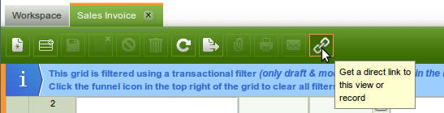
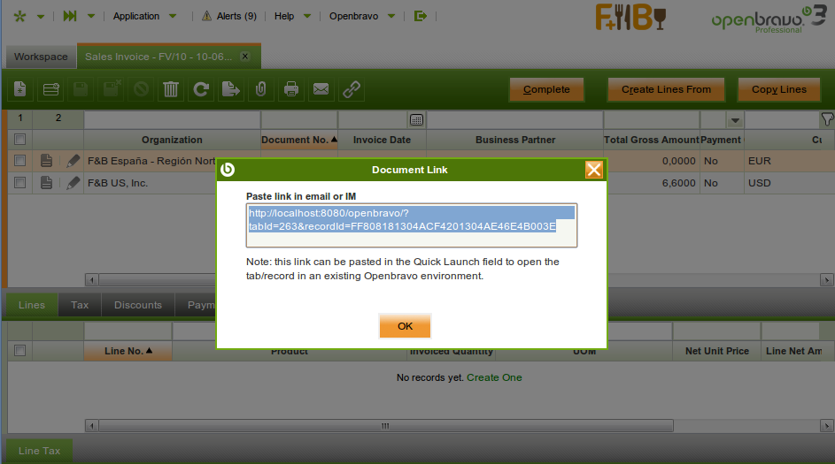

#  Deep Linking

!!! example  "IMPORTANT: THIS IS A BETA VERSION"
    It is under active development and may contain **unstable or incomplete features**. Use it **at your own risk**. The module behavior may change without notice. Do not use it in production environments.
  
##  Overview

According to [Wikipedia]() "Deep linking, on the World Wide Web, is making a hyperlink that points to a specific page or image on a website, instead of that website's main or home page. Such links are called deep links". In the case of Etendo, it is the way to link with a URL directly to an specific functionality, e.g. a Window/Tab, a Manual Form, etc. This link can be built and attached in an email, or copied/pasted in an IM window, etc.

##  Retrieving a direct/deep link

The Etendo user interface makes it very easy to retrieve an URL to a window, tab and specific record (in a child tab). See the icon in the top of the Etendo window.

{: .legacy-image-style}

This icon can be clicked to create a direct link to a tab:

{: .legacy-image-style}
  
This example shows the direct link to the sales invoice header tab.

##  Structure of the URL
  
    http://server:port/obcontext/?params

* **http://** The protocol to access the application (can be https if is an SSL enabled instance) 
* **server** The name or IP address of the server 
* **port** The port to access (If configured with Apache Httpd in front of tomcat is not necessary) 
* **/obcontext** The name of the Etendo context (required) 
* **?params** The list of parameters to access an specific window or form. 

For more information, visit [the structure of an URL](https://skorks.com/2010/05/what-every-developer-should-know-about-urls/){target="\_blank"}.

The following parameters are supported:

* **tabId** (mandatory) the ID of the tab to which you want to link.
* **recordId** the id of the record to be shown in the tab .
* **command** the command parameter can be used to show the form in New mode, only one command is supported: NEW.

!!! note
    * Linking to a (grand-)child tab only makes sense when also a recordId (of the record to be shown in the child tab) is defined. This is needed to determine which parent record to load in the parent tab 
    * When the recordId parameter is used, the tab will always open in form mode 

Here are some examples of hyperlinks:

* http://localhost:8080/openbravo/?tabId=263 - Link to the sales invoice header 
* http://localhost:8080/openbravo/?tabId=263&recordId=FF808181304ACF4201304AE46E4B003E - Link to a specific sales invoice 
* http://localhost:8080/openbravo/?tabId=270&recordId=00C1DB5F5AB241D2A574B8CEBF482F8F - Link to a specific sales invoice line 
* http://localhost:8080/openbravo/?tabId=263&command=NEW - Opens the sales invoice header window in NEW mode 

---

This work is a derivative of [Deep Linking](http://wiki.openbravo.com/wiki/Deep_Linking){target="\_blank"} by [Openbravo Wiki](http://wiki.openbravo.com/wiki/Welcome_to_Openbravo){target="\_blank"}, used under [CC BY-SA 2.5 ES](https://creativecommons.org/licenses/by-sa/2.5/es/){target="\_blank"}. This work is licensed under [CC BY-SA 2.5](https://creativecommons.org/licenses/by-sa/2.5/){target="\_blank"} by [Etendo](https://etendo.software){target="\_blank"}.