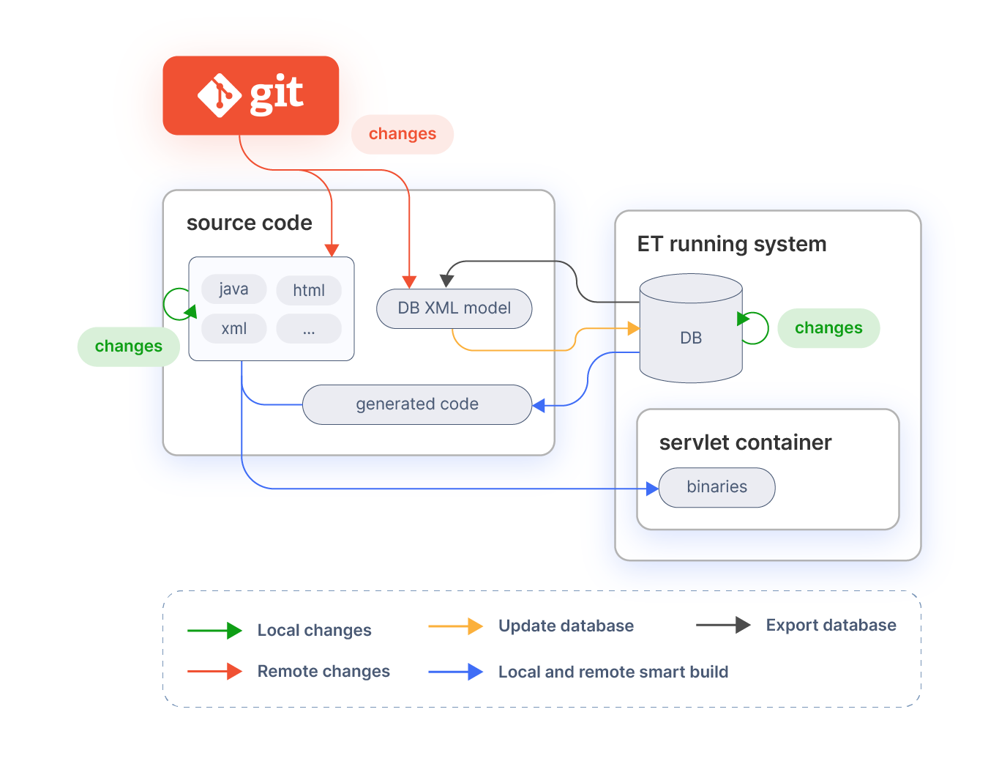

# Development Build Tasks

## Overview

This document discusses the **gradle tasks** used during the build process of Etendo. It explains what the gradle tasks are used for and which properties can be used to control their behavior. 

!!!note
    Notice that Gradle is **case sensitive**.

## Main Build Tasks

This section explains the main build tasks following the steps as illustrated in the image.

In most of the cases, it is only necessary to use 3 tasks (`install` , `smartbuild` and `export.database`). There are a number of other tasks that can be used but they are not required for the standard process. 

!!!info
    For more information, see [Detailed Build Tasks](#detailed-build-tasks) section.

The main task for the standard process is `smartbuild` which performs all the required processes as explained below. This task accepts an optional property:

  * `local` for local or remote developments which by default is set to **yes** . 

The difference between `local` and `remote` development is illustrated in the diagram. Local development are changes by the developer him/herself. Remote developments are changes done by other developers. Changes by remote developments are pulled from the source code revision system.



!!!info
    `remote` means that the user is bringing changes to the workspace from an external location, e.g. with a `git pull`.
    
### Initial installation

After downloading the Etendo ERP source files. It is necessary to install and deploy it. Check our guide about [Etendo Install](../../../getting-started/installation.md#install-etendo)

### Database export

In most cases developments include modifications on the database. This modifications can be persisted in `xml` files using the **DBSourceManager** tool. **DBSourceManager** exports to `xml` files only the modules (including core) that are set as `In Development`. To export the database execute:

``` bash title="Terminal"
./gradlew export.database
```

After this step, the changed model `xml` files can be pushed/committed to the source code revision system, so that other developers can pick them up and continue working on top of it.

When a module is exported using the `export.database` task, it is first validated to check for common errors. If the validation fails then the `export.database` task will also fail and export is not possible.

The following checks are currently done:

  * A table defined in the Application Dictionary should be present in the database and vice versa. 
  * Column definitions in the database and the Application Dictionary are compared, any mismatch is reported. The column datatype, default value and length are checked. 
  * Tables should have a primary key. 
  * Foreign key fields should be part of a foreign key constraint. 
  * Names of tables, columns and constraints are checked for their length (Oracle and PostgreSQL has a 30 character limit there). 

### Update database

**Database model** changes are distributed by committing the database schema as `xml` to `SCM`. Other developers pull the changes from `SCM` and can apply them to update their own database. After updating the database the process is exactly the same as the local one, that is compile and deploy the elements that have been modified since last build.

``` bash title="Terminal"
./gradlew update.database
./gradlew smartbuild
```

All the required actions (update database, compile last modifications and deploy them) can be done with only the `smartbuild` command:

``` bash title="Terminal"
./gradlew smartbuild -Dlocal=no -Dforce=yes
```

The only difference with the local development is in the `local` parameter which makes the process to update the database in case the `xml` files were changed.

### Module Consistency Check

An instance is **consistent** in case the dependencies of all the modules it has installed are satisfied. Development instances can define inconsistencies (for example by creating a dependency on a module version which is not installed) whereas production instances where all the modules are installed through obx or Central Repository should not be inconsistent because it is guargradleeed by the installation process.

**Inconsistent instances** can be in a situation where it is not possible to update any of the modules (including core) they have installed. This is due the fact that Central Repository only proposes updates to consistent sets of versions and it is possible the inconsistency cannot be resolved by any.

## Detailed Build Tasks

This section contains a detailed listing of all available build tasks.

### Libraries build tasks

|  Task      |  Description  |  Notes  |
|------------|---------------|---------|
|  `core.lib`  |  Compiles and generates a `.jar` file from the `src-core` project. Which is needed by `wad.lib` and the rest of build tasks.  |  **Required by**: wad.lib  |
|  `wad.lib`   |  Compiles and generates a `.jar` file from the `src-wad` project. Which is needed by the build tasks. This project contains the WAD, the automatic window generator.  |  **Requires**: `core.lib`, database created **Required by**: compile.*  |
|  `trl.lib`   |  Compiles and generates a `.jar` file from the `src-trl` project. Which is needed by the translate task. This project allows to translate to different languages manual windows.  | **Requires**: core.lib  |
  
### Build tasks

|  Task                 |  Description   |  Notes  |
|-----------------------|----------------|---------|
|  `install`            |  Installs the whole application: creates the database, compiles it and generates a war file to be deployed or copies the classes to Tomcat's directory (depending on the `deploy.mode` property set in Openbravo.properties).  |  **Calls**: `create.database`, `core.lib`, `wad.lib`, `trl.lib`, `compile.complete.deploy`, `applyModule`.
|  `smartbuild`         |  Makes an incremental build of the application. Including: <br> `update.database` <br> compile <br> deploy <br> All these tasks are done only if needed.  |  **Requires**: Database must be created and populated with data **Properties**: <br> `local`: (`yes/no` default as `yes`) when this property is set to no `update.database` task is executed, otherwise it is not executed. <br> `tr`: (`yes/no` default as `yes`) if set to no, translation process is not executed. <br> `force`: (`yes/no` default as `no`) used with `local=no`. If set to yes it will overwrite the changes in the database with the XML information. Note: All un-exported changes will be lost.
|  `compile.complete`  |  Compiles all modified classes (including the generated ones) but before removes all the generated and built files, so the whole application is built  |  **Requires**: `wad.lib`, `trl.lib`, database created and populated. **Calls**: translate <br> **Properties**: <br> **tab**: specifies the window name(s) to be generated, to specify more than one window add them as a list of comma separated values. Note that even window is specified by this property, its 2.50 code will not be generated unless it is required or forced. <br>  **tr**: if set to "no" it will not call the translation process. <br>  **module**: a list of comma separated javapackages of modules to generate just the windows containing objects for those modules. <br>
|  `generate.entities`  |  Generates the Java files for `src-gen` directory, and compiles them. They are used by DAL to access to the database information.  |   **Requires**: Database must be created and populated with data.
|  `translate`          |  Checks in the manual windows User Interface files the translateable elements that have not been yet registered and registers them, this is necessary to be able to translate those interfaces to different languages.  |  **Requires**: `trl.lib` **Called by:** This task is called by the compile.* tasks in case the tr property is not set to "no". 
|  `antWar`                |  Generates a war file from the existing built code. In fact it only zips the application in a single war file.  |  **Requires:** compile.*: the application must be built before calling this task.
|  `deploy.context`     |  Deploy the existing war file in the tomcat context using the tomcat manager.  |  **Requires:** <br> war file must be created <br> Tomcat manager must be running <br> These properties must be properly set in the `Openbravo.properties` file: <br> `tomcat.manager. url` <br> `tomcat.manager.username` <br> `tomcat.manager.password` 

### Database tasks

|  Task               |  Description  |  Notes  |  Sub Tasks  |
|---------------------|---------------|---------|-------------|
|  `create.database`  |  Creates the database from the `xml` files, note that the database is first removed. If the `apply.on.create` property is set, masterdata and sampledata will be inserted in the database. If not, only sourcedata will be inserted.  |  **Properties:** <br> `apply.on.create`: If is set to **true** and there are modules they will be applied, otherwise they will be set as **In process** status.  |  `create.database.script`: The same as `create.database.structure` but does not affect the database it only generates the `sql script` file with all the statements that would be executed by the other tasks. 
|  `update.database`  |  Synchronizes database with the current database xml files. By default it checks that no changes in application dictionary in database are done, if so the process stops.  |  **Properties:**  <br>  `force`: (`yes/no` default as `no`) Do not check for database modification and update directly. This can cause lose of database data.  |   `update.database.script`: It is the same as `update.database.structure` but does not modify the database. It only generates a `sql` script file with the statements that would be executed by the other tasks.
|  `export.database`  |  Synchronizes xml files with the database current contents. By default they are only exported in case there are modifications in the database. In addition performs database validations for the modules which are exported.  |  **Properties:** <br> `force`: (`yes/no`default as `no`) Forces the export skipping the check of which files had been modified since last `update.database`. <br> `validate.model`: (`yes/no` default as `yes`) Checks the model that is being exported fulfills a series of rules related to modularity, `oracle-postgreSQL` compatibility, etc. In case any of these rules is not complied, export will not be done and an error message will be raisen.

!!!info

    ` update.database ` and ` export.database ` tasks support multi-thread parallel execution for some of their actions such as index creation or function standardization. By default, the number of threads used is calculatedas the half of the available number of cores in the machine where the task isexecuted. This value can be set by adding the `-Dmax.threads=numOfThreads` parameter. 

### Test Tasks

|  Task     |  Description  |  
|-----------|---------------|
|  `test`  |  By default, all Etendo tests are run. You can use the `--tests "<package>"` to specify which tests you want to run.

!!!info
    For more information about execution test in Gradle visit [Test Filtering in Gradle](https://docs.gradle.org/current/userguide/java_testing.html#test_filtering)

### Other Tasks

|  Task                   |  Description  |
|-------------------------|---------------|
|  `migrate.attachments`  |  Migrates the attachments to the new attachment model.

This work is a derivative of [Development Build Tasks](http://wiki.openbravo.com/wiki/Development_Build_Tasks){target="\_blank"} by [Openbravo Wiki](http://wiki.openbravo.com/wiki/Welcome_to_Openbravo){target="\_blank"}, used under [CC BY-SA 2.5 ES](https://creativecommons.org/licenses/by-sa/2.5/es/){target="\_blank"}. This work is licensed under [CC BY-SA 2.5](https://creativecommons.org/licenses/by-sa/2.5/){target="\_blank"} by [Etendo](https://etendo.software){target="\_blank"}.