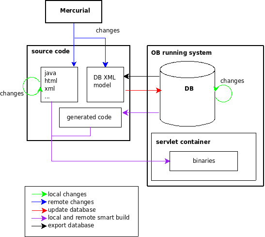
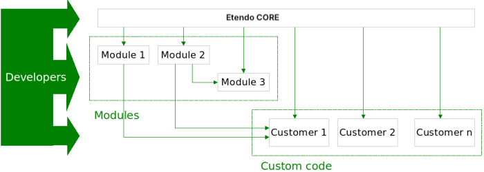

#  Development Model

!!! example  "IMPORTANT: THIS IS A BETA VERSION"
    It is under active development and may contain **unstable or incomplete features**. Use it **at your own risk**.
    
##  Overview

The **Etendo Development Environment** (abbreviated as **ODE** ) is a framework of tools, methodologies and processes to make Etendo development process easier and to help developers to be more efficient in tasks such as editing source code, debugging, testing, deploying and managing code repositories. ODE supports both **Oracle** and **PostgreSQL** based on environments. ODE is designed to support the development process for whatever the intent is (Etendo core contributions, modules and custom code) and whatever the scope is (from small bug fixes to complete new functional modules).

##  Concepts

Before starting with the development process, let's explain some basic general concepts.

###  Database Model

It contains the structure of all the database elements used in Etendo: tables, triggers, views, sequences and functions. The Database Model is part of the     
`XML` model.

###  Application Dictionary

The Application Dictionary is the part of the source code of Etendo stored in the database. It is a set of declarative definitions of business elements and logic that are used to build and render the application. For example it contains the definition of windows, tables, forms, reports, processes, etc. It is stored in `AD` tables such as `AD_Window` or `AD_Column` and is part of the `XML` model.

###  XML model

The XML model contains the database schema and the Database Model and the Application Dictionary. In order to ease concurrent developments this information can be exported from database to plain XML files. These files
maintain all the information required to generate the database and populate it with all data in Application Dictionary. It is stored in a neutral language compatible with the two database engines supported by  Etendo: PostgreSQL and Oracle.

The synchronization from database to the XML model and vice versa is managed by the [DBSourceManager](../concepts/dbsourcemanager.md).

###  Source code

It is where all the information required to build the whole Etendo system is. It includes the Database Model, the Application Dictionary, generated entity classes, core classes to manage the system as well as java code, javascript code, html, reports and other files to implement functionality that complements the Application Dictionary.

###  Binaries

During the build process, all `Java` classes in the system are compiled and transformed to binary files. These binary files can be packaged and deployed to a `J2EE` application server like Tomcat.

###  Database

The Database is where the Application Dictionary and user's data are stored.

###  Gradle

[Gradle](https://http://gradle.org/){target="\_blank"} is a Groovy-based build tool. Etendo automates most of its development and compilation tasks using Gradle.

###  IntelliJ IDEA

Etendo source code is IntelliJ IDEA ready. This means that the setup of Etendo source code within IntelliJ IDEA is optimized to be done in a very few steps.

###  GitHub

GitHub is a distributed SCM which facilitates multiple developers to work in the same code managing revisions for each source code file. Etendo source code and packages are maintained and freely available in the **Etendo Software repositories**. 

###  Deploy Modes

Etendo is a web application that runs in a Servlet Container. This means that, to build the system, it needs to generate the binaries from source code and to deploy the binaries into a Servlet Container, usually Apache-Tomcat.
Etendo build tasks can be configured to manage the deployment in three different modes:

- **class**

    **class** deployment mode copies the compiled Java classes and all necessary files to the Etendo Context folder within the Servlet Container where the application is served from. Using this deployment mode the application is automatically deployed when the system is built.

- **war**

    **war** deployment mode generates a war file with the whole application. This file can afterwards be deployed on the server. Note that using this deployment mode the application is not automatically deployed when the system is built, but the war file needs to be manually deployed. 

- **none**

    When Etendo is compiled, all the necessary files to be run in the server are copied to `WebContent` directory. It is possible to set the server to serve from this directory, which is the standard way to work from Eclipse IDE. In this case Eclipse will manage the deployment. 

The deploy mode is set in the `gradle.properties` file, by the `deploy.mode` property.

##  Source Code Structure

The source code of Etendo is structured in different folders:

- **config** : Here go all the configuration files of Etendo. The most important file is **gradle.properties** file and **Openbravo.properties** that contains all the deployment options and database connection properties. 
- **legal** : Here go the Etendo licence and the licence files of all the third party components used by Etendo. 
- **lib** : All the libraries files go in this folder. Libraries are separated between **lib/build** , libraries needed only to perform build tasks and **lib/runtime** libraries needed in runtime and during performing build tasks. 
- **modules** : All the modules installed or in development with all its artifacts go in each own subfolder inside **modules** . 
- **modules_core** : All the modules distributed with the Etendo Core. 
- **referencedata** : The standard and sample data stored in XML files go in this folder. 
- **src** : This is the main folder for all the core source code file and resources. 
- **src-core** : Source files and resources of the library **openbravo-core.jar** go. 
- **src-trl** : Source files and resources of the library **openbravo-trl.jar** go. 
- **src-wad** : Source files and resources of the library **openbravo-wad.jar** go. 
- **src-util** : This folder is used for the Build Validation, Module Scripts and Diagnostic components needed to perform maintenance tasks for Etendo an modules. 
- **src-db** : This go the source files and resources of the DBSourceManager tool and also the files of the Databasase Model and Application Dictionary. 
- **src-gen** : In this folder go all the DAL entity generated java classes. 
- **src-test** : In this folder go all the source files and resources of the tests. 
- **web** : This is where all static web files are located like javascript files, images, skins, ... 
- **WebContent** : This is where all the files needed to deploy Etendo are copied when executing the building tasks. An application server can serve the Etendo application directly from here or a package file can be built from here to be deployed. 

##  Database Code Management

###  Overview

Etendo source code is made of two different **types** of code: **source code** ( `Java`, `JavaScript`, `CSS`, `HTML` files) and **database code** . Database code can be separated into DDL statements of **Database Model** (tables, triggers, views, sequences and functions) and **Application Dictionary** .

When Etendo is installed, a database (Oracle or PostgreSQL) is created by executing the DDL statements, application dictionary data is inserted and code is generated. Once the database is created, custom ERP data are added to the database (products, business partners, orders, invoices, etc). Those data are stored by the database in binary files mixed with the Database Model and the Application Dictionary.

New developments (bug fixes or new features) usually include changes in both source code and database code. There are **two major problems** with the generic exported database dump, especially when wanting to include it in a source code repository:

1. **It is not easy to get a detailed and clean description of your development changes** since the `dump` (`*.dmp`) file is a binary file and not a text one. Hence, `diff` statement does not work well on binary files. 

2. **It is not possible to update a production environment by deploying the changes in the source code**. Instead, a database script needs to be prepared that performs the `alter` and `update` statements required in order to keep customer data that is already in the database. 

###  DBSourceManager

DBSourceManager is based on [DdlUtils](https://db.apache.org/ddlutils/){target="\_blank"} a small, easy-to-use component by Apache Foundation for working with Database Definition (DDL) files. These are **XML files** that contain the definition of the database schema (e.g., tables and columns). These files can be feed into DBSourceManager via their corresponding **Ant task** in order to create or alter the database. In the same way, DBSourceManager can generate a DDL file from an existing database.
**Etendo has extended several DdlUtils capabilities** (for instance, support for check constraints, procedures and views; PL/SQL translation from Oracle to PostgreSQL; support for more database types, etc) and fine tuned others (for instance, export database schema objects, etc) to fully support ODE requirements.

###  How it Works

Each Etendo system (working copy) has  a folder called [`database`](../concepts/development-project-structure.md#src-db) where all the **database code** (Database Model and Application Dictionary) are stored in **plain XML text files**. Source code in plain XML files inside the `src/database` folder is divided into:

* **model** Database model. 
* **sourcedata** Application dictionary. 

**Changes to the database can happen in 2 places** :

1. **Inside `src-db/database` folder** (working copy): 
    1. Through updates coming from the GitHub repository. When changes come from a GitHub update, they do not overwrite changes done in the working copy since these changes are merged within the plain XML files. 
2. **Inside the database** : 
    1. Editing the Application Dictionary using the Etendo Application Dictionary windows and processes. 
    2. Performing changes In the Database model (tables, procedures, etc.) using your favourite database management tool (PGAdmin, SQL Developer, TOAD, etc.). 

ODE provides the following **tasks to synchronize the database XML files with the database** itself:

* [**create.database**](../concepts/development-build-tasks.md) task: first reads the Database Model XML files inside `src-db/database/model` folder and creates schema objects in the Oracle or PostgreSQL database. After that, this task fills the database with the Application Dictionary taken from `src-db/database/sourcedata` folder. 

    !!!warning
        Keep in mind that this task re-creates the database from scratch which means that the existing database will first be dropped.

* [**update.database**](../concepts/development-build-tasks.md) task: compares the Database Model and the Application Dictionary stored in the database with the XML files inside the `src-db/database/model` and `src-db/database/sourcedata` folders. Differences are applied to the database, keeping custom ERP data (products, business partners, orders, invoices, etc) in the database untouched. 

* [**export.database**](../concepts/development-build-tasks.md) task: takes the Database Model and Application Dictionary stored in the database and overwrites the XML files inside the `src-db/database/model` and `src-db/database/sourcedata` folders. 

As you can imagine, whenever any of these tasks are executed, **both models (the one inside `src-db/database` folder and the database itself) are forced to be identical**. The first two tasks modify the database so that it is equal to `src-db/database` folder content and the third one overwrites the `src-db/database` folder content to equal it to the database.

In summary, the `src-db/database` folder contains Etendo database source code (plain XML files) clearly separated from custom ERP data (products, business partners, orders, invoices, etc). This way, the database is not distributed as a binary dump file anymore.

!!! important
    Since changes to the database can happen within the text files or the database itself, it is extremely **important to guarantee that these changes do not happen simultaneously to both sides** because this situation would lead to system inconsistency and loss of data. This is guaranteed by using a check
    based on the **GitHub revision number** . Each time `create.database` or `update.database` tasks are launched, revision number of the working copy is saved into the database. `export.database` task checks that the revision number of the working copy matches with the revision number of the database.
    If it matches, there is a guarantee that changes in our database will not overwrite changes done by other developers in the database XML files . If it does not, the developer will get an error and will be forced to switch the working copy to the current database revision number.  
  
  
###  Different Types of Data

The default installation of Etendo will install different data sets resulting in a complete workable system. Within Etendo, we distinguish the following information:

* sourcedata: this is the Application Dictionary information. Data of tables `ad_tables`, `ad_columns`, `ad_windows` go here. This can be extended through modules (modules can add information here), and is updated on each Core update (through `update.database`). Application Dictionary data can be found in the `src-db/database/sourcedata` folder. 
* referenceddata: this is information referenced by sourcedata, data of tables `ad_client`, `ad_org`, `ad_user`, `ad_language`, or `ad_role`. The Etendo database cannot be created without this information (the referencial integrity of the database would be compromised without it), and this explains why it is treated in a special way. It is not updated on each Core update. This data is located in the `src-db/database/sourcedata/referenceddata` folder. 
* standard: this is information which is not needed to create the database, but it is really convenient for every user, like document types, document templates, etc. This is also not updated on each Core update. This data is located in the `referencedata/standard` folder. 
* sampledata (): this is sample information we provide for the users to test Etendo, and contains a new client, with its corresponding business information. This data is located in the `referencedata/sampledata` folder. 

This data is installed/loaded into the database when installing Etendo.

##  Development process



This section explains the most common way of developing Etendo and which build tasks should be used for each case. In most of the cases it is only necessary to use 3 tasks (`install.source`, `smartbuild` and
`export.database`). There are a number of other tasks that can be used but they are not required for the standard process. They are explained in the [Development Build Tasks](../concepts/development-build-tasks.md#libraries-build-tasks) article.

The main task for the standard process is **smartbuild** which performs an incremental build of the system -only the modified components are rebuilt- as explained below. This task accepts two optional properties: `local` for local or remote developments which by default is set to `yes` and `restart` indicating if after the build process tomcat should be restarted with `no` as default value.

Local is used as a hint to the build task to let it know if there have been database changes coming from other developers through a pull of the GitHub repository so it is needed to apply those changes to the database in the local instance. A developer working locally in her/his instances performs all database changes directly in the database so there is no need to update the database to build the system. But if the developer has just done a GitHub pull then it is likely that other developers have done changes in the XML
database files so it is needed to update the database with those changes.

Smartbuild is an incremental process and avoids any task that is not needed. When development is local, smartbuild can skip the update of the database. In any case, developers are allowed to update their database from XML files at any time.

###  Initial installation

After downloading the Etendo source files (for example from a clone repository using GitHub) the next step is to install and deploy the system.

First, you have to properly configure all the required properties. All of them are stored in the `gradle.properties` file, that **you have to configure properly before going ahead**.

After all properties are configured, the following step is to build the application from source code and deploy it. All this is done by the **install.source** task. This task creates the database, inserts sample data on it and compiles and deploys the application accordingly with the deployment mode chosen. To execute it just type in the Etendo root directory:
    
```
./gradlew install.source
```

###  Local Developments

Once Etendo is up and running, it is possible to develop on it. Generally, new developments should be done through modules.

The standard way for developing locally consists on:

* Develop/modify windows, tabs, etc through the Application Dictionary. 
* Create/modify database objects directly in database. 
* Develop/modify windows editing html, xml, javascript and java files. 

####  Build

Once your changes are done and before you test them, it is necessary to build the application. You can do an incremental build by just executing (from command line):

```
./gradlew  smartbuild
```

!!!note
    Remember that by default smartbuild considers only local changes so it does not synchronize the database from the XML files (`update database` is skipped).

This task generates and compiles the sources for the modified elements, and, depending on the deploy mode, it also deploys them. It is possible to restart tomcat from the same task setting the property restart to yes, this would be:

```
./gradlew smartbuild -Dlocal=yes -Drestart=yes # Note the -Drestart=yes 
```

####  Database Exportation

In most cases, developments include modifications in the database. These modifications can be persisted in the database XML files using the [DBSourceManager](../concepts/dbsourcemanager.md) tool. DBSourceManager exports to XML files only the database changes of modules (including core) that are set as `In Development`. To export the database changes execute:
    
```
./gradlew export.database
```

###  Remote Developments

Remote developments are done by other developers remotely and then are merged with the local sources. The main difference with local ones is that remote developments do no modify the database directly. The way a remote development can change objects in database is using XML files, so after updating (merging) the XML files it is necessary also to update the database. After updating the database the process is exactly the same as the local one, this is, compile and deploy the elements that have been modified since last build. All this (update the database, compile last modifications and deploy them) can be done at the same time with the **smartbuild** command:
    
```
./gradlew smartbuild -Dlocal=no # Note the -Dlocal=no 
```

The only difference with the local development is in the `local` parameter which makes the process to update the database in case the XML files were changed.

###  Validate Database

When a module is exported using the `export.database` task, it is first validated to check for common errors. If the validation fails, then the `export.database` task will also fail and export is not possible.

The following checks are currently done:

* A table defined in the Application Dictionary should be present in the database and vice versa. 
* Column definitions in the database and the Application Dictionary are compared, any mismatch is reported. The column datatype, default value and length are checked. 
* Tables should have a primary key. 
* Foreign key fields should be part of a foreign key constraint. 
* Names of tables, columns and constraints are checked for their length (Oracle has a 30 character limit there). 

###  Gradle Test Tasks

Etendo has a number of Gradle tasks for running  JUnit test cases.


``` bash title="Terminl"
./gradlew test`
```
``` bash title="Terminl"
./gradlew test --tests <package>
```
This tasks will run all tests defined in Etendo and installed modules.

##  Core, modules and customizations

Etendo is designed to fulfil all customer requirements whatever they are. It is done at different levels each one more specific to the customer than the previous:

* **Etendo core** : common functionality **without any industry specific** detail that is used for most of the customers. 
* **Modules** divided in three different types: 
    * **Functional modules and Plugins** : extended functionality (such a HR module) and specific tools or components (such a connection to a remote banking system). More than one module/plugin could be applied to a customer installation. 
    * **Localization packs** : adaptation of Etendo Core and modules to a country specific operations (translation and specific rules such as chart of account and taxes). 
    * **Industry Templates** : adaptation of Etendo Core and related modules to a industry specific operations (for example, a vertical for non-profit organizations). Only one `industry template` can be applied per customer installation. 
* **Custom code** : customization of Etendo Core and related modules to completely fulfill customer requirements. 

So, regardless of the scope of a project - just a small bug fix or a large new functional module - development using ODE can be divided in one of the following categories:

1. **Core**: A modification of the source code provided by the Etendo distribution.
2. **Module**: A pluggable module that can be packaged independenty from the core of Etendo, distributed and deployed to other Etendo installations.  
3. **Customization**: To **fit some customer requirements**, sometimes it is needed to update the Etendo core source code that cannot be packaged in a module.

**Customer's production deployment** can therefore consist of **several elements** listed above such as bug fixes, module plugins, new features, etc.

Regardless of the objective, the development process' base is a **source code repository** updated from different sources. ODE will keep track of the source for each change, but all of them will be managed in the same standard way.



This figure also explains the dependency tree in Etendo. **Etendo core** is completely **independent from modules and custom code** . A module depends on Etendo core and other modules it might be based on. Custom code depends on Etendo core and on all the modules the customer has installed.

The [development process](#development-process) is identical for all of the categories described above.

---

This work is a derivative of [Development Model](http://wiki.openbravo.com/wiki/Development_Model){target="\_blank"} by [Openbravo Wiki](http://wiki.openbravo.com/wiki/Welcome_to_Openbravo){target="\_blank"}, used under [CC BY-SA 2.5 ES](https://creativecommons.org/licenses/by-sa/2.5/es/){target="\_blank"}. This work is licensed under [CC BY-SA 2.5](https://creativecommons.org/licenses/by-sa/2.5/){target="\_blank"} by [Etendo](https://etendo.software){target="\_blank"}.