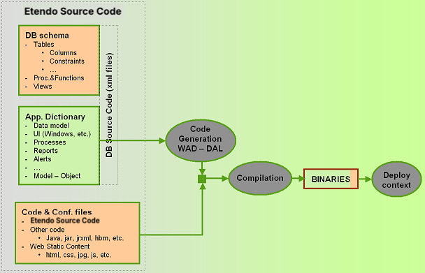

#  Main Development Concepts

!!! example  "IMPORTANT: THIS IS A BETA VERSION"
    It is under active development and may contain **unstable or incomplete features**. Use it **at your own risk**.

##  Design Principles

Etendo is a software application which is being developed with the following design principles in mind:

- Open Source
- ERP application framework 
- [Model Driven Development](https://en.wikipedia.org/wiki/Model-driven_engineering){target="\_blank"}
- [Modularity](../concepts/modularity-concepts.md) 
- [Rich Internet Application (RIA)](../concepts/etendo-architecture.md#smartclient) 
- Java - Lightweight J2EE 
- Support for multiple databases

The aim of Etendo is, while following these principles, to deliver an application which is state-of-the-art from both a technological as well as a functional point of view.

### Open Source

Etendo is an open source project built on open source technologies. We aim to leverage on the excellent infrastructure components developed by the open source community to ensure our platform benefits from the advantages and stability of components supported by a large community. Whenever necessary we contribute our developments back to the community.

### ERP Application Framework

Etendo is an application developed through an integrated development framework included in Etendo distribution. This integrated development framework takes care of a wide range of concerns in all the areas involved during the development process. Most relevant from low level to high level:

- Integration with [IntelliJ IDEA](../getting-started/installation/install-etendo-development-environment.md) 
- Integration with SCM (GitHub) 
- [Automated build process](../developer-tools/etendo-gradle-plugin.md#build-tasks) 
- Automated update process 
- Automated deploy process 
- Built-in infrastructure for several common development needs: 
    - MVC framework (xmlEngine, httpBaseServlet, sqlc) 
    - [Data Access Layer](../concepts/data-access-layer.md) (based on [Hibernate](https://hibernate.org/){target="\_blank"}) 
    - Web server and servlet-container (integration with [Apache-Tomcat](https://tomcat.apache.org/){target="\_blank"} and support to other J2EE implementations) 
    - [Reporting](../how-to-guides/how-to-create-a-report.md)(integration with [JasperReports](https://community.jaspersoft.com/download-jaspersoft/){target="\_blank"} engine) 
    - [XML](../concepts/xml-rest-web-services) and [JSON REST Webservices](./json-rest-web-services.md) 
    - Emailing 
    - Process scheduling (integration with Quartz) 
- MDD development framework (Etendo [Application Dictionary](../concepts/data-model.md#application-dictionary)) 
- Multi-language user interface support.
- Built-in security model.
- Built-in enterprise model. 
- Multi-currency support.
- Multi-general ledger support. 

###  Model Driven Development

Etendo follows a [Model Driven Development](../concepts/development-model.md#development-process) (MDD) approach. This means that Etendo uses a technology agnostic model to define application components, such as windows and processes. Based on this application model, code and other software artifacts are generated.

[Etendo data model](../concepts/development-model.md) information -so called metadata- is stored in the Etendo Application Dictionary.

Model Driven Development aims to increase productivity and re-use through separation of concerns and abstraction. The model is an abstract definition of system components which contains enough information to drive the generation of one (or more) implementations of the system in a concrete technology.

This separation of concerns -abstract functional description in the model and implementation of model components in a concrete technology- hides technology complexities to ERP domain experts in their process to define and implement new ERP functionality and simplifies the evolution of the implementation technology.

In some cases it is needed to code a solution externally from the model. This is fully supported by Etendo. Developers can freely develop their own solutions on top of the Etendo technology stack.

###  Modularity

Modularity is a capability  which allows to define and package additional functionality and configurations as extension modules, independently from the core product.

Modularity changes the way in which Etendo can be adapted to user needs. Instead of customizing the code to match user requirements, it is possible to externally -from an independent module- extend functionality and to configure it.

This new approach has several advantages. Most important:

- **Enables pure distributed development** : new functionality can be developed through modules in a pure distributed manner. The team developing the module can work isolated from other teams -they only need a stable API from the other modules they use- and the life cycle of this module -including releases- is independent from other modules. 
- **Highly improves maintenance of code** : developing through modules means packaging independently. With a proper definition of module dependencies and keeping API's stable the process of updating an instance is straightforward and can be performed in one user click 
- **Encourages sharing and re-use of new functionality** : developing through modules makes it quite simple to share this new functionality with other people. If developers want to share their modules, all they need is to package and publish them in  Etendo Forge  (Central Repository). After that these modules will be publicly available and other users can search for them and install them through a simple process. 

###  Pure Web Application - Rich Client

Etendo is, by its very nature, a pure web application. Ubiquity of web browsers provides a universal point of access. Etendo understands the network as a platform, delivering and allowing users to use applications entirely through a browser.

The requirements are minimum: a web browser is available on virtually all computer systems. Moreover, being web-based means the product can be delivered over the Internet, allowing to update the application without distributing and installing software on potentially hundreds of client computers.

Traditionally, web applications had big limitations in regards of user interface. This has changed with the introduction of new web technologies such as AJAX. With AJAX and similar frameworks, it is possible to develop a rich, interactive and user-friendly interface.

###  Java - Lightweight J2EE

Etendo uses Java as its backend programming language. There are many reasons for choosing Java as the server-side language:

- Open Source nature 
- Wide support for enterprise-level development 
- Mature architecture for web applications 

Etendo follows Java 2 Enterprise Edition architecture (J2EE) without making use of the EJB container. Instead of that Etendo uses lightweight infrastructure to implement access to data and business logic. Etendo has delivered a new Data Access Layer [(DAL)](../concepts/data-access-layer.md) based on Hibernate that provides a powerful but still lightweight persistence mechanism.

###  Support for Multiple Databases

Etendo is committed to avoid vendor locking in any technology it uses including database. Etendo runs on PostgreSQL (8.3.5+) and Oracle SE (10g-11g).

In future releases, Etendo aims to be database independent. The Data Access Layer (DAL) based on Hibernate is a first step in that transition.

##  Etendo Main Concepts

###  System Requirements

Etendo runs on top of a group of well-known third party applications:

- Apache-Tomcat. We use Apache Tomcat as the servlet container but others can be used instead 
- Gradle 
- PostgreSQL or Oracle SE database 

All of these applications can be installed both on Linux or Windows.

###  Development Environment

Etendo developers have three different ways to develop their code. Following the MDD approach, most common is to edit Etendo Application dictionary through a web browser connected to Etendo. Based on the new model definition the software artifacts can be generated automatically. A developer can also connect directly to the Etendo database through a sql client (eg. `pgAdmin`, `sqlDeveloper`) to manage database schema objects (tables, procedures, etc.). Finally developers can develop their own code through an integrated development environment such as Eclipse.

{: .legacy-image-style}

All Etendo software artifacts are stored in text files in the development project. This includes the database definition and content. The large advantage of using text files for storing all software artifacts is that it is much easier to share and compare changes made by developers in a distributed environment.

Etendo uses a tool called [DBSourceManager](../concepts/dbsourcemanager.md) to manage database source code. DBSourceManager is able to read from the database schema objects and application dictionary data and export them to xml files. It can also create or update an Etendo database from those xml files.

The process to build the system from Etendo source code includes a number of steps to generate the code at different levels (DAL, WAD and others) and put together that code with other code directly written by developers. Etendo has automated this process through an ant task.

{: .legacy-image-style}

###  Architecture

The new architecture is explained in the [Etendo Architecture](../concepts/etendo-architecture.md) article.

---

This work is a derivative of [Main Development Concepts](http://wiki.openbravo.com/wiki/Main_Development_Concepts){target="\_blank"} by [Openbravo Wiki](http://wiki.openbravo.com/wiki/Welcome_to_Openbravo){target="\_blank"}, used under [CC BY-SA 2.5 ES](https://creativecommons.org/licenses/by-sa/2.5/es/){target="\_blank"}. This work is licensed under [CC BY-SA 2.5](https://creativecommons.org/licenses/by-sa/2.5/){target="\_blank"} by [Etendo](https://etendo.software){target="\_blank"}.