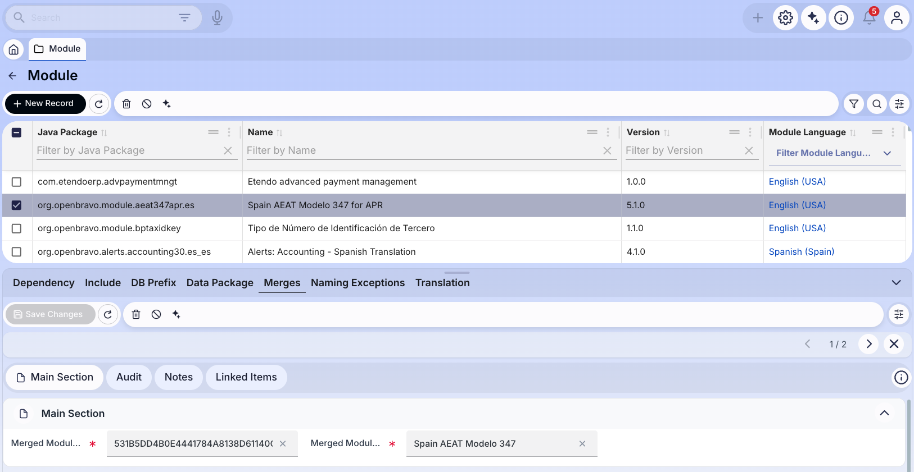

# Merging Modules

!!! example  "IMPORTANT: THIS IS A BETA VERSION"
    It is under active development and may contain **unstable or incomplete features**. Use it **at your own risk**.

## Overview

The aim of this section is to explain what merges are and how modules can be merged.

## What is Merging

A module (**B**) can be merged into another one (**A**). After merging these two modules, **B** is no longer available because it is included within **A**.

In case an instance has an old version of **A** and tries to install the new version of **B** or update to this one. The installation/update process will uninstall **A**, after this the only installed module will be **B** and it will not be possible to install in that instance any other **A** version.

## When to Merge

Merging modules should be done only in very few cases, it should not become a common practice.

Two modules are prone to be merged in case one of them does not make sense without the other one. Initially they could be thought to be separated modules because of some reason (different functionality, intended to be used separately, etc.), but within the evolution of both of them you realize they should have be designed to be a single module.

The first decision to be taken in this situation is which is the module that will be merged (so it will disappear) and which one will contain the functionality of the other.

Also, take into account that it will be necessary to publish a new major version of the module that merges the other one. This will extend dependencies of all modules that depend on this one. Also modules that depend on the merged module will not be compatible with the new merged one, so these dependencies should be removed forcing to publish a new major version of them.

## Merge Process

This section explains which are the steps to be followed in order to merge two modules within one.

### Merging the Code

#### Database

The objective here is to reassign all the database artifacts that belong to merged module (**B**) to the module that is merged into (**A**) without regenerating all these artifacts.

The simplest way to do this is by directly editing the `database/sourcedata` files within module **B**. In all these files it will be needed to replace module **B**'s UUID with module **A**'s UUID.

After doing that, set both modules in development in the application, execute `ant update.database` and then `ant export.database`. This exportation will move all database artifacts from **B** to **A**.

It is also necessary to change **B** data package to one inside **A**'s namespace (starting with **A**'s Java package name). 

!!!note
    This last change will cause an API change because all DAL classes generated for **B**'s artifacts will be repackaged.

#### Java

All Java classes in **B** must be repackaged to be included within **A**'s Java package and the .java copied within **A**'s module directory.

Again, this repackaging will cause API change for all original **B** classes.

Because of the change of package for database artifacts, it will also be necessary to adapt all parts where DAL was used for them to the new package.

### Merge Definition

Last step is to define the merge and publish a new major version of **B**.
  
Before setting which is the module merged, it is necessary to remove dependencies of **B** to **A**, because it is not allowed to define a module as merged and as a dependency at the same time.

The merged is defined in `Merges` tab of `Module` window, here it is necessary to insert the Merged Module UUID and its name. As the merged module is not part of the installed module, it is not a foreign key relationship to module table but it is identified by its UUID as a plain String, the name is used just to make it human readable.

### Version

All these changes will be packaged as a new version of module **A**. It is mandatory to be a new major version, this is because this new version includes major changes in all original **B**'s API.

!!!Note
    This change of major version will force all modules that already depend on **A** to extend their dependency on **A** to be compatible with latest major version.

Also, modules that depend on **B** will not be compatible with new **A** version (as it is not allowed to have installed a module that merges another module with a module that depends on the merged one), so they should also publish a new major version removing this dependency, they might now depend on **A** as it includes the old **B**'s functionality.

---

This work is a derivative of [Merging Modules](http://wiki.openbravo.com/wiki/Merging_Modules){target="\_blank"} by [Openbravo Wiki](http://wiki.openbravo.com/wiki/Welcome_to_Openbravo){target="\_blank"}, used under [CC BY-SA 2.5 ES](https://creativecommons.org/licenses/by-sa/2.5/es/){target="\_blank"}. This work is licensed under [CC BY-SA 2.5](https://creativecommons.org/licenses/by-sa/2.5/){target="\_blank"} by [Etendo](https://etendo.software){target="\_blank"}.