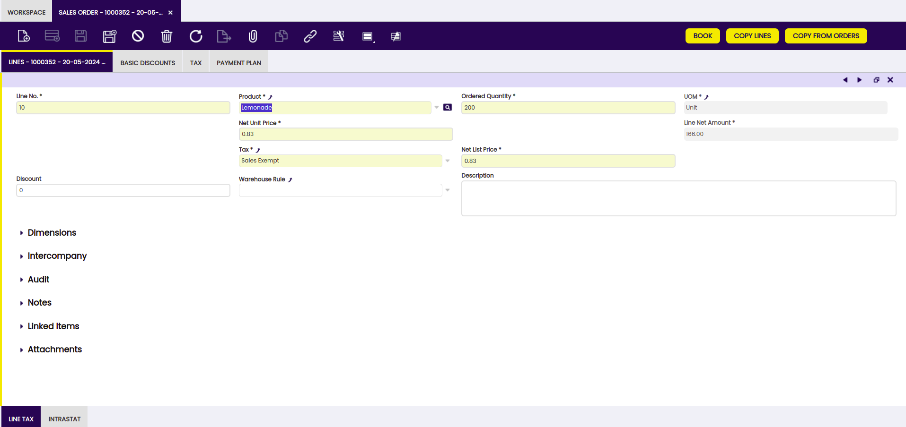
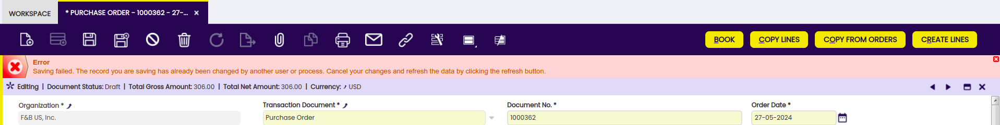
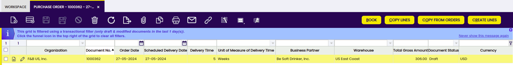

---
tags:
  - Standard Windows
  - Application Dictionary
  - Windows
  - Tabs
  - Fields
  - Java
  - XSQL
  - HTML
  - XML
---

# Standard Windows

## Overview

**Standard Windows** are the windows completely defined in **Application Dictionary**. They allow viewing and editing records in tables.

After defining (or modifying) a standard window, the system must be rebuilt (`gradle.smartbuild`). During this process `WAD` generates automatically the `Java`, `XSQL`, `HTML` and `XML` code for that window and it is compiled. This means that the complete definition for standard windows is within Application Dictionary without any need of manual developments. This has a number of benefits:

  * No need to write manual code: This reduces the possibility of introducing bugs.
  * Faster development: As a window creation consists only in defining it in Application Dictionary, it is faster that doing it manually.
  * Automatic inclusion of new features and bug fixes: Whenever `WAD` fixes a bug or adds a new feature, this is automatically propagated to all standard windows when the system is rebuilt without needing to re-code or re-define anything.

Due to these reasons, it is a best practice to use standard windows, if possible, rather than manual ones.

## Structure: Windows, Tabs and Fields

The structure for standard windows consists in `Windows`, `Tabs` and `Fields`.

  * [**Windows**](#windows): Windows are holders for tabs. Their main purpose is to group a set of related tabs. They can be added to the application's menu.
  * [**Tabs**](#tabs): Tabs are placed inside windows and can be ordered hierarchically. Each tab is linked to a unique [Application Dictionary Table](../concepts/data_model.md#tables-in-application-dictionary) and contains a number of fields.
  * [**Fields**](#fields): Fields are contained within tabs. Each field is associated to a [Column](../concepts/data_model.md#columns_in_application_dictionary) in the same table than its tab.



The following sections explain how **Windows**, **Tabs** and **Fields** are defined. They are managed from `Application Dictionary` > `Windows, Tabs, and Fields` window.

## Windows

Windows are generated automatically by `WAD` from their definition in Application Dictionary, all windows have a common layout.

### Menu

Windows can be added to [Application Menu](../concepts/application_menu.md).

## Tabs

`Tabs` are included within `Windows`. Each tab is limited to a single Application Dictionary `Table`. The following subsections detail some important topics to be taken into account when creating a tab.

### Tabs Hierarchy

`Tabs` are shown hierarchically, they are defined in a tree way. This means that a tab can have subtabs (it is the parent tab for them), consequently a tab can also be a child for another one and it is possible to have several tabs at the same level.

This hierarchy is specified using two fields in the tab:

  * `Tab Level`: Indicates the level in the hierarchy, being 0 the top level, 1 child tabs for ones in 0, etc. Usually there is a single tab at 0 level and the rest of tabs in the window are subtabs for this one. 
  * `Sequence Number`: It is a number that defines the order tabs are displayed. They are sorted ascendantly, so lower ones and in the left side and higher ones in the right. It is a good idea not to use consecutive numbers in order to allow new tabs inclusions between existent ones. 

The conjunction of these two values gives the position and hierarchy for each tab. Let's see through an example how the following tab structure could be defined:

```
     A
     |-A1
     |  |-A11
     |-A2
     |  |-A21
     |  |-A22
     |     |-A221
     |-A3
```

Tab  |  Sequence number  |  Tab level
---|---|---
A  |  10  |  0
A1  |  20  |  1
A11  |  30  |  2
A2  |  40  |  1
A21  |  50  |  2
A22  |  60  |  2
A221  |  70  |  3
A3  |  80  |  1

When creating subtabs, it is necessary to set which column in the parent column is going to be the master for the subtab. In order to show in the subtabs only the records that are linked to the current record in the parent one. For example let's suppose tab A is a tab for `C_Invoice` table and tab A1 is for `C_InvoiceLine` , in this case `C_Invoice.C_Invoice_ID` in tab A must be the master column for tab A1, showing in A1 only the records linking to the selected record in A.

There are three possible ways of setting which is the master column in the parent tab:

  1. Using the `AD_Column.IsParent` check in the table used in the subtab. When a table in a tab contains columns checked as `Link to Parent Column`, it is looked in the parent tab a column with the same name and if found that one will be the master.
  2. By `name`. In case the table in subtab has a column with the same name as the parent's `primary key` one, the link will be generated using them.
  3. Using `AD_Tab.WhereClause`. In case it is not possible to use #1 or #2, the relation must be set in the child tab's `Where Clause` field. For more info about this clause, read the document about [Dynamic Expressions](../concepts/dynamic_expressions.md). In these cases, it is possible to mark the `Disable Parent Key Property` flag, doing so only where clause will be used to create the relationship not adding any other criteria.

#### Locking mechanism

All `WAD` generated tabs implement a simple [Optimistic locking mechanism](https://en.wikipedia.org/wiki/Optimistic_concurrency_control){target="\_blank"}.

When a record is loaded in edition mode, its updated `timestamp` is stored. If the record is modified and saved, this stored timestamp is compared with the current one in database for that record. In case they are different, that record has been modified by another user or process and the application does not allow to save the current modifications. Because otherwise, the modifications done from the record was loaded till the current time would be overwritten.



##### Transactional Windows

Windows for documents can be set as `Transactional`. Documents have a status, which initially is **Draft**.
When a transactional window is accessed, it appears filtered by default. This is visualized using a `message` and a small `funnel` icon on the top right.



The applied filter is all the documents with status Draft or which date is in the defined `Transaction Range`. To clear the filter, click the `funnel` icon.

To define a window as transactional, go to `Application Dictionary` > `Windows, Tabs, and Fields` > `Window` tab and select the `Window Type` as `Transaction`.

To define the **Transaction Range**, go to ``General Setup` > `Application` > `Session Preferences` and define in the `Transaction Range` the maximum number of days that processed documents will be shown in.

##### High Volume Tables

When a table is set defined as `High Volume` (in `Application Dictionary` > `Tables and Columns` > `Table` tab) and the tab that displays it is set to by default be shown in edition mode ( `Default Edit Mode` in `Application Dictionary` > `Windows, Tabs, and Fields` > `Window` > `tab` tab), when the tab is accessed a filter is shown.

##### Filter Clause in Tab

In `Application Dictionary` > `Windows, Tabs, and Fields` > `Window` > `tab` tab there is a **Filter Clause** field,  `HQL Filter Clause`. This field allows `HQL where clauses` to be used as default filter for the tab. When the tab is accessed this filter is applied, to remove it just click on the `funnel` filter icon.

!!!note
    This field is different than the `HQL Where Clause` which also accepts where clauses, but this clause is permanent and cannot be removed by the user.

## Fields

`Fields` are contained in tabs, each field has a `column` (from the same `table` as the tab's one) associated. It displays and allows editing the column's value. The way a field is displayed within the tab is determined by the [reference](../concepts/data_model.md#references) its associated column has.

Some of the things to take into account when configuring a field are:

  * `Read Only Logic` which allows determining if field is read only (applies only when field is read-write).The Read Only indicates that this field may only be Read. It may not be updated. Note that it is defined at Column level in the Application Dictionary. It is a [Dynamic Expression](../concepts/dynamic_expressions.md).
  * `Display Logic` which allows showing or hiding the field depending on other fields' values. It is a [Dynamic Expression](../concepts/dynamic_expressions.md).
    * Display logic is taken into account in `grid view` as read only logic, being only applied when a record is edited in grid view. 
  * `Central Maintenance`, how it works is explained in the document about [Elements and Synchronize Terminology](../concepts/Element_and_Synchronize_Terminology.md).
  * [`Callout`](../concepts/data_model.md#callout), although it is not defined in the fields, it affects them directly becuse they are raised when fields' values are modified.
  * `Field group`, fields can be assigned to a field group, when a group of fields has a field group, a separator is shown in the tab. Field Groups are defined in `Application Dictionary` > `Setup` > `Field Category` tab.

## Classic Window Visualization

As a default, Etendo will visualize windows using rich internet technology. There are however some situations in which Etendo will use classic servlet based technology (i.e. classic mode):

  * In case of a specific `preference` setting, visit [this page](../how-to-guides/How_To_Switch_to_Classic_Mode.md) for more information.
  * When the window has a tab with one of the following settings:
    * A `manual` form.
    * An `SQL filterClause` but the `HQL filter clause` field is empty.
    * An `SQL order by clause` but the `HQL order by clause` is empty.
    * An `SQL where clause` set but the `HQL where clause` is empty.

In this second case, you will notice the following warning message when compiling: _INFO org.openbravo.wad.Wad - Window: WindowName is needed in classic 2.50 mode._

---

This work is a derivative of [Standard Windows](http://wiki.openbravo.com/wiki/Standard_Windows){target="\_blank"} by [Openbravo Wiki](http://wiki.openbravo.com/wiki/Welcome_to_Openbravo){target="\_blank"}, used under [CC BY-SA 2.5 ES](https://creativecommons.org/licenses/by-sa/2.5/es/){target="\_blank"}. This work is licensed under [CC BY-SA 2.5](https://creativecommons.org/licenses/by-sa/2.5/){target="\_blank"} by [Etendo](https://etendo.software){target="\_blank"}.