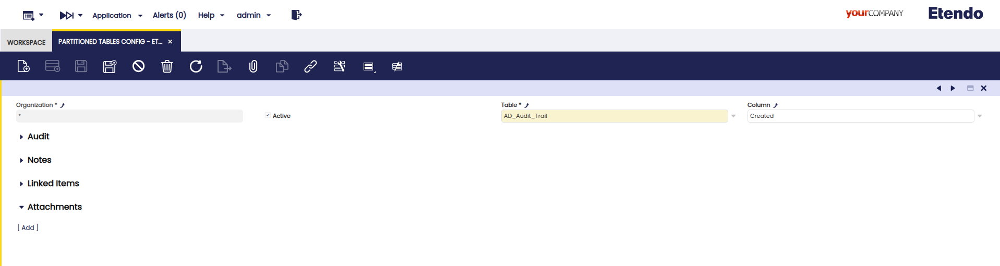

---
tags:
  - Database Management  
  - Database Tools
  - PostgreSQL
  - Table Partitioning
  - Table
---

# Extended Database Utilities (BETA)

:octicons-package-16: Javapackage: `com.etendoerp.db.extended`


!!! warning  "IMPORTANT:THIS IS A BETA VERSION"
    - It is under active development and may contain **unstable or incomplete features**. Use it **at your own risk**, especially in production environments.
    - It should be used with **caution**, and you should always **validate backups** before executing any critical operation.

## Overview

The **Extended Database Utilities** module adds advanced PostgreSQL tools to Etendo for managing **partitioned tables**. Partitioning divides large datasets into smaller segments, improving performance, scalability, and maintainability.

This guide covers requirements, configuration, and usage for partitioning and unpartitioning tables.

### Key Features

- **Partition** and **Unpartition** PostgreSQL tables  
- Manage table structures and metadata  

### Why Partition?

- **Faster queries** by scanning only relevant partitions.  
- **Easier maintenance** through logical data organization.  
- **Scalable growth** without degrading performance.

### Recommendations

- Always create a **full database backup** before changes.  
- Plan a clear **partitioning strategy** based on data usage and critical tables.
- Test thoroughly in **non-production environments** first.   

## Requirements

The following requirements must be met before using the module:
- **Etendo 25** or higher.
- **[Python 3](https://docs.python.org/3.13/)** – latest release of version 3.
- **[PostgreSQL](https://www.postgresql.org/docs/16/index.html)** – version 16 or higher.
- **Etendo DBSM (Database Source Manager)** – version **1.2.0-beta**, configured in the `artifacts.list.COMPILATION.gradle` file into the Etendo environment. 

## Installing the module

1. Clone the module code in the `/modules` folder into the Etendo environment:

    ```bash title="Terminal"
    cd modules
    git clone git@github.com:etendosoftware/com.etendoerp.db.extended.git
    ```

2. Compile the environment.

    ```bash
    ./gradlew update.database smartbuild
    ```

## Setting up the Python Environment

To prepare the Python environment necessary for this module:

1. Create a virtual environment:

    ```bash title="Terminal"
    python3 -m venv modules/com.etendoerp.db.extended/.venv
    ```

2. Activate the virtual environment:

    ```bash title="Terminal"
    source ./modules/com.etendoerp.db.extended/.venv/bin/activate
    ```

3. Install the required Python packages:

    ```bash title="Terminal"
    pip3 install pyyaml psycopg2-binary
    ```

## Partition a Table

Partitioning a table alters its physical structure to improve query performance for very large datasets. This process must be executed cautiously and requires appropriate permissions.

### Partitioned Table Config Window

:material-menu: `Application`> `Partition`> `Partitioned Table Config`



1. Log in as **System Administrator**.
2. Access the **Partitioned Table Config** Window.
3. Define how tables should be partitioned:

    - Create a new configuration record.
    - Select the table you wish to partition.
    - Choose a column for partitioning (**must reference a date**).
    
        !!! Question "Why a date reference?"
            This is because the partitioning script uses the selected column to extract the year from each record and then groups the data into partitions based on that year. Therefore, the column must have a date reference.

    - Save the configuration.


### Apply the Partitioning

1. Stop the **Tomcat server**.
2. Execute the following commands to partition the table(s):

    ```bash title="Terminal"
    python3 modules/com.etendoerp.db.extended/tool/migrate.py
    ./gradlew update.database -Dforce=yes smartbuild
    ```

    - The first command executes the partitioning process based on the configuration set in the data dictionary.
    - The second command updates the database by regenerating the table structures to reflect the partitioning.

        !!! note
            A forced `update.database` is executed here because, after partitioning a table, the database structure changes due to one or more tables being partitioned. This step ensures that the updated structure is correctly applied, including handling of partitioned tables, which the default **DB Source Manager** would not manage properly.


## Unpartition a Table

Before starting development, tables must be **unpartitioned** because the `export.database` task does not support partitioned tables.

The unpartitioning tool restores tables to their original, non-partitioned state, ensuring compatibility with development workflows.

!!! warning
    The `export.database` task cannot be executed on partitioned tables. Always unpartition the required tables before running this task.

### Steps to Unpartition a Table

1. Execute the following command, replacing "table_name1", "table_name2", etc., with the name of the table(s) you want to unpartition.

    !!!info 
        It's possible to unpartition one or multiple tables by listing their names separated by commas (no spaces between names).

    ```bash
    python3 modules/com.etendoerp.db.extended/tool/unpartition.py "table_name1,table_name2,..."
    ```

    **Example:**

    - Unpartition a single table:

        ```bash
        python3 modules/com.etendoerp.db.extended/tool/unpartition.py "c_order"
        ```

    - Unpartition multiple tables:
    
        ```bash
        python3 modules/com.etendoerp.db.extended/tool/unpartition.py "c_order,c_invoice"
        ```

2. Regenerate the Database Structure:

    After unpartitioning, run the following command to update the database metadata:

    ```bash
    ./gradlew update.database -Dforce=yes smartbuild
    ```

    This step restores the database to a consistent and functional state by reflecting the changes made during the unpartitioning process.

!!!warning  "This module is in `BETA` Phase"
    The module behavior may change without notice. Do not use it in production environments without thorough validation.

---
This work is licensed under :material-creative-commons: :fontawesome-brands-creative-commons-by: :fontawesome-brands-creative-commons-sa: [ CC BY-SA 2.5 ES](https://creativecommons.org/licenses/by-sa/2.5/es/){target="_blank"} by [Futit Services S.L.](https://etendo.software){target="_blank"}.