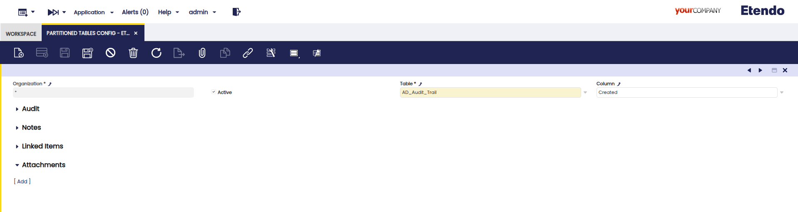

---
tags:
  - Database Management  
  - Database Tools
  - PostgreSQL
  - Table Partitioning
  - Table
  - Semantic Search
  - pgvector
status: beta
---

# Extended Database Utilities (BETA)

:octicons-package-16: Javapackage: `com.etendoerp.db.extended`


!!! example  "IMPORTANT:THIS IS A BETA VERSION"
    - It is under active development and may contain **unstable or incomplete features**. Use it **at your own risk**, especially in production environments.
    - It should be used with **caution**, and you should always **validate backups** before executing any critical operation.

## Overview

The **Extended Database Utilities** module adds advanced PostgreSQL capabilities to Etendo. It covers two independent areas, and each one is optional:

- **Partitioned tables.** Partitioning divides large datasets into smaller segments, improving performance, scalability, and maintainability.
- **Semantic search.** An optional pgvector capability indexes the columns of any table and answers nearest-neighbour queries over their meaning rather than their text.

Neither area affects the other. A tenant that only partitions tables never installs pgvector, and a tenant that only searches never partitions anything.

This guide covers requirements, configuration, and usage for both.

### Why Partition?

- **Faster queries** by scanning only relevant partitions.  
- **Easier maintenance** through logical data organization.  
- **Scalable growth** without degrading performance.

### Recommendations

- Always create a **full database backup** before changes.  
- Plan a clear **partitioning strategy** based on data usage and critical tables.
- Test thoroughly in **non-production environments** first.   

## Requirements

The following requirements must be met before using the module:

- **[Etendo 25](../../../whats-new/release-notes/etendo-classic/release-notes.md)** or higher.
- **[Python 3](https://docs.python.org/3.13/){target="_blank"}** – latest release of version 3.
- **[PostgreSQL](https://www.postgresql.org/docs/16/index.html){target="_blank"}** – version 16 or higher.
- **Etendo DBSM (Database Source Manager)** – version **1.2.0-beta**, configured in the `artifacts.list.COMPILATION.gradle` file into the Etendo environment. 

Semantic search adds two requirements of its own:

- **[pgvector](https://github.com/pgvector/pgvector){target="_blank"}** – version **0.5.0** or higher, available on the PostgreSQL server. Version 0.5.0 is where HNSW indexes arrived, and the module builds them.
- A database role allowed to run `CREATE EXTENSION` and to create a schema, needed only by `update.database` on an instance that configured a search source.

!!!info
    Semantic search also reaches an embeddings API over the network. Review [Semantic search](#semantic-search) before enabling it in an environment with restricted egress or with data residency requirements.

## Installing the module

1. Clone the module code in the `/modules` folder into the Etendo environment:

    ```bash title="Terminal"
    cd modules
    git clone git@github.com:etendosoftware/com.etendoerp.db.extended.git
    ```

2. Compile the environment.

    ```bash
    ./gradlew update.database smartbuild
    ```

## Setting up the Python Environment

To prepare the Python environment necessary for this module:

1. Create a virtual environment:

    ```bash title="Terminal"
    python3 -m venv modules/com.etendoerp.db.extended/.venv
    ```

2. Activate the virtual environment:

    ```bash title="Terminal"
    source ./modules/com.etendoerp.db.extended/.venv/bin/activate
    ```

3. Install the required Python packages:

    ```bash title="Terminal"
    pip3 install pyyaml psycopg2-binary
    ```

## Partition a Table

Partitioning a table alters its physical structure to improve query performance for very large datasets. This process must be executed cautiously and requires appropriate permissions.

### Partitioned Tables config window

:material-menu: `Application Dictionary` > `Partitioning` > `Partitioned Tables config`



1. Log in as **System Administrator**.
2. Access the **Partitioned Tables config** window.
3. Define how tables should be partitioned:

    - Create a new configuration record.
    - Select the table you wish to partition.
    - Choose a column for partitioning (**must reference a date**).
    
        !!! Question "Why a date reference?"
            This is because the partitioning script uses the selected column to extract the year from each record and then groups the data into partitions based on that year. Therefore, the column must have a date reference.

    - Save the configuration.


### Apply the Partitioning

1. Stop the **Tomcat server**.
2. Execute the following commands to partition the table(s):

    ```bash title="Terminal"
    python3 modules/com.etendoerp.db.extended/tool/migrate.py
    ./gradlew update.database -Dforce=yes smartbuild
    ```

    - The first command executes the partitioning process based on the configuration set in the data dictionary.
    - The second command updates the database by regenerating the table structures to reflect the partitioning.

        !!! note
            A forced `update.database` is executed here because, after partitioning a table, the database structure changes due to one or more tables being partitioned. This step ensures that the updated structure is correctly applied, including handling of partitioned tables, which the default **DB Source Manager** would not manage properly.


## Unpartition a Table

Before starting development, tables must be **unpartitioned** because the `export.database` task does not support partitioned tables.

The unpartitioning tool restores tables to their original, non-partitioned state, ensuring compatibility with development workflows.

!!! warning
    The `export.database` task cannot be executed on partitioned tables. Always unpartition the required tables before running this task.

### Steps to Unpartition a Table

1. Execute the following command, replacing "table_name1", "table_name2", etc., with the name of the table(s) you want to unpartition.

    !!!info 
        It's possible to unpartition one or multiple tables by listing their names separated by commas (no spaces between names).

    ```bash
    python3 modules/com.etendoerp.db.extended/tool/unpartition.py "table_name1,table_name2,..."
    ```

    **Example:**

    - Unpartition a single table:

        ```bash
        python3 modules/com.etendoerp.db.extended/tool/unpartition.py "c_order"
        ```

    - Unpartition multiple tables:
    
        ```bash
        python3 modules/com.etendoerp.db.extended/tool/unpartition.py "c_order,c_invoice"
        ```

2. Regenerate the Database Structure:

    After unpartitioning, run the following command to update the database metadata:

    ```bash
    ./gradlew update.database -Dforce=yes smartbuild
    ```

    This step restores the database to a consistent and functional state by reflecting the changes made during the unpartitioning process.

## Semantic search

Semantic search indexes the text of records so a query can find them by meaning. Searching for *late delivery complaint* reaches a record that says *the shipment arrived after the agreed date*, which no keyword search does.

The capability is off until somebody configures a search source. Installing the module, compiling Etendo, or starting the application never installs the PostgreSQL extension and never creates a vector object, and neither does `update.database` on an instance where no source asks for one.

### How a record reaches the index

1. A **search source** names a table and the columns to index.
2. The next `update.database` installs the extension, the storage and the database triggers on that table. From then on, every insert, update, or delete of an indexed column writes an event to a queue.
3. A background process drains the queue, asks an embeddings provider to turn the text into a vector, and stores it.
4. A search embeds the query text the same way and returns the nearest records.

Records that already existed when the source was configured are not in the index: triggers only capture what changes from the moment they exist. A **reindex** walks the table and enqueues them.

### Windows

| Window | Menu | Purpose |
| --- | --- | --- |
| **Embedding Provider** | :material-menu: `Search Indexes` > `Embedding Provider` | The model that turns text into vectors, the endpoint it is reached at, and the reference to its API key. |
| **Search Sources** | :material-menu: `Search Indexes` > `Search Sources` | The table to index, the columns, the search targets, the reindex request, and the events produced. Both actions live here. |
| **Outbox Monitor** | :material-menu: `Search Indexes` > `Outbox Monitor` | Every indexing event of every source, for when a problem spans more than one. |

### Actions

Both actions are buttons in the **Search Sources** window and take several records at a time.

- **Check Indexing Readiness** reports whether each selected source is ready to be indexed, and what is stopping the ones that are not. It changes nothing: a configuration mistake surfaces here, before the update runs, instead of as a queue full of failures afterwards.
- **Request Reindex** asks for the records a source already held to be indexed. The walk itself is performed by the background process in bounded chunks.

!!!info "Configuring a source takes two steps"
    Save the source, then run `update.database`. Everything a source needs is a database object, and creating database objects while the application runs makes the next `update.database` refuse to start, reporting local changes. Creating them during the update avoids that.

### Background processes

Schedule these at System level, once for the whole instance, through `Process Request`.

| Process | Purpose |
| --- | --- |
| **Process Vector Outbox** | Drains the queue: recovers events left behind by an interrupted run, embeds and stores the pending ones, and purges events that finished more than thirty days ago. |
| **Process Vector Reindex** | Walks the table of a requested reindex, in chunks, from where it last stopped. |
| **Requeue Failed Vector Events** | Puts failed events back in the queue once the cause of the failure is fixed. |

### What leaves the tenant

The text of the indexed columns is sent to the configured embeddings endpoint on every indexing event. The endpoint is configurable, so the traffic can be directed to the Etendo LLM proxy, to an Azure OpenAI deployment, or to a gateway inside the network instead of to a public API.

!!!warning
    Review which columns a source indexes before activating it. Every value in an indexed column of every affected record reaches the endpoint.

[:material-file-document-outline: How to Configure Semantic Search](../how-to-guides/how-to-configure-semantic-search-with-etendo-database-extended.md){ .md-button .md-button--primary }

!!!warning  "This module is in `BETA` Phase"
    The module behavior may change without notice. Do not use it in production environments without thorough validation.

---
This work is licensed under :material-creative-commons: :fontawesome-brands-creative-commons-by: :fontawesome-brands-creative-commons-sa: [ CC BY-SA 2.5 ES](https://creativecommons.org/licenses/by-sa/2.5/es/){target="_blank"} by [Futit Services S.L.](https://etendo.software){target="_blank"}.