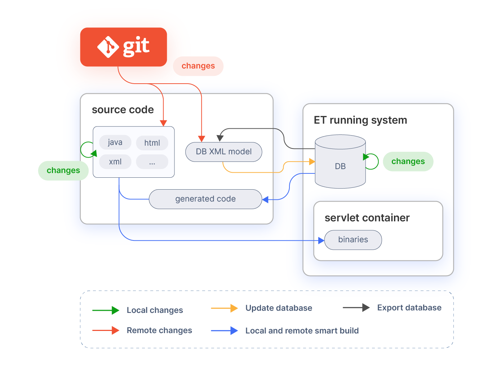

## Overview

This article explains how to use Gradle, an open-source build automation tool that is designed to be flexible enough to build almost any type of software. 

!!! note
    For additional information read: [What is gradle?](https://docs.gradle.org/7.3/userguide/what_is_gradle.html){target="_blank"}.


Etendo uses Gradle to define and improve compilation, version management, modules publication, migrations and more tasks.


## How to use Gradle

Etendo project includes an embedded wrapper from Gradle called `gradlew`. Run the following  command in the Etendo project directory, and it will execute the mentioned task.

```bash title="Terminal"
 ./gradlew <task>
```
 

You can use `-P<Parameter Name>` to pass parameters in a task. For example:

```bash title="Terminal"
./gradlew publishVersion -Ppkg=test.package
```

## Common Gradle flags

| Flag                     | Description                                          |
| ------------------------ | ---------------------------------------------------- |
| `--offline`              | To execute Gradle without internet connection.       |
| `--stop`                 | To stop all Gradle daemons.                          |
| `--no-daemon`            | To execute a Gradle task without launching a daemon. |
| `--info`                 | To give more information in the task execution.      |
| `--refresh-dependencies` | Will force download of dependencies.                 |


## Etendo Plugin

Add in the `build.gradle` file the plugin version available in [Gradle Plugin Release Notes](../../../whats-new/release-notes/etendo-classic/plugins/etendo-gradle-plugin/release-notes.md).

```groovy title="build.gradle"
plugins {
    id 'com.etendoerp.gradleplugin' version '<version>'
}
```
### Plugin Configuration

The plugin configuration needs to be declared in the `build.gradle` file in *etendo block*. <br>
In the following sections, you can find all the flags or variables available to set up and a brief description of each one.

```groovy title="build.gradle"
etendo {
  /**
  * Flags used to indicate if the 'default' core dependencies (jar files) should be
  * loaded (This is the case when you are working with sources and the 'default' jar files are missing)
  * This flags should be false.
  */
  boolean loadCompilationDependencies = false
  boolean loadTestDependencies = false

  /**
  * Flag used to ignore loading the source modules to perform resolution conflicts.
  * Default true
  */
  boolean ignoreSourceModulesResolution = true

  /**
  * Flag used to perform or not the resolution of conflicts.
  * Default true
  */
  boolean performResolutionConflicts = true

  /**
  * Flag used to ignore throwing a error if there is conflict resolutions with the Core dependency.
  * Default false
  */
  boolean forceResolution = false

  /**
  * Flag used to apply the subproject dependencies to the main project.
  * Default true
  */
  boolean applyDependenciesToMainProject = true

  /**
  * Flag used to prevent overwriting the transitive source modules when performing the expandModules task.
  * Default true
  */
  boolean overwriteTransitiveExpandModules = true

  /**
  * Flag used to exclude the Core dependency from each subproject to all the configurations.
  * Default true
  */
  boolean excludeCoreDependencyFromSubprojectConfigurations = true

  /**
  *  Flag used to indicate that the current Core version support jars.
  *  Default true.
  * 	When this flag is set to false, the behavior of the 'expandModules' task will change, forcing to expand all the declared modules with 'moduleDeps' to sources.
  */
  boolean supportJars = true

  /**
  * List of Etendo artifacts to always extract and ignore from the version consistency verification.
  */
  List<String> ignoredArtifacts = []

  /**
  * Flag use to prevent throwing error on version inconsistency between modules.
  * Default false
  */
  boolean ignoreConsistencyVerification = false

  /**
  * Flag used to prevent throwing error when an artifact could not be resolved.
  * This includes transitives ones.
  * Default false
  */
  boolean ignoreUnresolvedArtifacts = false

  /**
  * The list of modules that should not be re expanded.
  * Default empty.
  */
  List<String> sourceModulesInDevelopment = []

  /**
  * Flag used to ignore the Etendo CORE jar dependency located in the
  * build.gradle of the root project.
  * Default false.
  */
  boolean ignoreCoreJarDependency = false
}

```

## Main Build Tasks

This section explains the main build tasks following the steps as illustrated in the image.



In most of the cases, it is only necessary to use 3 tasks (`install` , `smartbuild` and `export.database`). There are a number of other tasks that can be used but they are not required for the standard process. 

!!!info
    For more information, see [Detailed Build Tasks](#detailed-build-tasks) section.

The main task for the standard process is `smartbuild` which performs all the required processes as explained below. This task accepts an optional property:

  * `local` for local or remote developments which by default is set to **yes** . 

The difference between `local` and `remote` development is illustrated in the diagram. Local development are changes by the developer him/herself. Remote developments are changes done by other developers. Changes by remote developments are pulled from the source code revision system.

!!!info
    `remote` means that the user is bringing changes to the workspace from an external location, e.g. with a `git pull` or `./gradlew expandModules`.
    
### Initial installation

After downloading the Etendo ERP source files. It is necessary to install and deploy it. Check our guide about [Etendo Install](../../../getting-started/installation.md#install-etendo)

### Database export

In most cases developments include modifications on the database. These modifications can be persisted in `xml` files using the **DBSourceManager** tool. **DBSourceManager** exports to `xml` files only the modules (including core) that are set as `In Development`. To export the database execute:

``` bash title="Terminal"
./gradlew export.database
```

After this step, the changed model `xml` files can be pushed/committed to the source code revision system, so that other developers can pick them up and continue working on top of it.

When a module is exported using the `export.database` task, it is first validated to check for common errors. If the validation fails then the `export.database` task will also fail and export is not possible.

The following checks are currently done:

  * A table defined in the Application Dictionary should be present in the database and vice versa. 
  * Column definitions in the database and the Application Dictionary are compared, any mismatch is reported. The column datatype, default value and length are checked. 
  * Tables should have a primary key. 
  * Foreign key fields should be part of a foreign key constraint. 
  * Names of tables, columns and constraints are checked for their length (Oracle and PostgreSQL has a 30 character limit there). 

### Update database

**Database model** changes are distributed by committing the database schema as `xml` to `SCM`. Other developers pull the changes from `SCM` and can apply them to update their own database. After updating the database the process is exactly the same as the local one, that is compile and deploy the elements that have been modified since last build.

``` bash title="Terminal"
./gradlew update.database
./gradlew smartbuild
```

All the required actions (update database, compile last modifications and deploy them) can be done with only the `smartbuild` command:

``` bash title="Terminal"
./gradlew smartbuild -Dlocal=no -Dforce=yes
```

The only difference with the local development is in the `local` parameter which makes the process to update the database in case the `xml` files were changed.

## Detailed Build Tasks

This section contains a detailed listing of all available build tasks.

### Libraries build tasks

|  Task      |  Description  |  Notes  |
|------------|---------------|---------|
|  `core.lib`  |  Compiles and generates a `.jar` file from the `src-core` project. Which is needed by `wad.lib` and the rest of build tasks.  |  **Required by**: wad.lib  |
|  `wad.lib`   |  Compiles and generates a `.jar` file from the `src-wad` project. Which is needed by the build tasks. This project contains the WAD, the automatic window generator.  |  **Requires**: `core.lib`, database created **Required by**: compile.*  |
|  `trl.lib`   |  Compiles and generates a `.jar` file from the `src-trl` project. Which is needed by the translate task. This project allows to translate to different languages manual windows.  | **Requires**: core.lib  |
  
### Build tasks

|  Task                 |  Description   |  Notes  |
|-----------------------|----------------|---------|
|  `install`            |  Installs the whole application: creates the database, compiles it and generates a war file to be deployed or copies the classes to Tomcat's directory (depending on the `deploy.mode` property set in Openbravo.properties).  |  **Calls**: `create.database`, `core.lib`, `wad.lib`, `trl.lib`, `compile.complete.deploy`, `applyModule`.
|  `smartbuild`         |  Makes an incremental build of the application. Including: <br> `update.database` <br> compile <br> deploy <br> All these tasks are done only if needed.  |  **Requires**: Database must be created and populated with data **Properties**: <br> `local`: (`yes/no` default as `yes`) when this property is set to no `update.database` task is executed, otherwise it is not executed. <br> `tr`: (`yes/no` default as `yes`) if set to no, translation process is not executed. <br> `force`: (`yes/no` default as `no`) used with `local=no`. If set to yes it will overwrite the changes in the database with the XML information. Note: All un-exported changes will be lost.
|  `compile.complete`  |  Compiles all modified classes (including the generated ones) but before removes all the generated and built files, so the whole application is built  |  **Requires**: `wad.lib`, `trl.lib`, database created and populated. **Calls**: translate <br> **Properties**: <br> **tab**: specifies the window name(s) to be generated, to specify more than one window add them as a list of comma separated values. Note that even window is specified by this property, its 2.50 code will not be generated unless it is required or forced. <br>  **tr**: if set to "no" it will not call the translation process. <br>  **module**: a list of comma separated javapackages of modules to generate just the windows containing objects for those modules. <br>
|  `generate.entities`  |  Generates the Java files for `src-gen` directory, and compiles them. They are used by DAL to access to the database information.  |   **Requires**: Database must be created and populated with data.
|  `translate`          |  Checks in the manual windows User Interface files the translateable elements that have not been yet registered and registers them, this is necessary to be able to translate those interfaces to different languages.  |  **Requires**: `trl.lib` **Called by:** This task is called by the compile.* tasks in case the tr property is not set to "no". 
|  `antWar`                |  Generates a war file from the existing built code. In fact it only zips the application in a single war file.  |  **Requires:** compile.*: the application must be built before calling this task.
|  `deploy.context`     |  Deploy the existing war file in the tomcat context using the tomcat manager.  |  **Requires:** <br> war file must be created <br> Tomcat manager must be running <br> These properties must be properly set in the `Openbravo.properties` file: <br> `tomcat.manager. url` <br> `tomcat.manager.username` <br> `tomcat.manager.password` 

### Database tasks

|  Task               |  Description  |  Notes  |  Sub Tasks  |
|---------------------|---------------|---------|-------------|
|  `create.database`  |  Creates the database from the `xml` files, note that the database is first removed. If the `apply.on.create` property is set, masterdata and sampledata will be inserted in the database. If not, only sourcedata will be inserted.  |  **Properties:** <br> `apply.on.create`: If is set to **true** and there are modules they will be applied, otherwise they will be set as **In process** status.  |  `create.database.script`: The same as `create.database.structure` but does not affect the database it only generates the `sql script` file with all the statements that would be executed by the other tasks. 
|  `update.database`  |  Synchronizes database with the current database xml files. By default it checks that no changes in application dictionary in database are done, if so the process stops.  |  **Properties:**  <br>  `force`: (`yes/no` default as `no`) Do not check for database modification and update directly. This can cause loss of database data.  |   `update.database.script`: It is the same as `update.database.structure` but does not modify the database. It only generates a `sql` script file with the statements that would be executed by the other tasks.
|  `export.database`  |  Synchronizes xml files with the database current contents. By default they are only exported in case there are modifications in the database. In addition performs database validations for the modules which are exported.  |  **Properties:** <br> `force`: (`yes/no` default as `no`) Forces the export skipping the check of which files had been modified since last `update.database`. <br> `validate.model`: (`yes/no` default as `yes`) Checks the model that is being exported fulfills a series of rules related to modularity, `oracle-postgreSQL` compatibility, etc. In case any of these rules is not complied, export will not be done and an error message will be raised.

!!!info

    ` update.database ` and ` export.database ` tasks support multi-thread parallel execution for some of their actions such as index creation or function standardization. By default, the number of threads used is calculated as the half of the available number of cores in the machine where the task is executed. This value can be set by adding the `-Dmax.threads=numOfThreads` parameter. 

### Test Tasks

|  Task     |  Description  |  
|-----------|---------------|
|  `test`  |  By default, all Etendo tests are run. You can use the `--tests "<package>"` to specify which tests you want to run.

!!!info
    For more information about execution test in Gradle visit [Test Filtering in Gradle](https://docs.gradle.org/current/userguide/java_testing.html#test_filtering)

### Other Tasks

|  Task                   |  Description  |
|-------------------------|---------------|
|  `migrate.attachments`  |  Migrates the attachments to the new attachment model.


## Common Gradle Tasks

!!!danger
    Since Etendo Classic 25Q1, all Gradle tasks require Java 17 or higher. To add support for previous versions, the new flag `java.version` has been added.

    ``` bash title="Terminal"
    ./gradlew <task> -Pjava.version=11
    ```

    This new flag forces the use of Java 11.

- Creates the properties and configuration files.
  
    ``` bash title="Terminal"
    ./gradlew setup 
    
    ```
  
    | Command line parameters    | Description                                              |                       
    | -------------------------- | -------------------------------------------------------- |
    | `-PforceDefaultProps=true` | Recreates the default properties file from the template. |
    | `-PforceBackupProps=true`  | Recreates the backup.properties file from the template.  |
    | `-PforceQuartzProps=true`  | Recreates the quartz.properties file from the template.  |

- Creates the properties files from the templates in `/config` folder. The *setup* tasks depend on this task.
    ``` bash title="Terminal"
    ./gradlew prepareConfig
      
    ```

- Creates the database and installs reference data. 
    ``` bash title="Terminal"
    ./gradlew install
        
    ```

-  Compiles the Java classes that were modified and deploys them to Tomcat.

    ``` bash title="Terminal"
    ./gradlew smartbuild
        
    ``` 
    
    | Command line parameter    | Description                                                                                                               |          
    |  ------------------------ | ------------------------------------------------------------------------------------------------------------------------- |
    | `PignoreConsistency=true` | Flag used to ignore the consistency verification (verifies the versions between the local modules and the installed ones) |
    

- Deletes all the Java Classes and recompiles them. 
    ``` bash title="Terminal"
    ./gradlew compile.complete
          
    ``` 
       
- Updates the database applying the changes in XML files.
    ``` bash title="Terminal"
    ./gradlew update.database
            
    ``` 

- Exports the database changes to XML files
    ``` bash title="Terminal"
    ./gradlew export.database
              
    ``` 
      
- Exports the module Application Dictionary data.
    ``` bash title="Terminal"
    ./gradlew export.database
                  
    ``` 

- Exports the configuration script. 
    ``` bash title="Terminal"
    ./gradlew export.config.script 
                  
    ``` 
   

- Task to download core dependency.
    ``` bash title="Terminal"
    ./gradlew expandCore
                      
    ``` 
      

    | Command line parameter    | Description                                                        |                       
    |  -------------------       | ------------------------------------                               |
    | `-PforceExpand=<true>`     | Flag used to force the sources expansion when the core is in JAR.  |


- Task to download the modules dependencies in sources.
    ``` bash title="Terminal"
    ./gradlew expandModules
                      
    ``` 


    | Command line parameter     | Description                                                                                                                           |  
    |  -------------------       | ------------------------------------                                                                                                  |
    | `-Ppkg=<package name>`     | The name of the module to be *re expanded* in case that it is already in sources. This will *OVERWRITE* all the changes in the module.|

- Task to delete directories created by the expandCore task.
    ``` bash title="Terminal"
    ./gradlew cleanExpandCore
    ```

### Modules

- Creates the `build.gradle` file with all the necessary information to publish.
    ``` bash title="Terminal"
    ./gradlew createModuleBuild
                      
    ```  

    | Command line parameters    | Description                 |                       
    | -------------------------- | --------------------------- |
    | `-Ppkg=<package name>`     | The name of the module.     |
    | `-Prepo=<repository name>` | The name of the repository. |


- Publish the module to a custom repository.
    
    ``` bash title="Terminal"
    ./gradlew publishVersion
                            
    ``` 

    | Command Line Parameters | Description                                                                                                        | 
    | :---------------------- | :----------------------------------------------------------------------------------------------------------------- |
    | `-Ppkg=<packagename>`   | **Required** The name of the module.                                                                               |
    | `-PupdateLeaf=true   `  | This updates automatically the version of the project being published. By default `false`.                         |


### Uninstall Modules

=== ":octicons-package-16: Source Modules"

    To uninstall an Etendo module you need to run the gradle task.

    ``` bash title="Terminal"
    ./gradlew uninstallModule -Ppkg=<modulename>
    ```

    This task will try to delete the source module and the source dependencies which depends on it.

    If the module to uninstall is a dependency of other source module, an exception is thrown. You can force the uninstall providing the flag `-Pforce=true`.


=== ":material-language-java: Jar Modules"

    You can make use of Gradle exclusion rules to prevent the extraction of a JAR dependency.
    In the `build.gradle` of the root project you can specify the dependency to exclude.

    ``` groovy title="build.gradle"
    configurations.implementation {
      exclude group: 'com.test', module: 'custommodule1'
      exclude group: 'com.test', module: 'custommodule2'
    }
    ```

    If the dependency belongs to a `build.gradle` of a source module, it may be downloaded when the `javaCompile` task is executed. You can also make use of gradle exclude rules.

    !!! warning
        When you make use of exclude rules in a custom source module, the `pom.xml` can be affected when you publish a new version.

    To prevent downloading dynamic JAR modules, you need to remove the dependency from each `build.gradle`.

    The JAR module could also be a transitive dependency.
    You can see the transitive dependencies tree running the gradle task
    `./gradlew dependencies --info`
    and remove the root parent dependency.

    When you declare a dependency you can also exclude custom modules. See [Gradle dependency exclusion](https://docs.gradle.org/current/userguide/dependency_downgrade_and_exclude.html#sec:excluding-transitive-deps){target="_blank"}.

    !!! info
        Etendo JAR modules are dynamically extracted in the root project `build/etendo/modules` directory.

    !!! warning
        Each `build.gradle` file (from the root project or source modules) can be using the dependency directly or by transitivity and this can lead to resolution of the module.

    Finally you need to rebuild the system:

    ``` bash title="Terminal"
    ./gradlew update.database compile.complete
    ```

### Internal Developer Tasks

- Used to clone all the git submodules of a module extension (bundle). The module `build.gradle` should contain the property
      ``` bash title="Terminal"
      ./gradlew cloneDependencies
                                    
      ```
    

      ```groovy  title="build.gradle"
      ext.defaultExtensionModules = [
          'git@github.com:example1.git',
          'git@github.com:example2.git'
        ]
      ```


      | Command line parameter | Description                          |                       
      |  --------------------- | ------------------------------------ |
      | `-Ppkg=<package name>` | **Required** The name of the bundle  |


- Creates all the `build.gradle` files for each module using the database from `AD_MODULE.xml`.
    ``` bash title="Terminal"
    ./gradlew createModuleBuild
                                          
    ```

    | Command line parameter           | Description                             |                       
    | -------------------------------- | --------------------------------------- |
    | `-Ppkg=<package name>`           | **Required** The name of the module     |
    | `-Prepo=<repository name>`       | **Required** The name of the repository |
    | `-Pbundle=<bundle package name>` | The name of the bundle                  |
    | `-Ppkg=all`                      | Creates all the `build.gradle` files for each module, each `build.gradle` file will contain the dependencies between projects (in the dependencies block). |
  
      

- Parameters to override the default core group, name and version.

    | Command line parameters        | Description         |                       
    |  -------------------           | ------------------- |
    | `-PcoreGroup=<core group>`     | The core group name |
    | `-PcoreName=<core name>`       | The core name       |
    | `-PcoreVersion=<core version>` | The core version    |


     
- Parameters to override the default repository. Publish all the modules of a bundle in the source modules directory.
    ``` bash title="Terminal"
    ./gradlew publishAll
                                              
    ```

    | Command line parameters          | Description                                                                                                                  |
    |  ------------------------------- | ---------------------------------------------------------------------------------------------------------------------------- |
    | `-Ppkg=<bundle package name>`    | **Required** The package of the bundle                                                                                       |
    | `-PupdateLeaf=true`              | This updates automatically the version of all the project being published. By default `false`.                               |
    | `-Pupdate=<major, minor, patch>` | Used to specify which part of the version will be updated. By default `patch`.                                               |
    | `-PpushAndTag=true`              | Used to specify if the modules published should push the changes and create a tag in the git repository. By default `false`. |
    | `-PpushAll=true`                 | Used to specify if all the modules should run the push and tag. By default `false`.                                          |
        

- Task used to push and tag the modules' changes.
    ``` bash title="Terminal"
    ./gradlew pushToGit
                                                          
    ```

    | Command line parameters | Description                                                                         |
    | ----------------------- | ----------------------------------------------------------------------------------- |
    | `-PpushAll=true`        | Used to specify if all the modules should run the push and tag. By default `false`. |
        
 

- Updates the version of a dependency in each `build.gradle` submodule.
    ``` bash title="Terminal"
    ./gradlew updateModuleBuildDependency
                                                              
    ```

    !!! warning
        If you put a wrong version, you have to revert the changes manually.


    | Command line parameters                 | Description                                                                                                                        |
    |  -------------------                    | ---------------------------------------------------------------------------------------------------------------------------------- |
    | `-Pdependency=<dependency name>`        | The name of the module to update in each `build.gradle`. Default `com.etendoerp.platform.etendo-core`                              |
    | `-PlowerBound=<version>`                | The lower version bound. Example: `-PlowerBound=1.0.3`                                                                             |
    | `-PlowerBoundInclusive=<true or false>` | By default `false`.                                                                                                                |
    | `-PupperBound=<version>`                | The upper version bound. Example: `-PupperBound=1.0.3`                                                                             |
    | `-PupperBoundInclusive=<true or false>` | By default `false`.                                                                                                                |
    | `-PexactVersion=<version>`              | Will replace the current version with the specified one. The version should be between quotes. Example: `-PexactVersion="[1.0.3]"` |


### Ant Tasks

Most of [ant build tasks](#detailed-build-tasks) previously used can be run with Gradle:

```bash title="Terminal"
./gradlew <ant task> [params]
```

Except for some commands:

| Old Command      | New Command   | 
| ---------------- | ------------- | 
| `clean`          | `antClean`    |
| `setup`          | `antSetup`    |
| `init`           | `antInit`     |
| `install.source` | `antInstall`  |
| `war`            | `antWar`      |


## Conflict Resolution

!!!note
    Etendo makes use of the [Conflict Resolution Strategy](https://docs.gradle.org/current/userguide/dependency_resolution.html){target="_blank"} offered by Gradle.

This approach is used to identify conflict between Etendo artifacts published in a repository.

For example, when you make use of an Etendo module, which depends on the Etendo core

```groovy title="build.gradle"
group          = 'com.etendoerp'
ext.artifact   = "moduleCextract"
version        = '1.0.1'
dependencies {
    // Etendo CORE dependency
    implementation 'com.etendoerp.platform:etendo-core:[22.1.1, 22.1.2]'
}
```

and you are currently working with the Etendo core in `22.1.0`, then a conflict resolution is found.

Depending on the type of conflict, if the problem is with the Etendo Core, then a Exception will be thrown.


!!!danger "To force the dependencies' resolution must be the last step to follow"
    You can force the resolution using the extension flag
    ``` groovy
    etendo {
      forceResolution = true
    }
    ```

    If you want to skip the resolution you can add to the plugin extension the flag.
    ``` groovy
    etendo {
      performResolutionConflicts = false
    }
    ```


## Version Consistency

The version consistency approach verifies that an extracted Etendo JAR artifact is consistent with the installed one (Equal version).

When a new Etendo JAR dependency is added or the version is updated, an `update.database` needs to be run before executing any compilation task (smartbuild, compile.complete, etc).
You can force the compilation tasks by adding to the Etendo plugin extension the ignore flag

!!!warning "This section explains how to ignore the consistency verification. Use this approach only if there are no conflicts between versions."
    ``` groovy
    etendo {
      ignoreConsistencyVerification = true 
    }
    ```
    or run the tasks with the `-PignoreConsistency=true` flag.

    By default Etendo does not allow you to add a JAR dependency with an old version to the current installed one.
    You can ignore this behavior adding the module name to be updated with an old version as a configuration.
    ``` groovy
    etendo {
      ignoredArtifacts = ['com.etendoerp.mymodulename']
    }
    ```

## Recompile CSS files

**Requirements**

  - *Node.js*: Version 16 or higher.
  - *npm*: Node Package Manager.
  - *Sass*: Must have a Sass compiler installed.


??? info "How to install Node.js, npm and Sass"

    === ":simple-linux: Linux"
        
        **Node.js 16.10.0 using NVM:**
        
        1. Install NVM (Node Version Manager):
        ```bash
        curl -o- https://raw.githubusercontent.com/nvm-sh/nvm/v0.39.0/install.sh | bash
        ```
        Close and reopen your terminal to start using NVM, or execute the following commands:
        ```bash
        export NVM_DIR="$HOME/.nvm"
        [ -s "$NVM_DIR/nvm.sh" ] && \. "$NVM_DIR/nvm.sh"
        [ -s "$NVM_DIR/bash_completion" ] && \. "$NVM_DIR/bash_completion"
        ```
        
        2. Install Node.js version 16.10.0:
        ```bash
        nvm install 16.10.0
        ```

            **Note:** If you encounter errors during the installation of Node.js with the `nvm install 16.10.0` command, it might be because `curl` isn't installed or is misconfigured on your system. In such cases, you can try running the following commands:

            ```bash
            sudo snap remove curl
            sudo apt install curl
            ```

            After successfully configuring `curl` using this method, return to this guide and execute the steps above to install NVM and set up Node.js.
        
        3. Set Node.js version 16.10.0 as the default version:
        ```bash
        nvm use 16.10.0
        nvm alias default 16.10.0
        ```
        
        4. Verify the installation:
        ```bash
        node -v
        npm -v
        ```


    === ":simple-macos: Mac OS"

        **Homebrew Installation:**

        - Install Homebrew by running the following command in the terminal:

        ```bash
        /bin/bash -c "$(curl -fsSL https://raw.githubusercontent.com/Homebrew/install/HEAD/install.sh)"
        ```

        - Once Homebrew is installed, verify it by checking its version:

        ```bash
        brew --version
        ```

        **Node.js & npm Installation using Homebrew:**
            
        1. Update Homebrew (ensuring you have the latest package definitions):
        ```bash
        brew update
        ```

        2. Install Node.js and npm:
        ```bash
        brew install node
        ```

        3. Verify the installation of Node.js and npm:
        ```bash
        node -v
        npm -v
        ```


    === ":material-microsoft-windows: Windows"
        
        **Node.js & npm:**
        
        1. Download the Node.js Windows Installer from the [official website](https://nodejs.org/){target="_blank"}.
        
        2. Run the installer and follow the instructions.
        
        3. After installation, open a command prompt or PowerShell and verify the installation:
        ```powershell
        node -v
        npm -v
        ```

    **Installing npm (Node Package Manager)**

    If you don't have npm installed on your system, follow these steps:

    - Install npm globally using the following command:

    ```bash
    npm install -g npm
    ```

    - Confirm the installation by checking the versions of node and npm:

    ```bash
    node -v
    npm -v
    ```

    **Installing Sass (Syntactically Awesome Style Sheets)**
    
    If you have npm installed and need the Sass compiler, follow these instructions:

    - Use npm to install Sass globally on your system:

    ```bash
    npm install -g sass
    ```

    - Confirm the Sass installation by running:

    ```bash
    sass --version
    ```

    Seeing the Sass version number means that Sass has been installed correctly.

**Execution**

The `cssCompile` task in the Etendo Gradle configuration is specifically designed to convert `.scss` files into `.css` files. To customize the Etendo skin, you will need to work with `.scss` files. 

``` bash title="Terminal"
./gradlew cssCompile smartbuild
```


After executing the task, look for the following output to indicate a successful build:
!!! success "Successful Execution"
    After executing the task, the following output indicates a successful build:

    ```
    > Task :cssCompile
    > BUILD SUCCESSFUL
    ```

    This confirms the successful processing of the files.

Finally, restart Tomcat to apply the changes and ensure the updated `.css` files are properly deployed.

## Delete Client Process

The `delete.client` task allows running the Delete Client Process directly from gradlew. This task also allows running this process with the Tomcat service down to avoid database locks.

``` bash title="Terminal"
./gradlew delete.client

```

| Command line parameters                   | Description                                                                                               |
|  -------------------                      | ------------------------------------                                                                      |
| `-DclientId=<AD_Client_ID>`               | `AD_Client_ID` of `AD_Client` table to be used on this process to delete all information of this client.  |

!!!danger "Danger Process"
    This task executes the same legacy process that you can run in the application like as System Administrator role. It is a very sensitive task you must be very careful because this can lead to crashes in the system if used incorrectly.
    <br>**A backup previous to executing the task is recommended.**


---
This work is licensed under :material-creative-commons: :fontawesome-brands-creative-commons-by: :fontawesome-brands-creative-commons-sa: [ CC BY-SA 2.5 ES](https://creativecommons.org/licenses/by-sa/2.5/es/){target="_blank"} by [Futit Services S.L.](https://etendo.software){target="_blank"}.
