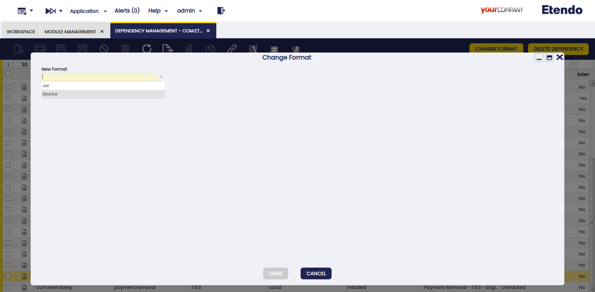
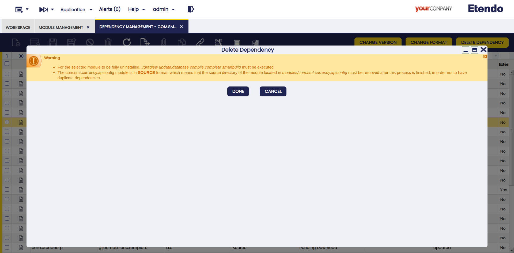
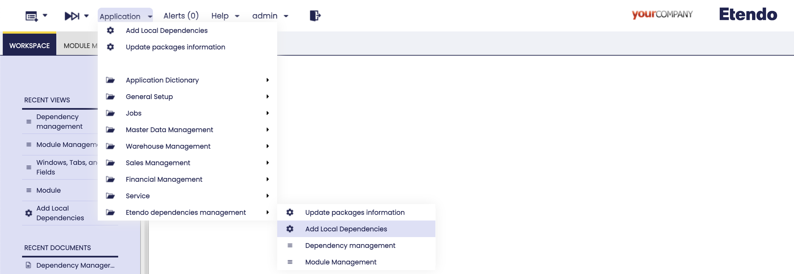

---
tags:
  - Beta
  - Etendo Classic
  - Install
  - Modules Instalation
  - Dependency Manager
---

# Dependency Manager

:octicons-package-16: Javapackage: `com.etendoerp.dependencymanager`

## Overview

With this module, the user can access from the Etendo Classic interface all Etendo packages published in Etendo Software repositories. 

In addition, from the Module Management window you can query packages, available versions, dependencies and install new packages. 

Then, from the Dependency Management window you can update, remove and change the format of already installed modules. 

## Installation 

To install this package that will allow you to manage other packages directly from the Etendo Classic interface you must add in the `build.gradle` file the following dependency:


``` groovy title="gradle.properties"
dependencies {
// Add your dependency here
    implementation('com.etendoerp:dependencymanager:1.1.0')
}
```
Then, to install the module run the command gradle : 

``` bash title="Terminal"
./gradlew update.database smartbuild
```

!!! info 
    For more information visit [Install Modules](./install-modules-in-etendo.md#2-search-for-dependencies) guide. 

## Module Management
:material-menu: `Application` > `Etendo Dependencies Management` > `Module Management`

Logged as System Administrator role, in the `Module Management` window, the user can see all the modules to be added and select the corresponding version in the **versions** tab. Once one of the versions is selected, the dependencies of such version can be found in the **dependencies** subtab.


!!!info
    The fields in this window are read-only.

Fields to note:

- **Active**: Checkbox to select if this module is active or not.
- **Group**: the identifier of the artifact.
- **Artifact**: the unit of deployment fetched and used.
- **Installed Version**: the version of the module if it is installed.
- **Is bundle**: Field to filter if this module is a bundle or not.

This window presents two buttons that can be used: **Add dependency** and **Update Packages**.

### Add Dependency 

This button allows you to add the dependencies associated with a specific version of the selected module. When clicked, a pop-up window will display all the dependencies and modules that will be installed.

- **If a package bundle is selected**: you will have the option to add all the modules within the bundle or select only the ones you need. Below, a new read-only grid will appear, showing the dependencies of the selected modules. This grid is for informational purposes, allowing you to see which dependencies will be added.

- **If a non-bundle package is selected**: the grid will be read-only, displaying only the necessary dependencies for the module to work correctly. If no dependencies are displayed, it means that the module has no additional dependencies.
!!!note
    A warning notification is shown to inform the user about versions compatibility before installing the dependencies shown.


Once the process is done, the **Dependency Management** window is opened and all the installed dependencies are shown.

#### Dependency Version Handling Rules

1. **If the dependency version is greater than the installed version:**:

    - No installed module and no record in `Dependency Management`window: New dependency record added. 
    - No installed module but record exists in `Dependency Management`window: Update the existing record version.
    - Installed module and the dependency record exists in `Dependency Management`window: Update the existing record version.
    - Installed module but no dependency record exists in `Dependency Management`window: The local dependency is deleted, and a new record is added in `Dependency Management`. 

    

2. **If the dependency version is less than the installed version:**

    - Display error and disable the process, preventing installation of an older version to avoid compatibility issues. This approach ensures that dependencies are handled properly, maintaining compatibility and minimizing the risk of functionality loss. In case you need to install the dependency version anyway, you must downgrade the version from the `Dependency Management` window with the [change version](#change-version) button.  

### Update Packages

This button is used to execute the Update Packages process which updates the list of available packages with the latest information.

## Dependency Management
:material-menu: `Application` > `Etendo Dependencies Management` > `Dependency Management`

Logged as System Administrator role, in the `Dependency Management` window, the user can find all the dependencies installed in the previous step.


Fields to note:

- **Active**: Checkbox to select if this dependency is active or not
- **Group**: The identifier of the artifact.
- **Artifact**: The unit of deployment fetched and used.
- **Version**: Version of the module
- **Format**: Describes the dependency format. They can be `Source`, `JAR` or `local`.
    - `Source`: In this case, the source code is available, to download the dependencies the user must excecute the `./gradlew expandModules` Gradle task and then compilation is required.
    - `JAR`: In this case, a standard format for java packages distribution, these include the compiled Java classes, and the dependencies resolution is dynamic.
    - `Local`: The local format implies that the module is installed but it is not declared as a repository dependency. 
- **Installation Status**: It describes the dependency current status.
    - Pending download: This is the status by default when a new dependency is added or updated.  To be installed, it is necessary to compile the environment and, in such case, the dependency is in `source` format. 
    - Installed: Used once the dependency is already installed.
- **Version Status**: It describes the dependency version status.
    - Untracked: Only for external dependencies.
    - Update Available: In case there are new available versions.
    - Updated: The latest available version is installed.
- **External Dependency** (Only available for `JAR` dependencies): Checkbox that identify an external library or module required by the project, managed by Gradle. These dependencies are retrieved from remote repositories during the build process.

This window presents to buttons that can be used: **Change Version** and **Change Format**.

### Change Version 


This button is used to update or downgrade versions. 

When the version of a module is modified, its related dependencies could be modified as well. In this case, it is possible to add new, update or delete versions. 

!!!note
    A warning notification is shown to inform the user about versions compatibility before executing the process.

### Change Format 



This button is used to change the format of the module.  This process needs to be executed when it is necessary to migrate from a local format to a gradle dependency, while keeping the modules updated.  The options are `source`, `JAR` or `local`.

- In case the module is originally in `local` format, the options in the **Change format** popup window are `JAR` or `source`.

- In case the module is originally in `source` format, the only option in the **Change format** popup window is `JAR`.

- In case the module is originally in `JAR` format, the only option in the **Change format** popup window is source. In this case, the window shows a warning notification to remind the user that the original directory is deleted once the process is finished.

### Delete Packages

This button is used to delete packages/dependencies.

- **If a format is Jar**: In case you need to remove a dependency to actually complete the action, the environment must be compiled.

    

- **If a format is Local or Souce**: In case you need to remove a dependency to actually complete the action, the environment must be compiled. Also, note that both `Source` and `Local` dependencies must be manually removed from the `/modules` folder prior to compilation.

    

    !!!note
        A warning notification is displayed to inform the user of the steps to remove it.

## Add Local Dependencies 
:material-menu: `Application` > `Etendo Dependencies Management` > `Add Local dependencies`



This process, in `Add Local dependencies` window, also part of the **Dependencies Management**, is in charge of identifying all the locally installed modules without related dependencies, add them to the Dependency Management window with the `local` format.

!!! note
    The main objective of this process is to add the dependencies in `local` format, so that in case of being distributed as an Etendo module it can be easily migrated to `Sources` or `Jar` format. 

## Update Packages Information
:material-menu: `Application` > `Etendo Dependencies Management` > `Update Packages Information`

Since the information about packages is daily updated, the user can execute manually the process from `Update Packages Information` window to update the list of packages with the latest information.

!!!info
    The same process can be executed from the **Module Management** window, selecting one record and clicking the **Update packages** button.

!!!note
    Each time the server is restarted, the update process is executed automatically.