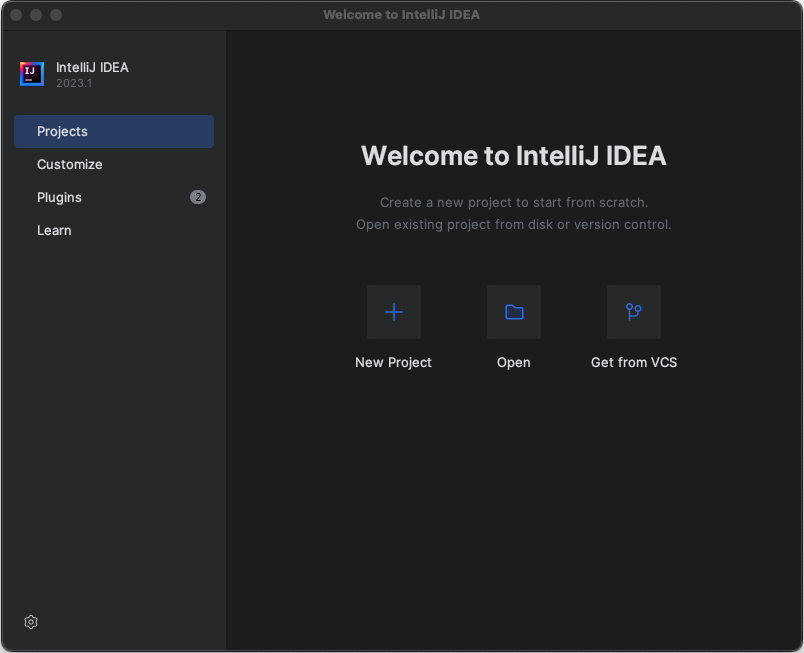
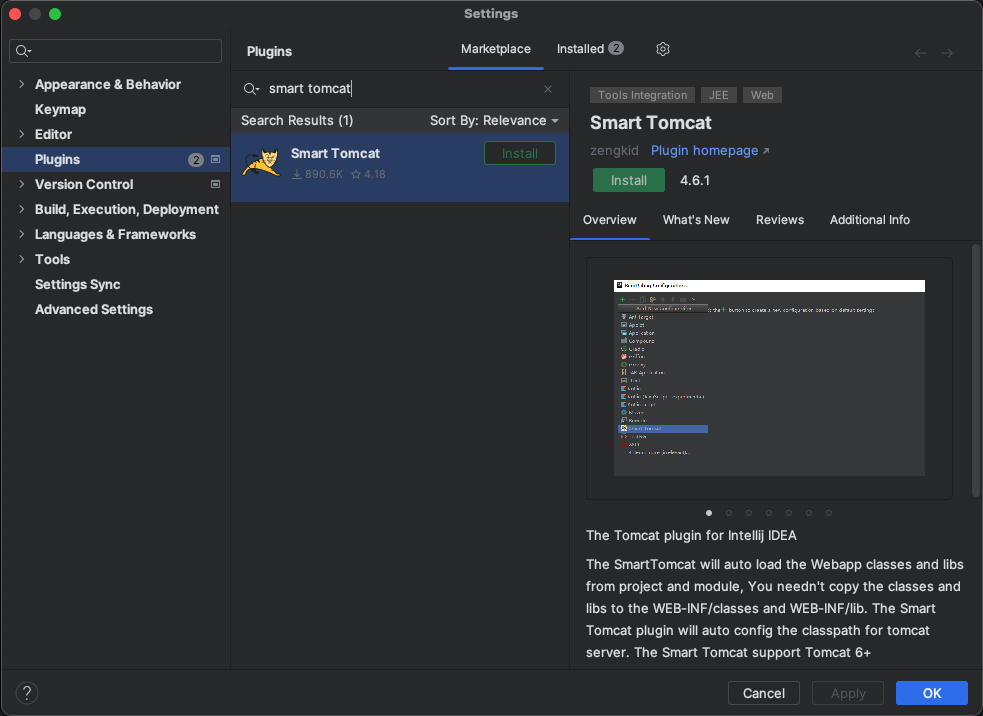
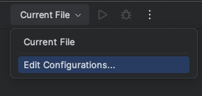
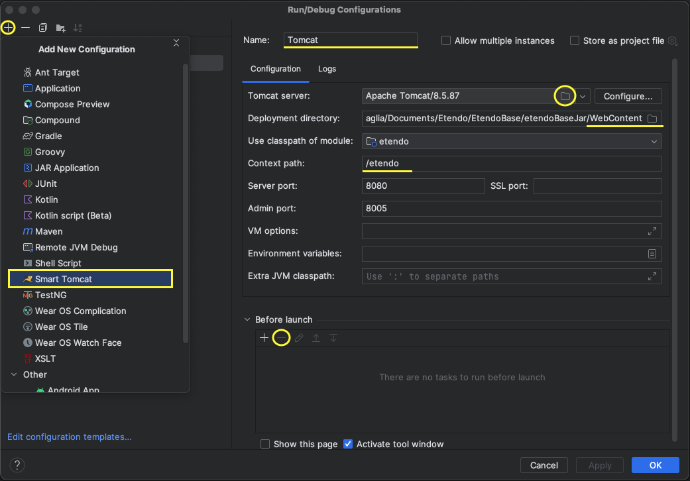
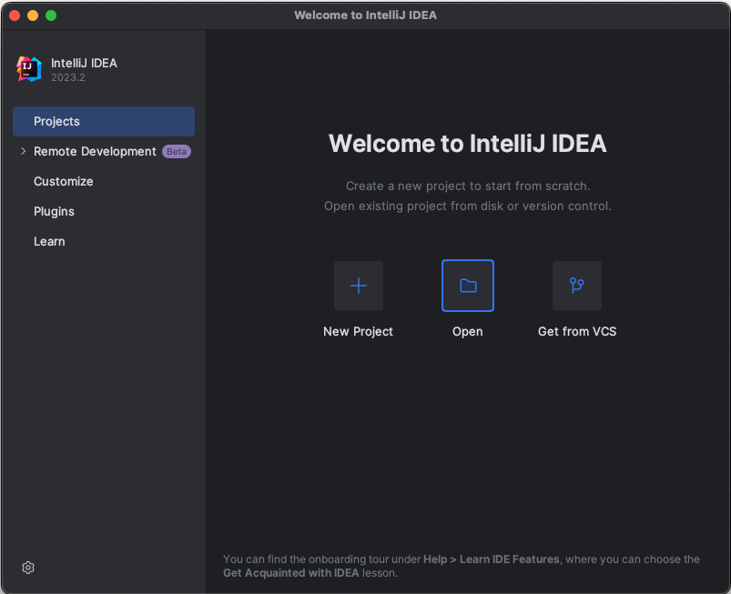
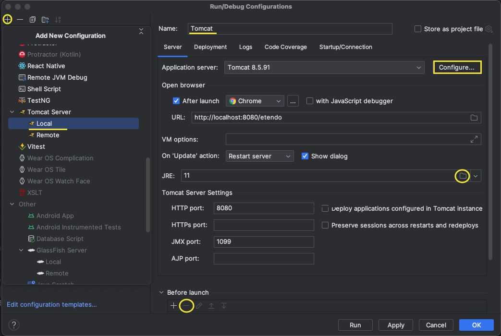
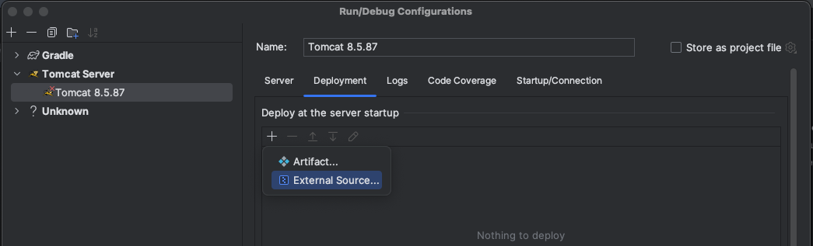
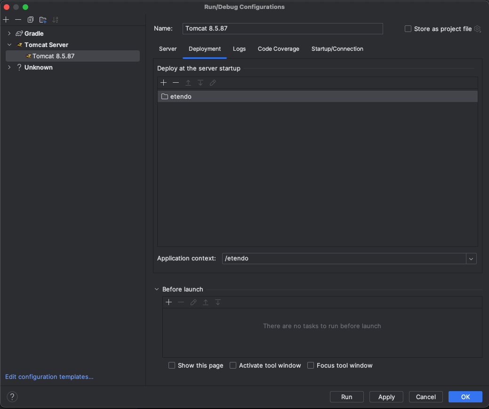

# Install Etendo Development Environment

## Overview

This section explains how to install and run a new local Etendo environment.


## Install Etendo in local Environment

To install Etendo in a development environment, follow the same steps as described in the [Etendo Installation Guide](../../../../getting-started/installation.md), the only difference is that we open the project with intelliJ and run Tomcat locally.


## Run Etendo Development Environment

=== "IntelliJ IDEA Community Edition"

    1. Download and install [IntelliJ IDEA Community Edition](https://www.jetbrains.com/idea/download){target="_blank"}

    2. Open Etendo source directory with IntelliJ:
        

    2. Install Smart Tomcat plugin:
        To install, go to `Settings` >> `Plugins` and search for `“Smart Tomcat”`
        

    3.  Download [Apache Tomcat](https://tomcat.apache.org/download-90.cgi){target="_blank"} and unzip it in the project directory

    4. Setting up Tomcat
        
        - Go to Current File >> Edit configurations.
        { align=right }
        - Add new Smart Tomcat Configuration, clicking "+"
        - Name: Tomcat
        - Tomcat Server: Select unziped Apache Tomcat directory
        - Deployment directory: Select `WebContent` directory in the project
        - Context path: define the same context path defined in gradle.properties file (by default "/etendo" )
        - Before launch: Remove all default tasks

         

    5. Start the Tomcat 

        

        !!! success
            Now you have a new Etendo environment running in [http://localhost:8080/etendo](http://localhost:8080/etendo)

        !!! tip "Default credentials"
            User: admin  
            Password: admin


=== "IntelliJ IDEA Ultimate"

    1. Download and install [IntelliJ IDEA Ultimate](https://www.jetbrains.com/idea/download){target="_blank"}

    2. Open Etendo source directory with IntelliJ:

        

    3. Seting up Tomcat
        
        - Go to Current File >> Edit configurations.
            
            
        
        - Select the Tomcat configuration that appears first in the list, check the Tomcat server configuration on your machine.
            
            
        - In the Deployment section, add external sources 

            
        - Selec the C `${env.CATALINA_HOME}/webapps/etendo` folder  or  the and then click the OK button.

            

    4. Start the Tomcat

        

        !!! success
            Now you have a new Etendo environment running in [http://localhost:8080/etendo](http://localhost:8080/etendo)

        !!! tip "Default credentials"
            User: admin  
            Password: admin


## Enable Etendo Logs (Optional)

1.  Open the file `config/log4j2-web.xml`, find the line `<!-- <AppenderRef ref="Console"/> -->` and uncomment it:

    ``` XML title="config/log4j2-web.xml"
    ...
    <Loggers>
        <Root level="info">
        <AppenderRef ref="RollingFile"/>
        <!-- Add this appender to show log messages in console i.e Eclipse: -->
        <AppenderRef ref="Console"/>  << UNCOMMENT THIS LINE
        </Root>
    ...
    ```
2. Run smartbuild task

    ``` bash title="Terminal"
        ./gradlew smartbuild --info 
    ```

---
This work is licensed under :material-creative-commons: :fontawesome-brands-creative-commons-by: :fontawesome-brands-creative-commons-sa: [ CC BY-SA 2.5 ES](https://creativecommons.org/licenses/by-sa/2.5/es/){target="_blank"} by [Futit Services S.L](https://etendo.software){target="_blank"}.
