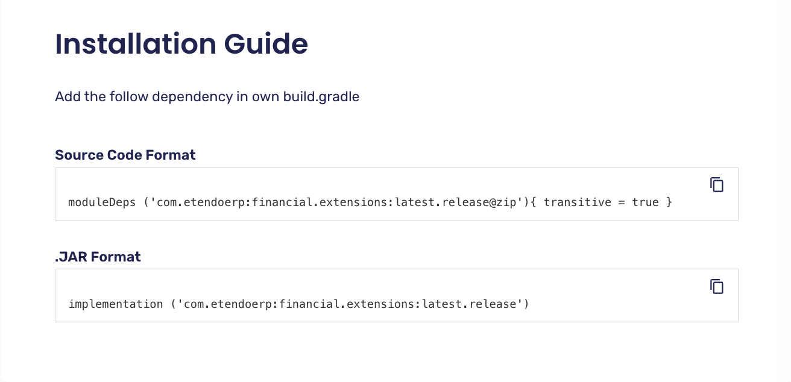
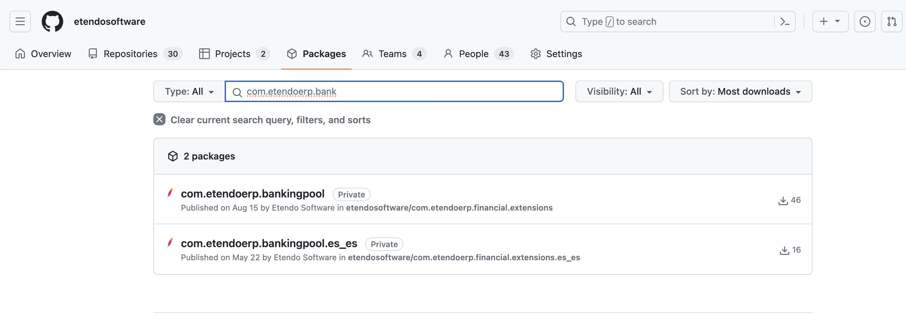
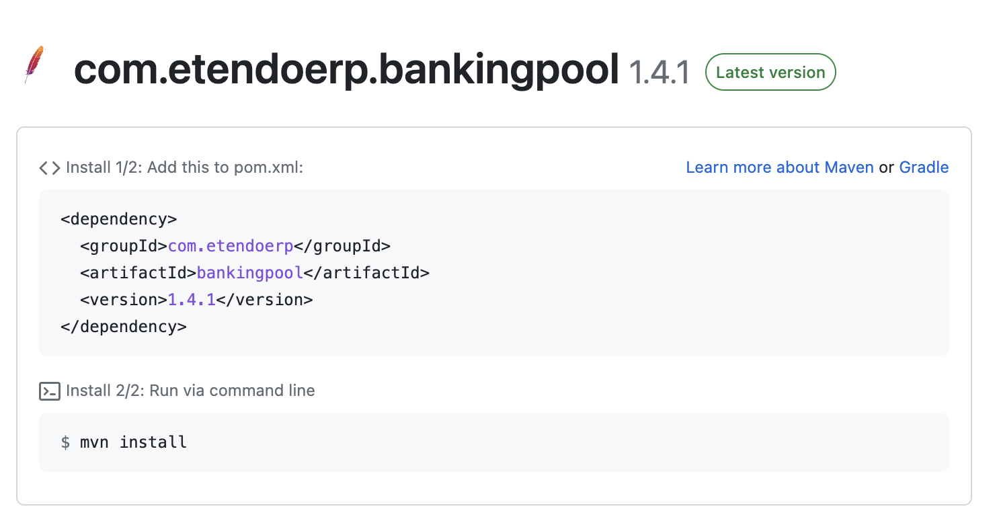
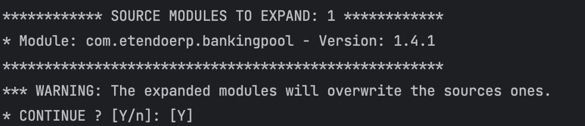

## Overview
This page explains how to install modules either from the Etendo Marketplace or by searching for the dependencies on GitHub, taking into account that these can be installed in JAR or Sources format. 

## 1. Dependency resolution

It is important to mention that the dependencies are resolved from GitHub, so you must have the credentials properly configured as explained in the [Etendo installation guide](../../../../getting-started/installation.md). Depending on the level of access your GitHub user has, you have access to packages in public or private repositories.

!!! success "Info"
    Along your license, you have access to all packages distributed by Etendo.


## 2. Search for dependencies
There are two ways to search for and install modules on Etendo: 

=== ":material-store: Marketplace"

    Install bundles from the Etendo Marketplace: In this case, you will install bundles that include a set of modules grouped by functionality.

    
    
    1.  First, go to [Etendo Marketplace](http://marketplace.etendo.cloud){target="_blank"}.
    2.  Search for the bundles that you want to install.
    3.  Click on the bundle to see its details, such as the version, description, and compatibility.
    4.  Check the requirements for the module, such as any dependencies or system configurations needed to run the module.
    5.  Select the format for the installation of the module, Source or JAR, and copy the corresponding dependency. E.g
    


=== ":simple-github: GitHub Packages"

    In case you only need to install one package or a set of packages separately, you can do so by resolving the dependencies from GitHub.

    First, you can search within the [Etendo Software organization packages](https://github.com/orgs/etendosoftware/packages){target="_blank"} section for the necessary javapackage. Or if it is your own repository, search for the packages associated with it.

    Exploring the bundles and modules documentation, you find the javapackages of each one. E.g. [Banking Pool](/user-guide/etendo-classic/optional-features/bundles/financial-extensions/overview/#banking-pool) documentation.
    
    

    When you select a package, you see the related information, e.g. 

    

    You should use this information to include the dependency, in our case in Gradle format.

## 3. Set dependencies

Based on the modules format you want to work with, you need to specify different configurations.

- In your Etendo project, open the `build.gradle` file.
- In the dependencies area, declare your modules.

=== ":octicons-package-16: Sources Format"

    If you want to work with source modules, declare your dependencies using the *moduleDeps* configuration. (notice the @zip extension)

    ```groovy title="ModuleDeps Template"
        moduleDeps('<groupId>:<artifactId>:<version>@zip'){ transitive = true }
    ```

    E.g:

    ```groovy title="build.gradle"
    dependencies {
        // Add your dependency here
        moduleDeps('com.etendoerp:bankingpool:1.4.1@zip'){ transitive = true }
    }
    ```

===  ":material-language-java: JAR Format"

    If you want to work with JARs modules, declare your dependencies using the *implementation* configuration.

    ```groovy title="Implementation Template"
        implementation('<groupId>:<artifactId>:<version>')`
    ```
    E.g:

    ```groovy title="build.gradle"
    dependencies {
    // Add your dependency here
        implementation('com.etendoerp:bankingpool:1.4.1')
    }
    ```


!!! info
    You can declare a specific version (e.g. '1.0.0') or an interval of versions: <br>
    \[begin, end\] - Both versions are included <br>
    (begin, end) - Both versions are not included <br>
    \[begin, ) - From a base version to the latest one <br>
    And any other possible combination

??? info "Gradle Exclusion Rules"
    You can make use of Gradle exclusion rules to prevent downloading a specific transitive module. Refer to [Gradle documentation](https://docs.gradle.org/current/userguide/dependency_downgrade_and_exclude.html#sec:excluding-transitive-deps){target="_blank"}


## 4. Resolve (download) and Install Dependencies


=== ":octicons-package-16: Sources Format"

    To work with sources, you must expand manually the modules with a *Gradle* task.

    ``` bash title="Terminal" 
    ./gradlew expandModules
    ```  
    
    This task will try to download or update the modules declared as *moduleDeps* in the `build.gradle` file.   
    
    A menu is displayed showing the modules that will be expanded, you have to confirm manually to continue with the expansion.

    

    You can manually exclude the expansion of modules adding it in the *sourceModulesInDevelopment* list.

    ```groovy title="build.gradle"
    etendo {
        sourceModulesInDevelopment = ['com.test.custommodule']
    }
    ```

    ??? warning 
        *Transitive dependencies* (not declared in the *moduleDeps* configuration), by default will be extracted, updating or overwriting the source modules if exists. To prevent this behavior, you can set in the plugin extension the flag *overwriteTransitiveExpandModules* to false.

        ```groovy title="build.gradle"
        etendo {
            overwriteTransitiveExpandModules = false
        }
        ```

    To expand only a specific module, you can use the `-Ppkg` flag and have defined the module in the *moduleDeps* configuration.

     ```bash title="Terminal"
     ./gradlew expandModules -Ppkg=com.etendoerp.custommodule
     ```

    !!! info
        Only the defined module will be updated or installed.
        *Transitive dependencies* will *not* be updated or installed.

===  ":material-language-java: JAR Format"

    To work with JAR modules, you need to resolve the dependencies running

    ``` bash title="Terminal"
    ./gradlew dependencies 
    ```
    When a new Etendo *JAR dependency* (implementation) is added or the version is updated, it is necessary to run an *update.database* before executing any *compilation* task (smartbuild, compile.complete, etc).
    You can force the compilation tasks adding to the Etendo extension the ignore flag

    ```groovy title="build.gradle"
    etendo {
        ignoreConsistencyVerification = true
    }
    ```

    Or run the tasks with the `-PignoreConsistency=true` flag.

    By default, Etendo does not allow you to add a *JAR dependency* with an old version to the current installed one.
    You can ignore this behavior adding the module name to be updated with an old version in the

    ```groovy
    etendo {
        ignoredArtifacts = ['com.etendoerp.mymodulename']
    }
    ```

Finally, update the database and compile the new modules.

```bash title="Terminal"
./gradlew update.database smartbuild 
```

!!! success ":simple-apachetomcat: Restart the Tomcat"
    Restart the Tomcat server and check the installation. <br>
    The module is ready to use in Etendo!


## Installing translation modules

If you want to install translation modules, you have to follow some more steps.The translation modules are installed automatically when you compile the code for the first time. E.g. after running `./gradlew install` command to create a new client's instance.  
But if you want to update a translation module version, you can execute:

```bash title="Terminal"

./gradlew install.translation -Dmodule=<javapackage>
./gradlew update.database smartbuild
```

??? info
    The `install.translation` task changes the status of the module and the translations is installed on the next run of `update.database`.

Another option to force the installation of all the translation modules is to add the `forceRefData=true` property in the `gradle.properties` file and then running:

```bash title="Terminal"
./gradlew setup
./gradlew update.database smartbuild
```