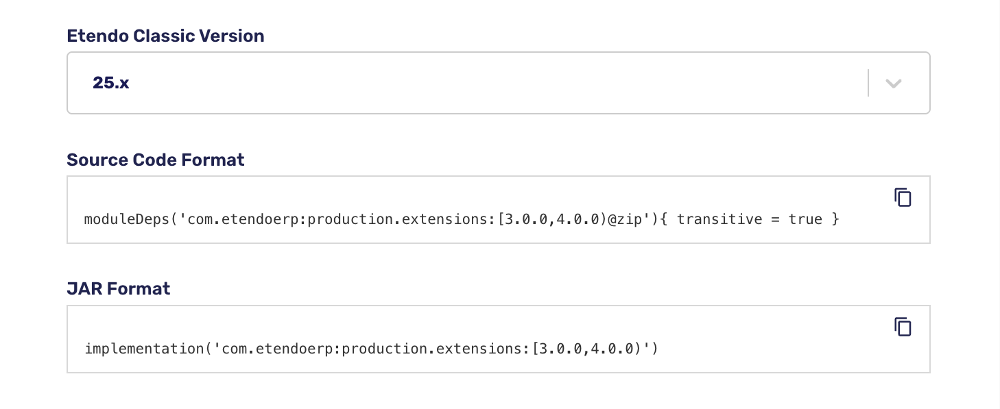
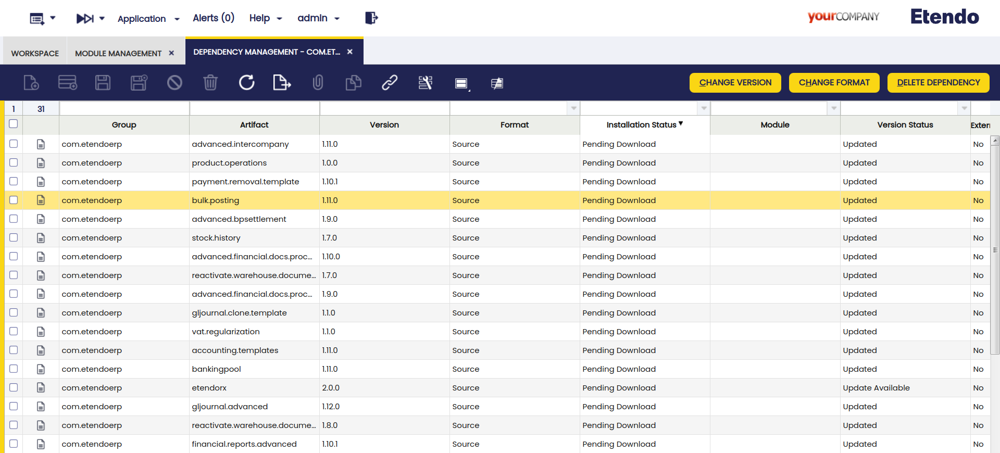

# Install Modules in Etendo Classic

## Overview
This guide explains two different ways to install modules in Etendo Classic:

- **Gradle Standard Installation**: This method involves manually defining the dependencies in the project's `build.gradle` file, specifying the modules to be included either as JAR or Source format.

-  **Using the Dependency Manager**: A module pre-installed in Etendo instances that allows managing and installing dependencies directly from the Etendo Classic user interface, without the need to manually edit configuration files.


!!! warning "Important Notice"
    It is strongly recommended to choose **only one method** for managing dependencies: either **Gradle Standard Installation** or the **Dependency Manager**. Once you start using the **Dependency Manager**, it takes precedence over the `build.gradle` file, and dependency information will be managed through the database instead. Combining both methods is not supported and may result in unexpected behavior or inconsistencies during the installation or upgrade of modules.


##  Authentication

It is important to mention that the dependencies are resolved from GitHub, so you must have the credentials properly configured as explained in the [Use of Repositories in Etendo](../../../etendo-classic/getting-started/installation/use-of-repositories-in-etendo.md). 
Depending on the level of access your GitHub user has, you have access to public or private (commercial) packages.

!!! success "Info"
    Along your license, you have access to all packages distributed by Etendo.


## Gradle Standard Installation

<iframe width="560" height="315" src="https://www.youtube.com/embed/gY0kLINlyq0?si=fGXiZ9wJsw-Bhs2B" title="YouTube video player" frameborder="0" allow="accelerometer; autoplay; clipboard-write; encrypted-media; gyroscope; picture-in-picture; web-share" referrerpolicy="strict-origin-when-cross-origin" allowfullscreen></iframe>

### Checklist

:octicons-check-circle-16: **Set up credentials**.<br>
:octicons-check-circle-16: **Search for modules or bundles to install**.<br>
:octicons-check-circle-16: **Choose module format (Source or JAR)**.<br>
:octicons-check-circle-16: **Set dependencies in the `build.gradle` file**.<br>
:octicons-check-circle-16: **Expand Sources Code or resolve dynamic dependencies (JAR)**.<br>
:octicons-check-circle-16: **Install modules**.<br>
:octicons-check-circle-16: **Restart Tomcat service and verify installation**.<br>


### Search for Dependencies
There are two options to search and install modules in Etendo Classic. Choose one of the following:

=== ":material-store: Marketplace"

    You can install modules from the **Etendo Marketplace**, which contains packages grouped by functionality.

    

    Steps to follow:

    1. Open [Etendo Marketplace](http://marketplace.etendo.cloud){target="_blank"}.
    2. **Search** for the module or bundle you want to install.
    3. **Select it** to see details and instructions.
    4. Choose the **Etendo Classic Version**, to determine the compatibility range of the dependency.
    5. **Copy** the installation line in your preferred format: **Source Code** (allows customizations) or **JAR** (precompiled).

    

    !!! info 
        By selecting the **Etendo Classic Version**, the compatibility range is determined, which guarantees to always resolve to the latest version available for that Etendo version.
    
    !!! tip 
        In addition, in each bundle you will find a link to the release notes with more information about each version, compatibilities and more.   

    !!! tip
        If your Etendo Classic instance predates the supported versions, you must select version 24.x
    
    !!! danger "Not Recommended"
        Avoid using the `latest.release` version as it may not be compatible with your current Etendo version.

=== ":simple-github: GitHub Packages"

    If you want to install specific modules directly from GitHub:

    Steps to follow:

    1. Visit the packages section on [Etendo Software GitHub](https://github.com/orgs/etendosoftware/packages){target="_blank"} or search within your own repository.
    2. Select the required module to get the necessary information.
    3. Copy the module information to include it in your `build.gradle` file.

    For example, to install the [Banking Pool](/user-guide/etendo-classic/optional-features/bundles/financial-extensions/overview/#banking-pool) module, copy the provided information there.

    
    

### Set Dependencies in Etendo Classic 

Based on the modules format you want to work with:

- In the Etendo project, open the `build.gradle` file.
- In the dependencies area, paste the modules or bundle to install.

=== ":octicons-package-16: Sources Format"

    If you want to work with source modules, declare your dependencies using the **moduleDeps** configuration (notice the @zip extension).

    ```groovy title="ModuleDeps Template"
        moduleDeps('<groupId>:<artifactId>:<version>@zip'){ transitive = true }
    ```

    E.g:

    ```groovy title="build.gradle"
    dependencies {
        // Add your dependency here
        moduleDeps('com.etendoerp:production.extensions:[3.0.0,4.0.0)@zip'){ transitive = true }    
    }
    ```

===  ":material-language-java: JAR Format"

    If you want to work with JARs modules, declare your dependencies using the **implementation** configuration.

    ```groovy title="Implementation Template"
        implementation('<groupId>:<artifactId>:<version>')
    ```
    E.g:

    ```groovy title="build.gradle"
    dependencies {
    // Add your dependency here
        implementation('com.etendoerp:production.extensions:[3.0.0,4.0.0)')
    }
    ```


!!! info
    - You can declare a specific version (e.g. '1.0.0') or an interval of versions: <br>
    - \[begin, end\] Both versions are included <br>
    - (begin, end)  Both versions are not included <br>
    - \[begin, )  From a base version to the latest one <br>
    - And any other possible combination.

!!! tip "Gradle Exclusion Rules"
    You can make use of Gradle exclusion rules to prevent downloading a specific transitive module. Refer to [Gradle Documentation](https://docs.gradle.org/current/userguide/dependency_downgrade_and_exclude.html#sec:excluding-transitive-deps){target="_blank"}


### Resolve Dependencies


=== ":octicons-package-16: Sources Format"

    To work with source code, you must expand manually the modules using a **Gradle** task.

    ``` bash title="Terminal" 
    ./gradlew expandModules
    ```  
    
    This task will try to download or update the modules declared as **moduleDeps** in the `build.gradle` file.   
    A menu is displayed showing the modules that will be expanded, you have to confirm manually to continue with the expansion.

    

    !!! tip
        Only the main dependency defined in **Source Code** (moduleDeps) format will be expanded. If you want all transitive dependencies to also be resolved in this format, set the `supportJars` property to `false` in the `build.gradle` file:

        ```groovy title="build.gradle"
        etendo {
            supportJars = false
        }
        ```
        This ensures that all dependencies are expanded as source code instead of using JAR files.

    !!! tip 
        To expand only a specific module, you can use the `-Ppkg` flag and have defined the module in the **moduleDeps** configuration.

        ```bash title="Terminal"
        ./gradlew expandModules -Ppkg=com.etendoerp.custommodule
        ```

===  ":material-language-java: JAR Format"

    To work with JAR modules, you need to resolve the dependencies explicitly by running the `dependencies` task, which displays the resolved dependency tree:

    ```bash title="Terminal"
    ./gradlew dependencies
    ```

    However, note that when executing any Gradle task, the JAR dependencies (declared with `implementation`) are dynamically resolved beforehand. 

    When a new Etendo **JAR** dependency is added or its version is updated, it is necessary to run **update.database** before executing any **compilation** task (e.g., `smartbuild`, `compile.complete`, etc.).
    
    !!! tip
        You can force the compilation tasks adding to the Etendo extension the ignore flag

        ```groovy title="build.gradle"
        etendo {
            ignoreConsistencyVerification = true
        }
        ```

        Or run the tasks with the `-PignoreConsistency=true` flag.

    
    !!! warning
        By default, Etendo does not allow you to add a *JAR dependency* with an old version to the current installed one.
        
        You can ignore this behavior adding the module name to be updated with an old version in the

        ```groovy
        etendo {
            ignoredArtifacts = ['com.etendoerp.mymodulename']
        }
        ```

### Install Dependencies

Finally, update the database and compile the new modules.

```bash title="Terminal"
./gradlew update.database smartbuild 
```

!!! success ":simple-apachetomcat: Restart the Tomcat"
    Restart the Tomcat server and check the installation. <br>
    The module is ready to use in Etendo!


## Dependency Manager
:octicons-package-16: Javapackage: `com.etendoerp.dependencymanager`

<iframe width="560" height="315" src="https://www.youtube.com/embed/du8EYoSsZ68?si=HDmwg-JxPg7gJ2sT" title="YouTube video player" frameborder="0" allow="accelerometer; autoplay; clipboard-write; encrypted-media; gyroscope; picture-in-picture; web-share" referrerpolicy="strict-origin-when-cross-origin" allowfullscreen></iframe>

- With this module, the user can access from the Etendo Classic interface all Etendo packages published in Etendo Software repositories. 
- In addition, from the Module Management window you can query packages, available versions, dependencies and install new packages. 
- Then, from the Dependency Management window you can update, remove and change the format of already installed modules. 


### Installation 

The **Dependency Manager** is distributed by default in the current versions of Etendo Classic, in case it is not installed in your instance you can do it by following the [Gradle Standard Installation](#gradle-standard-installation) section described above.

!!! tip
    You can find the module in the Etendo Marketplace at the following link: [Dependency Manager - Marketplace](https://marketplace.etendo.cloud/#/product-details?module=CBD09C84BFB2469096758C3297F1C7A9)

!!! warning
    You must make sure to use Etendo Gradle Plugin in version `1.5.1` or higher, check the plugins section in the `build.gradle` file.  For more information about plugin releases see, [Etendo Gradle Plugin - Release Notes](../../../../whats-new/release-notes/etendo-classic/plugins/etendo-gradle-plugin/release-notes.md)

### Module Management Windows
:material-menu: `Application` > `Etendo Dependencies Management` > `Module Management`
    
Logged as System Administrator role, in the `Module Management` window, the user can see all the modules to be added and select the corresponding version in the **versions** tab. Once one of the versions is selected, the dependencies of such version can be found in the **dependencies** subtab.


!!!info
    The fields in this window are read-only.

Fields to note:

- **Active**: Checkbox to select if this module is active or not.
- **Group**: the identifier of the artifact.
- **Artifact**: the unit of deployment fetched and used.
- **Installed Version**: the version of the module if it is installed.
- **Is bundle**: Field to filter if this module is a bundle or not.

This window presents two buttons that can be used: **Add dependency** and **Update Packages**.

#### Buttons
##### Add Dependency Button

This button allows you to add the dependencies associated with a specific version of the selected module. When clicked, a pop-up window will display all the dependencies and modules that will be installed.

- **If a package bundle is selected**: you will have the option to add all the modules within the bundle or select only the ones you need. Below, a new read-only grid will appear, showing the dependencies of the selected modules. This grid is for informational purposes, allowing you to see which dependencies will be added.

- **If a non-bundle package is selected**: the grid will be read-only, displaying only the necessary dependencies for the module to work correctly. If no dependencies are displayed, it means that the module has no additional dependencies.

!!! warning
    A warning notification is shown to inform the user about versions compatibility before installing the dependencies shown.

!!!info
    Consider that by default, all dependencies are added in Source format.


Once the process is done, the **Dependency Management** window is opened and all the installed dependencies are shown.

**Dependency Version Handling Rules**

1. **If the dependency version is greater than the installed version:**:

    - No installed module and no record in `Dependency Management`window: New dependency record added. 
    - No installed module but record exists in `Dependency Management`window: Update the existing record version.
    - Installed module and the dependency record exists in `Dependency Management`window: Update the existing record version.
    - Installed module but no dependency record exists in `Dependency Management`window: The local dependency is deleted, and a new record is added in `Dependency Management`. 

    

2. **If the dependency version is less than the installed version:**

    - Display error and disable the process, preventing installation of an older version to avoid compatibility issues. This approach ensures that dependencies are handled properly, maintaining compatibility and minimizing the risk of functionality loss. In case you need to install the dependency version anyway, you must downgrade the version from the `Dependency Management` window with the [change version](#change-version) button.  

##### Update Packages Button

This button is used to execute the Update Packages process which updates the list of available packages with the latest information.

### Dependency Management Windows
:material-menu: `Application` > `Etendo Dependencies Management` > `Dependency Management`

Logged as System Administrator role, in the `Dependency Management` window, the user can find all the dependencies installed in the previous step.



Fields to note:

- **Active**: Checkbox to select if this dependency is active or not.
- **Group**: The identifier of the artifact.
- **Artifact**: The unit of deployment fetched and used.
- **Version**: Version of the module
- **Format**: Describes the dependency format. They can be `Source`, `JAR` or `local`.
    - `Source`: In this case, the source code is available, to download the dependencies the user must excecute the `./gradlew expandModules` Gradle task and then compilation is required.
    - `JAR`: In this case, a standard format for java packages distribution, these include the compiled Java classes, and the dependencies resolution is dynamic.
    - `Local`: The local format implies that the module is installed but it is not declared as a repository dependency. 
- **Installation Status**: It describes the dependency current status.
    - Pending download: This is the status by default when a new dependency is added or updated.  To be installed, it is necessary to compile the environment and, in such case, the dependency is in `source` format. 
    - Installed: Used once the dependency is already installed.
- **Module**: A reference that appears to the module when it is installed.
- **Version Status**: It describes the dependency version status.
    - Untracked: Only for external and local dependencies.
    - Update Available: In case there are new available versions.
    - Updated: The latest available version is installed.
- **External Dependency** (Only available for `JAR` dependencies): Checkbox that identify an external library or module required by the project, managed by Gradle. These dependencies are retrieved from remote repositories during the build process.


#### Buttons

##### Change Version 


This button is used to update or downgrade versions. 

When the version of a module is modified, its related dependencies could be modified as well. In this case, it is possible to add new, update or delete versions. 

!!! warning
    A warning notification is shown to inform the user about versions compatibility before executing the process.

##### Change Format 


This button is used to change the format of the module.  This process needs to be executed when it is necessary to migrate from a local format to a gradle dependency, while keeping the modules updated.  The options are `source`, `JAR` or `local`.

- In case the module is originally in `local` format, the options in the **Change format** popup window are `JAR` or `source`.

- In case the module is originally in `source` format, the only option in the **Change format** popup window is `JAR`.

- In case the module is originally in `JAR` format, the only option in the **Change format** popup window is source. In this case, the window shows a warning notification to remind the user that the original directory is deleted once the process is finished.

##### Delete Dependency

This button is used to delete dependencies.

- **JAR format dependency**: In case you need to remove a dependency to actually complete the action, the environment must be compiled.

    

- **Local or Souce format dependency**: In case you need to remove a dependency to actually complete the action, the environment must be compiled. Also, note that both `Source` and `Local` dependencies must be manually removed from the `/modules` folder prior to compilation.

    

    !!! warning
        A warning notification is displayed to inform the user of the steps to remove it.

### Add Local Dependencies Process
:material-menu: `Application` > `Etendo Dependencies Management` > `Add Local dependencies`


This process, in `Add Local dependencies` window, also part of the **Dependencies Management**, is in charge of identifying all the locally installed modules without related dependencies, add them to the Dependency Management window with the `local` format.

!!! note
    The main objective of this process is to add the dependencies in `local` format, so that in case of being distributed as an Etendo module it can be easily migrated to `Sources` or `Jar` format. 

### Update Packages Information Process
:material-menu: `Application` > `Etendo Dependencies Management` > `Update Packages Information`

Since the information about packages is daily updated, the user can execute manually the process from `Update Packages Information` window to update the list of packages with the latest information.

!!!info
    The same process can be executed from the **Module Management** window, selecting one record and clicking the **Update packages** button.

!!!note
    Each time the server is restarted, the update process is executed automatically.

---

This work is a derivative of [Developer Guide](https://wiki.openbravo.com/wiki/Category:Developers_Guide){target="\_blank"} by [Openbravo Wiki](http://wiki.openbravo.com/wiki/Welcome_to_Openbravo){target="\_blank"}, used under [CC BY-SA 2.5 ES](https://creativecommons.org/licenses/by-sa/2.5/es/){target="\_blank"}. This work is licensed under [CC BY-SA 2.5](https://creativecommons.org/licenses/by-sa/2.5/){target="\_blank"} by [Etendo](https://etendo.software){target="\_blank"}.