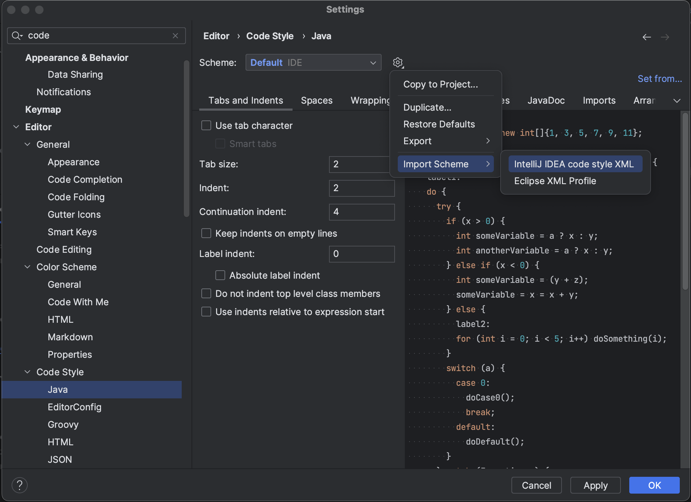

## Overview

This document covers how IntelliJ IDEA  is capable of importing code formatter settings.

## Code Formatting

1. First, download the following [IntelliJ formatting file](../../../../assets/developer-guide/etendo-classic/getting-started/instalation/code-formatting-style-in-intellij/etendo.xml){: download="etendo.xml"}.
2. Open :simple-intellijidea: IntelliJ IDEA Settings 
3. Search Code Style → Java
4. Click the gear icon → Import Schema → IntelliJ IDEA code style XML. 

    

5. Select the file downloaded first and import the schema.

---
This work is licensed under :material-creative-commons: :fontawesome-brands-creative-commons-by: :fontawesome-brands-creative-commons-sa: [ CC BY-SA 2.5 ES](https://creativecommons.org/licenses/by-sa/2.5/es/){target="_blank"} by [Futit Services S.L](https://etendo.software){target="_blank"}.
