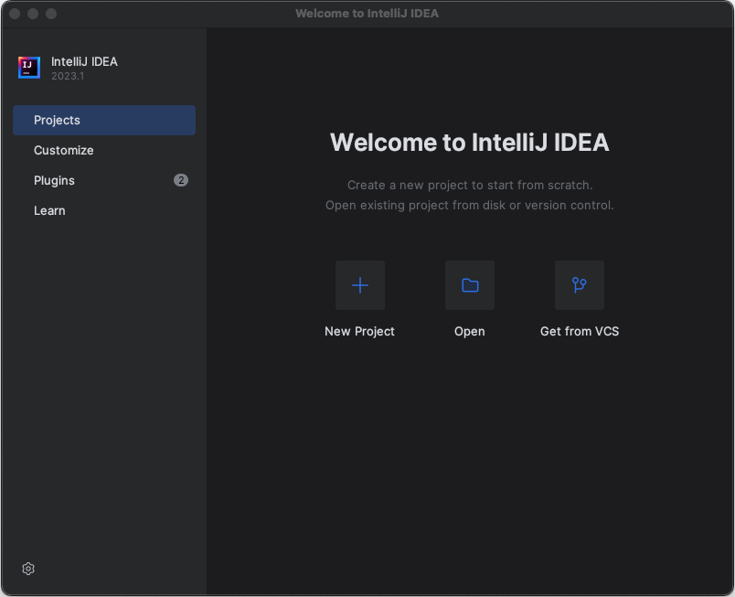
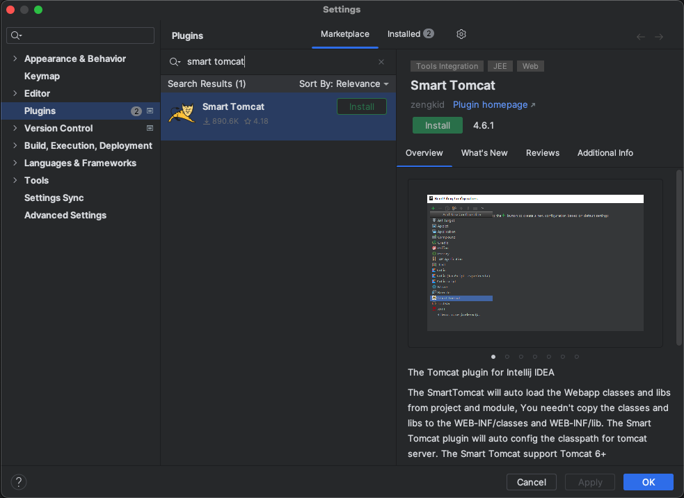
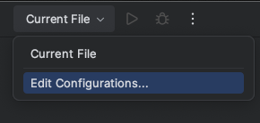
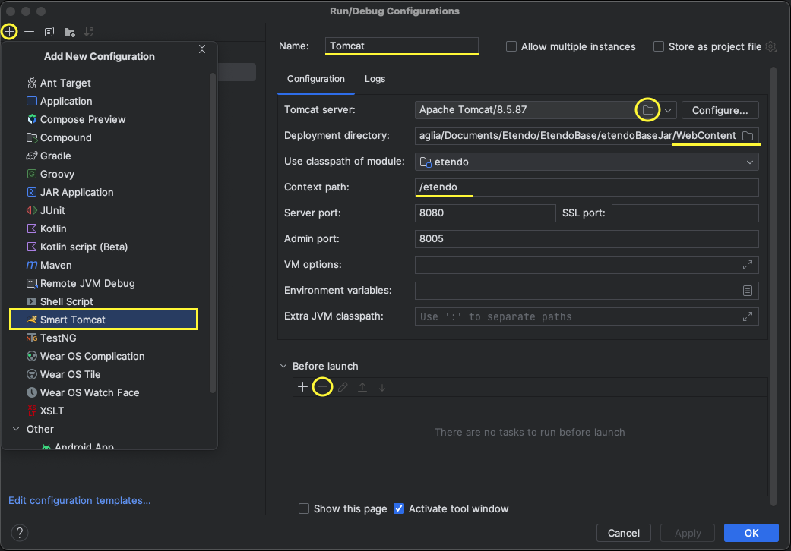
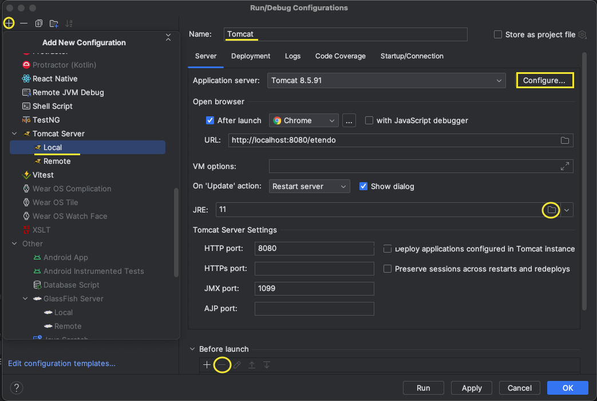
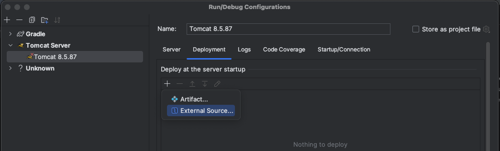
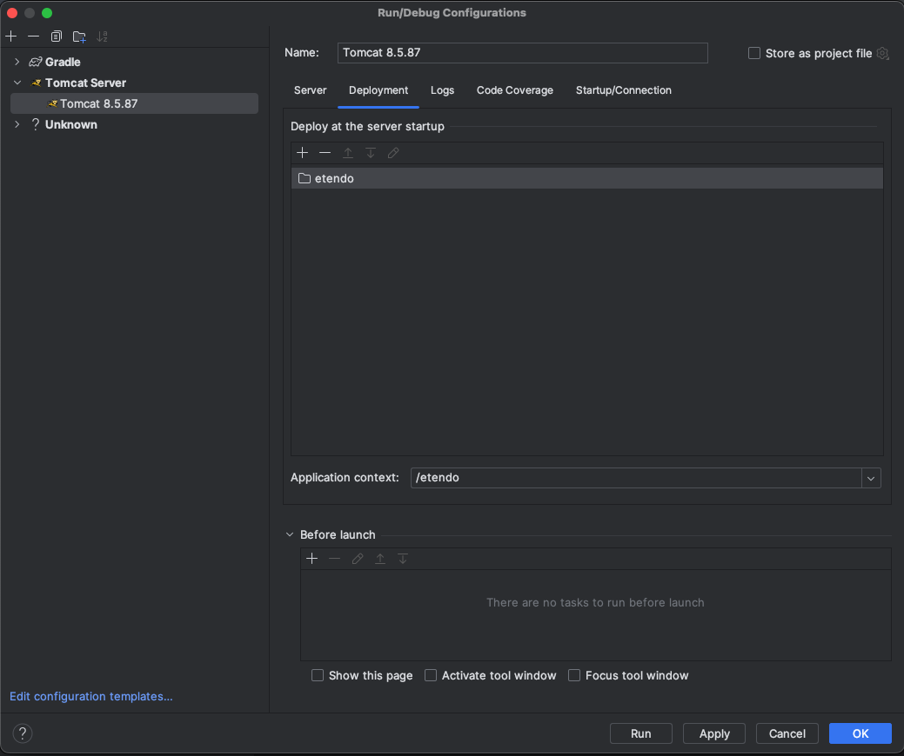

---
tags:
  - Getting Started
  - Development
  - Installation
  - Local Development
  - IntelliJ
---

# Install Etendo - Local Development Environment

## Overview

This guide covers setting up a local Etendo development environment. It uses IntelliJ IDEA with a local Tomcat instance to run Etendo, and Docker to run Copilot and Main UI as containerized services.

## Prerequisites

Before starting, make sure the following are ready:

- [System requirements](requirements.md)
- [PostgreSQL configured](postgresql-configuration.md)
- [GitHub credentials](use-of-repositories-in-etendo.md)
- [Docker](https://docs.docker.com/get-docker/){target="_blank"} version `26.0.0` or higher
- [Docker Compose](https://docs.docker.com/compose/install/){target="_blank"} version `2.26.0` or higher
- **OpenAI API Key** — required for Copilot. Use your own key from [OpenAI](https://platform.openai.com/account/api-keys){target="_blank"} or contact [Etendo](https://etendo.software){target="_blank"} to get one. For details on supported providers, see the [Copilot Installation guide](../../../etendo-copilot/installation.md#configuration-variables).

!!! warning
    Avoid installing Docker via [Snap](https://snapcraft.io){target="_blank"} — its sandbox restrictions may prevent Etendo Docker containers from accessing host directories correctly. Install Docker following the official guide for your distribution.

## Installation

### 1. Clone the Project

```bash title="Terminal"
cd /path/to/workspace
git clone https://github.com/etendosoftware/etendo_base.git EtendoERP
cd EtendoERP
```

### 2. Add GitHub Credentials

Edit `gradle.properties` and add your GitHub credentials. To generate them, follow the [Use of Repositories in Etendo](use-of-repositories-in-etendo.md) guide.

```groovy title="gradle.properties"
githubUser=<username>
githubToken=<*******>
```

### 3. Expand the Project

=== ":octicons-file-zip-24: Source Format"

    Source format is recommended for local development as it gives full access to the codebase.

    ```bash title="Terminal"
    ./gradlew expand
    ```

=== ":material-language-java: JAR Format"

    Uncomment the core dependency in `build.gradle`:

    ```groovy title="build.gradle"
    implementation('com.etendoerp.platform:etendo-core:<version>')
    ```

    !!! info
        To know the available versions, visit the [Etendo Release Notes](../../../../whats-new/release-notes/etendo-classic/release-notes.md).

### 4. Apply the Local Template

Run the following task to configure all required variables for Etendo, Copilot, and Main UI:

```bash title="Terminal"
./gradlew setup.applyTemplates --template=local
```

When prompted, enter your **OpenAI API Key**.

The template configures `gradle.properties` automatically with all required settings for a local environment, including Copilot and Main UI Docker services.

!!! info "Availability"
    `setup.applyTemplates` is available from **Etendo 26** onwards, or in earlier versions with the [Etendo Gradle Plugin 2.3.0](../../../../whats-new/release-notes/etendo-classic/plugins/etendo-gradle-plugin/release-notes.md) or higher.

!!! info
    For details about available templates, options, and advanced usage, see the [How to Use Setup Apply Templates](../../how-to-guides/how-to-use-setup-apply-templates.md) guide.

!!! tip "Alternative: Manual Configuration"
    Configure variables directly in `gradle.properties` and apply them by running:
    ```bash
    ./gradlew setup --info
    ```

!!! tip "Alternative: Interactive Setup"
    For a fully guided, property-by-property configuration, run the interactive setup instead:
    ```bash
    ./gradlew setup -Pinteractive=true --console=plain
    ```
    For more details, see the [How to Use the Interactive Setup](../../how-to-guides/how-to-use-interactive-setup.md) guide.

### 5. Start Docker Services

```bash title="Terminal"
./gradlew resources.up --info
```
This starts the **Copilot** and **Main UI** containers. Both are included in the base installation.

### 6. Install Etendo

```bash title="Terminal"
./gradlew install smartbuild --info
```

This creates the database, compiles the sources, and deploys to the local Tomcat directory.


## Run in IntelliJ

=== "IntelliJ IDEA Community Edition"

    1. Download and install [IntelliJ IDEA Community Edition](https://www.jetbrains.com/idea/download){target="_blank"}.

    2. Open the Etendo source directory with IntelliJ:

        

    3. Install the **Smart Tomcat** plugin: go to `Settings` > `Plugins` and search for `Smart Tomcat`.

        

    4. Download [Apache Tomcat](https://tomcat.apache.org/download-90.cgi){target="_blank"} and unzip it inside the project directory.

    5. Set up the Tomcat run configuration:

        - Go to `Current File` > `Edit Configurations`.

            

        - Click `+` and add a new **Smart Tomcat** configuration with the following values:
            - **Name**: `Tomcat`
            - **Tomcat Server**: select the unzipped Apache Tomcat directory
            - **Deployment directory**: select the `WebContent` directory in the project
            - **Context path**: use the same value defined in `gradle.properties` (default: `/etendo`)
            - **Before launch**: remove all default tasks

            

    6. Start Tomcat from the run configuration:

        

=== "IntelliJ IDEA Ultimate"

    1. Download and install [IntelliJ IDEA Ultimate](https://www.jetbrains.com/idea/download){target="_blank"}.

    2. Open the Etendo source directory with IntelliJ.

    3. Set up the Tomcat run configuration:

        - Go to `Current File` > `Edit Configurations`.

            

        - Select the Tomcat configuration from the list and verify the Tomcat server settings.

            

        - In the **Deployment** section, add external sources and select the `${env.CATALINA_HOME}/webapps/etendo` folder.

            

            

    4. Start Tomcat from the run configuration.

## Access the Installation

Once Tomcat and Docker services are running:

| Interface | URL |
|---|---|
| **Main UI** | [http://localhost:3000](http://localhost:3000){target="_blank"} |
| **Classic UI** | [http://localhost:8080/etendo](http://localhost:8080/etendo){target="_blank"} |

!!! tip "Default credentials"
    User: `admin`
    Password: `admin`

## Optional

### Enable Etendo Logs

1. Open `config/log4j2-web.xml` and uncomment the `Console` appender reference:

    ```xml title="config/log4j2-web.xml"
    <Loggers>
        <Root level="info">
            <AppenderRef ref="RollingFile"/>
            <AppenderRef ref="Console"/>  <!-- uncomment this line -->
        </Root>
    ```

2. Run `smartbuild` to apply the change:

    ```bash title="Terminal"
    ./gradlew smartbuild --info
    ```

---
This work is licensed under :material-creative-commons: :fontawesome-brands-creative-commons-by: :fontawesome-brands-creative-commons-sa: [ CC BY-SA 2.5 ES](https://creativecommons.org/licenses/by-sa/2.5/es/){target="_blank"} by [Futit Services S.L](https://etendo.software){target="_blank"}.