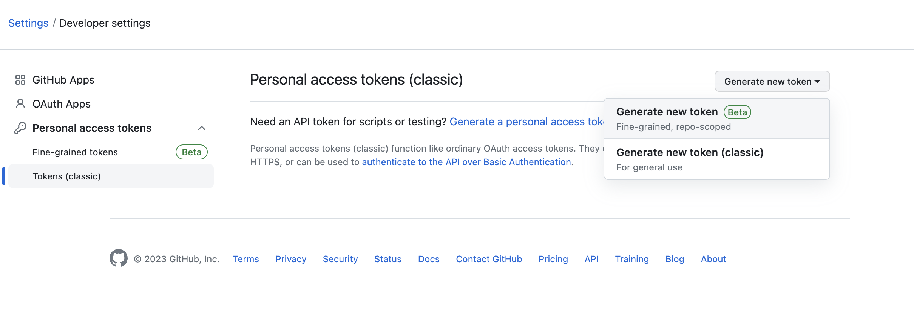
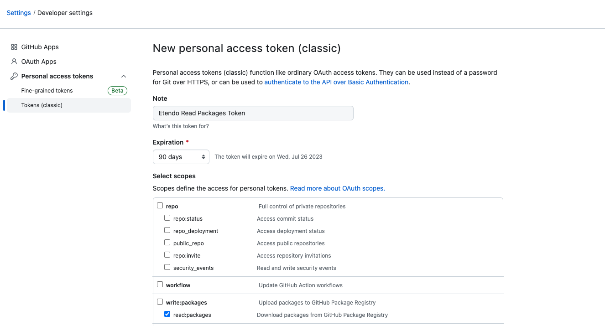

# Use of Repositories in Etendo

## Overview
Etendo supports any Maven package repository, but this guide focuses on configuring credentials for Etendo's standard repositories.

!!! tip
    By default, Etendo Classic and extension bundles are downloaded from the [Etendo GitHub repositories](https://github.com/etendosoftware){target=_isblank}.

To access Etendo's GitHub repositories and resolve dependencies, you need the appropriate credentials. This involves using a **Personal Access Token**. This guide explains how to set up and use these credentials.

## GitHub Token

### Generating a Personal Access Token

!!! info
    As part of your Etendo License, you will receive an email invitation to join the **Etendo Partners Team** on GitHub. You must create or associate a GitHub account with the invited email. Your user will then have read access to all Etendo repositories.

Follow these steps to generate a Personal Access Token:

1. Log in to your **GitHub account**.
2. Click your profile picture in the top-right corner and select **Settings**.
3. Navigate to **Developer settings** in the left menu and click **Personal access tokens**.

     

4. Click **Generate new token (classic)**.

5. Provide a **name** for your token and select the required permissions. At a minimum, ensure the `read:packages` permission is selected.

    !!! warning
        It is highly recommended to set an expiration date for the token. However, you can also choose to leave it without an expiration date.

     

6. Click *Generate token* and copy the token value.

    !!! warning
        You will not be able to view the token again, so make sure to copy it and store it securely.

### Configuring the GitHub Token in Etendo Projects

After generating a **Personal Access Token**, configure it in your Etendo project by following these steps:

1. Open the `gradle.properties` file in your project.
2. Add the following lines, replacing `YOUR_GITHUB_USERNAME` and `YOUR_PERSONAL_ACCESS_TOKEN` with your actual GitHub username and token:
        
    ```properties title="gradle.properties"
    nexusUser=
    nexusPassword=
    githubUser=YOUR_GITHUB_USERNAME
    githubToken=YOUR_PERSONAL_ACCESS_TOKEN
    context.name=etendo
    bbdd.sid=etendo
    bbdd.port=5432
    ```

3. Save the `gradle.properties` file.

### Using the Personal Access Token in Gradle Tasks

Once your **GitHub Token** is configured, Gradle tasks can seamlessly interact with Etendo's GitHub repositories. For example, when running the following command:

```bash title="Terminal"
./gradlew dependencies
```

Gradle will automatically use your *Personal Access Token* to authenticate with GitHub and securely resolve dependencies.

### Revoking a Personal Access Token

If you no longer need a token or suspect it has been compromised, revoke it immediately by following these steps:

1. Go to your **Settings** page on GitHub.
2. Navigate to **Developer settings** in the left-hand sidebar.
3. Click **Personal access tokens**.
4. Locate the token you want to revoke and click **Revoke**.
5. Confirm the revocation.

The token will be invalidated immediately and can no longer be used.