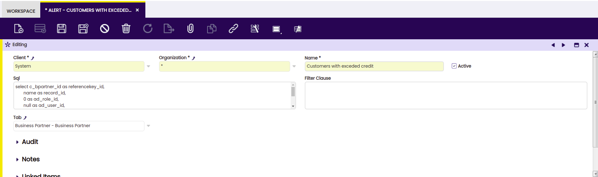
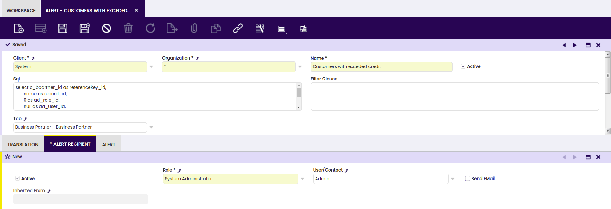
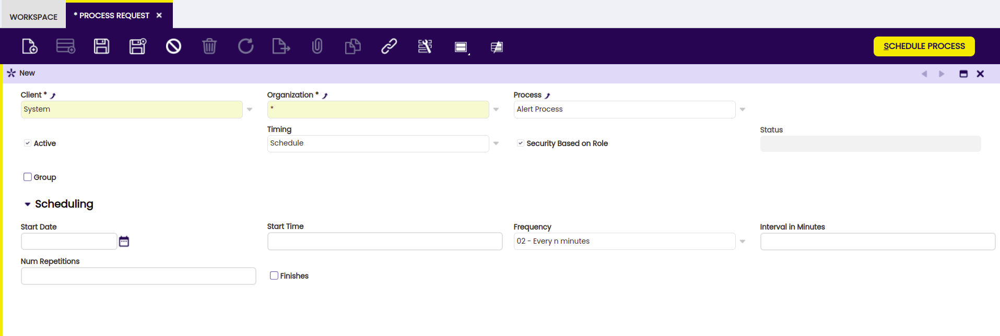

#  How to create an Alert

 
  
##  Overview

The objective of this how-to is to illustrate how you can add new  alerts  to
Etendo. Alerts are non-intrusive informational messages to individual users
or groups (roles) about everything within the system. One can define unlimited
number of alerts for various statuses, errors, informative purposes, reminder
etc. 

Some examples are:

  * Errors in the application dictionary that the System Administrator needs to be alerted about (e.g. a table without a an identifier)‏ 
  * Errors in master data (e.g. a Business partner without an address)‏ 
  * Notifications about critical situations (e.g. overdue payments)‏ 

and many more.

##  Defining the alert

First of all, the condition under which the alert appears needs to be defined.
This is done using a SQL statement that needs to follow certain conventions.

To enter a new  alert  , use the role _*System Administrator* _ to navigate
to _*General Setup || Application || Alert* _ window. Depending on how you
installed Etendo, you might already have some alerts here. If you do, try
to find the _Customers with exceeded credit_ one and double click it. If not,
create a new record as indicated below:

  

{: .legacy-image-style}

where this is the exact code for the *SQL* field:

    
    
     
     SELECT c_bpartner_id AS referencekey_id,
         ad_column_identifier('C_BPartner', c_bpartner_id, 'en_US') AS record_id,
         0 AS ad_role_id,
         NULL AS ad_user_id,
         ad_column_identifier('C_BPartner', c_bpartner_id, 'en_US') ||' has '||SO_CreditLimit||' as limit and has reached '||SO_CreditUsed AS description,
         'Y' AS isActive,
          ad_org_id, 
          ad_client_id, 
          now() AS created,  
          0 AS createdBy,  
          now() AS updated,
          0 AS updatedBy
     FROM c_bpartner 
     WHERE SO_CreditLimit < SO_CreditUsed
     AND iscustomer='Y'
     AND SO_CreditLimit!=0

The fields in question here are:

  * *Name* is a user friendly name for an alert 
  * *SQL* is the actual SQL statements whose results (individual records) will be items alerted about 
  * *Tab* is a tab of a specific window where the user should be taken to be shown the item in question generated by the SQL statement 

##  Defining recipients

Switch to the role _*System Administrator* _ (or your defined 'administrator'
role), navigate to _*General Setup || Application || Alert* _ , select the
_Customers with exceeded credit_ alert and switch to the  *Alert Recipients*
tab. Add a new record as indicated below:

  

{: .legacy-image-style}

  
!!!note
    Notice that a role can be added (that includes several users) or a specific
    user.

##  Scheduling the alerting background process

For the alerts to be evaluated and triggered, the background process needs to
be scheduled. Using the role _*System Administrator* _ (or your defined 'administrator' role) navigate to _*General Setup || Process Scheduling || Process Request* _ and enter a new record:

{: .legacy-image-style}

##  The Result

Finally, log out and back in and select the role _*System Administrator* _(or
your defined 'administrator' role). You should be able to see an alert in the
navigation bar. By clicking on it, you will automatically be taken to the
_*Alert Management* _ window that should look something like:

  

{: .legacy-image-style}

  

##  SQL code explained

In order to write any kind of alert, the approach is very similar. Let's take
another look at the SQL code that describes the condition:

    
    
     
     SELECT c_bpartner_id AS referencekey_id,
         ad_column_identifier('C_BPartner', c_bpartner_id, 'en_US') AS record_id,
         '0' AS ad_role_id,
         NULL AS ad_user_id,
         ad_column_identifier('C_BPartner', c_bpartner_id, 'en_US') ||' has '||SO_CreditLimit||' as limit and has reached '||SO_CreditUsed AS description,
         'Y' AS isActive,
          ad_org_id, 
          ad_client_id, 
          now() AS created,  
          '0' AS createdBy,  
          now() AS updated,
          '0' AS updatedBy
     FROM c_bpartner 
     WHERE SO_CreditLimit < SO_CreditUsed
     AND iscustomer='Y'
     AND SO_CreditLimit!=0

Each SQL statement basically simulates an Etendo table which is why it
needs to have all the columns defined above:

  * *referencekey_id* \- this is ID (primary key) of the record that needs attention and is the cause of the alert. In our case, this would be the C_BPartner_ID of Neil Reiley. 
  * *record_id* \- this is a user friendly label for the item that is in questions with the referencekey_id. Use the _ad_column_identifier_ function as shown to retrieve all column values required to uniquely identify the problematic record within the specific table. 
  * ad_role_id - should always be set to 0 
  * ad_user_id - should always be set to null 
  * *description* \- this is the message shown to the user describing what the problem is. You need construct this message according to what the alert is all about, indicating to the user what caused the alert and what the problem is. Again, use the _ad_column_identifier_ function as shown to retrieve all column values required to uniquely identify the problematic record within the specific table. 
  * isActive - should always be set to 'Y' 
  * ad_org_id - should be inherited from the actual record that triggers the alert, in this case, the record from the C_BPartner table 
  * ad_client_id - should be inherited from the actual record that triggers the alert, in this case, the record from the C_BPartner table 
  * created - should always be set to now() 
  * createdBy - should always be set to 0 
  * updated - should always be set to now() 
  * updatedBy - should always be set to 0 

Finally, the WHERE clause describes the condition that triggers the alert. In
our case the SELECT statement will return all Business Partners (FROM
c_bpartner) that are customers (iscustomer='Y') and have exceeded their credit
limit (SO_CreditLimit < SO_CreditUsed) which needs to be different from zero
(SO_CreditLimit!=0).

In other words, anything you can describe in a SQL statement can be defined as
an alert. 

This work is a derivative of [How to create an alert](http://wiki.openbravo.com/wiki/How_to_create_an_Alert){target="\_blank"} by [Openbravo Wiki](http://wiki.openbravo.com/wiki/Welcome_to_Openbravo){target="\_blank"}, used under [CC BY-SA 2.5 ES](https://creativecommons.org/licenses/by-sa/2.5/es/){target="\_blank"}. This work is licensed under [CC BY-SA 2.5](https://creativecommons.org/licenses/by-sa/2.5/){target="\_blank"} by [Etendo](https://etendo.software){target="\_blank"}.

