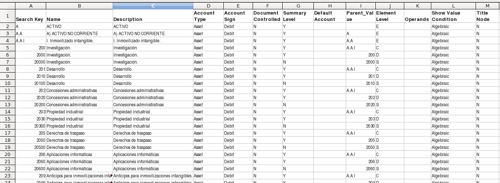
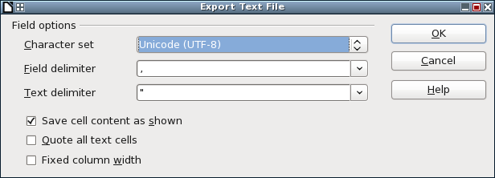
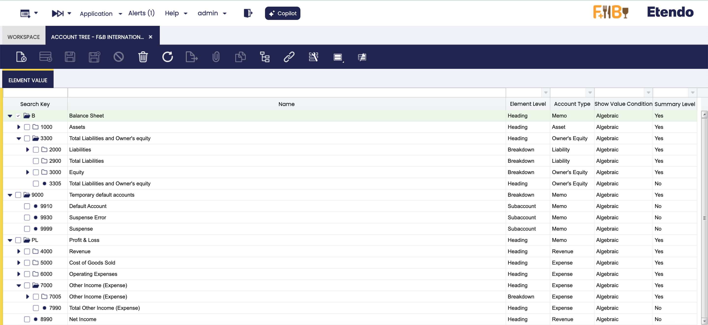

# How to Create Accounts Files

## Overview
Etendo supports importing the Chart of Accounts through a [CSV](https://en.wikipedia.org/wiki/Comma-separated_values){target="\_blank"} (comma-separated values) file with a concrete structure. This CSV file is afterward included into a module that can be distributed and installed from [Etendo marketplace](https://marketplace.etendo.cloud/#/){target="\_blank"}.

To create the CSV file, it is recommended to use any spreadsheet sofware that supports exporting to CSV, like [LibreOffice Calc](https://www.libreoffice.org/){target="\_blank"}.

## File Structure

The file is a plain text file, with commas (,) as field separator, that defines all the accounts. To ensure that your chart of accounts is imported correctly, the file must be encoded using [UTF-8](https://en.wikipedia.org/wiki/UTF-8){target="\_blank"} charset.

For creating your own CSV file, you can either download the [Spanish Chart of Accounts CSV file](../../../assets/developer-guide/etendo-classic/how-to-guides/COA.csv) and use it as a template to adapt it to your needs, or you can create the entire file from scratch.

Each field of the file comprises one line.

| Field Name          | Description                                                       | Mandatory | Length and type                |
|---------------------|-------------------------------------------------------------------|-----------|--------------------------------|
| Search key           | This is the unique identifier that defines the account.           | Yes       | Up to 20 alphanumeric characters |
| Name                | The name of the account                                           | Yes       | Up to 60 characters            |
| Description         | Brief description for the account                                 | No        | Up to 255 characters           |
| Account Type        | Defines the type of the account. Defines the type of the account. It can contain any text, but only the first character is used. This first character must be one of the following:  <ul><li>A:Asset</li><li>L:Liability</li><li>O:Owner's equity</li><li>E:Expense </li><li>R:Revenue</li><li>M:Memo</li></ul>                                | Yes       | Any length but only the first character is used. |
| Account Sign        | Defines the sign of the account in the reports. An account has got two columns: debit and credit. Amounts are added to one of the columns in each entry. At the end of the day, one account will have got two amounts: debit and credit amounts. The sign of the whole account (due to debit and credit movements) can be established following one of the next rules: <ul><li>N: Natural (Sign is always positive) </li><li>D: Debit (Sign is positive if debit amount is higher than credit one; negative in other case)</li><li>C: Credit (Sign is positive if credit amount is higher than debit one; negative in other case)</li><li>E: Empty</li></ul>                  | Yes       | Any length but only the first character is used. |
| Document Controlled | If this is a default account used in the general ledger configuration type "Yes". Otherwise, type "No". The fields with this field set to Yes are processed during the Initial Client Setup process | Yes | Must be Yes, No or Empty |
| Account Summary     | This field is defines the account as a summary account.           | Yes       | Must be Yes, No or Empty      |
| Default Account     | See below for details.                                             | Yes       | See below the set of valid values |
| Parent_Value        | Defines the account's parent account. The parent is ignored during the Initial Client Setup process.                             | No        | Must be the search key of a valid summary account |
| Element Level       | Defines the level of the account.  The last level that correspond with Account Summary = N, must be S (Subaccount). Any other level can be added to the existing ones. As they are defined in the dictionary as a reference list, you can edit this list and modify the values shown for this field, setting all the new values you need. The only thing that must be noted is that the lowest level must be 'S' Subaccount, as accounting reports uses this value.Following levels are defined by default in the Etendo Classic:<ul><li>C: Account</li><li>D: Breakdown</li><li>E: Heading</li><li>S: Subaccount</li></ul>                                 | No        | Unlimited but only the first letter is used. |
| Operands            | If the account is the product of a calculation between other accounts, you can define the operands here. For example, if the value of account A is the result of adding the value of accounts B and C, the value of the operand column in the chart of accounts would be B+C. This feature works only if referred operands are already inserted before, otherwise system can not find them when trying to insert them. | No | Unlimited |
| Show Value Condition | User can, optionally, set here the value for "Show Value Condition" field of the Element Value tab. | No | Positive, Negative, Algebraic (default value if empty cell) |
| Title Node          | User can, optionally, activate here the flag "Title Node" of the element value tab. | No | Yes, No (default value if empty cell) |

## Which accounts must be defined?

How you define your accounts file depends primarily on whether there are official rules in your country. For example, in countries like France or Spain there are standard charts of accounts and general accounting reports. In this case you must define a chart of accounts with the structure of the general accounting reports that include all the accounts. Other countries such as the USA have no defined plan, so you must define a general plan that suits your enterprise. The structure of the file must include the Balance Sheet (with Assets, Liabilities and Owner’s Equity) and a Profit and Loss report (with Expenses and Revenues).

## Accounts hierarchy

The general accounting report has a hierarchical structure. The Balance Sheet has two sides, following the equation Assets = Liabilities + Owner’s equity. The Asset side of the balance sheet is composed of different types of assets: Current Assets and Long Term Assets, and each one can have different sub-accounts.

The levels of this hierarchy can differ from one account tree to another; the only requirement is that the last level, where the accounting is done, must start with the letter S (from Sub-account).

The *Parent_Value* column of the accounts file creates the hierarchical relationship between accounts. This column specifies which account is the parent of the account.

## Default accounts

Etendo Classic makes most account entries automatically. To enable automatic account entries, it is necessary to define the default accounts. With this information, Etendo Classic builds the accounting entry with the account number defined in the chart of accounts.

The mandatory default accounts are defined in the chart of accounts file with a constant that must be written literally in the *Default Account* column. The following table has an explanation of these accounts.

| Default                 | Type           | Description                                                             | Example of name of the account                                   |
|-------------------------|----------------|-------------------------------------------------------------------------|-------------------------------------------------------------------|
| A_ACCUMDEPRECIATION_ACCT | Asset          | Account used by the amortization process to show the depreciation of an asset | Accumulated Depreciation                                        |
| A_DEPRECIATION_ACCT      | Expense        | Account used by the amortization process to define the lost of value caused by the depreciation of an asset | Depreciation Expense                                             |
| B_ASSET_ACCT             | Asset          | The account used for the movements of a bank account                    | Bank Account                                                     |
| B_EXPENSE_ACCT           | Expense        | Charges made by the bank                                                | Bank charge                                                      |
| B_INTRANSIT_ACCT         | Asset          | Account used for the period between the settlement and the bank statement registration | Bank in transit                                                  |
| B_REVALUATIONGAIN_ACCT   | Revenue        | Account for the revenues due to gain for revaluations of foreign money | Bank revaluation gain                                            |
| B_REVALUATIONLOSS_ACCT   | Expense        | Account for the expenses due to loss for revaluations of foreign money | Bank revaluation loss                                            |
| C_RECEIVABLE_ACCT        | Asset          | Account for the payments to be received from an invoice. They are created in the invoice process and canceled when the payment is made or canceled.                | Accounts receivable                                              |
| C_PREPAYMENT_ACCT        | Asset          | The Customer Prepayment account indicates the account to be used for recording prepayments from a customer. Any payment against an order or any payment generating credit is considered as a prepayment. | Customer Prepayment                                              |
| CB_ASSET_ACCT            | Asset          | Account for the petty cash used by the company                         | Petty Cash                                                       |
| CB_CASHTRANSFER_ACCT     | Asset          | Account used for the money transferred from or to petty cash           | Petty Cash In-Transfer                                           |
| CB_DIFFERENCES_ACCT      | Expense        | Accounts for differences in petty cash                                 | Petty Cash differences                                           |
| CURRENCYBALANCING_ACCT   | Expense        | Account used for currency balancing (rounding)                         | Currency balancing                                               |
| DEFAULT_ACCT             | Expense        | Account used when there is not a defined account for other default     | Default account                                                  |
| INCOMESUMMARY_ACCT       | Owner's Equity | Account used to calculate the income for the period. Also it is used to show the income in the balance sheet before the closing process | Income summary                                                   |
| NOTINVOICEDRECEIPTS_ACCT | Liability      | Account used for the receipts that haven't been invoiced yet. It is used only if the company is configured to account shipments | Not invoiced receipts                                            |
| P_ASSET_ACCT             | Asset          | Account used for fixed assets                                          | Product asset                                                    |
| P_COGS_ACCT              | Expense        | Account for the cost of the good sold. It is used in the shipment of the product | Cost of goods sold                                               |
| P_COGS_RETURN_ACCT       | Expense        | Account for the cost of the good return. It is used in the shipment of a return of a product | Cost of goods returned                                           |
| P_EXPENSE_ACCT           | Expense        | Account used for the expenses from purchase invoices                   | Service costs                                                    |
| P_INVOICEPRICEVARIANCE_ACCT | Expense     | Invoice price variance                                                  | Invoice price variance                                           |
| P_REVENUE_ACCT           | Revenue        | Account used for the revenues from sale invoices                       | Sales                                                            |
| P_REVENUE_RETURN_ACCT    | Revenue        | Account used for the returns from sale invoices                        | Returns                                                          |
| RETAINEDEARNING_ACCT     | Owner's Equity | Account used for profits and losses of previous periods. It receives the value of income summary if it is defined | Retained earnings                                                |
| SUSPENSEBALANCING_ACCT   | Memo           | Account used in the accounting process if the accounting entry is not balanced and it is defined to produce an accounting entry | Suspense Balancing                                               |
| SUSPENSEERROR_ACCT       | Memo           | Account used when the accounting process produces an error and it is defined to produce an accounting entry | Suspense Error                                                   |
| T_CREDIT_ACCT            | Asset          | Tax that is due to the company                                         | Tax Receivables                                                  |
| T_CREDIT_TRANS_ACCT      | Asset          | Transitory Account for the Cash VAT that is not yet paid to the company | Tax Transitory Receivables                                       |
| T_DUE_ACCT               | Liability      | Tax owed by the company                                                 | Tax Due                                                          |
| T_DUE_TRANS_ACCT         | Liability      | Transitory Account for the Cash VAT that is not yet collected by the company | Tax Transitory Due                                               |
| V_LIABILITY_ACCT         | Liability      | Account for the payments due for an invoice. They are created in the invoice process and cancelled when the payment is made or cancelled | Accounts payable                                                 |
| V_PREPAYMENT_ACCT        | Liability      | The Vendor Prepayment Account indicates the account used to record prepayments from a vendor. Any payment against an order or any payment generating credit is considered as a prepayment. | Vendor Prepayment                                                |
| W_DIFFERENCES_ACCT       | Expense        | Gains or losses due to differences in the inventory                    | Inventory loss                                                   |
| W_INVENTORY_ACCT         | Asset          | Account used for recording the value of your inventory                 | Inventory Asset Account                                          |
| WRITEOFF_ACCT            | Expense        | Account used for irrecoverable amounts                                 | Bad debts                                                        |

## Exporting the Chart of Accounts to the CSV file

Once we have entered all the accounts into our spreadsheet, it is time to export it to a CSV file. When exporting, the software will allow you to configure the concrete CSV format to use. It is important to ensure the following values are entered:

- Character set: *UTF-8*
- Field delimiter: , (comma)
- Text delimiter: " (double quote)

!!!note
    If you afterward want to edit this CSV file in your spreadsheet software, remember to use this configuration when opening it.

## Chart of accounts in Etendo Classic

After the [Initial client setup process](How_to_run_an_initial_client_setup_process.md), the user can find the corresponding Chart of accounts in the *Account Tree* window of Etendo Classic.

---

This work is a derivative of [Creating Account Files](https://wiki.openbravo.com/wiki/Creating_Accounts_Files){target="\_blank"} by [Openbravo Wiki](http://wiki.openbravo.com/wiki/Welcome_to_Openbravo){target="\_blank"}, used under [CC BY-SA 2.5 ES](https://creativecommons.org/licenses/by-sa/2.5/es/){target="\_blank"}. This work is licensed under [CC BY-SA 2.5](https://creativecommons.org/licenses/by-sa/2.5/){target="\_blank"} by [Etendo](https://etendo.software){target="\_blank"}.