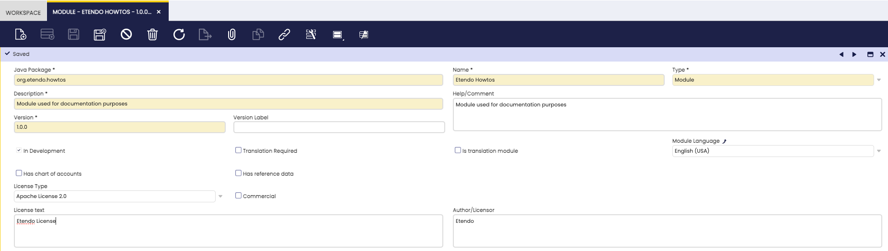
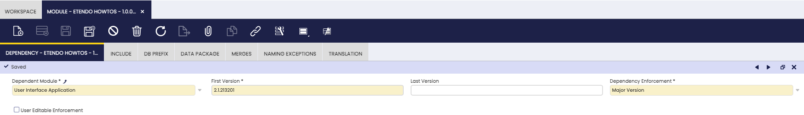
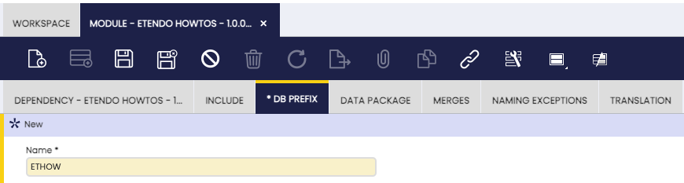
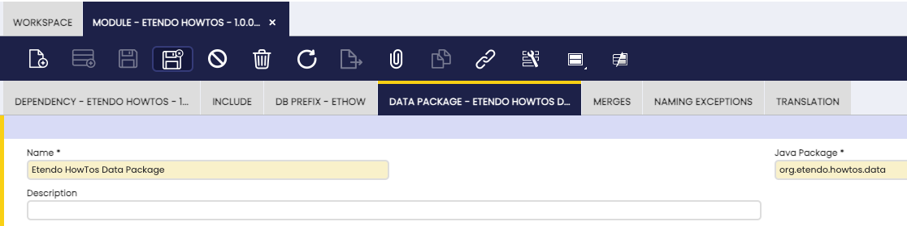

#  How To Create a Module

##  Overview

Etendo uses the concept of Modularity. Modularity provides developers with the means to be able to develop, publish and distribute their work in a structured and controlled manner. For users of Etendo Classic, Modularity makes it possible to download, install and update custom developments.

This section describes how to create a new module. It is of particular interest as it describes the first steps which should be followed in all of the other sections in this developer's guide and in Etendo Classic custom development in general.

##  Introduction to Modularity

The objectives of modularity are:

  * To make it easier to contribute to Etendo Classic by allowing distributed and decoupled development and maintenance of optional features. 
  * To provide the community with a rich set of extensions to meet their unique business requirements without bloating the core product. 
  * To shorten the implementation cycles by enabling system integrators to develop very specific functionality to meet the unique needs of a particular market. 

A module is a piece of additional functionality that can be deployed optionally and independently on top of Etendo Classic. Examples of modules are:
additional reports, additional windows, connectors, content packs (translations, chart of accounts, list of tax codes, product categories, etc).

!!!info
    For a detailed description on the Etendo Classic modularity concept, see the [Modularity Guide](../concepts/Modularity_Concepts.md).

This section explains only the standard module type, because that is most relevant for the other sections.

All new development should be done as a part of a module. Only modules which are marked as _In Development_ can be used in the development process. A module can consist of the following software artifacts:

  * Application dictionary components: all new application dictionary artifacts must be associated with a module. Application dictionary windows have a field that enables you to link an application dictionary component to a module. 
  * Software resources: these are artifacts not defined in Etendo Classic itself but, for example, Java classes, libraries, web resources (images, etc.), configuration files, etc. To maintain the relationship with the module, software resources need to be located in the module's directory inside the Etendo Classic development project. Each module has its own unique directory. 
  * Reference data: modules can be distributed with their own set of reference business data, for example, product categories, tax code, etc. The reference data is defined in datasets which can be related to a module. 

The process of developing a module has three main steps:

  1. Register your module in the Application Dictionary and in your github repository.
  2. Develop the artifacts included in your module. Depending on the functional specification and technical design of your module, it might include only one type of artifacts or a combination of them. In following sections, each type of artifact is described in detail. 
  3. Publish the module in your github repository.

!!!Important
    Every piece of Etendo Classic code belongs to a module, including Etendo Classic core itself. You should do all your developments through modules, including customizations. You can make changes directly in other modules -including Etendo Classic core- but it is highly recommended not to do that. It makes it much easier to maintain Etendo Classic if you restrict code changes to modules.

A module can be distributed and downloaded by other Etendo Classic users via the central repository. For more information about the central repository and distribution of modules, visit the [Modularity Guide](../concepts/Modularity_Concepts.md).

The following sections discuss the main topic of this section: create and setup a module, and [publish it for distribution](how-to-publish-modules-to-github-repository.md).

##  Creating a Module

The first step in the development process is to create a new module. From the Application menu, select `Application Dictionary` > `Module`.



Note the following important fields: (for more details see the  AD_Module table description):

  * The format of the Version field is three numbers separated by two dots. 
  * The Java Package is a unique identifier of your module and has to match the Java package naming rules as described in the  Java Naming Conventions  (names and package names). Be careful when setting this value as you are not allowed to change it once your module is registered in the central repository. If your module includes Java files, they have to be packaged within your module's Java package or in its sub-packages. Examples of Java packages for a module are _org.etendo.howtos_ , _com.etendoerp.examples.helloworld_ , _com.yourcompany.yourPackage_ , _org.yourfoundation.yourPackage.yourSubpackage_ , etc. 
  * The In Development option informs the system that you are developing the module. Only modules in development are exported by development tools and the system will raise an error if you try to modify a component of a module that is not in development. 
  * The Default field option for a module marks that module as the one which is selected by default when developing and when editing components in the Application Dictionary. You may be developing more than one module at any one time, and specifying a default enables the module you want to be selected by default. 
  * Select the Translation Required option if your module contains UI artifacts (window, field) with translatable elements. 

The tabs at the bottom of the window enable you to define the module further:

  * Dependency: defines the module's dependency on other modules. 
  * Include: is used by industry templates/packs. 
  * DB Prefix: relates database schema artifacts to modules. 
  * Data Package: allows you to groups tables together. Data packages are used to determine the Java package generated Java code (business objects). 
  * Naming Exceptions: is used during upgrades of previous versions of Etendo Classic. It should not be used for any other purpose. 
  * Merges: If this module A does now include the content of another module B previously published independently (So module B was merged into module A). 
  * Translation: is used for supporting translations. 

  
In this section, we create an example module, called _Etendo Howtos_ .
We will define the module using the following three tabs of the `Application Dictionary` > `Module` window:

  * Dependency
  * DB Prefix
  * Data Package

Dependency: Etendo Classic core functionality is in itself a module, called _Core_. All modules have a dependency on User Interface Application and in turn, it has a dependency on Etendo core. In the Dependency window, specify that the module is dependent on User Interface Application. (see also the  AD_Module_Dependency description):



  
DB Prefix: at least one db prefix is required when a module also contains database artifacts (table, column, constraints, etc.). Etendo Classic determines the module of a database artifact by checking to see if its name starts with one of the defined db_prefixes. If database artifacts will be added to the module, at least one DB prefix must be specified.

!!!important
    DB Prefix can only contain uppercase [A-Z0-9] and the first letter is required to be from [A-Z] only.  

  


!!!info
    For more information, see the  AD_Module_Dbprefix  table description.

  
Data Package: Tables are linked to a module through the Data Package. The generated business object for the new table will use the Java Package defined in the  Data Package. If new tables are to be added to the module, a data package must be specified as illustrated in the image below.




##  Develop your software artifacts

Now, let's see how to develop the software artifacts required for the functionality of the module. While developing, the relation to the module is maintained in different ways:

  * Direct: for example, a Window is directly related to a specific module. 
  * Indirect: a table belongs to a data package which again belongs to a module. 
  * By name: a new stored procedure is linked through a module by prefixing it with the _DB\_Prefix_ of the module. 

When the custom development is ready, the next step is to export the module.

##  Exporting a Module

Exporting a module creates a directory for your module under Etendo Classic root directory and the appropriate XML files for inclusion in the finished module. Modules that are not flagged as being in development are not exported.

!!!note
    Remember that you must select the In Development checkbox when you define a new module, otherwise it will not be exported.

When the development of the module is finished (or to deliver intermediate results), open a command window/shell and navigate to the Etendo Classic development project execute the `./gradlew export.database` command.

!!!important
    Export database task will export all and only the modules set as in Development  
    `./gradlew export.database`
    
Since we do not have any additional developments yet, only the corresponding
folder structure and the module descriptor XML files have been created at this
point.

```
modules
    └── org.etendo.howtos
        └── src-db 
            database
               └── sourcedata
                   ├── AD_MODULE_DBPREFIX.xml
                   ├── AD_MODULE_DEPENDENCY.xml
                   ├── AD_MODULE.xml
                   └── AD_PACKAGE.xml
```

  
Etendo Classic validates the database and module artifacts of a module when the module is exported and its build file is created. See more information on the [database validation step](../concepts/Development_Build_Tasks.md).

!!!info
    For a detailed description of this `export.database` task and other relevant Module related gradle tasks, see the [database gradle tasks](../concepts/Development_Build_Tasks.md#database_tasks) and [module gradle task](../concepts/Development_Build_Tasks.md#Modules) descriptions.


##  Creating a Source Directory

To develop manual Java code you need a _src_ directory inside of your specific module:

```
modules
    └── org.etendo.howtos
        ├── src 
        │   └── org
        │       └── etendo
        │           └── howtos
        │                └── 
        └── src-db
            └──[...]
```
  
The Java package in the source directory should start with the Java package of the module.

## Publishing a Module

Once the module is created and documented, the next step is to publish it for it to be available.

For detailed information about this process, visit the [How to Publish Modules to Github Repository guide](how-to-publish-modules-to-github-repository.md)

##  The Result

The result of this section is a correctly set up module, which can be installed in an Etendo Classic instance that meets the module's requirements.

---

This work is a derivative of [How to Create and Package a Module](http://wiki.openbravo.com/wiki/How_To_Create_and_Package_a_Module){target="\_blank"} by [Openbravo Wiki](http://wiki.openbravo.com/wiki/Welcome_to_Openbravo){target="\_blank"}, used under [CC BY-SA 2.5 ES](https://creativecommons.org/licenses/by-sa/2.5/es/){target="\_blank"}. This work is licensed under [CC BY-SA 2.5](https://creativecommons.org/licenses/by-sa/2.5/){target="\_blank"} by [Etendo](https://etendo.software){target="\_blank"}.