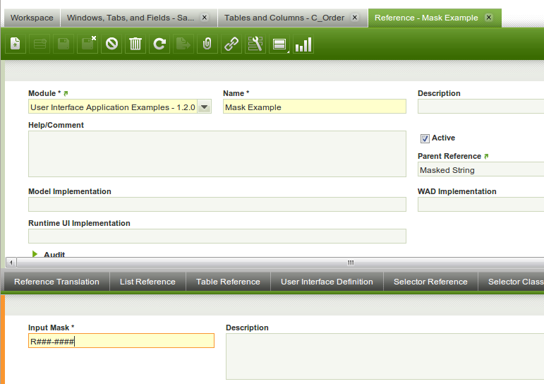
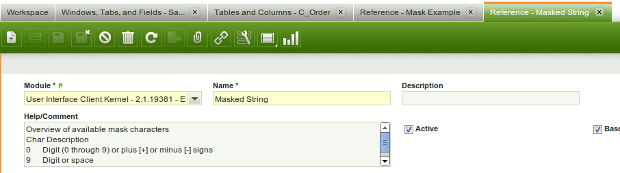
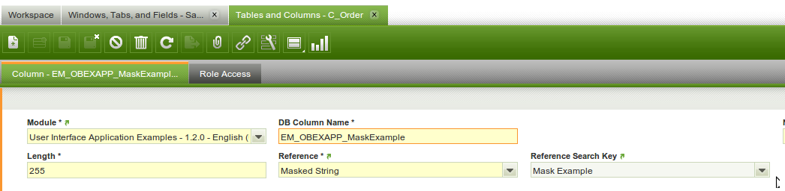
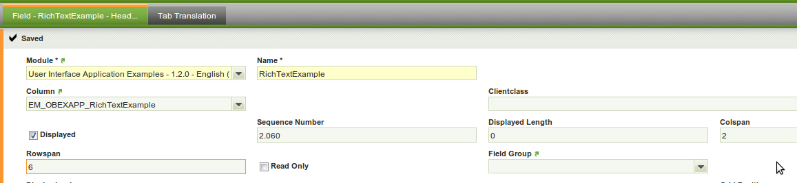
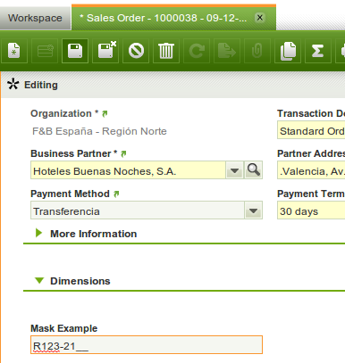

#  How to add a masked text field

!!! example "IMPORTANT: THIS IS A BETA VERSION"
    It is under active development and may contain **unstable or incomplete features**. Use it **at your own risk**.

##  Overview

This section explains how to add a **masked text field and column** to the Etendo system. A masked  text can be used to force the user in entering text/string values in the correct format.

The steps to get a masked text field in the window consists of the following steps: 

- 1) create a reference defining the mask, 
- 2) add a column to a table using the reference, and 
- 3) add a field to a tab.

The last 2 steps are defined in detail in the following sections:

  * [How to Add a New Column to a Table in the system](../how-to-guides/how-to-add-columns-to-a-table.md).

  * [Define and How to Add a new Field to a Tab](../how-to-guides/how-to-add-a-field-to-a-window-tab.md).

This section will only focus on the specific parts of a **masked text field**.
 
  
##  Example Module

This section is supported by an example module which shows example of the code shown and discussed in this section.

The example module adds a mask text field to the sales order header window.

The code of the example module can be downloaded from this mercurial
repository:
https://code.openbravo.com/erp/mods/org.openbravo.client.application.examples/   ??? (sitio no disponible)

  
##  Defining the Mask Reference

The first step is to create a specific reference for the mask and then set the mask in the **mask reference child** tab.

The mask reference must have the `Masked String` as the parent reference and can not be a base reference. Then create a record in the **Mask Reference** child tab defining the mask.

  

  
For information on how to define a mask see the description in the 'Masked String' parent reference.

##  Adding a column

To get a mask text field, the first thing to do is to select the **correct reference and reference search key** when  adding a column:

  
##  Create a field

Then, create a field  within the tab/window:

  
##  The result

The result is visualized as a masked text editor in form view:

  

This work is a derivative of [How to Add a Masked Text Field](http://wiki.openbravo.com/wiki/How_to_add_a_masked_text_field){target="\_blank"} by [Openbravo Wiki](http://wiki.openbravo.com/wiki/Welcome_to_Openbravo){target="\_blank"}, used under [CC BY-SA 2.5 ES](https://creativecommons.org/licenses/by-sa/2.5/es/){target="\_blank"}. This work is licensed under [CC BY-SA 2.5](https://creativecommons.org/licenses/by-sa/2.5/){target="\_blank"} by [Etendo](https://etendo.software){target="\_blank"}.

  

