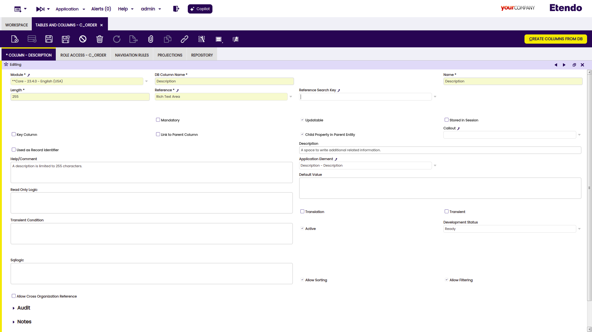
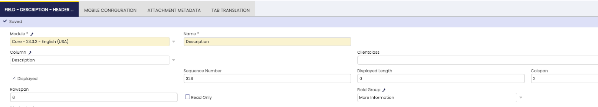
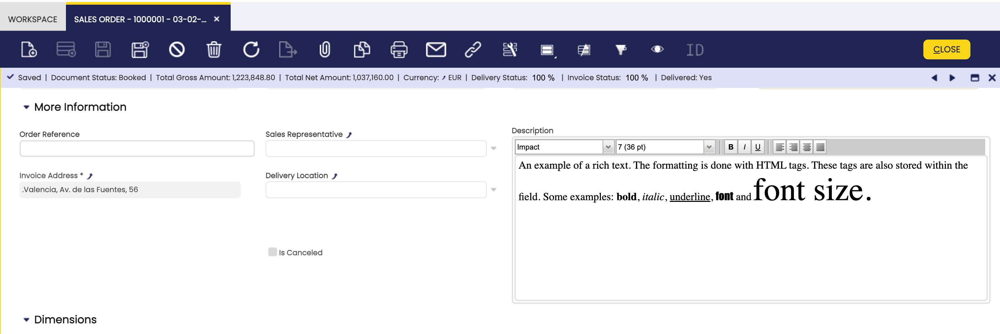

#  How to Add a Rich Text Field and Column
 
  
##  Overview

This How-to section explains how to add a rich text field and column to the Etendo Classic.

The steps to get a rich text field in your window consists of two steps: 

- [Add a column to a table](/developer-guide/etendo-classic/how-to-guides/How_to_add_Columns_to_a_Table/)
- [Add a field to a tab](/developer-guide/etendo-classic/how-to-guides/How_to_add_a_field_to_a_Window_Tab/)

You can also create a new table and a new window/tab ofcourse.
This how-to will only focus on the specific part of a rich text field.

  
##  Example 

For this how-to, we will use the redefine the description field in the sales order window. So, you may need to do a *smartbuild* after the changes to see the result.

  
###  Adding a column

First, you have to [add a column to the existing table](../../../developer-guide/etendo-classic/how-to-guides/How_to_add_Columns_to_a_Table.md).

!!!note
    As rich text is stored as HTML inside the database, the varchar column type
    should be used. What is more, the developer needs to keep in mind that 100
    characters of rich text requires more that 100 chars of storage inside the
    database due to html markup. Usually, a factor of 2 will suffice, for example,
    if one wants to allow the user to enter 1000 characters of rich formatted
    text, the database column should have a type of varchar(2000).  

  
When introducing the new column to the application dictionary, the correct
reference must be selected, i.e. the new _Rich Text_ reference:

###  Create a field - set col and rowspan

Then [create a field](/developer-guide/etendo-classic/how-to-guides/How_to_add_a_field_to_a_Window_Tab/) within the tab/window. For a rich text field you can
also set the col and rowspan (these are only shown when the corresponding
column is defined as rich text):

 

###  The result

The result is visualized as a rich text editor in form view:

 

  

!!!info
    Rich text fields can not be edited in grid mode (a hoover shows the
    content). They are always displayed as read-only fields.  

  

This work is a derivative of [How to add a rich text field and column](http://wiki.openbravo.com/wiki/How_to_add_a_rich_text_field_and_column){target="\_blank"} by [Openbravo Wiki](http://wiki.openbravo.com/wiki/Welcome_to_Openbravo){target="\_blank"}, used under [CC BY-SA 2.5 ES](https://creativecommons.org/licenses/by-sa/2.5/es/){target="\_blank"}. This work is licensed under [CC BY-SA 2.5](https://creativecommons.org/licenses/by-sa/2.5/){target="\_blank"} by [Etendo](https://etendo.software){target="\_blank"}. 

