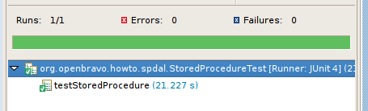

#  How to call a stored procedure from the DAL

!!! example "IMPORTANT: THIS IS A BETA VERSION"
    It is under active development and may contain **unstable or incomplete features**. Use it **at your own risk**.
  
##  Overview

This section shows how to execute a database stored procedure using the [Data Access Layer](../concepts/data-access-layer.md) (DAL). The example uses the generate shipments for invoices stored procedure and runs the code inside a JUnit test case. ???

The code can however also be run inside Etendo (in a servlet). All new developments must belong to a module that is not the **core** module.

!!!info
    For more information about how to create a new module visit, [How to create a module](../how-to-guides/how-to-create-a-module.md). 

##  Notes

The DAL has been extended with two utility classes which make it easier to call processes and stored procedures through the DAL:  
  
  
  * CallProcess 
  * Call Stored Procedure 

These classes make use of the **same database connection as the DAL** in addition, instead of working with String parameters it is possible to work with the java (primitive) objects directly.  ???

This section does not make use of the above classes as it provides a more detailed description on how to call database level logic directly.

Another interesting read (when doing direct database updates outside of Hibernate) is the following section in the trouble shooting guide: **changes not visible in the DAL after calling stored procedure**.

##  Setup a test case

The **test case** is created inside of the module directory of the new module. This directory is located inside the modules directory of the Etendo development project. To create a new source folder in Eclipse right-click on
the project and select **New** and then **source folder**. Note the actual folder name depends on the java package set for the module.

  

  
In the source folder create a new package called: `org.openbravo.howto.query` (right click on the new folder and select New > package). Inside this package create a java file `StoredProcedureTest.java`. This file has the following content:    ???

    
    
    package org.openbravo.howto.spdal;
    
    import org.openbravo.test.base.OBBaseTest;
    
    /**
     * Stored Procedure from DAL howto
     */
    
    public class StoredProcedureTest extends OBBaseTest {
    
      public void testStoredProcedure() {
        setUserContext("100");
    
        // here we will be doing our stuff...
    
        commitTransaction();
      }
    }
    

  
This test case inherits from the  `OBBaseTest`  class provided by Etendo. The `OBBaseTest` class provides a user context and transaction handling. There is one test method in the class: `testStoredProcedure`. This method first selects the user context. It is possible that this needs to be different for your installation. The selected user must be allowed to create `ProcessInstance` records in the db. The **commitTransaction()** at the end commits the transaction, if an exception occurs during the test then this statement will not be executed and the transaction is automatically rolled back.

Right-click the `java file` in Eclipse and then run as > junit testcase, see the greenbar in the junit view:

  

  
This is the main testcase setup. The next section will add some code to the testcase to call the stored procedure in the correct way.

##  Calling the stored procedures

The main business logic of Etendo is implemented in stored procedures. Some stored procedures can be called directly through `jdbc`. But for other stored procedures first create a **special record** (the `PInstance`) and its related parameters. 

!!!info
    For more information visit, [How to develop a stored procedure](../how-to-guides/how-to-create-a-stored-procedure.md). This section describes how to create the `ProcessInstance` record and Parameter through the DAL and then execute a stored procedure.

This is the complete method, each part is discussed separately below:

    
    
      public void testStoredProcedure() {
        setUserContext("100");
    
        // get the process, we know that 199 is the generate shipments from invoice sp
        final Process process = OBDal.getInstance().get(Process.class, "199");
    
        // Create the pInstance
        final ProcessInstance pInstance = OBProvider.getInstance().get(ProcessInstance.class);
        // sets its process
        pInstance.setProcess(process);
        // must be set to true
        pInstance.setActive(true);
        pInstance.setRecordID("0");
        // get the user from the context
        pInstance.setUserContact(OBContext.getOBContext().getUser());
    
        // now create a parameter and set its values
        final Parameter parameter = OBProvider.getInstance().get(Parameter.class);
        parameter.setSequenceNumber("1");
        parameter.setParameterName("Selection");
        parameter.setString("Y");
    
        // set both sides of the bidirectional association
        pInstance.getADParameterList().add(parameter);
        parameter.setProcessInstance(pInstance);
    
        // persist to the db
        OBDal.getInstance().save(pInstance);
    
        // flush, this gives pInstance an ID
        OBDal.getInstance().flush();
    
        System.err.println(pInstance.getId());
    
        // call the SP
        try {
          // first get a connection
          final Connection connection = OBDal.getInstance().getConnection();
          // connection.createStatement().execute("CALL M_InOut_Create0(?)");
          final PreparedStatement ps = connection.prepareStatement("SELECT * FROM M_InOut_Create0(?)");
          ps.setString(1, pInstance.getId());
          ps.execute();
        } catch (Exception e) {
          throw new IllegalStateException(e);
        }
    
        // refresh the pInstance as the SP has changed it
        OBDal.getInstance().getSession().refresh(pInstance);
    
        System.err.println(pInstance.getResult());
        System.err.println(pInstance.getErrorMsg());
    
        commitTransaction();
      }
    

##  Explaining the logic

This part sets the user which runs the **stored procedure**. It is possible that this needs to be different for your installation. The selected user must be allowed to create `ProcessInstance` records in the db.

    
    
        setUserContext("100");
    

The following code reads the Process which will be run from the database. In this case we use **Process 199** which is the generate shipment process.

    
    
        final Process process = OBDal.getInstance().get(Process.class, "199");
    

Then create a new  `ProcessInstance`  instance and set its data:

    
    
        final ProcessInstance pInstance = OBProvider.getInstance().get(ProcessInstance.class);
        // sets its process
        pInstance.setProcess(process);
        // must be set to true
        pInstance.setActive(true);
        pInstance.setRecordID((long) 0);
        // get the user from the context
        pInstance.setUserContact(OBContext.getOBContext().getUser());
    

Note the way the current user is retrieved from the global `OBContext` object. See also how the process is set in the `pInstance`.

The process requires a  Parameter  which is created in the following step and linked to the `ProcessInstance` (and back):

    
    
        // now create a parameter and set its values
        final Parameter parameter = OBProvider.getInstance().get(Parameter.class);
        parameter.setSequenceNumber("1");
        parameter.setParameterName("Selection");
        parameter.setString("Y");
    
        // set both sides of the bidirectional association
        pInstance.getADParameterList().add(parameter);
        parameter.setProcessInstance(pInstance);
    

The next step is to persist the `ProcessInstance`, the Parameter will also automatically be saved because it is a child of the `ProcessInstance` business object. Hibernate caches database statements and sends them to the database when it is most appropriate. However, because as it is necessary to know the id (which is generated by the database) we force a flush of the Hibernate `sql` statements to
the database. The `System.err` should print a uuid.

    
    
        // persist to the db
        OBDal.getInstance().save(pInstance);
    
        // flush, this gives pInstance an ID
        OBDal.getInstance().flush();
    
        System.err.println(pInstance.getId());
    

The `ProcessInstance` has been created with its parameter. Now it is necessary to call the stored procedure. To accomplish the `jdbc` connection is retrieved from the DAL. The connection is the same one used by Hibernate for persisting the `ProcessInstance`, this ensure transaction acid behavior.

As the call is done through **raw** `jdbc` there is a different syntax for Oracle
and `Postgresql`. The last step, before executing, is to set the `pInstanceId` as a parameter in the `PreparedStatement`.

    
    
        // call the SP
        try {
          // first get a connection
          final Connection connection = OBDal.getInstance().getConnection();
          // This is the way to call the SP in Oracle 
          // connection.createStatement().execute("CALL M_InOut_Create0(?)");
          
          // This is the correct Postgresql format
          final PreparedStatement ps = connection.prepareStatement("SELECT * FROM M_InOut_Create0(?)");
    
          // Set the ProcessInstance id
          ps.setString(1, pInstance.getId());
          ps.execute();
        } catch (Exception e) {
          throw new IllegalStateException(e);
        }
    

The stored procedure will update the `ProcessInstance` record in the database with a result code and an error message. As Hibernate does not detect this automatically, it is necessary to refresh the instance we have in-memory. Then, call the methods on the instance to obtain the result:

    
    
        // refresh the pInstance as the SP has changed it
        OBDal.getInstance().getSession().refresh(pInstance);
    
        System.err.println(pInstance.getResult());
        System.err.println(pInstance.getErrorMsg());
    
        commitTransaction();
    

##  The result

The logic has been explained, so let's now run the **testcase**. Again do run as > junit testcase (note: you can also do debug as > junit testcase to step through the code).

You should see an output as follows:

    
    
    FF80818120000E9A0120000EC00B0002
    0
    

The result **0** normally means that an error occurred, however with this stored procedure, it means that no data was processed. Depending on the dataset this can occur.

If an error occurred, then it should be present in the `pInstance.getErrorMsg`.

This work is a derivative of [How to Call a Stored procedure from the DAL](https://wiki.openbravo.com/wiki/How_to_call_a_stored_procedure_from_the_DAL){target="\_blank"} by [Openbravo Wiki](http://wiki.openbravo.com/wiki/Welcome_to_Openbravo){target="\_blank"}, used under [CC BY-SA 2.5 ES](https://creativecommons.org/licenses/by-sa/2.5/es/){target="\_blank"}. This work is licensed under [CC BY-SA 2.5](https://creativecommons.org/licenses/by-sa/2.5/){target="\_blank"} by [Etendo](https://etendo.software){target="\_blank"}.

