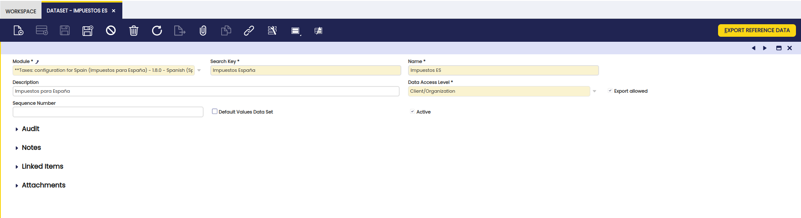

#  How to create a Dataset

  
##  Overview

This how-to will focus on creating a dataset in Etendo Classic and also will give some examples in detail under Examples section. Dataset will export both reference data as well as default data.

###  Introduction to Dataset Concept


  
First of all we need to understand the dataset concept, which allows to export
the sets of data from different tables in one step. This is especially useful
to manage and distribute the module along with _reference data_ , for instance
tax rates, regions or _default data_ in a new table(s) added by a module.

A dataset is defined by its Dataset Tables and Dataset Columns. This detailed
configuration leads to which tables to be exported, and which columns of each
table are executed and exported.

  
There are some important things to note:

  * A Dataset belongs to a module, so modules can add Datasets and define their own Datasets. 
  * Data Access Level: filters the tables which can be selected for this dataset, only tables with the set data access level can be included in the data set (see  _Data Access Level_ section for more information). 

  
  
###  Reference Data

The reference data is published, distributed and installed together with the
program code implementation of the module.

In Etendo, the concept of reference data is generalized and any data
in the instance can be exported in a module and imported when installing /
applying the module.

!!!note
    You can find the _Has reference data_ field / option at the time of module
    creation.

!!!info
    For detailed theoretical concepts on datasets please have a look at [Datasets](/developer-guide/etendo-classic/concepts/Datasets/). 
 
##  Data structure to define Dataset

There are mainly three tables referred to as data structure to define datasets. They
are:

1\. *DataSet* with the following columns: _Value, Name, Description, Module
and DataAccessLevel_

  * Data sets have a name and a description to describe the content of the data set. 
  * The value is used to get a dataSet object from the factory provided by DAL (eg. DBSourceManager gets the AD dataSet). 
  * A data set is owned by a module in the same way that all Application Dictionary components. 



    

!!!note
    If the export allowed column is flagged, then an **Export Reference Data** button is displayed. 
    

2\. *DataSet_Table* with the following columns: _DataSet, Table,
fullBusinessObject, includeAllColumns, excludeAuditInfo and whereClause (HQL
expression)_

  * A data set can have one or many tables from the ones registered in the `AD_Table`. For each of them developers can decide to include only records in that table or export the full business object using the check `fullBusinessObject`. 
  * Developers can also define for each table the columns that are included in the dataset. They can include all columns using the `includeAllColumns` check and then remove some of them in the column definition or only include the ones that are explicitly defined in the column definition. 
  * The whereClause is a *HQL expression* to filter the rows that are included in the DataSet. Details on this expression will be provided in the DAL project. 
  * Developers can exclude the audit information column like _created, createdby, updated, etc._ by checking the `excludeAuditInfo` column. 

  
    
!!!note 
    If IsBusinessObject field is flagged then the ` child-records ` of the table are exported.
    For example if the Dataset Table is defined for the ` C_Order ` table and this field is flagged then also the related ` C_OrderLines ` are exported. 
    

  
!!!info
    A full business object is a record including all its one-to-many relationships
    as defined in the AD through the isParent attribute of a column. An example of
    a full business object is a product with its vendors, prices, etc. A complete
    description of business objects is provided in the DAL project.

  
  
3\. *Dataset_column* with the following columns: *DataSet_Table, Column, isExcluded and conditionClause(Java expression)*.

  * For each table in a data set, developers can decide what columns to include from the ones registered in the AD for that table. 
  * They can exclude columns using the `isExcluded` check if they have marked the table as _Include all columns_ . Typically audit info will be removed from the dataset. 

   

###  Data Access Level

The Data Access Level is used to define how to import / install the module at
various levels, like System level, Client level, Organization level, etc. This
access level value is available at `Dataset` table. 

This is a detailed explanation at each access level.

  * _System Only:_ data will be imported at module installation time at System level without any user interaction. 
  * _Client:_ data will be imported at `Initial Client Setup` if the user chooses the module where the DataSet is included. 
  * _Organization:_ data will be imported at `Initial Organization Setup` if the user chooses the module where the DataSet is included. 
  * _Client/Organization:_ data will be imported at `Initial Client Setup` or `Initial Organization Setup` if the user chooses the module where the DataSet is included. The module can not be applied at both levels at the same time because it would lead to data redundancy. So if the module is applied to a Client it will not be available to apply in its Organizations and if the module is applied in an Organization it will not be available to apply in its Client. 
    
!!!info
    - The relationship between each entry data imported, the DataSet where it came 
    from, and the original ID it has in the DataSet's XML can be found in 
    the `AD_Ref_Data_Loaded` table.
    - Data from a DataSet being imported for the first time will be created 
    **with the ID set in its XML file**. A new ID will be created 
    for each entry from then on.
    - The `AD_Orginfo` table has information on which DataSet has ben imported 
    for which client and/or organization


##  Exporting Module

Before publishing, we need to export the module which creates a directory in the
module under Etendo Classic root directory and the appropriate XML files for
inclusion in the finished module. 

!!!note
    Modules that are not flagged as being in development are not exported, so remember that you must select the InDevelopment checkbox when you define a new module.

When the development of the module is finished, open a command window/shell
and navigate to the Etendo development project, execute the `export.database` command.

    
    
    ./gradlew export.database
    

##  Publishing a Module

The last step in the process is to publish the module and distribute across to
the end user.

For a detailed guide on how to do so, visit [How to Publish Modules to a GitHub Repository](how-to-publish-modules-to-github-repository.md)


##  Examples

Please find below the examples to know how to create a dataset and to export
it along with the reference data.

###  Dataset of roles and accesses

In this section you can find the example of a dataset of roles and access. It
basically covers the definition of the role in the organization and the
privileges they require.

**Create a Role and Assign Privileges**

  * Change to the admin role of your client. 
  * Click on `General Setup` and Navigate to `Security > Role`. 
  * Create a new record. Fill up the mandatory fields that required for this record. They are: 
    * `Name`: the name of the role in the customer organization e.i., Sales Clerk, Production Manager, Forecaster, etc. 
    * `Active`: Select Option to ensure this role appears in the generated application. During development you may require the role only to appear when it is complete. 
    * `User Level`: This controls which organizations the role has access to. There are four options, the most common are: 
        - `Organization`: the role only has access to organization specific data. 
        - `Client and Organization`: the role has access to organization specific data and client shared data. 
    * `Manual`: The controls if all existing privileges are automatically given to the role or if they are manually associated on a peer need basis. Selecting this option for manual control is recommended. 
  * Save the record. 
  * Now you need to assign some privileges by clicking on `Grant Access` button. 
  * select the module and access type to assign the privileges to the newly created role. 

#### Create a User and assign the user to the Role

  * Click on `General Setup` and navigate to `Security > User`. 
  * Create a new record. The `Client` field will show the name of your client by default. 
  * Select the Organization (This can be for access to one or all organizations in a client). 
    - First Name. 
    - Last Name. 
    - Name (Default). 
    - Select Active (Default). 
    - Username (The default is a concatenation of first and last name). 
    - Enter the user Password (Remember this). 
  * Save the record. 

  * Focus in the `User` window again
  * Select the `User Roles` tab. 
  * Create a new record and select a role. 
  * Save the record. 
  * Add all roles this new user will be able to have/use (one line for each role). 
  * Logout from the current role. 

#### Create a new module

  * Log into Etendo ERP as a System Administrator. 
  * Click on `Module` menu from the Application Dictionary. 
  * From the `Module Type` list, select Module. 
  * In the `Name` field, type the java package name of the module(proper naming convention). 
  * Complete the `Description` and `Help` fields. Supply the information about chart of accounts. 
  * Select the `Has reference data` option. 
  * Clear the `Has chart of accounts`, `Translation required` and `Is translation module` options. 
  * Select the In development option. Remember that you cannot work on a module unless the `In development` option is selected. 
  * On the `Dependencies` tab, select Core. 
  * Save the module 

#### Create a Dataset of roles and access

  1. From the Application menu, select `Application Dictionary > Dataset` 
  2. Click New. 
  3. From the `Module` list, select the module above created. 
  4. Specify a search key, name and description. 
  5. From the `Data Access Level` list, select the Data access level as *Organization*. 
  6. Select the `Export allowed` option. 
  7. Select the `Table` Tab.
  8. From the `Table` list, select the table whose content you want to include in the module. For example, ad_role_org_access, ad_role, ad_user_roles. 
  9. In the SQL where clause field, specify the SQL "WHERE" statement that will identify the set of rows to be exported, in DAL notation. For example, adrole.id='2EA831D59184490E9BA858E9745EF89F' 
  10. Select the `Include All Columns` option. 
  11. Select `isBusinessObject` option.
  12. Click Save. 
  13. Click the `Export Reference Data` button to export the reference data to an .xml file that you can include in the module. 

#### Exporting and Publishing Module

After completing all the steps successfully. Run the below gradle task to export the module:

    ./gradlew export.database
    

And publish the module ([How to Publish Modules to a GitHub Repository](how-to-publish-modules-to-github-repository.md))

  
#### How to Install - Organization Access Level Reference Data

  * Install the module following the [Install Modules in Etendo](../getting-started/installation/install-modules-in-etendo.md) guide.
  * At this point the reference data will not be installed. 
  * Log into the ERP as admin.
  * Click on `General Setup` and navigate to `Enterprise > Enterprise module Management`. 
  * Select the `Organization type` then select the appropriate module and click Ok to install the reference data. 

###  Dataset of taxes or alerts

In this section you can find the example on dataset of taxes or alerts. The
process for creating a standard reference data module for taxes and alerts,
you have set up Etendo ERP in a particular way to meet local requirements,
you can export this data and convert it to a module, so that you can share it
with other users.

#### Registering a data module for taxes and alerts:

  * Log into Etendo ERP as a System Administrator. 
  * Click on `Module` menu from the Application Dictionary. 
  * From the `Module Type` list, select Module. 
  * In the `Name` field, type the java package name of the module(proper naming convention). 
  * Complete the `Description` and `Help` fields. Supply the information about chart of accounts. 
  * Select the `Has reference data` option. 
  * Clear the `Has chart of accounts`, `Translation required` and `Is translation module` options. 
  * Select the `In development` option. Remember that you cannot work on a module unless the `In development` option is selected. 
  * On the `Dependencies` tab, select Core. 
  * Save the module.

#### Defining and exporting the dataset

  1. From the Application menu, select `Application Dictionary > Dataset` 
  2. Click New. 
  3. From the `Module` list, select the module above created. 
  4. Specify a `search key`, `name` and `description`. 
  5. From the `Data Access Level` list, select the Data access level as System only. 
  6. Select the `Export allowed` option. 
  7. Select the `Table` Tab.
  8. From the `Table` list, select the table whose content you want to include in the module. 
  9. In the `SQL where clause` field, specify the SQL WHERE statement that will identify the set of rows to be exported, in DAL notation. For example, client.id='1000001' 
  10. To export all columns, select the `Include All Columns` option. To include only the columns you specify, select the `Columns` tab and create a new record for each column you want to export. 
  11. To include the security audit columns (created, createdby, updated and updatedby) in the export, clear the `Exclude Audit Info` checkbox. 
  12. Clear the `Is Business Object` option. 
  13. Click Save.
  14. Click the `Export Reference Data` button to export the reference data to an .xml file that you can include in the module.

  
#### Exporting and Publishing Module

After completing all the steps successfully. Run the below gradle task to export
the module:
    
    ./gradlew export.database
    

And publish the module ([How to Publish Modules to a GitHub Repository](how-to-publish-modules-to-github-repository.md))

  
#### How to Install - System/Client Access Level Reference Data

  * Install the module following the [Install Modules in Etendo](../getting-started/installation/install-modules-in-etendo.md) guide.
  * At this point the reference data will not be installed. 
  * Log into the ERP as admin.
  * Click on `General Setup` and navigate to `Client > Initial Client Setup`. 
  * Fill up all the mandatory fields and then select the appropriate module. 
  * Finally click Ok to install the reference data. 

###  Dataset of regions

In this section you can export the reference data with the examples on
regions. Find below the steps to create the Dataset for this module:

  * Log into Etendo ERP as a System Administrator. 
  * Create a new module called _Indian States_ for this example. 
  * Make sure that you have selected or flagged for the field `Has Reference Data`. 
  * Now expand the `Application Dictionary` menu. 
  * Click on `Dataset` menu and create a new record for the for this module. 
  * For example, here the Name `Indian States` has been given. You can give a name as you wish to select the region. 
  * Fill up the Dataset form using the below mentioned values. 
    
    Field              |  value for the field   
    ---                |          ---  
    Active             |  make it flagged/put a tick mark  
    Module             |  select the value from the drop down _Indian States - 1.0.0_  
    Search Key         |  Indian States  
    Name               |  Indian States  
    Data Access Level  |  System Only  

  * Before assigning the tables to Dataset. Please execute the below query in sqldeveloper or postgres IDE to find the `C_country_Id` for INDIA. After executing the below query the result of `c_country_id` would be 208 for the below query. 

    ```sql
    select * from c_country where countrycode like 'IN%';
    ```

  * Navigate to `Table` Tab and create 2 new records for the dataset. 
  * Fill up the form by using the values below for the following Table: `C_Country`

    Field                |  value for the field   
    ---                  |          ---   
    Table                |  `C_Country`  
    Active               |  Default it is flagged. Leave as it is  
    Module               |  Indian States - 1.0.0  
    SQL Where Clause     |  id='208'  
    Include All Columns  |  Remove the flag or tick mark (Individual columns will be added in later steps)
    Exclude Audit Info   |  Mark it as flagged or put tick mark for this check box  

  * Fill up the form by using the values below for the following Table: `C_Region`

    Field                |  value for the field   
    ---                  |          ---  
    Table                |  `C_Region`  
    Active               |  Default it is flagged. Leave as it is  
    Module               |  Indian States - 1.0.0  
    SQL Where Clause     |  country.id='208'  
    Include All Columns  |  Mark it as flagged or put tick mark for this check box  
    Exclude Audit Info   |  Mark it as flagged or put tick mark for this check box  

  * Select the `C_Country` table from the table grid view and navigate to `Column` Tab. 
  * Click on create a new record button for the above table. You need to select three columns for this table. 
  * Those columns are:
      - Name
      - CountryCode
      - HasRegion 
  * Fill up the following values in the form. 

    Field   |  value for the field   
    ---     |          ---  
    **Column 1:**   
    Column  |  Name  
    Active  |  It has benn flagged. Leave as it is  
    Module  |  Indian States - 1.0.0  
    **Column 2:**  
    Column  |  CountryCode  
    Active  |  It has benn flagged. Leave as it is  
    Module  |  Indian States - 1.0.0  
    **Column 3:**  
    Column  |  HasRegion  
    Active  |  It has benn flagged. Leave as it is  
    Module  |  Indian States - 1.0.0  

  * Finally navigate to `Dataset Tab` of Indian States and Click on `Export Reference Data` button to export the data. 

  
#### Exporting and Publishing Module

After completing all the steps successfully, run the below gradle task to export
the module:
    
    ./gradlew export.database
    

And publish the module ([How to Publish Modules to a GitHub Repository](how-to-publish-modules-to-github-repository.md))

  
#### How to Install - System Only Access Level Reference Data

  * Install the module following the [Install Modules in Etendo](../getting-started/installation/install-modules-in-etendo.md) guide.
  * It will install along with the reference data. 


This work is a derivative of [How to Create a Dataset](http://wiki.openbravo.com/wiki/How_to_create_a_Dataset){target="\_blank"} by [Openbravo Wiki](http://wiki.openbravo.com/wiki/Welcome_to_Openbravo){target="\_blank"}, used under [CC BY-SA 2.5 ES](https://creativecommons.org/licenses/by-sa/2.5/es/){target="\_blank"}. This work is licensed under [CC BY-SA 2.5](https://creativecommons.org/licenses/by-sa/2.5/){target="\_blank"} by [Etendo](https://etendo.software){target="\_blank"}.

