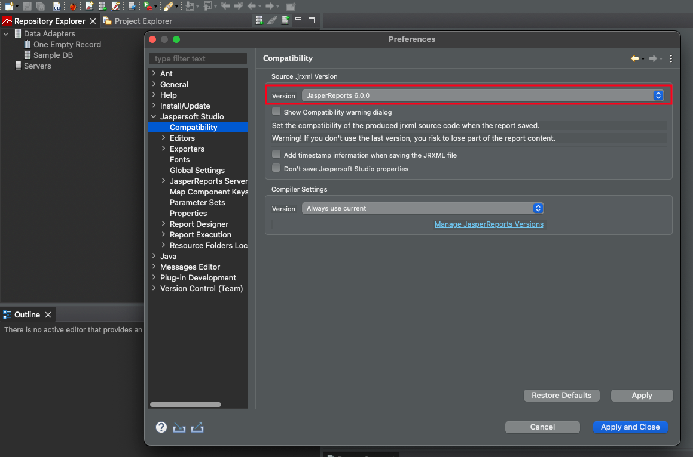
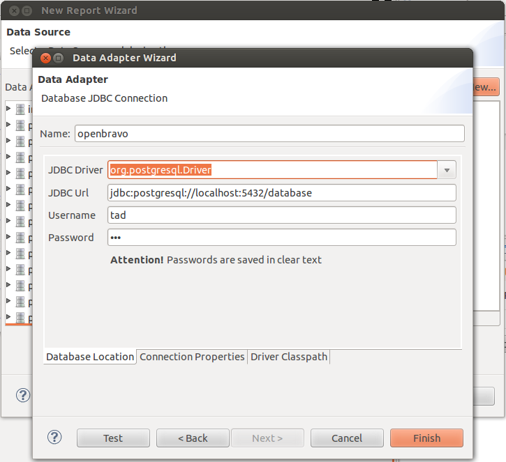
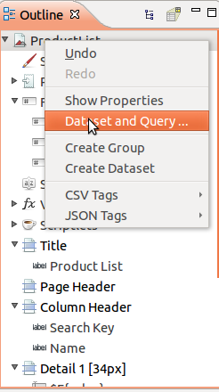
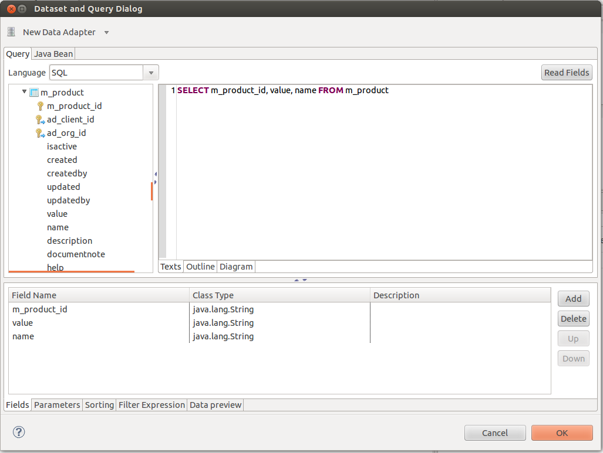
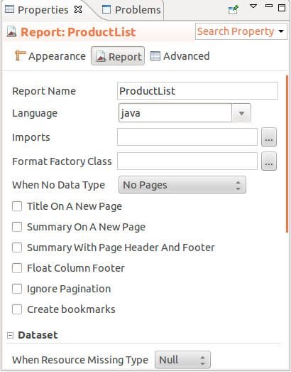
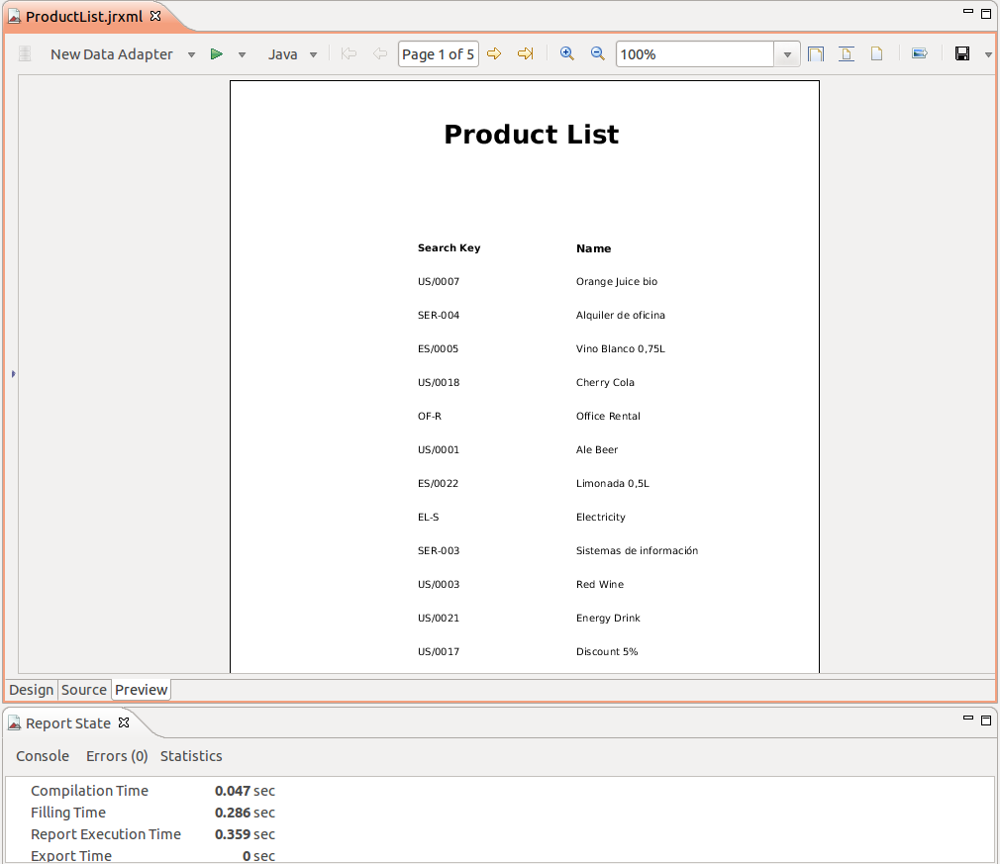
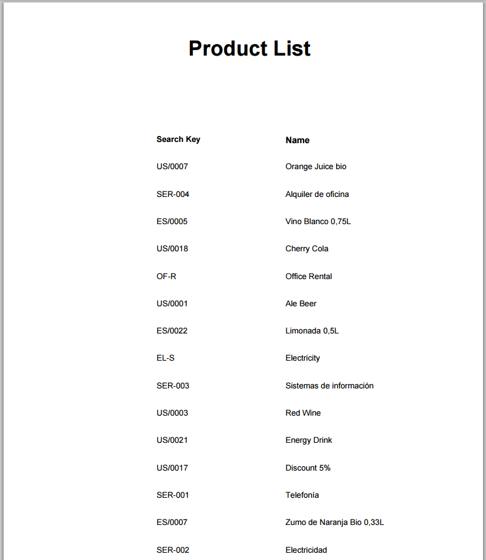

#  How to create a Report
  
##  Overview

In this section, the user can find information about the steps required to create a new report in Etendo Classic. The example explained is a simple report with a list of
products.

##  Setting up Jaspersoft Studio
  
!!!note
    It is recommended to use the latest version of Jaspersoft Studio.  
  
  
First, you need to download Jaspersoft Studio, a graphical tool that allows you to
create and modify JasperReports templates (.jrxml files).

  * Download  [Jaspersoft Studio](https://www.jaspersoft.com/products/jaspersoft-community){target="\_blank"}. 
  * On Linux: just download the .tgz file and uncompress it, execute the binary _Jaspersoft Studio_ located inside the main folder.
  * On Windows: Download and execute the .exe file.

###  Configuring Jaspersoft Studio Library Version
!!! warning
    Etendo supports Jasper Reports compatible with JasperReports 6.0.0. So, if you are using a newer version of Jaspersoft Studio, you need to make sure that the version of the JasperReports library is 6.0.0. Its very important to use the correct version of JasperReports library,so the jrxml file can has the syntax compatible with Etendo.

* Go to `Settings` > `Jaspersoft Studio` > `Compatibility` > `Source .jrxml Version` and set it to 6.0.0.



###  Configuring Jaspersoft Studio Properties

Some properties of Jaspersoft Studio need to be modified in order to work
properly. In short, you need to make sure:

  * You modified the JasperReport property _net.sf.jasperreports.awt.ignore.missing.font_ and set it to *true*. It can be changed in `Properties` > `Jaspersoft Studio` > `Properties` 
  * Do not use any *Scriplet* class 
  * Use *Java* as default expression language 


  
###  Setting up Classpath

In Jaspersoft Studio, each report is supposed to be part of a project. So, you
first need to create a new project (`File` > `New` > `Project`).

The project has a classpath, and here is where you can add the jars you need.

  * Right-click on the project name: `Properties` > `Java Build Path`
  * Move to *Libraries* tab 
  * Click *Add External Jars* button 
  * Add the desired library. 
  * Click *OK*

##  Creating the Template

  * Go to `File` > `New`
  * Pick *Jasper Report*
  * The *New Report Wizard* will be opened 


  * Select a Report Template, (_Blank_ following our example) 
  * Define a Report Name 
  * Define the file Location in the project. 

Later on, we will copy this .jrxml file inside our Etendo module that is
going to keep our Report and also the required configuration in the Application
Dictionary.

  * Define the Report Data Source: by clicking on "New", a new database connection can be configured using the *Data Adapter Wizard*
  * Click *New*
  * Pick *Database JDBC Connection* and click _Next_
  * Fill all the fields 
    * *Name:* Etendo (or any name you like, e.g. pi) 
    * *JDBC Driver:* PostgreSQL (org.postgresql.Driver). In this case, we'll use PostgreSQL 
    * *JDBC URL:* jdbc:postgresql://localhost:5432/etendo where _5432_ is the port where PostgresSQL is running and _etendo_ is the SSID of our database 
    * *Username:* tad (you can check your username/password in gradle.properties configuration file. For more information about gradle.properties, visit [Install Etendo](docs.etendo.software/latest/getting-started/installation/#install-etendo)) 
    * *Password:* tad 
  * Click the Finish button to generate the JDBC Connection 
  * Test your connection 
  * Save 



Now we have to configure the query: we are going to list the products present
in the database.

  * Right-click on the Report Outline menu, and select *Dataset and Query*. Here is where we have to set the query of the report and it is also possible to switch between the available database connections in case we want to test the query. 



  * The products are stored in the `M_Product` table 
    
        SELECT m_product_id, value, name FROM m_product

  * We have to add the fields based on your query which we want to use in the report, so we are going to add: 
    * `m_product_id` 
    * `value` 
    * `name` 



  * Click *OK* 
  * Remember to clear the Scriptlet class and modify the Language for expressions 
  * Right-click on the Report Outline menu, and select *Show Properties*. 
  * In the report properties in the right, look for the following: 
    * Clear the Scriptlet class 
    * Choose Java as Language 
  * Save your changes 



Let's now design the Report Layout

  * Put a static text as report title: _Product List_
  * Place the fields in the *Detail* band and a title in the *Column Header* band 
  * Save your changes 


  * Switch to the *Preview* subtab to get a report preview 



!!!note
    It is recommended to use Dejavu fonts in jasper reports because these
    fonts support most of the characters in almost all languages​​. Besides,
    Dejavu typography is the family of fonts that Etendo included in
    jasperreports-fonts library.   
  
###  Etendo Runtime Environment

The standard reports in Etendo (_src/org/openbravo/erpReports_) make use
of several methods that reside inside the *Etendo Runtime Environment* ,
which cannot be executed at design time. For this reason, we provide a .jar file that encapsulates the following adapted methods of
the _org.openbravo.erpCommon.utility.Utility_ Class:

  * *public static BufferedImage showImageLogo*: returns a logo image that is already included in the JAR archive 
  * *public static String applyCountryDateFormat*: always returns the date formatted in this pattern dd-MM-yyyy 
  * *public static DecimalFormat getCountryNumberFormat*: just returns the same DecimalFormat received as parameter 

For this, to be able to preview the standard Etendo reports from
*JasperStudio*, it suffices just to import the .jar file into the classpath
of the project within JasperStudio.

###  Adding images and logos to a report using the ShowImage API

You can use the Image BLOB reference to display an image for a specific
report, or one of the Company logos in the application. 

To do so:

1. Add an image object to your report

2. set the expression class to "java.awt.Image" and the expression image to a call to the ShowImage function of the Utility class (if you want it to display a standard ImageBLOB image reference, that corresponds to a field added to a tab), or to the ShowImageLogo function if you want to display the logo of an Organization or Client.

Images loaded with this method must not have alpha channel. A transparency
layer is not supported by the function that loads images in Jasper Reports.

  * If you want to use the ShowImage function, you need to make the expression image look like: 
    * org.openbravo.erpCommon.utility.Utility.showImage("IMAGEID") 

IMAGEID needs to be the UUID of the image you want to show. You could set this
value using a Jasper parameter.

  * If you want to use the ShowImageLogo function to show one of the logos, you have several options. 
    * This one will show the Company logo at System level: 
        * org.openbravo.erpCommon.utility.Utility.showImageLogo("yourcompanylogin") 
    * This one will show the Company log at Client level (the client used will be the one the user logged at): 
        * org.openbravo.erpCommon.utility.Utility.showImageLogo("yourcompanymenu") 
    * This one will show the Company logo at Organization level: 
        * org.openbravo.erpCommon.utility.Utility.showImageLogo("yourcompanydoc", "ORGANIZATIONID") 

ORGANIZATIONID needs to be the UUID of the Organization whose log you want to
show. You could set this value using a Jasper argument. An example could be
*org.openbravo.erpCommon.utility.Utility.showImageLogo("yourcompanydoc",
"4387D62C6486481AB3D148442A6AD34E")* being 4387D62C6486481AB3D148442A6AD34E
the organization ID.

##  Registering the Report in Application Dictionary

###  Creating the Report

It is possible to create a report using a process definition. For more information, visit [this section](How_to_create_a_Report_using_Process_Definition.md).

  * Using the System Administrator role 
  * Using the quick-launch, open: *Process Definition* window 
    * You can find it in the menu: `Application Dictionary` > `Process Definition` 

  * Create a new record 
  * Fill all required fields 
    * *Module:* Pick your module 
    * *Search Key:* ETPF_ProductList (It is a best practice to start with your module's [DB_Prefix](../concepts/Modularity_Concepts.md#DB_prefix)) 
    * *Name:* Product List 
    * *UI Pattern:* Report (Using JR templates) 
    * *Data Access Level:* Client/Organization 
    * *Handler*: use the default `org.openbravo.client.application.report.BaseReportActionHandler`


We must copy the .jrxml template file generated with Jaspersoft Studio into
our module. When using Process Definition to generate a Report, templates need
to be stored in the web folder of the module. In our example, we place it in
the following location: `/web/com.etendoerp.platform.features/jasper`

  * Navigate to the *Report Definition* tab 
  * Fill the PDF template field with the location of the .jrxml file 


###  Creating the Menu record

  * Using the System Administrator role 
  * Open the Menu window 
  * Create a new record 
  * Fill all required fields: 
    * *Module:* Your module 
    * *Name:* Name of the menu entry (Product List) 
    * *Description:* Description of the action related to the menu entry 
    * *Action:* Pick `Process Definition` 
    * *Process Definition:* Pick your Process Definition (Product List) 


##  Compiling

After you have registered the report and menu entry in the Application
Dictionary, you need to compile to generate the necessary code.

    ```bash 
        ./gradlew smartbuild
    ``` 
Once the compilation has been completed: 

1. restart your Tomcat server.

##  Testing the Report

If you have completed all the steps, you should be able to open your Product
List report form the quick-lauch, or menu entry.



##  Further Details

###  Layout

For information on how JasperReports handles the layout, check [Making HTML,XLS or CSV friendly reports](https://community.jaspersoft.com/knowledgebase/tips-n-tricks/making-html-xls-or-csv-friendly-reports/){target="\_blank"}.

Also, a tutorial with the basics of how to design a report can be found [here](https://community.jaspersoft.com/knowledgebase/tips-n-tricks/designing-report-jaspersoft-studio/){target="\_blank"}.

###  Configuring Cell Type in XLS Reports

By default, Etendo Classic reporting engine exports the XLS data as strings. This is done in order ensure that the exported data can be read after opening the report with the vast majority of spreadsheet applications.

If we want to have a particular format in a cell of our XLS report, and for
example, display numbers inside a numeric cell, this default configuration can be overridden at template level.

To override this configuration, the following must be done inside the .jrxml
report template:

  1. Add the *net.sf.jasperreports.export.xls.detect.cell.type* property with true as its value. 
  2. Add a *pattern* for the text field that will be displayed in the XLS cell. With the `<pattern>` tag, a fixed pattern can be set and with the `<patternExpression>` tag, it is possible to define a dynamic pattern. 

!!!note
    The decimal and thousands *separators* used for the numeric
    cells exported in this way, will be those defined inside the spreadsheet
    program itself (LibreOffice Calc, Excel,etc).

###  Creating a Report Using Report and Process

In [this section](How_to_create_a_Report_with_iReport.md#Registering_the_Report_in_Application_Dictionary), you can find an example about how to create a Report in this way.

###  Creating a Reports in old releases

To get information about reporting in old releases, you can go [here](../concepts/.Reports_obsolete.md).

###  Report Compilation
  
When printing a report in the application, it is previously compiled at
runtime. The result of this report compilation is cached if there are no
modules in _in development_ status.

Besides, it is possible to handle the state of this cache through a JMX
extension. Thus, this extension allows to:

  * See if the cache is enabled. 
  * Enable/Disable the cache. 
  * See the list of reports whose compilation is stored in cache. 
  * Clear the cache contents. 

###  Barcodes

It is possible to generate barcodes from JasperReports, using barcode4j or
barbecue libraries. These libraries are included in [Barcode_generation_in_reports](https://bitbucket.org/koodu_software/org.openbravo.service.reporting.barcode/src/master/) module.

In Platform Features module, there is an example of a report making use of
different barcode styles, see here the jrxml template.

---
This work is a derivative of [How to create a Report](http://wiki.openbravo.com/wiki/How_to_create_a_Report){target="\_blank"} by [Openbravo Wiki](http://wiki.openbravo.com/wiki/Welcome_to_Openbravo){target="\_blank"}, used under [CC BY-SA 2.5 ES](https://creativecommons.org/licenses/by-sa/2.5/es/){target="\_blank"}. This work is licensed under [CC BY-SA 2.5](https://creativecommons.org/licenses/by-sa/2.5/){target="\_blank"} by [Etendo](https://etendo.software){target="\_blank"}.