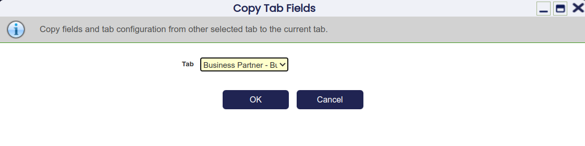

  
##  Overview

The objective of this section is to show how you can create a new window from scratch. 

!!!info
    This section builds on top of two previous sections which explain
    [How to Create a Module](../how-to-guides/How_To_Create_a_Module.md)  and [How to Create a Table](../how-to-guides/How_to_create_a_Table.md).

##  Module & Table

As mentioned above, this tutorial is based on two previous tutorials and assumes that the following objectives have been already completed:

  * Creation of a new module
  * Creation + Registration in the AD of a new table

##  Creating the New Window

Using the *System Administrator* role navigate to `Application Dictionary` > `Windows, Tabs and Fields `. 
Create a new record as indicated by the screenshot below:

 


The main fields of this window are:


  - *Module*: defines the module for which this element will belong to.
  - *Name*: defines the name that Etendo uses to recognize this window. 
  - *Description*: gives a small description of the table. 
  - *Help/Comments*: defines the text that is displayed in Help window. 
  - *Window Type*: defines some user interface specifics for a window: 
    - _Maintain_ : is used for windows with few entries. 
    - _Transaction_ : for transactional windows. It's the type of window that's used for showing the information of tables with a large volume of data. By default this window filters out old (n days – `General Setup` > `Application ` >`Session Preferences` window setting) and processed documents. The header tab's underlying table must contain the PROCESSED and UPDATED columns (for the data filters to work).
    - _Query Only_ : for read-only windows that only enable viewing of data. 

  
Save this record and move to *Tab* tab. Create a new record as shown
below, creating the first tab:

  


Main fields of this window are:

  * *Module*: defines the module for which this element will belong to.
  * *Name*: defines the name that Etendo uses to recognize this tab. 
  * *Description*: gives a small description of the table. 
  * *Help/Comments*: defines the text that is displayed in Help window. 
  * *Table*: specifies the table that the tab will show the data from. 
  * *Table Level*: defines the hierarchy of tabs, _0_ being the highest level. 
  * *UI Pattern* This dropdown offers the following options: 
    * _Standard_ \- standard interface where multiple records can be added, viewed and edited 
    * _Read Only_ \- this option disables any editing/creating capabilities for any user within this tab 
    * _Single Record_ \- this option enforces a one-to-one relationship between a parent and a child tab, allowing the user to enter maximum one record in the tab 
  * *HQL Where Clause*: by using this HQL filter, the user will never be able to see data that does not fit the criteria. When referring to properties of the entity shown in the tab then use the prefix *e* . In our case, we use this field to display only business partners that are our employees (using the _employee_ property). 
  * *SQL Where Clause* Same like HQL Where Clause but using SQL syntax and used for filtering in _classic windows_ . 

The *Copy Tab Fields* button can be used to copy fields from an existing tab into our new
one.

 

The *Create Fields* button can be used to create fields for the new tab based on its associated table
  
Move to *Field* tab to see the created fields.

  
  
If required, changes to these fields could be made or new ones could be added manually. 

!!!note
    For not header tabs, it is very important to not remove the field
    that points to the ID field of its parent tab, as it would made not possible to create records in this tab using the grid view. 


Now, go back to *Tab* tab and create a new record that will represent the
child tab of the Employee tab where salaries will be managed:

 

Most importantly, make sure you select:

  * *Table* = `HT_Salary`
  * *Tab Level* = _1_


By clicking and confirming the *Create Fields* dialog, the application will
automatically insert the columns of the selected table into the fields tab of
the *Salary* one.

  
To arrange the columns according to common look and feel of other windows, we now change a view field properties as can be seen in following screenshot.

  * Hide field _c_bpartner_id_
  * Reorder fields (using sequence), to have _isactive_ after all other fields 
  * Mark _amount_ and _isactive_ as *Start in new line*

 


  
For Etendo, to create links (labels that appear blue) to table elements, the system needs to know which window represents the table where a certain element resides.

To indicate that, go to the `Application Dictionary` > `Tables and Columns` window, find the corresponding table and set the *Window* as indicated below:

  


##  Creating the Menu Item

A menu item is required for the user to be able to call up the new window. Using the System Administrator role navigate to `General Setup` > `Application` >`Menu` and create a new record:

  

  
Main fields of this window are:

  * *Module*: defines the module for which this element will belong to.
  * *Name*: defines the name that Etendo uses to recognize this menu item. 
  * *Description*: gives a small description of the table. 
  * *Summary level*: defines a folder containing menu items (windows, processes, reports and so on). 
  * *Action*: defines the type of menu item. 
  * *URL* If _Action_ is _External link_ or _Internal link_ , defines the _URL_ to be linked. 
  * *Special Form*: If _Action_ is _Form_ , defines the form to be linked. 
  * *Process*: If _Action_ is _Process_ , defines the process to be launched. 
  * *Report*: If _Action_ is _Report_ , defines the report to be linked. 
  * *Window*: If _Action_ is _Window_ , defines the window to be linked. 

Save this record then click on _Tree_ icon 


Here you can drag and drop the new menu item to any of the
other menu groups.


##  Compiling the Application with the New Window

Finally, the application needs to be recompiled in order to generate the new window's code and deploy it to Tomcat. 

```bash
./gradlew smartbuild
```

##  The Result

Using the *F&B International Group Admin* role, select the link to the new window from the menu. 


  
!!!success
    You have now successfully created your own new window and seen how it came to life within Etendo. 

---

This work is a derivative of [How to create a window](http://wiki.openbravo.com/wiki/How_to_Create_a_Window){target="\_blank"} by [Openbravo Wiki](http://wiki.openbravo.com/wiki/Welcome_to_Openbravo){target="\_blank"}, used under [CC BY-SA 2.5 ES](https://creativecommons.org/licenses/by-sa/2.5/es/){target="\_blank"}. This work is licensed under [CC BY-SA 2.5](https://creativecommons.org/licenses/by-sa/2.5/){target="\_blank"} by [Etendo](https://etendo.software){target="\_blank"}.


