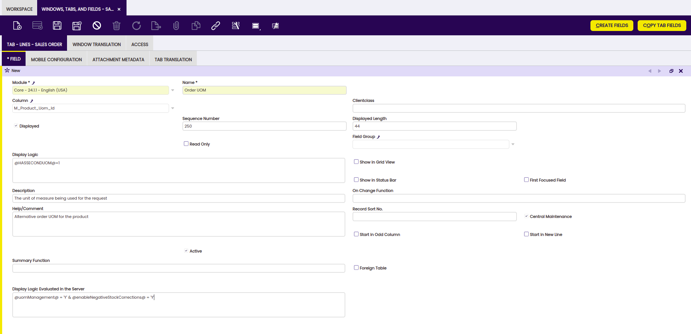

# How to Define Display Logic Evaluated at Server Level

##  Overview

With this functionality, it is possible to define in Etendo the Display Logic to be evaluated at Server Level.

This means that the expression for this particular Display Logic is going to be evaluated while generating the code for the final window instead of being evaluated when the window is loaded.

By doing so, it is possible to avoid blank fields when the field should not be shown. Instead, the fields are rearranged and the window looks more clean.

##  Usage

In the **Windows, Tabs & Fields** window, there is a new field named **Display Logic Evaluated in the Server**.

In this field, it is possible to define an expression that will be evaluated to decide whether that particular field must be shown or not.

!!!info
    This expression must follow the same syntactic rules that are used in the normal Display Logic. The expression can evaluate Preferences, but only those defined at System Level.

An example of an expression would be: `@uomManagement@ = 'Y' & @enableNegativeStockCorrections@ = 'Y'`

##  Limitations

Since this functionality is going to be evaluated at a System Level (the visibility of the fields is going to be the same for all the Clients, Organizations and Users), it is possible to use Preferences, but only those ones that have been defined at System Level.

---

This work is a derivative of [How to Define Display Logic Evaluated at Server Level](http://wiki.openbravo.com/wiki/How_to_define_Display_Logic_Evaluated_at_Server_Level){target="\_blank"} by [Openbravo Wiki](http://wiki.openbravo.com/wiki/Welcome_to_Openbravo){target="\_blank"}, used under [CC BY-SA 2.5 ES](https://creativecommons.org/licenses/by-sa/2.5/es/){target="\_blank"}. This work is licensed under [CC BY-SA 2.5](https://creativecommons.org/licenses/by-sa/2.5/){target="\_blank"} by [Etendo](https://etendo.software){target="\_blank"}.