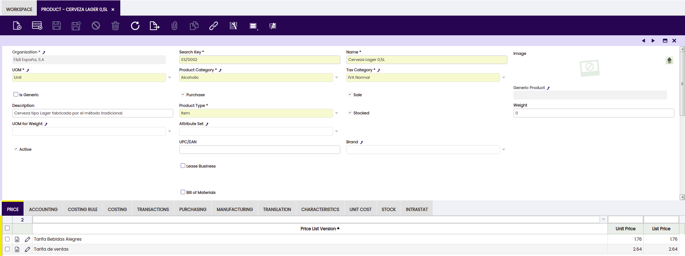
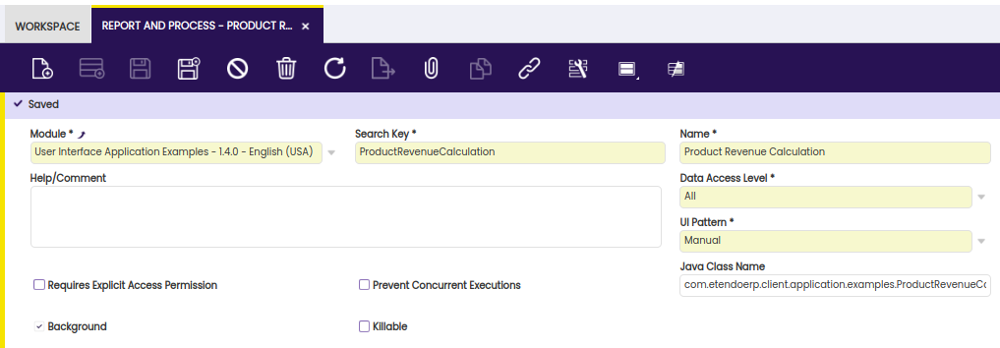
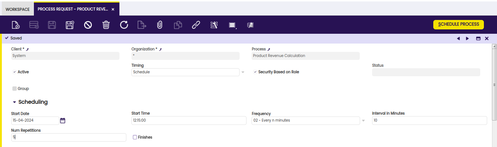
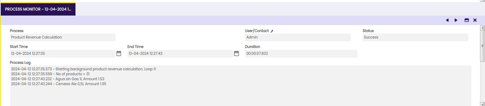
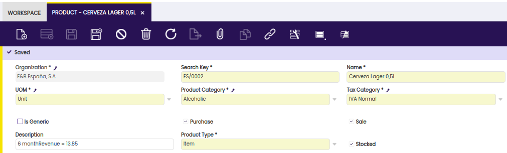

#  How to Develop a DAL Background Process

##  Overview

A background process is a process which runs at regular intervals. For this section we will develop a background process for the following scenario:

_Say our customer wants to have sales information for the last 6 months of each product in the description field._

A background process needs to (re)calculate the sales numbers on a regular basis and save them into the Description field of each product that is marked as being sold. Our main Product window's tab should end up similar to:



Consider that this is a simple exercise and that we are demonstrating how a background process is developed. The above example would probably better be implemented by first adding a new field to the `M_PRODUCT` database table that would hold this information. However, for the purpose of this exercise, we will just store it in the Description field.

In this section, it will be shown how a java process can be implemented as a background process. A java process can however also be called directly from the user interface and have a user interface which allows entering parameters. 

!!!info
      For a generic description of java processes see [Processes](../../../developer-guide/etendo-classic/concepts/Processes.md).

##  Definition within the application dictionary

Background processes are defined within the `Application Dictionary` > `Report and Process` window. Use the **System Administrator** role to create a new record as indicated below:


  
The following fields are vital for the definition of a background process: 

  * **Module** \- Your custom module that this new background process will belong to; note that this will consequently indicate the location on the hard drive and the package it must belong to 
  * **Search Key** \- Unique identifier of the process; a good practice is to use the class name 
  * **Name** \- A user friendly name of the process 
  * **UI Pattern** \- Should be set to Manual since Etendo ERP does not need to generate any UI windows 
  * **Background** \- Indicates that this process is a background process which consequently also displays the **Java Class Name** field 
  * **Java Class Name** \- The full specification of the class name including the package (this package must follow the package structure of your module specified above): `com.etendoerp.client.application.examples.ProductRevenueCalculation`

##  Process and DalBaseProcess

Before continuing, decide how the background process will perform the database operations. We have two options:

 - Use the XSQL file that will get converted to a Java class by the SQLC core library upon runtime. If this option is used, your background Java class should _implement_ the **Process interface** and implement the `execute` method to perform our tasks. 
  
!!!info
      Find this interface in `src/org/openbravo/scheduling/Process.java`. 

 - Use the new Data Access Layer which provides mid-tier POJOs through which we can manipulate database tables. If this method is used, your background Java class must _extend_ the **DalBaseProcess class** and implement the `doExecute` method that performs your task. This will give it access to the correct data context provided by DAL and at the same time, take care of authentication and privileges. 
  
!!!info
      Find the abstract class in `src/org/openbravo/service/db/DalBaseProcess.java` . 

Since the first method will eventually become deprecated due to database dependency, the second one is the prudent option to take.

!!!note
      Some understanding of the Hibernate Criteria API is beneficial when using the DAL. Read more information for a detailed description of this [API](https://docs.jboss.org/hibernate/core/3.3/reference/en/html/querycriteria.html){target="\_blank"}.

The Data Access Layer is discussed in several other articles and sections.

!!!info
      For more information, read the [Data Access Layer](../../../developer-guide/etendo-classic/concepts/Data_Access_Layer.md) reference manual.

##  Implementation

The example module implements the background process in the `modules/org.openbravo.client.application.examples/src/org.openbravo.client.application.examples.ProductRevenueCalculation.java`

```java title="ProductRevenueCalculation.java"
// assign the background process to a package that belongs to the 
// main package of the module this custom development belongs to  
package com.etendoerp.client.application.examples;
  
import java.math.BigDecimal;
import java.util.Calendar;
 
import org.hibernate.Criteria;
import org.hibernate.criterion.Projections;
import org.hibernate.criterion.Restrictions;
import org.openbravo.dal.service.OBCriteria;
import org.openbravo.dal.service.OBDal;
import org.openbravo.model.common.order.OrderLine;
import org.openbravo.model.common.plm.Product;
import org.openbravo.scheduling.ProcessBundle;
import org.openbravo.scheduling.ProcessLogger;
import org.openbravo.service.db.DalBaseProcess;
import org.quartz.JobExecutionException;
 
// the background process needs to extend DalBaseProcess since
// we will be using DAL objects to perform database operations
public class ProductRevenueCalculation extends DalBaseProcess {
 
  static int counter = 0;
 
  private ProcessLogger logger;
 
  // abstract method doExecute needs to be implemented and carries
  // with itself the ProcessBundle object deriving from Openbravo Quartz
  // scheduler
  public void doExecute(ProcessBundle bundle) throws Exception {
 
    logger = bundle.getLogger(); // this logger logs into the LOG column of
    // the AD_PROCESS_RUN database table
    BigDecimal sumAmount = BigDecimal.ZERO;
 
    logger.log("Starting background product revenue calculation. Loop " + counter + "\n");
 
    // define time 6 months ago from today which is the timespan that our
    // calculation will consider
    Calendar timeSixMonthsAgo = Calendar.getInstance();
    timeSixMonthsAgo.add(Calendar.DAY_OF_MONTH, -180);
 
    try {
      // get all products that are sold (M_PRODUCT.ISSOLD = 'Y')
      final OBCriteria<Product> productList = OBDal.getInstance().createCriteria(Product.class);
      productList.add(Restrictions.eq(Product.PROPERTY_SALE, true));
 
      logger.log("No of products = " + productList.list().size() + "\n");
 
      // loop through all products that are sold and calculate revenues
      // for each
      for (Product product : productList.list()) {
 
        sumAmount = BigDecimal.ZERO;
 
        // select lines from C_ORDERLINE table that match the product
        final Criteria orderLineList = OBDal.getInstance().createCriteria(OrderLine.class)
            .add(Restrictions.eq(OrderLine.PROPERTY_PRODUCT, product));
 
        // filter out lines that belong to sales (as opposed to
        // purchase) and fit within the last six months
        //
        // when you want to filter on a property of an associated entity
        // then the property of that association needs an alias, see
        // here: http://www.javalobby.org/articles/hibernatequery102/
        orderLineList.createAlias(OrderLine.PROPERTY_SALESORDER, "order")
            .add(Restrictions.eq("order.salesTransaction", true))
            .add(Restrictions.gt("order.orderDate", timeSixMonthsAgo.getTime()));
 
        // Sum line amounts grouped by product
        orderLineList.setProjection(Projections.projectionList()
            .add(Projections.sum(OrderLine.PROPERTY_LINENETAMOUNT))
            .add(Projections.groupProperty(OrderLine.PROPERTY_PRODUCT)));
 
        // due to grouping and sum operation there will really only be
        // one resulting record but in theory there could be more (a
        // list)
        for (Object o : orderLineList.list()) {
          // the query returns a list of arrays (columns of the query)
          final Object[] os = (Object[]) o;
          sumAmount = (BigDecimal) os[0];
          final Product p = (Product) os[1];
          logger.log(p.getName() + " Amount " + sumAmount + "\n");
        }
        product.setDescription("6 monthRevenue = " + sumAmount);
      }
 
    } catch (Exception e) {
      // catch any possible exception and throw it as a Quartz
      // JobExecutionException
      throw new JobExecutionException(e.getMessage(), e);
    }
  }
}
```

##  Compiling the application

Using the command line compilation, use the `./gradlew smartbuild` to compile the application's manual code and deploy it to Tomcat context. Then, restart Tomcat.

##  Scheduling

In order for a background process to be executed, it first needs to be scheduled. Using the **Etendo Client Admin** role (so not the System Admin role) navigate to `General Setup` > `Process Scheduling` >`Process Request` window and enter a new record.



The following fields are important:

  * **Process** \- determines which background process to schedule. Only background processes are available in the dropdown
  * **Timing** \- there are several ways of scheduling a process based on the requirement if the process needs to be run once or repetitively. Use the _Scheduled_ option for our purpose 
  * **Frequency** \- how often does the process need to run. Based on your selection the fields below will change accordingly for you to be able to enter appropriate interval. Select _02 - Every n minutes_ for us to be able to see the results immediately
  * **Interval in Minutes** \- How many minutes apart should the process be run in case _02 - Every n minutes_ was selected above. Enter _10_ 
  * **Num Repetitions** \- The number of times a process request will repeat after its first execution. Note that 10 repeats will give a total of 11 process executions. Enter _5_

Save the record and click on the **Schedule Process** button in order for the process to finally get scheduled.

!!!note
      It is needed to use the Etendo Admin role in order for the background process to have access to products of BigBazaar. The client of the role that enters the background process request is used to determine access privileges.  
  
##  Monitoring

To see the process executions, the status and the log it generated, use the `General Setup` > `Process Scheduling` > `Process Monitor` window. After a minute or two of scheduling the process, entries related to the executions of the new process should be seen.



##  The Result

To be able to get meaningful results, enter and complete a Sales Order (`Sales Management` > `Transactions` > `Sales Order`) since the background process calculates revenues within the last 6 months and the demo database can contain records older than that. For example, enter a new Sales Order for a business partner, and enter a line for a certain product, then complete the sales order.

Then, navigate to the `Master Data Management` > `Product` window and find the product. After a minute or two when the process has recalculated the **Description** field, you should be able to see the following:



This work is a derivative of [How to develop a DAL background process](http://wiki.openbravo.com/wiki/How_to_develop_a_DAL_background_process){target="\_blank"} by [Openbravo Wiki](http://wiki.openbravo.com/wiki/Welcome_to_Openbravo){target="\_blank"}, used under [CC BY-SA 2.5 ES](https://creativecommons.org/licenses/by-sa/2.5/es/){target="\_blank"}. This work is licensed under [CC BY-SA 2.5](https://creativecommons.org/licenses/by-sa/2.5/){target="\_blank"} by [Etendo](https://etendo.software){target="\_blank"}.
