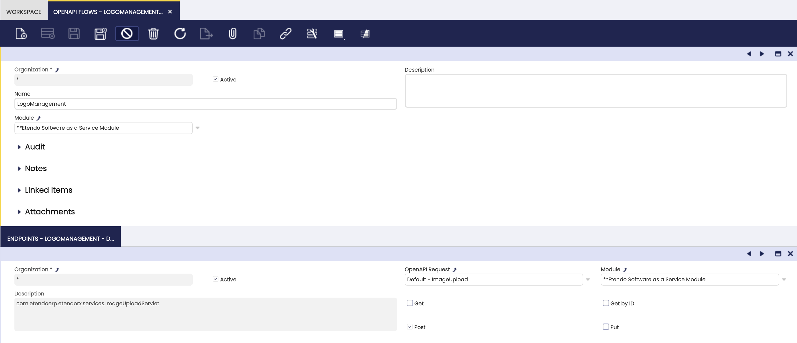

---
tags:
  - Etendo Infrastructure
title: How to Document an Endpoint with OpenAPI
---

# How to Document an Endpoint with OpenAPI

## Overview

This documentation details the steps to document API endpoints using the OpenAPI specification. By leveraging Swagger, developers can ensure their APIs are well-documented, standardized, and easy to integrate.

---

## Define a New OpenAPIDefaultRequest

To define a new `OpenAPIDefaultRequest`, you need to extend the abstract class `OpenAPIDefaultRequest`.

Here is an example:

```java
package com.etendoerp.etendorx.openapi;

public class ImageUploadOpenAPI extends OpenAPIDefaultRequest {
  public static final String ETENDO_ID_PATTERN = "^[0-9a-fA-F]{1,32}$";

  @Override
  protected Class<?>[] getClasses() {
    return new Class<?>[]{ com.etendoerp.etendorx.services.ImageUploadServlet.class };
  }

  @Override
  protected String getEndpointPath() {
    return "/sws/com.etendoerp.etendorx.imageUpload/";
  }

  @Override
  Operation getPOSTEndpoint() {
    Operation endpoint = new Operation();
    endpoint.setSummary("Upload an image to EtendoERP");
    endpoint.setDescription("Upload an image to EtendoERP, it can use a configuration associated with a Column ID to automatically resize the image.");

    Schema reqSchema = new Schema()
        .addProperty("filename", new StringSchema().description("The name of the file").example("image.jpg"))
        .addProperty("columnId", new StringSchema().description("The column ID where the size and resize configuration is stored").pattern(ETENDO_ID_PATTERN))
        .addProperty("base64Image", new StringSchema().description("The base64 encoded image"));
    reqSchema.required(List.of("filename", "base64Image"));

    RequestBody requestBody = new RequestBody().content(new Content()
        .addMediaType("application/json", new MediaType().schema(reqSchema)));
    endpoint.requestBody(requestBody);

    return endpoint;
  }
}
```

This class specifies a POST endpoint for uploading images. It defines the endpoint path, request body schema, and required properties.

---

## Define an OpenAPI Request & Flow

OpenAPI Requests are defined in the window `OpenAPI Request`.

1. **Type**: Set the type to "Default".
2. **Description**: Add the endpoint description.
3. **Java Class**: Specify the Java class created that extends the `OpenAPIDefaultRequest` class.


To appear in the Swagger documentation, the request should be part of an OpenAPI Flow. Open the window OpenAPI Flow, then add a new record. Afterward, link the request in the child tab of the flow.



---

## Check Swagger

The new endpoint documentation should now be visible at the Swagger UI URL. The URL might vary depending on your deployment but typically follows the format:

```
http://localhost:8080/etendo/web/com.etendoerp.openapi/#/
```

Verify that the new endpoint appears under the defined tag and displays the correct request and response schemas.

---

## Key Components of OpenAPI Integration

### OpenAPIDefaultRequest

The `OpenAPIDefaultRequest` abstract class provides the base functionality for adding default API endpoints to Swagger documentation. It:

- Retrieves related tags and flows.
- Adds definitions to the OpenAPI object.
- Supports GET, POST, and PUT operations.

### Example of an OpenAPI Endpoint Implementation

The `ImageUploadOpenAPI` class demonstrates:

- **Endpoint Path**: `/sws/com.etendoerp.etendorx.imageUpload/`
- **POST Operation**: Defines required properties (`filename`, `base64Image`) and validates input.
- **Java Class Association**: Links to `ImageUploadServlet` for handling requests.

### OpenAPIEndpoint Interface

This interface ensures consistent API endpoint behavior by defining methods such as:

- `boolean isValid(String tag)`
- `void add(OpenAPI openAPI)`

For example, the `ImageUploadOpenAPI` class implements these methods to validate tags and add endpoint definitions to the OpenAPI object.

---

## Summary

By following these steps, developers can create and document API endpoints in a structured and standardized way. Utilizing `OpenAPIDefaultRequest` ensures compatibility with OpenAPI standards and provides a clear interface for API integration.

