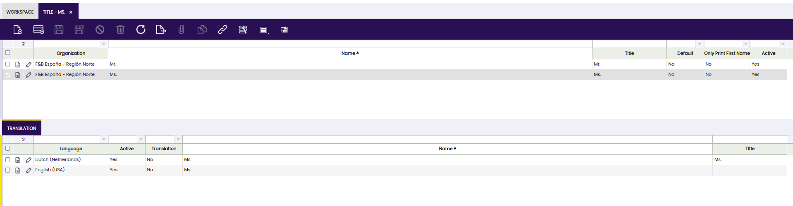

---
tags:
  - HowTo
  - Etendo Classic
  - Event Handler
  - Business Logic
  - Event Method
title: How to Implement a Business Event Handler
---
 
# How to Implement a Business Event Handler

## Overview

The  business entity event  allows you to implement business logic which reacts to specific events which are fired when entities are updated, deleted or inserted into the database. 
Business entity events correspond to triggers in the database. 
The main advantage of implementing logic using business entity events instead of in triggers is that you can code your logic in java using your IDE. 
This helps productivity and quality as you can code, debug and test in an integrated environment with the rest of your business logic.

!!! note "Some notes on business entity events:"
    * They are fired when an entity instance is updated, deleted or inserted. Before the actual operation has been done in the database, so you can change or add information which persists together with the event entity. 
    * Your event handling code runs in the same transaction as the business event, changes you make to the database persist together with the business entity event in one transaction. 
    * Business entity events only work when accessing the database through the data access layer, so they do not work for classic windows or direct jdbc calls.
    * You can make use of the full [data access layer](../concepts/Data_Access_Layer.md) functionality in your event handling code, you can query, create new objects, persist etc.
      
      Warning: Don't call setters on the instance itself, this does not work because when the event has been broadcasted, Hibernate has already read the state of the object. 
      So you must change the value through the special `setCurrentState` method: `event.setCurrentState(greetingTitleProperty, title + ".");`


Business events make use of the event framework provided by the [Weld](../concepts/Etendo_Architecture.md#Introducing_Weld:_dependency_injection_and_more) framework. To register an event handler, annotations are used. Weld automa

!!!note
    In order to maximize performance, certain part of the classpath are excluded, check out [this section](../concepts/Etendo_Architecture.md#Analyzing_the_classpath) if your event handlers are not found.

In this section, we will implement an event handler on the Greeting entity. Whenever a title is saved, a Spanish translation will be added. In addition, we will print some messages to the console for other business events.


##  Example Module

This section is supported by an example module which shows an example of the code shown and discussed here.

The code of the example module can be downloaded from this repository: [com.etendoerp.client.application.examples](../../../assets/developer-guide/etendo-classic/how-to-guides/com.etendoerp.client.application.examples.zip){:download}
  
##  The event handler - A first implementation

An event handler is implemented as a normal java class in your module. The key thing is to create methods with an annotation on the parameters. Here is a first simple example of an event handler which listens to events on the Greeting entity:

    
```java title="GreetingEventHandler.java"
class GreetingEventHandler extends EntityPersistenceEventObserver {
  private static Entity[] entities = { ModelProvider.getInstance().getEntity(Greeting.ENTITY_NAME) };
  private static final Logger logger = LogManager.getLogger();
 
  @Override
  protected Entity[] getObservedEntities() {
    return entities;
  }
 
  public void onUpdate(@Observes EntityUpdateEvent event) {
    if (!isValidEvent(event)) {
      return;
    }
    logger.info("Greeting " + event.getTargetInstance().getId() + " is being updated");
  }
 
  public void onSave(@Observes EntityNewEvent event) {
    if (!isValidEvent(event)) {
      return;
    }
    logger.info("Greeting " + ((Greeting) event.getTargetInstance()).getName()
        + " is being created");
  }
 
  public void onDelete(@Observes EntityDeleteEvent event) {
    if (!isValidEvent(event)) {
      return;
    }
    logger.info("Greeting " + event.getTargetInstance().getId() + " is being deleted");
  }
}
```

!!!note
    * It makes sense to extend the [EntityPersistenceEventObserver](https://github.com/etendosoftware/etendo_core/blob/main/modules_core/org.openbravo.client.kernel/src/org/openbravo/client/kernel/event/EntityPersistenceEventObserver.java){target="\_blank"}, it helps to filter for the correct events. 
    * The name of the method is not relevant, the relevant thing is the annotation on the parameter and the parameter. Weld uses this to detect and register for which events this class listens to 
    * The event handler will be called for events occurring on all entities, therefore each method starts with the if statement with isValidEvent, to filter out unwanted events. 
    * The use of the `_org.apache.logging.log4j.Logger_` class is recommended for logging as shown above 

!!!info
    Classes extending `_EntityPersistenceEventObserver_` are defined as `_@ApplicationScoped_` by default.

###  Result

When you add the above class to your module, restart the system, then go to the greeting window:
[http://localhost:8080/etendo/?tabId=282](http://localhost:8080/etendo/?tabId=282)

And do some actions you should see the following messages in the console:

```bash
Greeting FF8081813097E041013097E805F4000F is being updated
Greeting FF8081813097E041013097E805F4000F is being deleted
Greeting Mr is being created
```

###  Event methods

The source code above illustrates how the event methods are implemented:
     
```java    
public void onUpdate(@Observes EntityUpdateEvent event) {
  if (!isValidEvent(event)) {
    return;
  }
  logger.info("Greeting " + event.getTargetInstance().getId() + " is being updated");
}
 
public void onSave(@Observes EntityNewEvent event) {
  if (!isValidEvent(event)) {
    return;
  }
  logger.info("Greeting " + ((Greeting) event.getTargetInstance()).getName()
      + " is being created");
}
 
public void onDelete(@Observes EntityDeleteEvent event) {
  if (!isValidEvent(event)) {
    return;
  }
  logger.info("Greeting " + event.getTargetInstance().getId() + " is being deleted");
}
```

!!!note 
    * You only need to implement a method for the event you want to listen to, so if you only need to listen to update events, then only implement a method with the @Observes EntityUpdateEvent parameter. 
    * Each method starts with a check if the event is valid, this is needed to filter for relevant events only, see the section below. 
    * Within the event handler methods, you can use the api on the event object to detect which is the entity event and to get access to the current and previous state of the entity. See [here](../concepts/Etendo_Architecture.md#Event_Classes_and_API) for more information. 

###  Filtering Only Relevant Events

As mentioned above, the event methods get called for all entities of all types. 
In our example, we only want to handle events on the Greeting entity.
There is specific code in the example above which takes care of this. 
It starts in the top of the class:

```java
private static Entity[] entities = { ModelProvider.getInstance().getEntity(Greeting.ENTITY_NAME) };
 
@Override
protected Entity[] getObservedEntities() {
  return entities;
}
```

The `getObservedEntities` method is called when you call the `isValidEvent` method, `getObservedEntities` returns the entities you want to handle in this event handler. 
To make use of it add this code to each event handling method in the beginning:

```java
if (!isValidEvent(event)) {
  return;
}
```

This part is needed because the event methods will be called for entities of all types. 
In this example we only want to listen to changes on the Greeting entity.

##  Adding some business logic

In this next step, we add logic to the event handler:

  * Whenever a greeting gets created/updated, add a . to the title, if it was not already there 
  * When a new greeting gets created, add a translation for it. 

!!!note
    To create a new translation for when a new greeting is added. 
    For this example, we will be adding a dutch translation.
    

###  Changing the entity on update/insert

In this step we will be adding some simple logic to the update and save event to add a dot to the title if it not already has one.

```java
public void onUpdate(@Observes EntityUpdateEvent event) {
  if (!isValidEvent(event)) {
    return;
  }
  final Greeting greeting = (Greeting) event.getTargetInstance();
  final String title = greeting.getTitle();
  if (title != null && !title.endsWith(".")) {
    final Entity greetingEntity = ModelProvider.getInstance().getEntity(Greeting.ENTITY_NAME);
    final Property greetingTitleProperty = greetingEntity.getProperty(Greeting.PROPERTY_TITLE);
    // note use setCurrentState and not setters on the Greeting object directly
    event.setCurrentState(greetingTitleProperty, title + ".");
  }
  logger.info("Greeting " + event.getTargetInstance().getId() + " is being updated");
}
 
public void onSave(@Observes EntityNewEvent event) {
  if (!isValidEvent(event)) {
    return;
  }
  final Greeting greeting = (Greeting) event.getTargetInstance();
  // now also add the dot to the title
  final String title = greeting.getTitle();
  if (title != null && !title.endsWith(".")) {
    final Entity greetingEntity = ModelProvider.getInstance().getEntity(Greeting.ENTITY_NAME);
    final Property greetingTitleProperty = greetingEntity.getProperty(Greeting.PROPERTY_TITLE);
    // note use setCurrentState and not setters on the Greeting object directly
    event.setCurrentState(greetingTitleProperty, title + ".");
  }
 
  logger.info("Greeting " + ((Greeting) event.getTargetInstance()).getName()
      + " is being created");
}
```

Let's walk through the code. First, cast the instance and get the title:

    
```java
final Entity greetingEntity = ModelProvider.getInstance().getEntity(Greeting.ENTITY_NAME);
final String title = greeting.getTitle();
```

If the title does not end on a dot then get the entity and the relevant property:

```java
if (title != null && !title.endsWith(".")) {
  final Entity greetingEntity = ModelProvider.getInstance().getEntity(Greeting.ENTITY_NAME);
  final Property greetingTitleProperty = greetingEntity.getProperty(Greeting.PROPERTY_TITLE);
```

!!!note
    We use the generated constants to the entity name and property
    names, this gives compile time checking and is a recommended practice.

And then set the current state.

!!!note
    Don't call setters on the Greeting instance itself, this does not work because when the event has been broadcasted, Hibernate has already read the state of the object. So you must change the value through the special `setCurrentState` method:

```java
event.setCurrentState(greetingTitleProperty, title + ".");
```

The changed entity instance does not need to be saved explicitly, this is done by the [data access layer](../concepts/Data_Access_Layer.md) and hibernate automatically.

Then test the changes, go to the window ([http://localhost:8080/etendo/?tabId=282](http://localhost:8080/etendo/?tabId=282)), enter a new greeting without a dot in the title. 
When saving you will see a dot getting added. 
Try updating the record, you will have the same behavior.

###  Adding a child instance

As the next step we will be adding logic to the `onSave` method to create an extra child instance (a new translation). 
This is a bit more complex. Add the following code to the onSave method at the end:

```java
final GreetingTrl greetingTrl = OBProvider.getInstance().get(GreetingTrl.class);
// set relevant translation properties
greetingTrl.setGreeting(greeting);
// 171 is dutch, choose any other language..
greetingTrl.setLanguage(OBDal.getInstance().get(Language.class, "171"));
// note we can call getters on the targetInstance, but not setters!
greetingTrl.setName(greeting.getName());
greetingTrl.setTitle(greeting.getTitle());
greetingTrl.setTranslation(false);
 
// and add the greetingTrl to the greeting
// we don't use event.setCurrentState as we get the list and add to it
// get the trl property for the greeting entity
final Property greetingTrlProperty = greetingEntity
    .getProperty(Greeting.PROPERTY_GREETINGTRLLIST);
@SuppressWarnings("unchecked")
final List<Object> greetingTrls = (List<Object>) event.getCurrentState(greetingTrlProperty);
greetingTrls.add(greetingTrl);
 
// don't need to save the greetingTrl, it is saved as the child of the greeting
// OBDal.getInstance().save(greetingTrl);
```


Let's walk through the code. First the trl object is created and some properties are set. 
Note as the object is not part of the event you can call its setters directly. 
The language is arbitrarily chosen. 
See the  [DAL](../concepts/Data_Access_Layer.md) document for information on the api's you can use to retrieve objects from the database.

```java
final GreetingTrl greetingTrl = OBProvider.getInstance().get(GreetingTrl.class);
// set relevant translation properties
greetingTrl.setGreeting(greeting);
// 171 is dutch, choose any other language..
greetingTrl.setLanguage(OBDal.getInstance().get(Language.class, "171"));
// note we can call getters on the targetInstance, but not setters!
greetingTrl.setName(greeting.getName());
greetingTrl.setTitle(greeting.getTitle());
greetingTrl.setTranslation(false);
```

Then, as a next step, add the new trl object to the event entity. This is a bit
special as we need to update a List property of the event entity. So instead
of calling `setCurrentState` we get the list and add to it. This is a correct way of doing this:

```java
// and add the greetingTrl to the greeting
// we don't use event.setCurrentState as we get the list and add to it
// get the trl property for the greeting entity
final Property greetingTrlProperty = greetingEntity
    .getProperty(Greeting.PROPERTY_GREETINGTRLLIST);
@SuppressWarnings("unchecked")
final List<Object> greetingTrls = (List<Object>) event.getCurrentState(greetingTrlProperty);
greetingTrls.add(greetingTrl);
 
// don't need to save the greetingTrl, it is saved as the child of the greeting
// OBDal.getInstance().save(greetingTrl);
```

The trl object is a child of the Greeting event entity and will persist together with it, so it is not necessary to explicitly save it.
When you now enter a new entry in the window, you will see an additional translation child record being created.



###  Interrupt the Save Action

Sometimes you need to interrupt the save action because the user is doing something wrong, this can be done throwing an exception

```java
public void onUpdate(@Observes
EntityUpdateEvent event) {
  if (!isValidEvent(event)) {
    return;
  }
  final OBSA_Orderline_Assign olineAssign = (OBSA_Orderline_Assign) event.getTargetInstance();
  if (olineAssign.getProductWithStorage().getProduct() != olineAssign.getSalesOrderLine()
      .getProduct()) {
    String language = OBContext.getOBContext().getLanguage().getLanguage();
    ConnectionProvider conn = new DalConnectionProvider(false);
    throw new OBException(Utility.messageBD(conn, "OBSA_ErrorProduct", language));
  }
}
```

##  Examples of Business Entity Event Handlers

Etendo Classic uses business entity event handlers to implement business logic in
various locations, here are some examples:

  * [ModuleHandler](https://github.com/etendosoftware/etendo_core/blob/main/modules_core/org.openbravo.client.application/src/org/openbravo/client/application/event/ModuleHandler.java){target="\_blank"}
  * [SetDocumentNoHandler](https://github.com/etendosoftware/etendo_core/blob/main/modules_core/org.openbravo.client.application/src/org/openbravo/client/application/event/SetDocumentNoHandler.java){target="\_blank"}

The complete source code of the example event handler is available [here](../../../assets/developer-guide/etendo-classic/how-to-guides/com.etendoerp.client.application.examples.zip){:download}

---

This work is a derivative of [How to implement a business event handler](https://wiki.openbravo.com/wiki/How_to_implement_a_business_event_handler){target="\_blank"} by [Openbravo Wiki](http://wiki.openbravo.com/wiki/Welcome_to_Openbravo){target="\_blank"}, used under [CC BY-SA 2.5 ES](https://creativecommons.org/licenses/by-sa/2.5/es/){target="\_blank"}. This work is licensed under [CC BY-SA 2.5](https://creativecommons.org/licenses/by-sa/2.5/){target="\_blank"} by [Etendo](https://etendo.software){target="\_blank"}.
