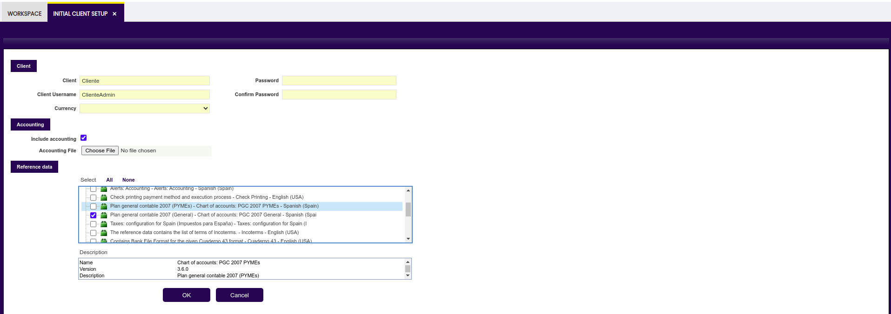

#  How to Run an Initial Client Setup Process

## Overview

<iframe width="560" height="315" src="https://www.youtube.com/embed/yGzPXU3nxpk?si=akTrp1_j8RAafSWx" title="YouTube video player" frameborder="0" allow="accelerometer; autoplay; clipboard-write; encrypted-media; gyroscope; picture-in-picture; web-share" referrerpolicy="strict-origin-when-cross-origin" allowfullscreen></iframe>

The Initial Client Setup process is a crucial process in Etendo which allows defining information about the client and the accounting schema the organization will use. The information configured through this window sets the bases for the organizational structure and the chart of accounts to be used with every organization of the client. 

The initial client setup process is an automated process which can be run by logging in Etendo as *System Administrator* role.

This process allows to:

- Enter the name of the client and the client admin user name and a password.
- Enter the base currency of the client, that is going to be the currency of the Client regardless of if an Organization which belongs to it might have a different currency.
- Include Accounting for the client.

## Including accounting Schema

Decide on the *accounting schema* the organization will use and, from the Initial Client Setup window, set the accounting which will involve setting up the [Chart of Accounts](). 

### Include accounting

There is a checkbox named *Include Accounting* which allows selecting an accounting *reference data* within the Reference Data section to include in the accounting schema. 

!!!info
    It is recommended to have the Include Accounting option checked, which obligates the user to select one of the schemas.

!!!note
    From the Reference Data, it is important to choose between a general accounting schema or one tailored for small and medium-sized enterprises.

If the checkbox *Include Accounting* is selected and an accounting file or reference data is selected, Etendo creates:

  - a [Fiscal Calendar](../../../basic-features/financial-management/accounting/setup/#fiscal-calendar.md) which can be shared by all the *Legal with Accounting* organizations types which belongs to that Client and 
  - an [Account Tree](../../../basic-features/financial-management/accounting/setup/#account-tree.md) or *Chart of Accounts* and a [General Ledger configuration](../../../basic-features/financial-management/accounting/setup/#glconfig.md) which is shared by all the organizations created within the Client.

The *General Ledger Configuration* and the *Chart of Accounts* created by default can be later on customized. 

!!!info
    For more information, read [General Setup](../../../basic-features/general-setup/getting-started/.md). 

The *General Ledger Configuration* is linked to the *Account Tree* as the *Account* is a mandatory [dimension](../../../basic-features/financial-management/accounting/setup/#dimension.md) of the general ledger configuration.

### Accounting file 

Etendo also allows choosing the accounting csv file with the corresponding chart of accounts ([Account Tree](../../../basic-features/financial-management/accounting/setup/#account-tree.md)) to upload into the system from the field *Accounting File*. 

!!!info
    For more information, read [Creating Accounts Files]() 

## Module configuration

Etendo distributes accounting `csv files` as modules which can be applied as reference data. These kinds of modules are part of the Etendo localization for a given country.

There are some additional modules that may be important for the initial client setup.

The key modules include:

- Standard document types for orders, invoices, etc, this one is selected by default as it is necessary for creating transactional data such as orders and invoices.

- Reference data such as master data or configuration data (i.e. tax setup) created for Etendo extension modules.

These modules are useful as tax configurations generally apply to all organizations in a country, and setting standard document types helps avoid inconsistent numbering issues across different organizations.

!!!note
    It is recommended to install necessary modules for the proper operation of the client, based on their specific requirements.

!!!info
    Module Installation: additional modules can be added from the [Enterprise Module Management](../../../basic-features/general-setup/enterprise-model/#enterprise-module-management.md) window within the system.

Every new [Client](../../../basic-features/general-setup/client/.md) created in Etendo centrally maintains at least the mandatory accounting dimensions listed below:

- Organization
- Business Partner
- and Product

unless the *Central Maintenance* checkbox is unselected for the Client which would imply the configuration and management of all the accounting dimensions (mandatory and not mandatory) at organization level.

To conclude, it is important to carefully conduct the initial setup in Etendo, considering the organization's needs and specific requirements. Additionally, thorough documentation of the accounting structure and module configurations is essential for future reference and efficient system management.

!!!info
    For more information, read [Initial Organization Setup](../../../basic-features/general-setup/enterprise-model/#initial-organization-setup.md).

---

This work is a derivative of [Initial Client Setup](https://wiki.openbravo.com/wiki/Initial_Client_Setup){target="\_blank"} by [Openbravo Wiki](http://wiki.openbravo.com/wiki/Welcome_to_Openbravo){target="\_blank"}, used under [CC BY-SA 2.5 ES](https://creativecommons.org/licenses/by-sa/2.5/es/){target="\_blank"}. This work is licensed under [CC BY-SA 2.5](https://creativecommons.org/licenses/by-sa/2.5/){target="\_blank"} by [Etendo](https://etendo.software){target="\_blank"}.
