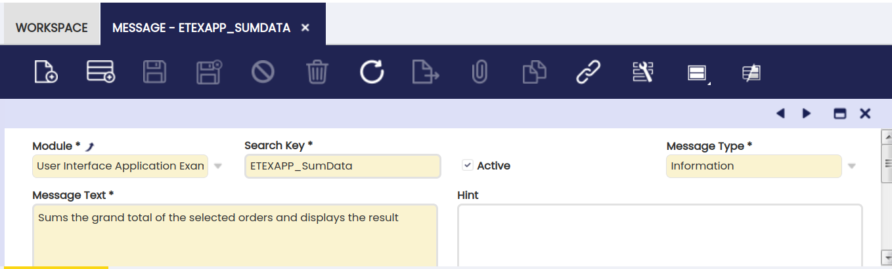
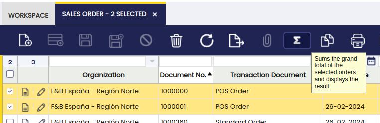
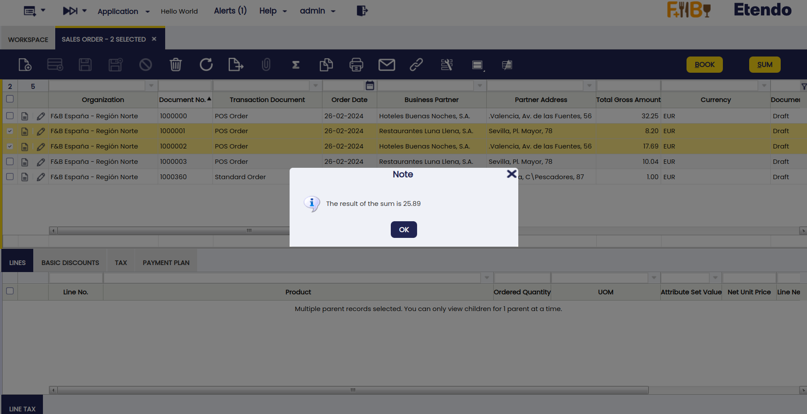

# How to Add a Button to the Toolbar

##  Overview

This section discusses how a button can be added the main toolbar shown in grids and forms. The toolbar contains two types of buttons, the application buttons on the left (visualized using an icon) and the custom buttons on the right (shown with a label). 

This section describes how to add a button to the left part: the application buttons.
  
To follow this section, develop javascript as well as server-side java and understand [Data Access Layer](../concepts/Data_Access_Layer.md) concepts.

##  Example Module

This section is supported by an example module which shows example of the code shown and discussed here.


!!! info
    The example module also contains implementations of other sections.  
 
  
##  Implementing a toolbar button

!!! info
    When implementing your own components, it often makes sense to extend existing components. Make sure that your module then depends on the module that provides the base types. This ensures that the javascript is loaded in the correct order.  
  
The button to be implemented, will compute and show the sum of a set of selected orders to the user. 

This section is divided in 2 parts:

- the first part
focuses on visualizing the button in the correct windows and tabs and making sure the button is enabled/disabled appropriately. 

- The second part will discuss how to implement backend logic and how to call the server side logic when the button gets clicked and show its results.

The first part consists of the following steps:

  * an icon for the visualization 
  * a `css` style and javascript linking the icon to the button 
  * javascript implementing the buttons click/action method and to register the button in the global registry 
  * add javascript to enable/disable the button when records are selected in the grid 
  * a `ComponentProvider` java class to register the javascript and `css` in Etendo.

These steps will visualize the button but not actually do anything yet. The follow up steps will add logic:

  * a server side actionhandler to implement the server side logic (summing the orders and returning the result to the client) 
  * client side javascript to call the server and process the result 

Each of these steps is described in more detail below.

##  Visualizing the button - Implementation steps

###  Defining the icon and a css

The icon and its related style is defined through an icon file. 

!!!info
    For standard visualization using the Etendo style the icon should be 24x24 without a background colour.


The icon should be placed in a specific directory in your module:
`web/com.etendoerp.userinterface.smartclient/etendo/skins/Default/[modulename]`.

Normally, it makes sense to store the icon in a subfolder. The example module has the icon file in:

`web/com.etendoerp.userinterface.smartclient/etendo/skins/Default/
com.etendoerp.client.application.examples/images`.

    com.etendoerp.client.application.examples
    ├── reference data
    ├── src
    ├── src-db
    └── web
        ├── com.etendoerp.client.application.examples
        │   └── js
        │       ├── example-toolbar-button.js
        │       └── example-view-component.js
        └── com.etendoerp.userinterface.smartclient
            └── etendo
                └── skins
                    └── Default
                        └── com.etendoerp.client.application.examples
                            ├── images
                            │   └── iconButton-sum.png
                            └── example-styles.css

  
Then add a `css file` which links this icon to a specific `css` style. The `css` file must also be located in this directory in your module:
`web/com.etendoerp.userinterface.smartclient/etendo/skins/Default/[modulename]`.

In the example module, the `css` file is located here:

`web/com.etendoerp.userinterface.smartclient/etendo/skins/Default/
com.etendoerp.client.application.examples/example-styles`


Within the `css` file add a style defined like this:

    
    
    .ETToolbarIconButton_icon_etexapp_sum {
      background-repeat: no-repeat;
      background-position: center center;
      background-image: url(./images/iconButton-sum.png);
    }

!!!note
    The name of the `css` class is important, it should start with
    `ETToolbarIconButton_icon_`, the part after that (etexapp_sum) is used later in this tutorial. It makes sense to use the module's dbprefix in this last part to prevent name collisions with other modules.

###  The javascript to create and register the button

The next step is to implement the javascript which defines the button and registers it to be shown on tabs. Start by creating a javascript file in this location: `web/com.etendoerp.client.application.examples/js/example-toolbar-button.js`.

This is the overall javascript for `toolbar-button`:


```js title="example-toolbar-button.js"
    
    (function () {
      var buttonProps = {
          action: function(){
            alert('You clicked me!');
          },
          buttonType: 'etexapp_sum',
          prompt: OB.I18N.getLabel('ETEXAPP_SumData'),
          updateState: function(){
              var view = this.view, form = view.viewForm, grid = view.viewGrid, selectedRecords = grid.getSelectedRecords();
              if (view.isShowingForm && form.isNew) {
                this.setDisabled(true);
              } else if (view.isEditingGrid && grid.getEditForm().isNew) {
                this.setDisabled(true);
              } else {
                this.setDisabled(selectedRecords.length === 0);
              }
          }
        };
      
      // register the button for the sales order tab
      // the first parameter is a unique identification so that one button can not be registered multiple times.
      ET.ToolbarRegistry.registerButton(buttonProps.buttonType, isc.ETToolbarIconButton, buttonProps, 100, '186');
    }());
```
Let's walk through the different parts. The javascript starts and ends with this part:

``` javascript
    
    (function () {
    ...
    }());
```

This is done to prevent the local variables to be available globally. It creates a function and executes it immediately.

Then the first part of the buttonprops"

``` javascript
          action: function(){
            alert('You clicked me!');
          },
          buttonType: 'etexapp_sum',
          prompt: OB.I18N.getLabel('ETEXAPP_SumData'),
```


  * Sets the action method which gets called when the user clicks the button. 
  * The buttonType maps back to the name used in the css style, it controls the icon and styling and is used as an identification also 
  * The prompt is shown when the user hovers over the button with the mouse, the label is retrieved through the OB.I18N.getLabel method to support translation, add a label in the Messages table to correctly visualize it: 



The updateState function is called to enable and disable the button when the
user navigates through the system.

```javascript   
    
         updateState: function(){
              var view = this.view, form = view.viewForm, grid = view.viewGrid, selectedRecords = grid.getSelectedRecords();
              if (view.isShowingForm && form.isNew) {
                this.setDisabled(true);
              } else if (view.isEditingGrid && grid.getEditForm().isNew) {
                this.setDisabled(true);
              } else {
                this.setDisabled(selectedRecords.length === 0);
              }
          }
```
The function enables/disables the button if the form or grid is new and if
there are no records selected.

Then this code registers the button for the tab with id '186':


``` javascript
      OB.ToolbarRegistry.registerButton(buttonProps.buttonType, isc.OBToolbarIconButton, buttonProps, 100, '186');
```

Note:

  * the first parameter is a unique identification so that one button can not be registered multiple times. 
  * as the second parameter the button javascript class is passed in, as a default always use `isc.ETToolbarIcon`Button 
  * the buttonProps define the button characteristics 
  * the third parameter defines the order in the toolbar, the standard buttons are placed with an interval of 10, so you can place your button in between other buttons. 
  * The last parameter is the tabId (a String), you can pass null to register a button for all tabs. It is also possible to pass in an array of tabIds (strings) to register a button for multiple tabs. 
  * To register a button for multiple tabs call the registerButton multiple times for different tabs 


###  The ComponentProvider

The previous steps added static resources (javascript and css) to the system.

Now Etendo should know where to find these resources when initializing and generating the user interface. For this, the `css` and javascript and resources have to be registered. This is done through a ComponentProvider. 

!!!info
    For more detailed information, visit [ComponentProvider](../concepts/Etendo_Architecture/#component-provider.md).


```javascript
     
    @ApplicationScoped
    @ComponentProvider.Qualifier(ExampleComponentProvider.EXAMPLE_VIEW_COMPONENT_TYPE)
    public class ExampleComponentProvider extends BaseComponentProvider {
      public static final String EXAMPLE_VIEW_COMPONENT_TYPE = "ETEXAPP_ExampleViewType";
     
      /*
       * (non-Javadoc)
       * 
       * @see com.etendoerp.client.kernel.ComponentProvider#getComponent(java.lang.String,
       * java.util.Map)
       */
      @Override
      public Component getComponent(String componentId, Map<String, Object> parameters) {
        throw new IllegalArgumentException("Component id " + componentId + " not supported."); 
        /* in this howto we only need to return static resources so there is no need to return anything here */
      }
     
      @Override
      public List<ComponentResource> getGlobalComponentResources() {
        final List<ComponentResource> globalResources = new ArrayList<ComponentResource>();
        globalResources.add(createStaticResource(
            "web/com.etendoerp.client.application.examples/js/example-toolbar-button.js", false));
        globalResources.add(createStyleSheetResource(
            "web/com.etendoerp.userinterface.smartclient/etendo/skins/"
                + KernelConstants.SKIN_VERSION_PARAMETER
                + "/com.etendoerp.client.application.examples/example-styles.css", false));
     
        return globalResources;
      }
     
      @Override
      public List<String> getTestResources() {
        return Collections.emptyList();
      }
    }
```
A short explanation:

  * The annotations in the top of the class are related to [Weld](../concepts/.Etendo_Architecture/?h=component+provider#introducing-weld-dependency-injection-and-more.md). 
  
  The annotations define that only one instance of this class is created (a singleton) and define an identifier for this instance. 

  * The getGlobalResources is important here, it shows how to register the global resources defined in the example module. 
  
!!!note
      For your own module just follow the same path structure and approach. 

!!!info
    To explain how Etendo can find the ComponentProvider: Etendo/Weld will analyze the classpath and find all the classes which have a @ComponentProvider annotation.


###  The result

To see the result, restart Tomcat, clear the cache of the browser (sometimes `css` styles are not picked up) and go back to the application and then specifically to the sales order window. 

You should see this:

!!!note
    The button is not visualized in other windows/tabs because it is
    registered for only the sales order header tab.

  



  

##  Adding server side logic - Implementation steps

The next step in this how to is to add the server side logic and calling this logic from the client. The server side logic is implemented using the action handler concept. 
The action handler concept allows you to create classes on
the server which are callable from the client. 

###  Implement the server side action handler

The server side action handler (`SumOrderActionHandler.java`) receives an array of order numbers of the selected orders. It will sum the order values and then return the total as a JSON string.

This is the implementation of the server side:

```java title="SumOrderActionHandler.java"
     */
package org.openbravo.client.application.examples;

import java.math.BigDecimal;
import java.util.Map;

import org.codehaus.jettison.json.JSONArray;
import org.codehaus.jettison.json.JSONObject;
import org.openbravo.base.exception.OBException;
import org.openbravo.client.kernel.BaseActionHandler;
import org.openbravo.dal.service.OBDal;
import org.openbravo.model.common.order.Order;

/**
 * Sums the orders passed in through a json array and returns the result.
 */
    public class SumOrderActionHandler extends BaseActionHandler {
     
      protected JSONObject execute(Map<String, Object> parameters, String data) {
        try {
     
          // get the data as json
          final JSONObject jsonData = new JSONObject(data);
          final JSONArray orderIds = jsonData.getJSONArray("orders");
     
          // start with zero
          BigDecimal total = new BigDecimal("0");
     
          // iterate over the orderids
          for (int i = 0; i < orderIds.length(); i++) {
            final String orderId = orderIds.getString(i);
     
            // get the order
            final Order order = OBDal.getInstance().get(Order.class, orderId);
     
            // and add its grand total
            total = total.add(order.getGrandTotalAmount());
          }
     
          // create the result
          JSONObject json = new JSONObject();
          json.put("total", total.doubleValue());
     
          // and return it
          return json;
        } catch (Exception e) {
          throw new OBException(e);
        }
      }
    }
```
Notes:

  * The BaseActionHandler is extended, this is often the best approach when implementing an ActionHandler, in this case only the execute methods needs to be implemented. 
  * Data can be send in 2 ways to server: as parameters and as part of the request body. Therefore the execute method has 2 parameters. In this example the request body is used.
  * Use a BigDecimal for numbers, as this far more precise than a double, unfortunately json only supports doubles. In the core Etendo system numbers are therefore send from client-server (and vice versa) as strings. 
  * the logic iterates over the order ids and retrieves the order using the [Data Access Layer](../concepts/Data_Access_Layer.md). 
  * the result is returned as json again.

###  Calling the server side from the client, displaying the result

Then, on the client, the action method of the button has to be implemented to call the server. Here is the implementation. 

```javascript
    
          action: function(){
            var callback, orders = [], i, view = this.view, grid = view.viewGrid, selectedRecords = grid.getSelectedRecords();
            // collect the order ids
            for (i = 0; i < selectedRecords.length; i++) {
              orders.push(selectedRecords[i].id);
            }
            
            // define the callback function which shows the result to the user
            callback = function(rpcResponse, data, rpcRequest) {
              isc.say(OB.I18N.getLabel('ETEXAPP_SumResult', [data.total]));
            }
            
            // and call the server
            OB.RemoteCallManager.call('com.etendoerp.client.application.examples.SumOrderActionHandler', {orders: orders}, {}, callback);
```

Note:

  * the selectedRecords contain the full record information of the order (businessPartner etc.), in this case we only use the id 
  * the call to the server is asynchronously therefore a callback is used, which is called when the server returns the result. The callback gets 3 parameters, the data parameter contains the JSONObject returned by the server's execute method. 
  * the call to the RemoteCallManager has these parameters: 
    * the class name of the action handler 
    * the data being sent as the request body 
    * request parameters (in this case nothing there) 
    * and the callback 


Then when the server returns, the callback is called which will display a prompt. 

!!!note
    The label used in the callback, uses parameter substitution.
    Parameters are specified using a %0, %1 etc.:

  


###  The result

The result shows the sum of the 2 selected order headers:




This work is a derivative of [How to add a button to the toolbar](https://wiki.openbravo.com/wiki/How_to_add_a_button_to_the_toolbar){target="\_blank"} by [Openbravo Wiki](http://wiki.openbravo.com/wiki/Welcome_to_Openbravo){target="\_blank"}, used under [CC BY-SA 2.5 ES](https://creativecommons.org/licenses/by-sa/2.5/es/){target="\_blank"}. This work is licensed under [CC BY-SA 2.5](https://creativecommons.org/licenses/by-sa/2.5/){target="\_blank"} by [Etendo](https://etendo.software){target="\_blank"}.