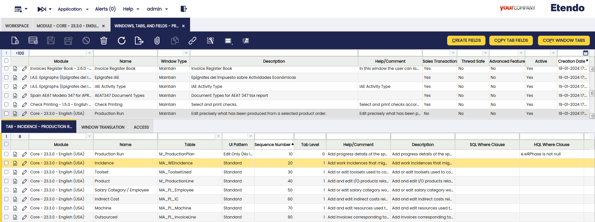
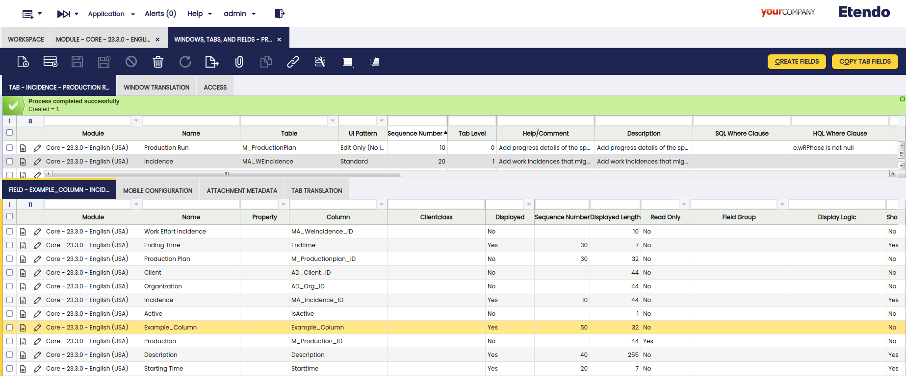
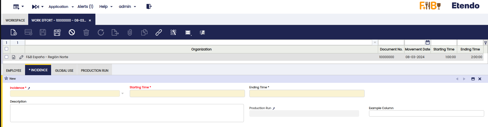

# How to Add a Field to a Window Tab

## Overview

The objective of this section is to show how you can add a new field to a tab in Etendo Classic.

It is closely related to the previous [How to add Columns to a Table](how-to-add-columns-to-a-table.md) section.

The task of adding columns to an existing window is now very simple since most of the work (like defining references, elements) has already been done when adding the columns to the table.

On this page we will show an example of how to place the `example_column` field in the `Production Run` window using the `create fields` button.

### Add the fields to the window example

The process to add new fields to an existing window is the same as the one to add fields to a new (empty) window. Going to `Application Dictionary` > `Window, Tabs and Fields`, we need to search for the `Production Run` window. Then, for that window, mark its `Incidence` tab.

Now, we use the Create Fields process on this tab to let it add all columns
of the underlying _MA_WEIncidence_ table to this tab if they have not been previously
added.

This will then add one new field to the tab matching the new column
and automatically place the field into the module.

As a last step, the Synchronize Terminology process should be run to synchronize our newly added fields to the elements created for the columns they are based on, so that the UI labels for the new fields get the names defined in those elements.

If this window should also be used in _classic UI mode_ then now `./gradlew smartbuild` should be execute to compile the changed window.

To see the changes in the new user interface just change the `System Administrator` role used for this section (Select a role where you have access to the window) and go to the modified window to see that it has the new field as shown here:

---

This work is a derivative of [How to add a field to a window tab](http://wiki.openbravo.com/wiki/How_to_add_a_field_to_a_Window_Tab){target="\_blank"} by [Openbravo Wiki](http://wiki.openbravo.com/wiki/Welcome_to_Openbravo){target="\_blank"}, used under [CC BY-SA 2.5 ES](https://creativecommons.org/licenses/by-sa/2.5/es/){target="\_blank"}. This work is licensed under [CC BY-SA 2.5](https://creativecommons.org/licenses/by-sa/2.5/){target="\_blank"} by [Etendo](https://etendo.software){target="\_blank"}.
